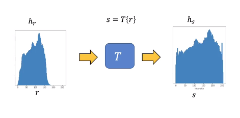
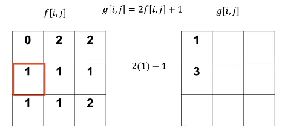
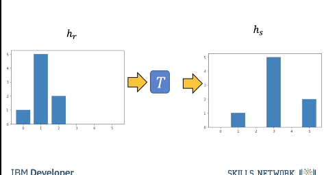
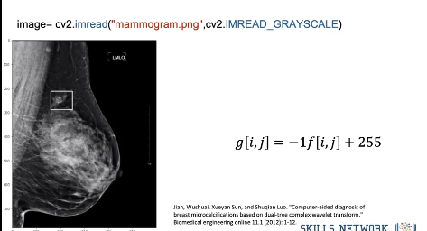
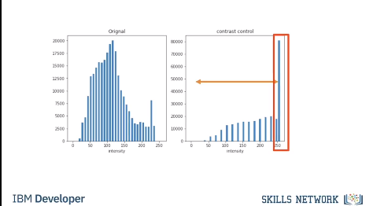
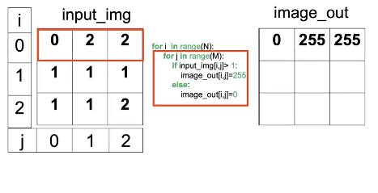

# Pixel Transformations

1. Histograms
2. Intensity Transformations
3. Thresholding and Simple Segmentation

## Histograms
 A histogram counts the number of occurrences of a pixel, and it's a useful tool for understanding and manipulating images.

Consider the following toy image with three intensity values, we can plot the occurrence of each pixel we have one black pixel, 5 gray pixels and two white pixels instead of counting the pixels, we can count the intensity values. 


Consider the following example as numbers ranging from 0 to 2, where 0 is black, 1 gray and 2 is white The histogram counts the pixel intensities. We represent these intensities as an array, the index of the array is the intensity level r in most images we have 256 levels, representing the count of the different intensity of gray levels consider the following image.  


We can calculate the histogram as follows. We have the image, the channel we would like to calculate, in this video we use the gray scale, the number of channels. Finally we have the range of intensity values in yellow We can plot the histogram as a bar graph.  


```python
cv2.calcHist(images, channels, mask, histSize, ranges[, hist[, accumulate]])
```


## Intensity Transformations
 An Intensity Transformation T depends on only one single point i,j, in the image array “f”, the image array ”f” is converted to array g.  


 The transform also operates on the intensity of gray levels “r” mapping them them to “s” This changes the histogram, lets apply a simple transform to a toy image.  


We apply the following linear transform to the image array f, returning the array g, we apply the transform at the pixel located at the first row first column we get the following result at the same pixel location at array g We apply the transform at the pixel located at the second row first column We get the following result at the same index in array g We repeat the process for the entire array.  





We have the histogram each pixel intensity is a function of “r” or histogram r The transform maps each intensity value at r to s we have the new intensity values s and it’s histogram s, let’s see the relationship between histogram “s” and “r” the value of histogram r has one intensity value at zero(click 1) the value of histogram r has one intensity value at zero when applying the transform to r we see the intensity value of zero is mapped to 1 the histogram s now has one intensity value at one we see the intensity value r =1 is mapped to 3 the histogram r has a value of 5 at r=1 In histogram s the value of 5 is mapped to s=3, and so on.  


If we plot the histogram after applying the transform, we see the histogram is shifted and scaled.  



## Image Negatives
Reverse intensity levels of an image. Consider the following image:



The following is the transformed image:

We can apply the transform as an array operation as follows The new image looks like this; we see the details are much more evident.  


Consider the following histogram:
  * We overlay transform as function of intensity (axis on right)
  * This flips graph about the 125 intensity point on x-axis


## Brightness and Contrast Adjustments

A linear transform can be seen as applying Brightness and Contrast Adjustments. 

We can use the following linear model where alpha is Simple contrast control and beta is Simple brightness control We can use the following values, just changing beta we can adjust the brightness Rather than using array operations we use the function “convertScaleAbs” after applying the transformation. The function scales, calculates absolute values, so the intensity values fall in the 0 to 255 value range We see the image is much brighter.  


We see the histogram of the bright image has shifted to the right. A lot of the intensity values have been mapped to the point value of 255.  


We can adjust alpha to change the contrast.  


We see the contrast in the darker areas have improved but the lighter areas the image appears washed out Comparing the original image histogram to the histogram of the new image We see the lower values exhibit more spread, but many of the larger values have been mapped to 255 explaining why the image appeared washed out.  


## Historgram Equalization
We can use nonlinear functions, but let’s explore some algorithms that optimize contrast.  

Consider, the following image with following histogram the function “equalizeHist” improves contrast, by using the histogram to determine a transform that flattens the histogram, the resulting image has improved contrast.  


## Thresholding and Simple Segmentation

A threshold function applies a threshold to every pixel, it can be used in extracting objects from an image this is called segmentation The following function applies a threshold to the input array input image array imput_out and outputs the result the following portion of the code will cycle through each pixel (𝑖,𝑗). If the pixel is greater then that threshold It will set a pixel in the array “image_out” pixel to some value, usually 1 or 255, Otherwise it will set it to another value, usually zero.  


Consider the following array In this case the threshold value is 1 and the min value is 0 and the max value 255 the first loop increments through the rows, for each column in “input_img” we check the condition if the values greater than 1 we set the corresponding element in “image_out” to 255. Otherwise we set it to zeros.  


We repeat the process for the second row As none of the columns are less than one all the corresponding rows in ”Image_out” is set to zero.  


We repeat the process for the final row.  


The result is all the values in the new image array are white or black.  


Consider the following image, it’s histogram bimodal We see the camera man corresponds to the first mode i.e intensities under 87, the second mode is the back round. By setting the threshold accordingly we can segment the camera man. We use the function threshold to perform thresholding, the output new_image is the image after thresholding has been applied. Along with the image ld the input is the threshold and the max value is set to 255. The final parameter is the threshold type, in this case THRESH_BINARY. This means the output will be 0 or 255. In the output we see the camera has zero values and most of the background has values of 255.  

We see the histograms intensities are mapped to black and wight after thresholding has been applied.  


Sometimes its difficult to select a threshold, therefore we can use OTSU method to select the value automatically. ret is the threshold value determined, We see the image looks identical to the one using the manual threshold.  


## Code Lab
```bash
# Setup Environment
cd ~/Desktop; rm -r temp; # To remove
cd ~/Desktop; mkdir temp; cd temp; pyenv activate venv3.10.4;

wget https://cf-courses-data.s3.us.cloud-object-storage.appdomain.cloud/IBMDeveloperSkillsNetwork-CV0101EN-SkillsNetwork/images%20/images_part_1/lenna.png -O lenna.png
wget https://cf-courses-data.s3.us.cloud-object-storage.appdomain.cloud/IBMDeveloperSkillsNetwork-CV0101EN-SkillsNetwork/images%20/images_part_1/baboon.png -O baboon.png
wget https://cf-courses-data.s3.us.cloud-object-storage.appdomain.cloud/IBMDeveloperSkillsNetwork-CV0101EN-SkillsNetwork/images%20/images_part_1/goldhill.bmp -O goldhill.bmp
wget https://cf-courses-data.s3.us.cloud-object-storage.appdomain.cloud/IBMDeveloperSkillsNetwork-CV0101EN-SkillsNetwork/images%20/images_part_1/cameraman.jpeg -O cameraman.jpeg
wget https://cf-courses-data.s3.us.cloud-object-storage.appdomain.cloud/IBMDeveloperSkillsNetwork-CV0101EN-SkillsNetwork/images%20/images_part_1/zelda.png -O zelda.png
wget https://cf-courses-data.s3.us.cloud-object-storage.appdomain.cloud/IBMDeveloperSkillsNetwork-CV0101EN-SkillsNetwork/images%20/images_part_1/mammogram.png -O mammogram.png
```

```python
import matplotlib.pyplot as plt
import cv2
import numpy as np

# First, lets define a helper function to plot two images side-by-side. You will not need to understand this code at this moment, but this function will be used repeatedly in this tutorial to showcase the results.
def plot_image(image_1, image_2,title_1="Orignal", title_2="New Image"):
    plt.figure(figsize=(10,10))
    plt.subplot(1, 2, 1)
    plt.imshow(image_1,cmap="gray")
    plt.title(title_1)
    plt.subplot(1, 2, 2)
    plt.imshow(image_2,cmap="gray")
    plt.title(title_2)
    plt.show()

# Lets define another helper function. The following one will plot two histograms side-by-side. Again, you do not need to understand the body of this function at this moment.
def plot_hist(old_image, new_image,title_old="Orignal", title_new="New Image"):
    intensity_values=np.array([x for x in range(256)])
    plt.subplot(1, 2, 1)
    plt.bar(intensity_values, cv2.calcHist([old_image],[0],None,[256],[0,256])[:,0],width = 5)
    plt.title(title_old)
    plt.xlabel('intensity')
    plt.subplot(1, 2, 2)
    plt.bar(intensity_values, cv2.calcHist([new_image],[0],None,[256],[0,256])[:,0],width = 5)
    plt.title(title_new)
    plt.xlabel('intensity')
    plt.show()
```

### Histograms

```python
# Toy Example
toy_image = np.array([[0,2,2],[1,1,1],[1,1,2]],dtype=np.uint8)
plt.imshow(toy_image, cmap="gray")
plt.show()
print("toy_image:",toy_image)
# toy_image: [[0 2 2]
#  [1 1 1]
#  [1 1 2]]

# cv2.calcHist(images, channels, mask, histSize, ranges[, hist[, accumulate]])
# We can use the caclHist function.
# In this case, we use only three bins as there are only three values, and the index of the bins are from 1 to 3.
hist_counts = cv2.calcHist([toy_image], [0], None, [3], [0,3])
hist_counts_list = [i[0] for i in hist_counts]
# array([[1.],
#        [5.],
#        [3.]], dtype=float32)
plt.bar([x for x in range(3)],hist_counts_list)
plt.show()
```
The histogram is a function where $h[r]$ where $r \in {0,1,2}$. In the above example $h[0]=1$,$h[1]=5$ and $h[2]=3$


### Gray Scale Histograms
Histograms are used in grayscale images.  Grayscale images are used in many applications, including medical and industrial. Color images are split into luminance and chrominance. The luminance is the grayscale portion and is usually processed in many applications. Consider the following "Gold Hill" image:

```python
goldhill = cv2.imread("goldhill.bmp",cv2.IMREAD_GRAYSCALE)
plt.figure(figsize=(10,10))
plt.imshow(goldhill,cmap="gray")
plt.show()

# We can calculate the histogram using the `calcHist` function from the `cv2` module as follows, the shape is 256.

hist = cv2.calcHist([goldhill],[0], None, [256], [0,256])
```

We can plot it as a bar graph, the $x$-axis are the pixel intensities and the $y$-axis is the number of times of occurrences that the corresponding pixel intensity value on $x$-axis occurred.

```python
intensity_values = np.array([x for x in range(hist.shape[0])])
plt.bar(intensity_values, hist[:,0], width = 5)
plt.title("Bar histogram")
plt.show()
```

The histogram is a function where $h[r]$ where $r \in {0,1,..,255}$.

```python
PMF = hist / (goldhill.shape[0] * goldhill.shape[1])

plt.plot(intensity_values,PMF)
plt.title("PMF")
plt.show()
```

We can also apply a histogram to each image color channel:
```python
baboon = cv2.imread("baboon.png")
plt.imshow(cv2.cvtColor(baboon,cv2.COLOR_BGR2RGB))
plt.show()

# In the loop, the value for i specifies what color channel calcHist is going to calculate the histogram for.   
color = ('blue','green','red')
for i,col in enumerate(color):
    histr = cv2.calcHist([baboon],[i],None,[256],[0,256])
    plt.plot(intensity_values,histr,color = col,label=col+" channel")
    plt.xlim([0,256])

plt.legend()
plt.title("Histogram Channels")
plt.show()
```

### Intensity Transformations

It's helpful to think of an image as a function $f(x,y)$ instead of an array at this point, where `x` is the row index and `y` is the column index. You can apply a transformation $T$ to the image and get a new image: 
$$
g(x,y)=T(f(x,y))
$$

An Intensity Transformation depends on only one single point $(x,y)$. For example, you can apply a linear transform $g(x,y) = 2f(x,y) + 1$; this will multiply each image pixel by two and add one.

As the Intensity transforms only depend on one value; as a result, it is sometimes referred to as a gray-level mapping. The variable if $r$ is the gray level intensity, similar to the histogram values. The new output s is given by:

$$
s=T(r)
$$

### Image Negatives

Consider an image with $L$ intensity values ranging from $[0,L-1]$.  We can reverse the intensity levels by applying the following:

$$
g(x,y)=L-1-f(x,y)
$$

Using the intensity transformation function notation 
$$
s = L - 1 - r
$$

This is called the image negative. For $L= 256$ the formulas simplifys to:


$$
g(x,y)=255-f(x,y) \qquad and \qquad s=255-r
$$


We can perform intensity transformation on the toy image where $L=3$.

```python
L = 3
neg_toy_image = (L - 1) - toy_image

print("toy image\n", neg_toy_image)
print("image negatives\n", neg_toy_image)

# We see darker intensity’s become brighter and brighter become darker, middle intensity’s remain the same.
plt.figure(figsize=(10,10))
plt.subplot(1, 2, 1) 
plt.imshow(toy_image,cmap="gray")
plt.subplot(1, 2, 2)
plt.imshow(neg_toy_image,cmap="gray")
plt.show()
print("toy_image:",toy_image)

# Reversing image intensity has many applications, including making it simpler to analyze medical images. Consider the mammogram with micro-calcifications on the upper quadrant:
image = cv2.imread("mammogram.png", cv2.IMREAD_GRAYSCALE)
cv2.rectangle(image, pt1=(160, 212), pt2=(250, 289), color = (255), thickness=2) 

plt.figure(figsize = (10,10))
plt.imshow(image, cmap="gray")
plt.show()

# Transform
img_neg = -1 * image + 255

# We see the micro-calcifications in the image negatives is easier it is to analyze:
plt.figure(figsize=(10,10))
plt.imshow(img_neg, cmap = "gray")
plt.show()
```

### Brightness and Color Adjustments
We can use multiplication by $\alpha$ for contrast control and addition by $\beta$ to improve brightness control. This applies the Intensity Transformation as well. The image is $f(x,y)$ and the transformed image is $g(x,y)$, where $g(x,y) = \alpha f(x,y) + \beta$.

Rather than implementing via array operations, we use the function  convertScaleAbs. It scales, calculates absolute values, and converts the result to 8-bit so the values fall between $[0,255]$. For brightness control, we can set $\alpha$ to 1 and $\beta$ to 100:

Remember the Good Hill image, it’s dark and hazy so let's see if we can improve it. 

```python
alpha = 1 # Simple contrast control
beta = 100   # Simple brightness control   
new_image = cv2.convertScaleAbs(goldhill, alpha=alpha, beta=beta)
plot_image(goldhill, new_image, title_1 = "Orignal", title_2 = "brightness control")

# We see the brighter image's histogram is shifted:     
plt.figure(figsize=(10,5))
plot_hist(goldhill, new_image, "Orignal", "brightness control")
```

We can increase the contrast by increasing $\alpha$:
```python
plt.figure(figsize=(10,5))
alpha = 2# Simple contrast control
beta = 0 # Simple brightness control   # Simple brightness control
new_image = cv2.convertScaleAbs(goldhill, alpha=alpha, beta=beta)
plot_image(goldhill,new_image,"Orignal","contrast control")
plt.figure(figsize=(10,5))
plot_hist(goldhill, new_image,"Orignal","contrast control")

# When plotting the image we see it's too bright. We can adapt the brightness by making the image darker and increasing the contrast at the same time. 
plt.figure(figsize=(10,5))
alpha = 3 # Simple contrast control
beta = -200  # Simple brightness control   
new_image = cv2.convertScaleAbs(goldhill, alpha=alpha, beta=beta)
plot_image(goldhill, new_image, "Orignal", "brightness & contrast control")
plt.figure(figsize=(10,5))
plot_hist(goldhill, new_image, "Orignal", "brightness & contrast control")
```

### Histogram Equalization
Histogram Equalization increases the contrast of images, by stretching out the range of the grayscale pixels; It does this by flatting  the histogram. We simply apply the function cv2.equalizeHist.

```python
zelda = cv2.imread("zelda.png",cv2.IMREAD_GRAYSCALE)
new_image = cv2.equalizeHist(zelda)
# We can compare the image before and after Histogram Equalization, we see the contrast is improved. We see after the Histogram Equalization is applied, the histogram is stretched out:
plot_image(zelda,new_image,"Orignal","Histogram Equalization")
plt.figure(figsize=(10,5))
plot_hist(zelda, new_image,"Orignal","Histogram Equalization")
```

### Thresholding and Simple Segmentation
Thresholding is used in image segmentation this means extracting objects from an image. Image segmentation is used in many applications including extracting text, medical imaging, and industrial imaging.

Thresholding an image takes a threshold; If a particular pixel (i,j) is greater than that threshold it will set that pixel to some value usually 1 or 255, otherwise, it will set it to another value, usually zero. We can write a Python function that will perform thresholding and output a new image given some input grayscale image:

```python
def thresholding(input_img,threshold,max_value=255, min_value=0):
    N,M=input_img.shape
    image_out=np.zeros((N,M),dtype=np.uint8)
        
    for i  in range(N):
        for j in range(M):
            if input_img[i,j]> threshold:
                image_out[i,j]=max_value
            else:
                image_out[i,j]=min_value
                
    return image_out   

# Consider the following toy image:
toy_image           
# We can apply thresholding, by setting all the values less than two to zero. 
threshold = 1
max_value = 2
min_value = 0
thresholding_toy = thresholding(toy_image, threshold=threshold, max_value=max_value, min_value=min_value)
thresholding_toy
# We can compare the two images. In the new image we see all the gray values are now black:
plt.figure(figsize=(10, 10))
plt.subplot(1, 2, 1)
plt.imshow(toy_image, cmap="gray")
plt.title("Original Image")
plt.subplot(1, 2, 2)
plt.imshow(thresholding_toy, cmap="gray")
plt.title("Image After Thresholding")
plt.show()  
# Consider the cameraman image:
image = cv2.imread("cameraman.jpeg", cv2.IMREAD_GRAYSCALE)
plt.figure(figsize=(10, 10))
plt.imshow(image, cmap="gray")
plt.show()
# We can see the histogram as two peeks, this means that there is a large proportion of pixels in those two ranges:
hist = cv2.calcHist([image], [0], None, [256], [0, 256])
intensity_values = np.array([x for x in range(hist.shape[0])])
plt.bar(intensity_values, hist[:, 0], width=5)
plt.title("Bar histogram")
plt.show()
# The cameraman corresponds to the darker pixels, therefore we can set the Threshold in such a way as to segment the cameraman. In this case, it looks to be slightly less than 90, let’s give it a try:
threshold = 87
max_value = 255
min_value = 0
new_image = thresholding(image, threshold=threshold, max_value=max_value, min_value=min_value)
# We see the pixels corresponding to the cameraman are now zero and the rest are set to 255:
plot_image(image, new_image, "Orignal", "Image After Thresholding")
plt.figure(figsize=(10,5))
plot_hist(image, new_image, "Orignal", "Image After Thresholding")
```

The function cv2.threshold applies a threshold to the gray image, with the following parameters:
```python
cv2.THRESH_BINARY # 0
# We can apply thresholding to the image as follows:
ret, new_image = cv2.threshold(image,threshold,max_value,cv2.THRESH_BINARY)
plot_image(image,new_image,"Orignal","Image After Thresholding")
plot_hist(image, new_image,"Orignal","Image After Thresholding")
```

`ret` is the threshold value and new_image is the image after thresholding has been applied. There are different threshold types, for example, `cv2.THRESH_TRUNC` will not change the values if the pixels are less than the threshold value:

```python
ret, new_image = cv2.threshold(image,86,255,cv2.THRESH_TRUNC)
plot_image(image,new_image,"Orignal","Image After Thresholding")
plot_hist(image, new_image,"Orignal","Image After Thresholding")
# We see that the darker elements have not changed and the lighter values are set to 255.

```

Otsu's method `cv2.THRESH_OTSU` avoids having to choose a value and determines it automatically, using the histogram.
```python
ret, otsu = cv2.threshold(image,0,255,cv2.THRESH_OTSU)
plot_image(image,otsu,"Orignal","Otsu")
plot_hist(image, otsu,"Orignal"," Otsu's method")
```
