# Softmax and Multi-Class Classification

## Argmax review

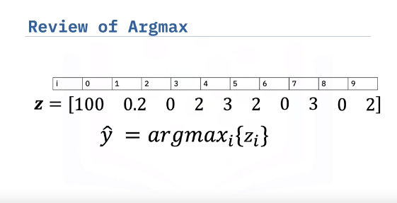

The argmax function returns the index corresponding to the largest value in a sequence of numbers. Here the largest value in Z is 100 and the corresponding index is zero, thus the argmax function will return zero. 

## Multiclass

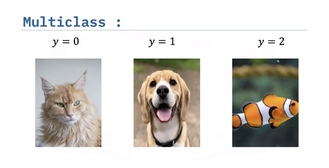

Instead of using one plane to classify the data, we will use one plane for each class. In this case, we have three equations representing three classes, but we can generalize to any number of classes.

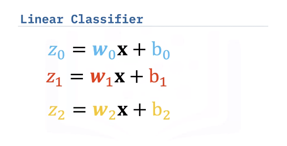

We can also use the graph to represent equations. In this case, nodes are representing the different components of X. We add nodes for each output Z. The edges represent the different learnable parameters with subscripts indicating the dimension. 

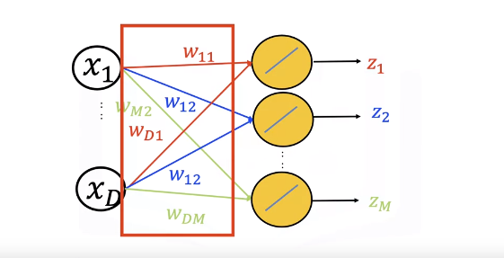

This is the plane where Z equals zero, the line is where the decision plane intersects with the plane Z equals zero. We can overlay our sample images, we see the lines split the classes. 

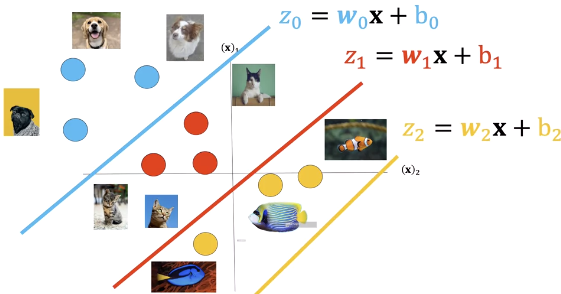

If the input is in the blue region, the value of z0 corresponding to the equation zero is the largest. This is where the blue plane has a higher value than the other regions. Therefore, anything in this region will be in class zero. 

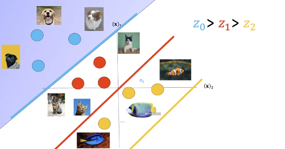

If the input is in the red region, the value of z1 corresponding to equation one is the largest. Therefore, anything in this region will be in class one. 

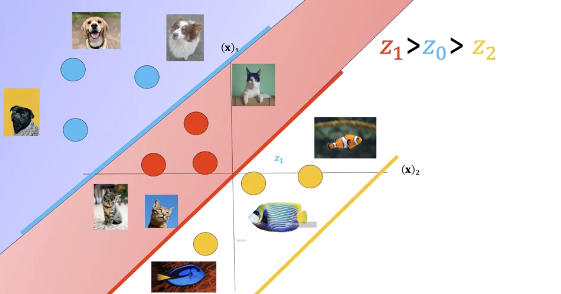

If the input is in the yellow region, the value of z2 corresponding to equation Z is the largest. Therefore, anything in this region will be in class two. Just to note, the yellow line we see is where the plane is greater than zero. The yellow region is where the yellow plane is larger than the blue and red region. We can now use the planes to classify this unknown point.

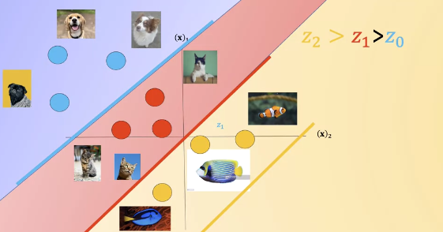

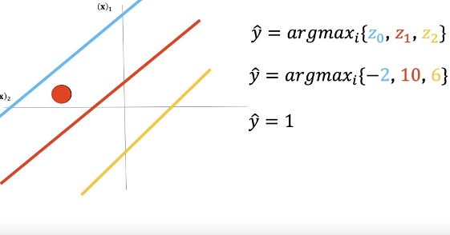

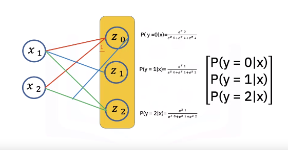

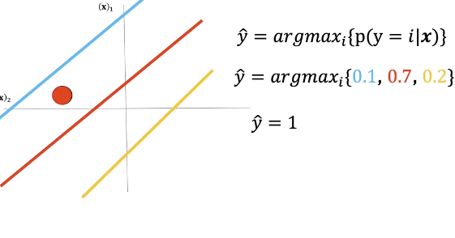

