# Spatial Operations In Image Processing

In this video we will discuss Spatial Operations in Image Processing. In this video we will review:

* Convolution sometimes called Linear Filtering
* Edge Detection
* Median Filters


In this video we will show the one channel representation, but unless specified we can apply these operations to each channel independently.

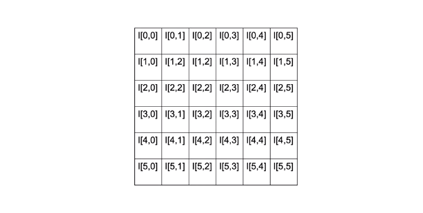

## Convolution
Spatial Operations consists of a neighbourhood, in this example we take a neighbourhood of 2 by 2 pixels we apply a function that involves each pixel in the neighbourhood and output the result we then shift the neighbourhood and repeat the process for each pixel in the image.

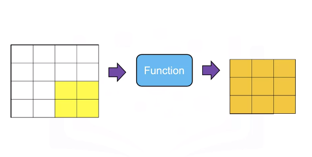

The result is a new image that has enhanced characteristics, these spatial operations take advantage is spatial patterns in the image.


Convolution or linear filtering is a standard way to Filter an image. The filter is called the kernel. The different kernels perform different tasks.

Convolution is analogous to this linear equation. The input is the image `X`. Output will be another image `Z`. We have the parameter `W` this is known as a kernel or filter. 


$z = wx$

$Z = W * Xx$

The star this operation is the convolution operation. There is actually an analytical expression for it, but it's a little confusing. So let's just go over an example to understand what's going on. 

Here's our image X, here's our kernel w, it’s just a smaller array.

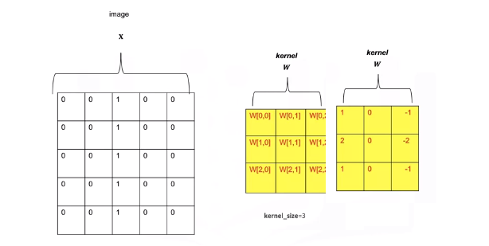

The array is made up of values that have been pre determined for some operation. Let's go over the operation of convolution. We start off in the top right corner of the image, and we'll overlay the kernel with that region of the image. We see the kernel values in red, we'll multiply every element of the image by the corresponding element of the kernel. For the first row we'll get the following operation, multiplying the intensity value and summing the results this process is repeated for the second row, multiplying the intensity value and summing the results. Finally for the final row we multiply the intensity values and sum the results. We sum those elements together. The result is the first element of the image z.

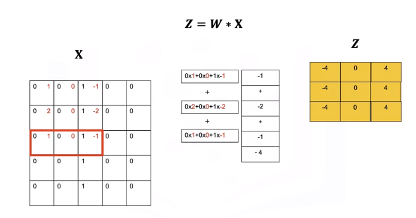

We shift the kernel to the left represented by the different colors in red. We multiply all the elements of the kernel with the image. This gives us the second element of the output image z. We'll shift the kernel one more column and perform the exact same operation, multiplying every element of the kernel by the corresponding intensity value of the image, adding them all together. This gives us the next value. We then shift the kernel down and repeat the process until we get to the end of the column. Repeating the process until we get a new image. One problem is the images are different sizes. We can fix this by changing the size of the image x. 
 
 We change the size of the image by padding. In zero padding we add two additional rows of zeros and two additional columns of zeros.
 
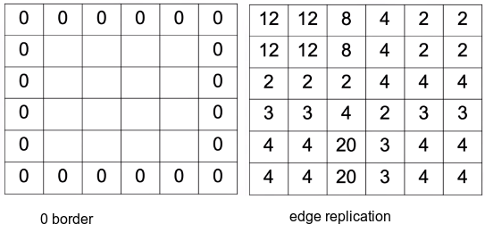
 
We can also replicate the values of the border.

## Low Pass Filters
Low Pass Filters are used to smooth the image getting rid of noise. Consider the following image of a square. 

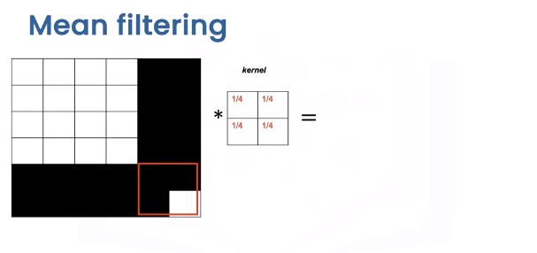

We have the following noise pixel. We can reduce this noise by applying a smoothing filter or kernel. Smoothing filters average out the pixels within a neighbourhood. They are sometimes called low pass filters.

For mean filtering the kernel simply averages out the kernels in a neighbourhood. 

Let's see what happens to the pixel intensities. To explore how the kernel effects different areas we can plot the output image and its relationship to specific regions of this input. When we apply the kernel to this area of the image, the intensity values remain unchanged around the edge of the box. 

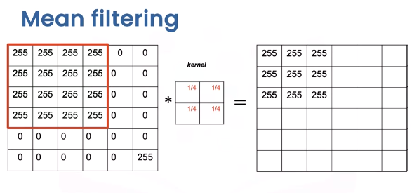

The values change as the values of 255 are averaged out with the zeros. 

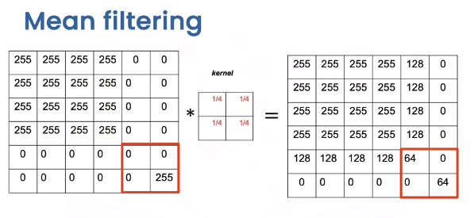

Finally, when we get to the region with the noise pixel, we see the noise value is smaller.

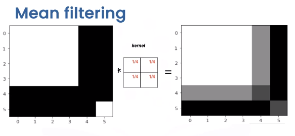


Comparing the original image and the output image we see the intensity of the noise has reduced but the edges appear less sharp.


In general there is a trade off between sharpness and smoothness, in the lab we will review several other kernels that explore this trade off.

## Edge Detection
Edge Detection is an important first step in many computer vision algorithms. Edges in a digital image are where the image brightness changes sharply. Edge detection uses methods to approximate derivatives and gradients for identifying these areas.


Consider the following image with a vertical and horizontal edge.

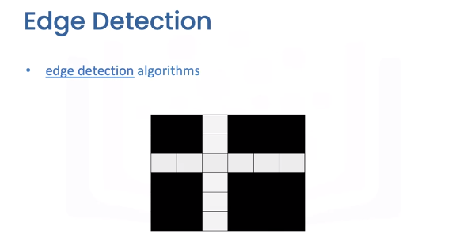

Let's take a look at the intensity values. Let’s plot the first row of the image, the horizontal axis is the column index, and the vertical axis is the intensity value. If we move in the right direction from pixel 1 to pixel 2, the intensity value increases. In the image, we can represent this as a vector, in the same manner, when moving from pixel 2 to pixel 3, the intensity value decreases. We can represent this as a vector pointing in the opposite direction. The direction of the vector represents if the adjacent pixel is increasing.

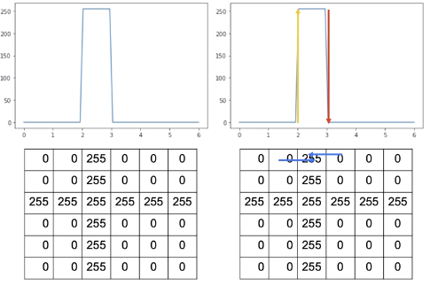


We can represent this change by applying the following difference equation, and this works by subtracting the intensity value of the adjacent columns $j$ and $j+1$ in row $I$.


This computes an approximation of the gradient in the x-direction. In the following table, each row applies the equation to the intensity values for column 1 and 2.

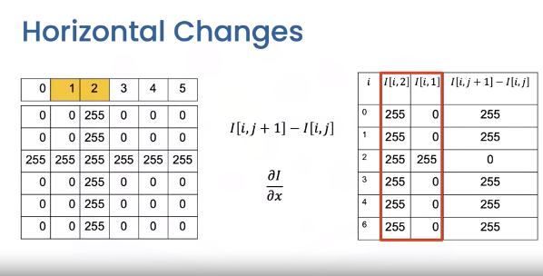

The final column is the result of using the equation. We can overly the result over the image as vectors. We can apply the same logic to the next column, this time the values are negative.

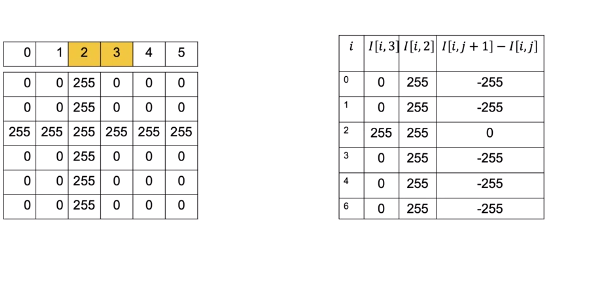

It turns out we can perform similar Horizontal Derivative Approximations using convolution.

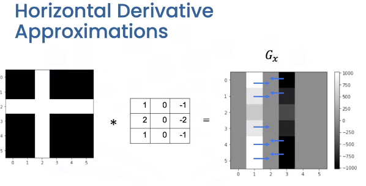

The Horizontal changes or gradient are computed by convolving the image with a kernel. These kernels are called `Sobel` operators. We can represent the output in the array of intensities $G_x$. All the values are zero except the elements corresponding to the horizontal edges. In this image the gray values have different ranges where black is negative, gray is zero, and white is positive.These represent vectors we discussed earlier.


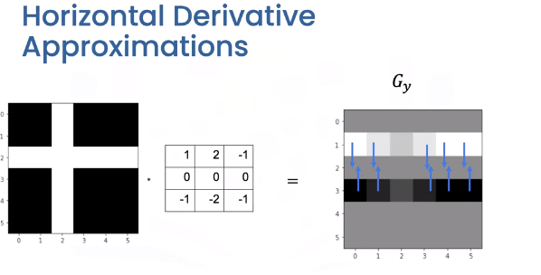

We can use the same process to find vertical changes. This is computed by convolving the image with a kernel to get the image $G_y$. This time the vectors point in the vertical direction.

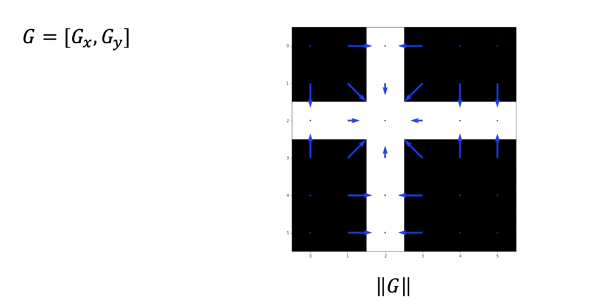

We can combine the output of each filter into a vector. If you are familiar with calculus this approximates the gradient. Taking the magnitude of the vectors we get the intensity values.

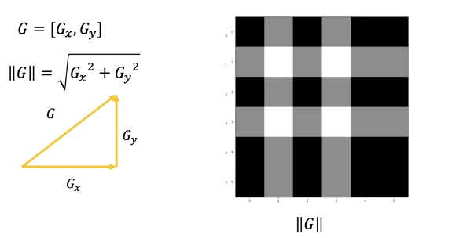

We can plot it as an image this represents the edges. We can also calculate the angle representing the direction.

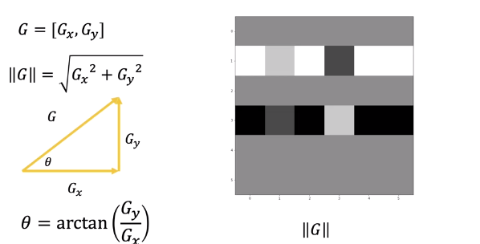

## Mediam Filtering
Median Filters are another popular filter. They are better at removing some types of noise but may distort the image. The median filter outputs the median value of the neighbourhood. Consider the yellow pixel.

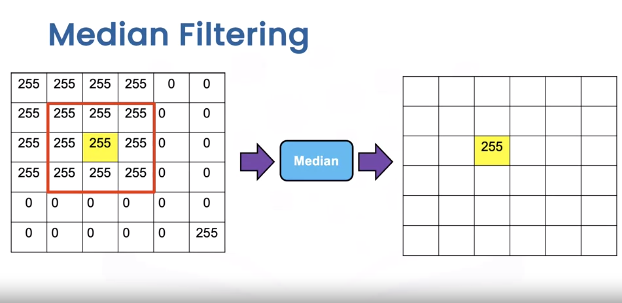

Consider the region in this three by three neighbourhood. The resultant value of the output image is the median value of the 9 pixels. Depending on the padding we see the median is identical to the image in most regions. In the region with the noise sample we see the output is as follows.

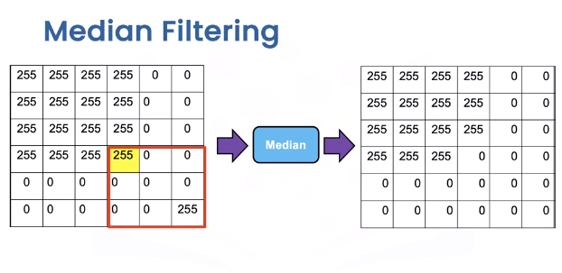


Overlaying the image values unlike the median filter, we see the noise is no longer there and the edges are straight, but the square is distorted as its missing a pixel.

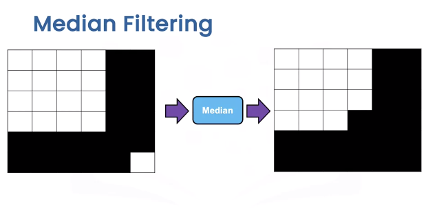

## OpenCV

Let’s apply some Spatial Operations in open cv. PIL is relatively simple, so check out labs for PIL examples. We will create an image “new image” that is a noisy version of the original first. 

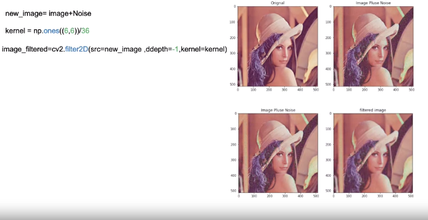

We create a kernel for mean filtering. The function filter2D performs 2D convolution between the image and the kernel on each color channel independently. The parameter values are in the lab. We see the new image has less noise, but the image is blurry.

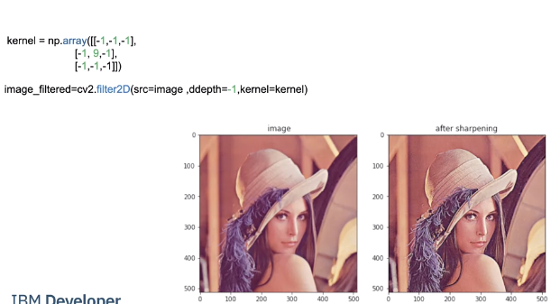

Image Sharpening involves smoothing the image and enhancing the edges. We can accomplish image sharpening by applying the following Kernel. 
We then apply fillters2D, comparing the image before and after we see it is much crisper.

We can perform edge detection consider the following image.

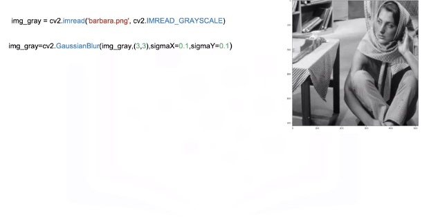

We smooth the image using `GaussianBlur`, a low pass filter we will be discussing in the lab; this decreases changes that may be caused by noise that would affect the gradient.

We can approximate the derivative in the X or Y direction using the `Sobel` function .

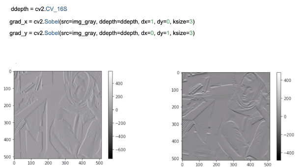

“ddepthis” is the output image depth. dx, dy is the order of the derivative in each direction; in this case it will be one. Finally, “k-size” size of the extended `Sobel` kernel; we can output the gradients as images.

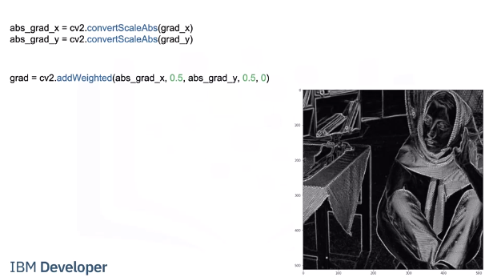

We can approximate the magnitude of the gradient. We calculate absolute values, and convert the result to 8-bit using convertScaleAbs Then apply the function ”addWeighted” to calculate the sum of two arrays and assign it to grad we plot Grad as an image the areas with high intensity values represent edges.

## Code Lab
```bash
# Setup Environment
cd ~/Desktop; rm -r temp; # To remove
cd ~/Desktop; mkdir temp; cd temp; pyenv activate venv3.10.4;

wget https://cf-courses-data.s3.us.cloud-object-storage.appdomain.cloud/IBMDeveloperSkillsNetwork-CV0101EN-SkillsNetwork/images%20/images_part_1/cameraman.jpeg
wget https://cf-courses-data.s3.us.cloud-object-storage.appdomain.cloud/IBMDeveloperSkillsNetwork-CV0101EN-SkillsNetwork/images%20/images_part_1/lenna.png
wget https://cf-courses-data.s3.us.cloud-object-storage.appdomain.cloud/IBMDeveloperSkillsNetwork-CV0101EN-SkillsNetwork/images%20/images_part_1/barbara.png   
```

### PIL
```python
# Used to view the images
import matplotlib.pyplot as plt
# Used to load an image
from PIL import Image
# Used to create kernels for filtering
import numpy as np
# This function will plot two images side by side 
def plot_image(image_1, image_2,title_1="Orignal",title_2="New Image"):
    plt.figure(figsize=(10,10))
    plt.subplot(1, 2, 1)
    plt.imshow(image_1)
    plt.title(title_1)
    plt.subplot(1, 2, 2)
    plt.imshow(image_2)
    plt.title(title_2)
    plt.show()
# Spatial operations use the neighboring pixels to determine the present pixel value 
```

#### Linear Filtering
Filtering involves enhancing an image, for example, removing the noise from an image. Noise can be caused by a bad camera or bad image compression. The same factors that cause noise may lead to blurry images. We can apply filters to sharpen these images. Convolution is a standard way to filter an image. The filter is called the kernel and different kernels perform different tasks. In addition, Convolution is used for many of the most advanced artificial intelligence algorithms. We simply take the dot product of the kernel and an equally-sized portion of the image. We then shift the kernel and repeat.

```python
# Loads the image from the specified file
image = Image.open("lenna.png")
# Renders the image
plt.figure(figsize=(5,5))
plt.imshow(image)
plt.show()
# The images we are working with are comprised of RGB values, which are values from 0 to 255. Zero means white noise, this makes the image look grainy:
# Get the number of rows and columns in the image
rows, cols = image.size
# Creates values using a normal distribution with a mean of 0 (loc) and standard deviation (size) of 15, the values are converted to unit8 which means the values are between 0 and 255
noise = np.random.normal(loc=0,scale=15,size=(rows,cols,3)).astype(np.uint8)
# Add the noise to the image
noisy_image = image + noise
# Creates a PIL Image from an array
noisy_image = Image.fromarray(noisy_image)
# Plots the original image and the image with noise using the function defined at the top
plot_image(image, noisy_image, title_1="Orignal", title_2="Image Plus Noise")
```
When adding noise to an image sometimes the value might be greater than 255, in this case 256, is subtracted from the value to wrap the number around keeping it between 0 and 255. For example, consider an image with an RGB value of 137 and we add noise with an RGB value of 215 to get an RGB value of 352. We then subtract 256, the total number of possible values between 0 and 255, to get a number between 0 and 255.

#### Filtering Noise
To be able to create customer kernels and use predefined filters we must import the following library

```python
from PIL import ImageFilter
```
Smoothing filters average out the Pixels within a neighborhood, they are sometimes called low pass filters. For mean filtering, the kernel simply averages out the kernels in a neighborhood.
```python
# Create a kernel which is a 5 by 5 array where each value is 1/36
kernel = np.ones((5,5))/36
# Create a ImageFilter Kernel by providing the kernel size and a flattened kernel
kernel_filter = ImageFilter.Kernel((5,5), kernel.flatten())
# The function filter performs a convolution between the image and the kernel on each color channel independently.
# Filters the images using the kernel
image_filtered = noisy_image.filter(kernel_filter)
# We can plot the image before and after the filtering. We see the noise is reduced, but the image is blurry:
plot_image(image_filtered, noisy_image,title_1="Filtered image",title_2="Image Plus Noise")

# A smaller kernel keeps the image sharp, but filters less noise, here we try a 3x3 kernel. You can see her shoulders are sharper in this image but the green noise is brighter than the filtered image above.
# Create a kernel which is a 3 by 3 array where each value is 1/36
kernel = np.ones((3,3))/36
# Create a ImageFilter Kernel by providing the kernel size and a flattened kernel
kernel_filter = ImageFilter.Kernel((3,3), kernel.flatten())
# Filters the images using the kernel
image_filtered = noisy_image.filter(kernel_filter)
# Plots the Filtered and Image with Noise using the function defined at the top
plot_image(image_filtered, noisy_image,title_1="Filtered image",title_2="Image Plus Noise")
```

#### Gaussian Blur
To perform Gaussian Blur we use the `filter` function on an image using the predefined filter `ImageFilter.GaussianBlur`

Parameters:  
* radius: blur kernel radius, default 2

```python
# Filters the images using GaussianBlur
image_filtered = noisy_image.filter(ImageFilter.GaussianBlur)
# Plots the Filtered Image then the Unfiltered Image with Noise
plot_image(image_filtered , noisy_image,title_1="Filtered image",title_2="Image Plus Noise")
# Lets try using a 4 by 4 kernel
# Filters the images using GaussianBlur on the image with noise using a 4 by 4 kernel 
image_filtered = noisy_image.filter(ImageFilter.GaussianBlur(4))
# Plots the Filtered Image then the Unfiltered Image with Noise
plot_image(image_filtered , noisy_image,title_1="Filtered image",title_2="Image Plus Noise")

```

#### Image Sharpening
Image Sharpening involves smoothing the image and calculating the derivatives. We can accomplish image sharpening by applying the following Kernel.

```python
# Common Kernel for image sharpening
kernel = np.array([[-1,-1,-1], 
                   [-1, 9,-1],
                   [-1,-1,-1]])
kernel = ImageFilter.Kernel((3,3), kernel.flatten())
# Applys the sharpening filter using kernel on the original image without noise
sharpened = image.filter(kernel)
# Plots the sharpened image and the original image without noise
plot_image(sharpened , image, title_1="Sharpened image",title_2="Image")

# We can also sharpen using a predefined filter
# Sharpends image using predefined image filter from PIL
sharpened = image.filter(ImageFilter.SHARPEN)
# Plots the sharpened image and the original image without noise
plot_image(sharpened , image, title_1="Sharpened image",title_2="Image")
```

#### Edges
Edges are where pixel intensities change. The Gradient of a function outputs the rate of change; we can approximate the gradient of a grayscale image with convolution. Consider the following image:

```python
# Loads the image from the specified file
img_gray = Image.open('barbara.png')
# Renders the image from the array of data, notice how it is 2 diemensional instead of 3 diemensional because it has no color
plt.imshow(img_gray ,cmap='gray')
plt.show()
# Filters the images using FIND_EDGES filter
img_gray = img_gray.filter(ImageFilter.FIND_EDGES)
# Renders the filtered image
plt.figure(figsize=(10,10))
plt.imshow(img_gray ,cmap='gray')
plt.show()
```

##### Median
Median filters find the median of all the pixels under the kernel area and the central element is replaced with this median value. 

We can apply median filters to regular images but let’s see how we can use a median filter to improve segmentation. Consider the cameraman example: 

```python
# Load the camera man image
image = Image.open("cameraman.jpeg")
# Make the image larger when it renders
plt.figure(figsize=(10,10))
# Renders the image
plt.imshow(image,cmap="gray")
plt.show()
# Median filtering blurs the background, increasing the segmentation between the cameraman and the background
image = image.filter(ImageFilter.MedianFilter)
plt.figure(figsize=(10,10))
# Renders the image
plt.imshow(image,cmap="gray")
plt.show()
```


### OpenCV