# Support Vector Machines

## Topics
* Kernels
* Maximum Margin

## Kernels
Sometimes data isn't linearly separable:
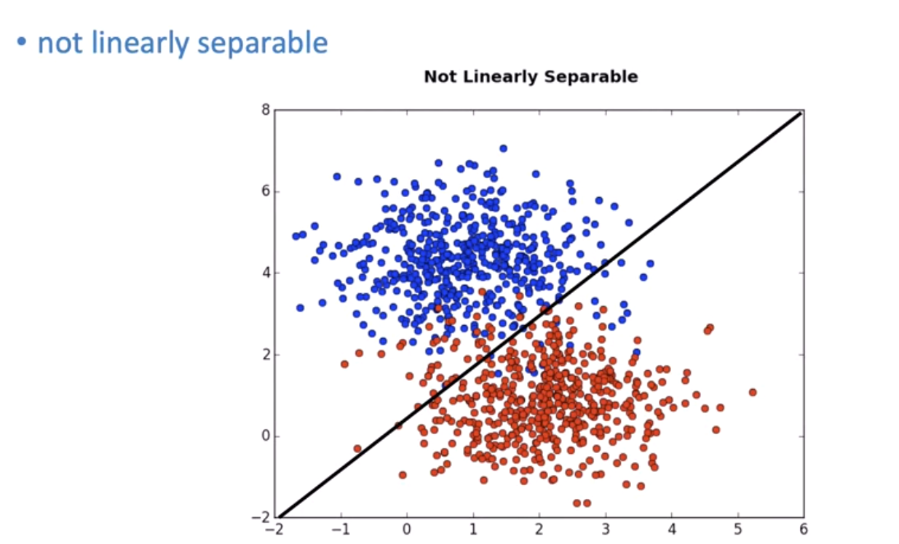

We can transform it to separate it:
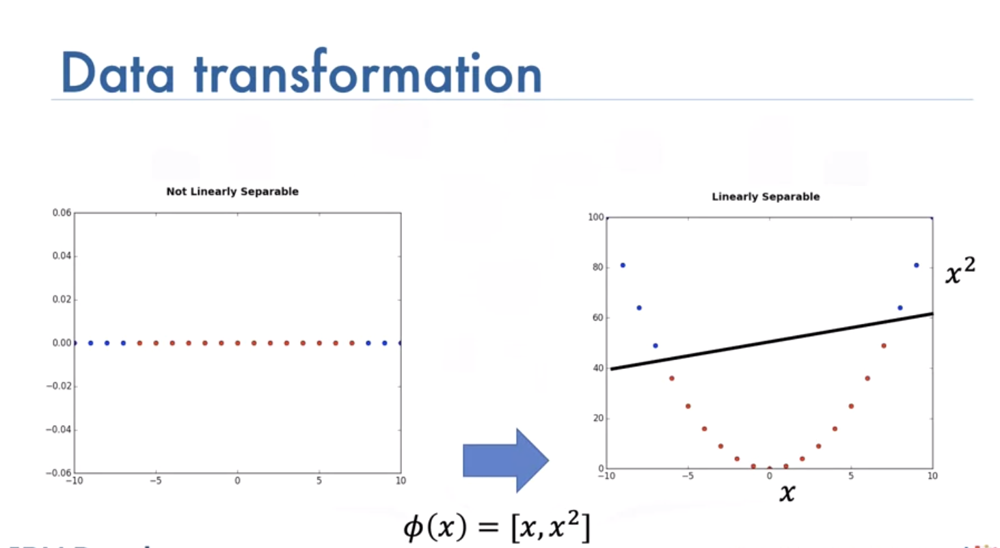

Sometimes it is hard to calculate mapping:


We use a short cut called a kernel, there are different types, such as: - *Linear*, - *Polynomial*, - *Radial basis function (or RBF)*, The RBF is most widely used. Each of these functions has its own characteristics, its pros and cons. The RBF kernel finds the difference between two inputs X and X’ that is called a support vector.

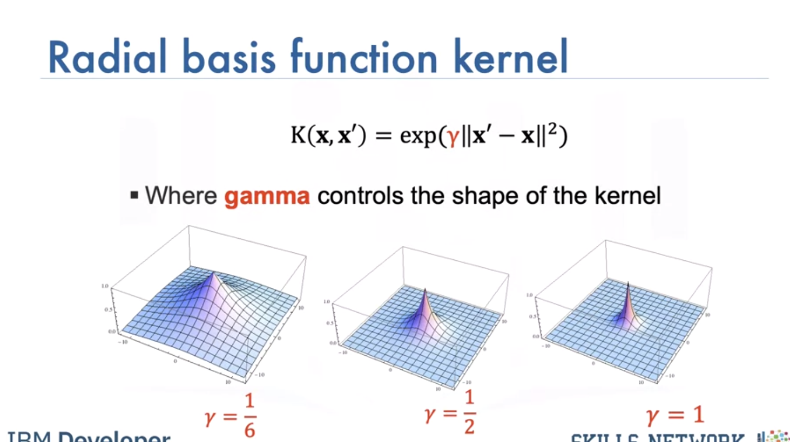

The RBF kernel has the parameter Gamma, lets see how we select Gamma Consider the following dataset of cats and dogs, anything in this region is a dog, anything in this region is a cat, anything in this region is a dog, anything in this region is a cat Therefore any sample in the red or blue region should be classified accordingly. Unfortunately you can’t find a plane that separates the data.

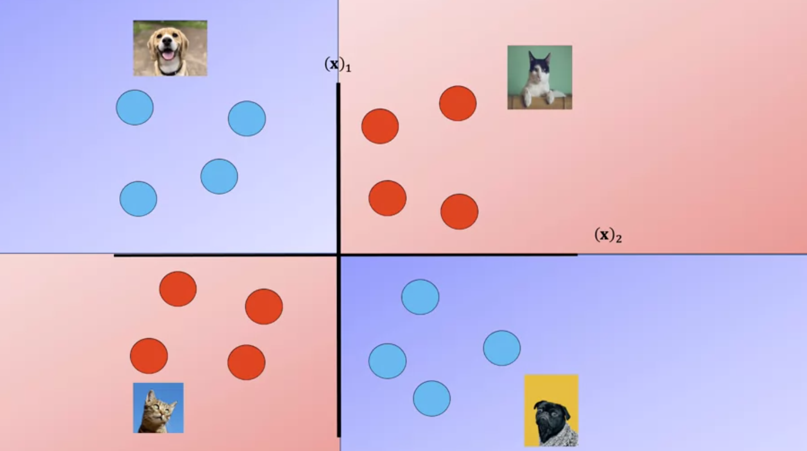

Here we use a plane to separate a similar dataset, it does not separate the data, lets try the RBF kernel.

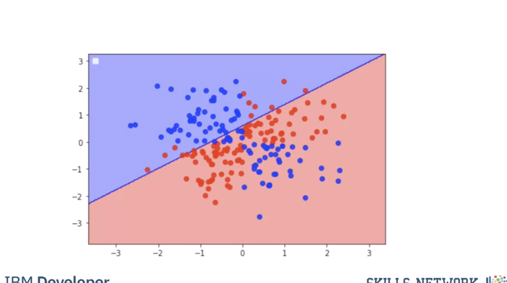

Using a value of gamma of 0.01 increases the flexibility of the classifier.

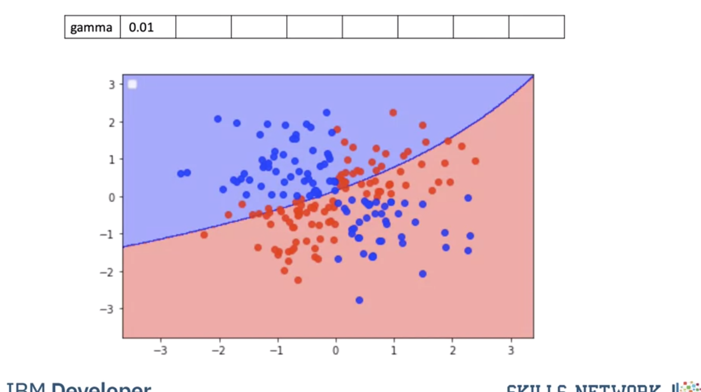

Using a value of gamma of 0.1 seems to be classifying more points.

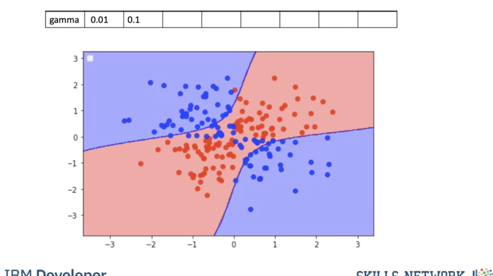

The value of 0.5 classified almost all the points correctly but it does not seem to match the regions in the original slide. This is known as overfitting, where the classifier fits the data points not the actual pattern, higher gamma the more likely we will over fit, let's clarify this with an example.

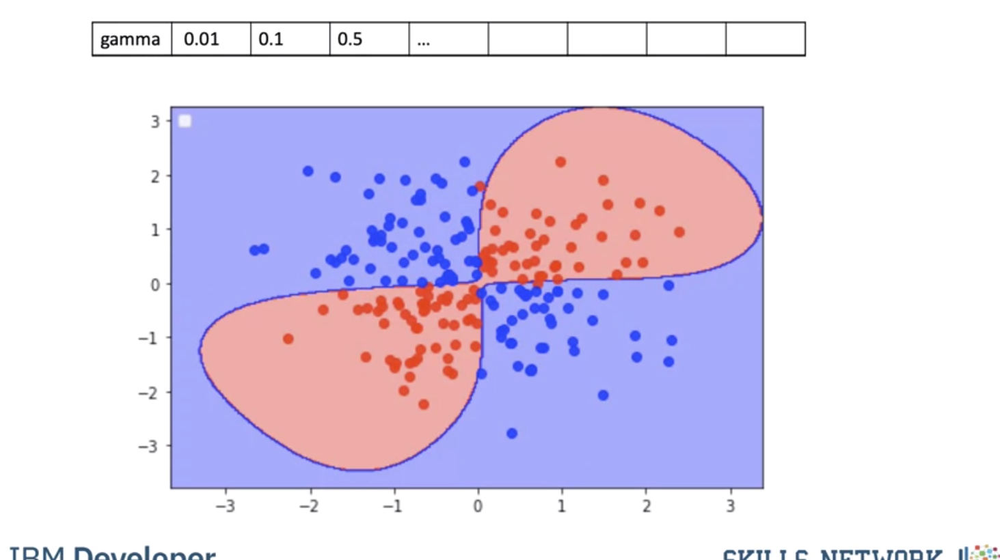

The following images of cats look like dogs, they could be mislabeled or the photo could be taken at a bad angle or the cat could just look like a dog. 

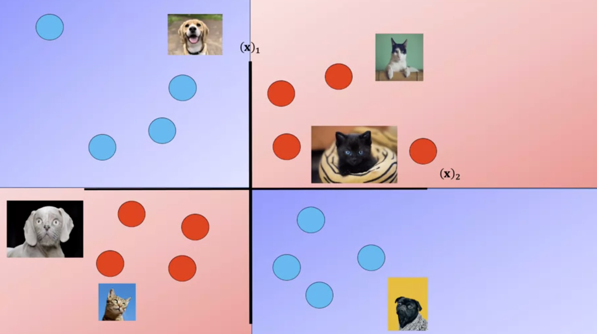

As a result the image points will appear in the incorrect region.

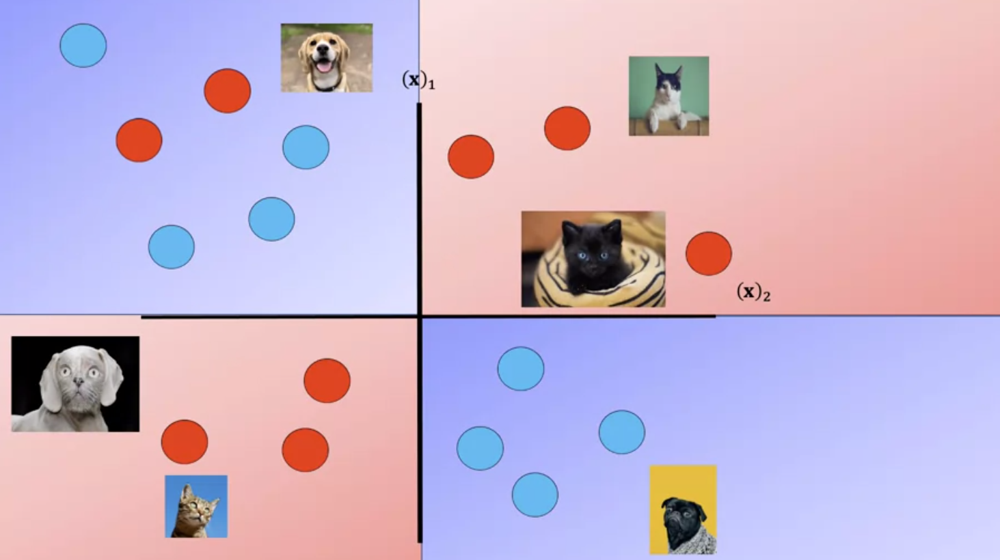

Fitting the model with a high value of gamma we get the following results, the performs almost perfect on the training points We can represent the classifier with the following decision region, where every point is classified by the color accordingly this does not match our Decision regions; this is called overfitting where we do well on the training samples but we may do poorly when we encounter new Data. 

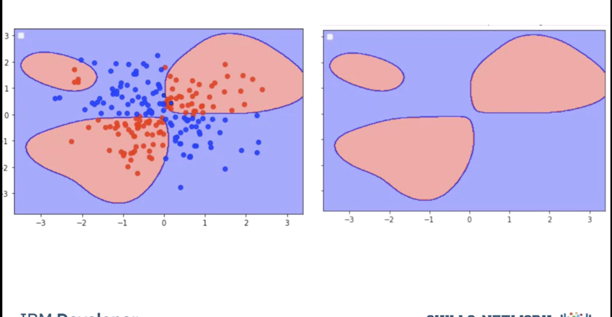

To avoid this we find the best value of gamma by using validation data. We split the data into training and validation sets. We use the validation samples to find the Hyperparameters.

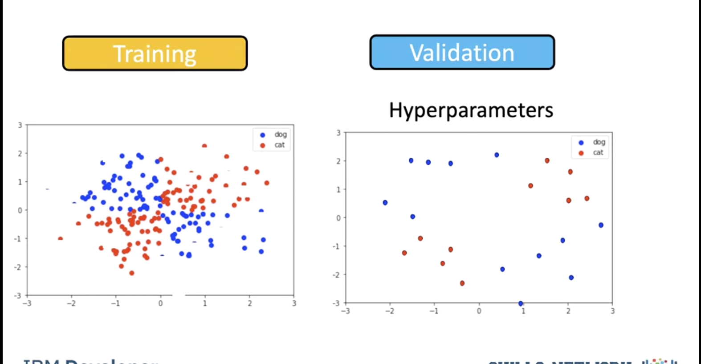

We test the model for a gamma of 0.5. We get the following misclassified samples. 


We see a value for gamma of 0.1 performs better. As a result, we use a value of 0.1. 

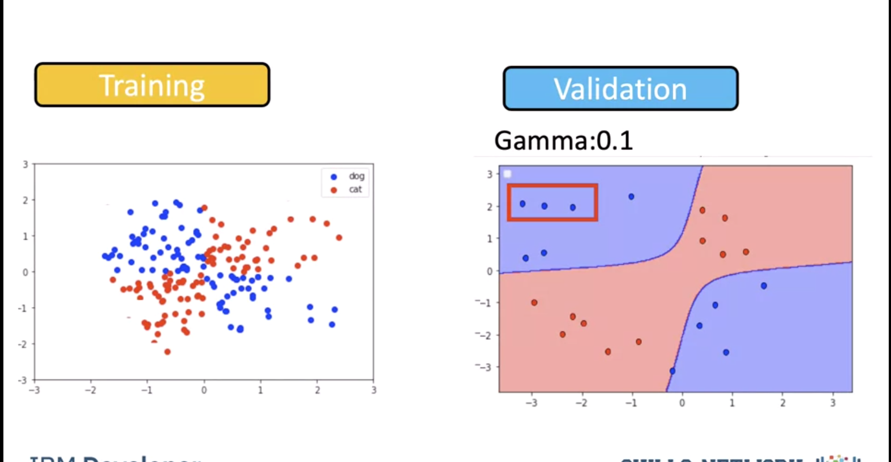

In practice we try several different values of Gamma and select the value that does the best on the validation data. 

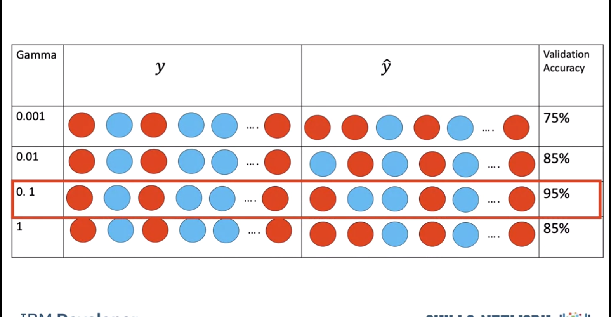

## Maximum Margin
SVM’s work by finding the Maximum Margin. Witch of the three planes do you think perform better in classifying the data?

Intuitively we choose green and even with some noise, would do well.


How to find best line? Maximize margine between line and data points with closest ones being `support vectors`. We can ignore other data samples when we have the support vectors. Hyperplane and boundary decision lines have their own equations. The math is involved. That said, the hyperplane is learned from training data using an optimization procedure that maximizes the margin; and like many other problems, this optimization problem can also be solved by gradient descent.

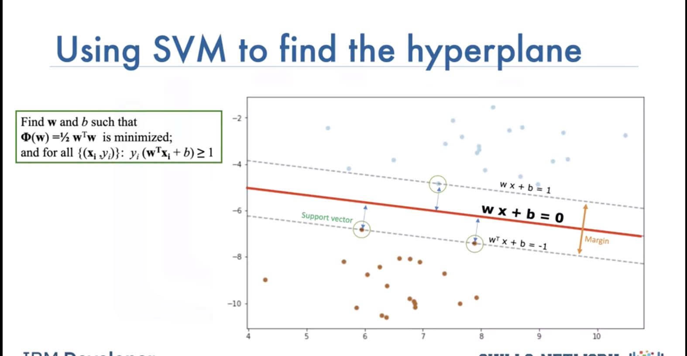

When the classes are not separable the `Soft Margin SVM` can be used:

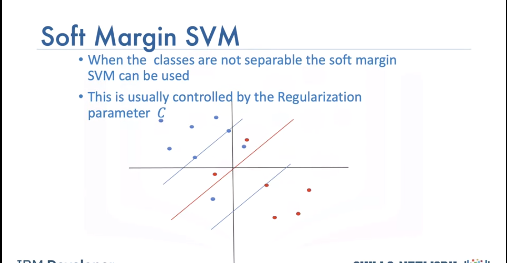

This is usually controlled by the regularization parameter. This allows some samples to be misclassified We select gamma and the regulation parameter C by using the values that do best on the validation data.

## Lab

```bash
# Setup Environment
cd ~/Desktop; rm -r temp; # To remove
cd ~/Desktop; mkdir temp; cd temp; pyenv activate venv3.10.4;
```

```python
import numpy as np
import matplotlib.pyplot as plt
from sklearn import datasets, svm, metrics, model_selection
from sklearn.linear_model import LogisticRegression
from sklearn.model_selection import train_test_split
from sklearn.preprocessing import StandardScaler
from sklearn.metrics import confusion_matrix
import pandas as pd
import seaborn as sns
import matplotlib.pyplot as plt
from sklearn.metrics import accuracy_score

# Load Important Libraries and Digit Dataset
digits = datasets.load_digits()
target = digits.target
flatten_digits = digits.images.reshape((len(digits.images), -1)) # (1797, 64)

# Visualize Some Handwritten Images in the Dataset
_, axes = plt.subplots(nrows=1, ncols=5, figsize=(10, 4))
for ax, image, label in zip(axes, digits.images, target):
    ax.set_axis_off()
    ax.imshow(image, cmap=plt.cm.gray_r, interpolation='nearest')
    ax.set_title('%i' % label)

plt.show()

# Divide Images into Training and Test Set
X_train, X_test, y_train, y_test = train_test_split(flatten_digits, target, test_size=0.2)

# Hand-written classification with Logistic Regression
## Standardize the dataset to put all the features of the variables on the same scale
scaler = StandardScaler()
X_train_logistic = scaler.fit_transform(X_train)
X_test_logistic = scaler.transform(X_test)
```

### Logistic Regression
Create the logistic regression and fit the logistic regression and use the `l1` penalty. Note here that since this is a multiclass problem the Logistic Regression parameter `multi_class` is set to `multinomial`.

```python
logit = LogisticRegression(C=0.01, penalty='l1', solver='saga', tol=0.1, multi_class='multinomial')
logit.fit(X_train_logistic, y_train)
y_pred_logistic = logit.predict(X_test_logistic)
# Get the accuracy of the logistic regression
print("Accuracy: "+str(logit.score(X_test_logistic, y_test)))
# Lets plot out the confusion matrix, each row of the matrix represents the instances in a predicted class, while each column represents the instances in an actual class.
label_names = [0, 1, 2, 3, 4, 5, 6, 7, 8, 9]
cmx = confusion_matrix(y_test, y_pred_logistic, labels=label_names)
```

Accuracy is fine and above 80% but we can see some heavily misclassified values, The classifier had a hard time classifying `8`.

```python
df_cm = pd.DataFrame(cmx)
# plt.figure(figsize=(10,7))
sns.set(font_scale=1.4) # for label size
sns.heatmap(df_cm, annot=True, annot_kws={"size": 16}) # font size
title = "Confusion Matrix for Logistic Regression results"
plt.title(title)
plt.show()
```

### SVM
```python
svm_classifier = svm.SVC(gamma='scale')
svm_classifier.fit(X_train, y_train)
y_pred_svm = svm_classifier.predict(X_test)
print("Accuracy: "+str(accuracy_score(y_test, y_pred_svm)))
label_names = [0, 1, 2, 3, 4, 5, 6, 7, 8, 9]
cmx = confusion_matrix(y_test, y_pred_svm, labels=label_names)

df_cm = pd.DataFrame(cmx)
# plt.figure(figsize=(10,7))
sns.set(font_scale=1.4) # for label size
sns.heatmap(df_cm, annot=True, annot_kws={"size": 16}) # font size
title = "Confusion Matrix for SVM results"
plt.title(title)
plt.show()
```

### Comparing both SVM and Logistic Regression with K-Fold Cross Validation

**k-fold Cross validation is used when there are limited samples**, the handwritten dataset contains about 1800 samples, this will give an opportunity for all the data to be in the training and test set at different given times. We will add `l2` regularization to visualize how well they both do against SVM.

> This is a comparing SVM to two different logistic regressions "using" k-fold cross validation

```python
algorithm = []
algorithm.append(('SVM', svm_classifier))
algorithm.append(('Logistic_L1', logit))
algorithm.append(('Logistic_L2', LogisticRegression(C=0.01, penalty='l2', solver='saga', tol=0.1, multi_class='multinomial')))


results = []
names = []
y = digits.target
for name, algo in algorithm:
    k_fold = model_selection.KFold(n_splits=10) #, random_state=10) # Got an error - BB
    if name == 'SVM':
        X = flatten_digits
        cv_results = model_selection.cross_val_score(algo, X, y, cv=k_fold, scoring='accuracy')
    else:
        scaler = StandardScaler()
        X = scaler.fit_transform(flatten_digits)
        cv_results = model_selection.cross_val_score(algo, X, y, cv=k_fold, scoring='accuracy')
        
    results.append(cv_results)
    names.append(name)


fig = plt.figure()
fig.suptitle('Compare Logistic and SVM results')
ax = fig.add_subplot()
plt.boxplot(results)
plt.ylabel('Accuracy')
ax.set_xticklabels(names)
plt.show()
```