# What is a Digital Image

A rectangular array of numbers.

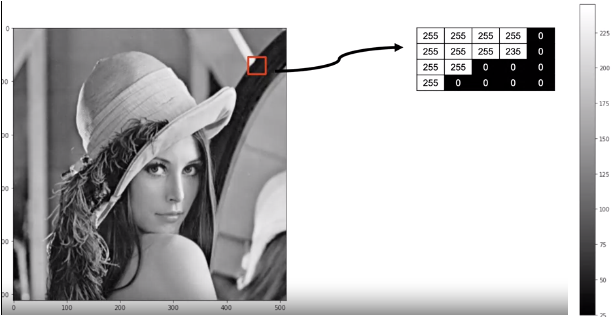

In the real world, an image can take on an almost unlimited number of values, but digital images have intensity values between zero (black) and 255 (white). It turns out that's all we need, 256 different intensity values to represent an image.

If we use less than 256 values, things will look cartoonish.

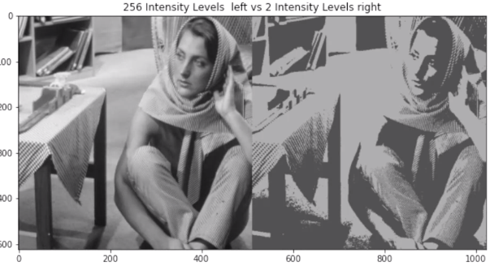

RGB:

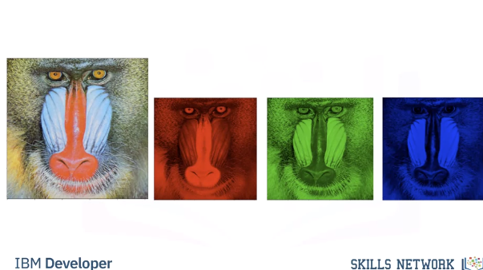

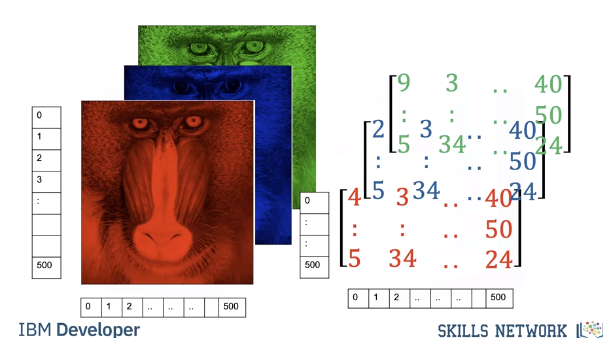

Image Masks:
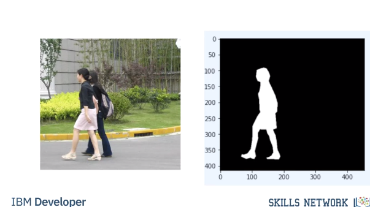

Basic Image Types:

An image is a file on your computer. Two popular image formats, Joint Photographic Expert Group image or JPEG, and Portable Network Graphics or PNG, these formats reduce file size and have other features. No matter what Python library you use, you're going to have to load the image

# PIL Intro

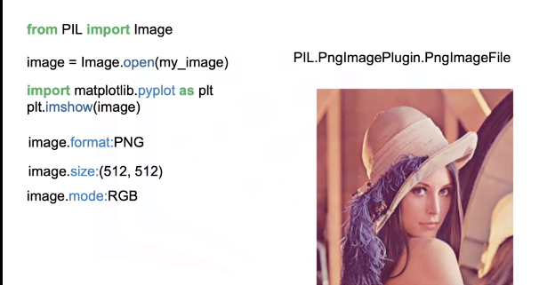

ImageOps:
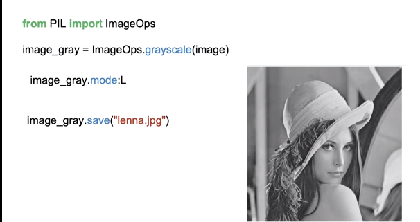

Quantizing:
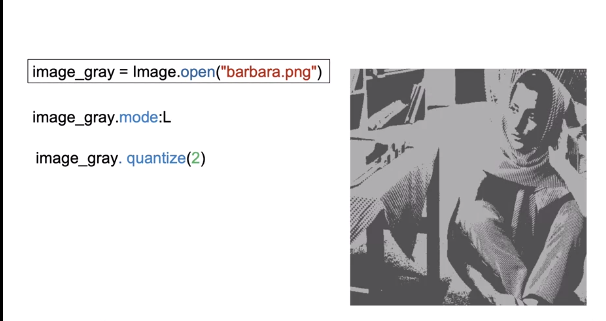

# Numpy Intro
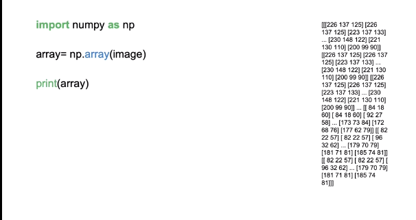

# OpenCV Intro
OpenCV is a library used for computer vision. It has more functionality than the PIL library, but is more difficult to use.

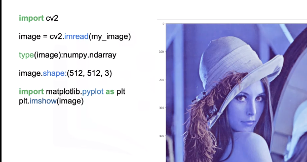

We can plot the image using Imshow, but the colors appear off. This is because the order of each channel is different in OpenCV unlike PIL that is RGB. OpenCV is BGR. This is the main difference between the arrays and PIL versus OpenCV. We can change the color space with conversion code, this changes the color space. We use the function cvtColor, the input is the color image and the color code BGR to RGB or blue, green, red to red, green, blue. We can now plot the image. You can also convert the image to gray-scale using cvtColor. The input is the original image and the BGR to gray color code. We can plot the image. We can save the image using imright, the input is the path and the image array.

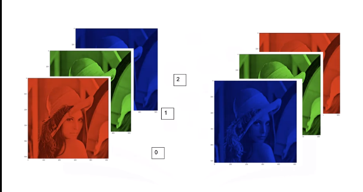

We can change the color space with conversion code, this changes the color space. We use the function cvtColor, the input is the color image and the color code BGR to RGB or blue, green, red to red, green, blue. We can now plot the image. You can also convert the image to gray-scale using cvtColor. The input is the original image and the BGR to gray color code. We can plot the image.
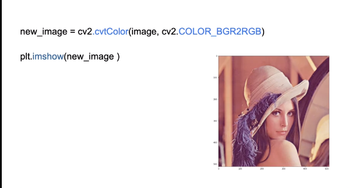

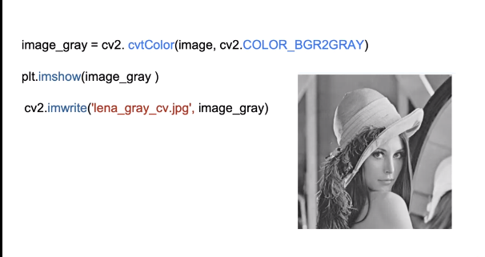