# Artificial_Neural_Networks

## Gradient Descent
### Cost Function
We fit a line to data. If we nail the weight $w$ then we have 0 loss. There is much loss if $w$ is not ideal and the loss increases exponentially the further we get from the origin with the loss function we defined. We need derivatives or "gradients" so we know if we change $w$ that the loss will be lower. We do this iteravely adjusting learning rate $\eta$. 

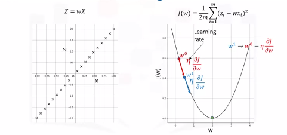  
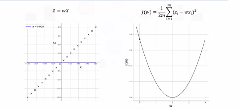  
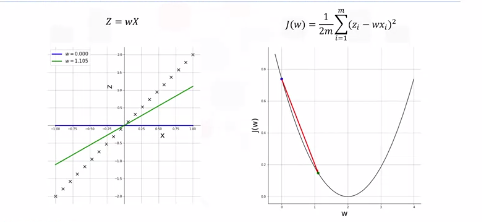  
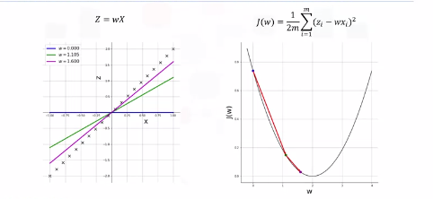  
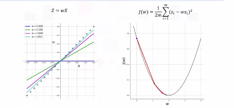  
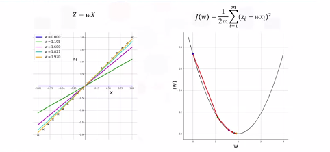  
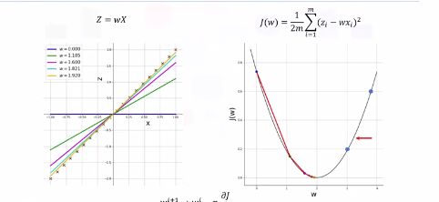  

## Backpropogation
How do we train and optimize weights and biases. Training is done in a supervised setting with a ground truth.

### Calculus
1. Calculate error between GT and estimated output. Denote this $E$.
2. Propogate this error back into the network and update each weight and bias as per the following equation:

    $w_i \rightarrow w_i - \eta * \frac{\delta E}{\delta w_i}$

    $b_i \rightarrow b_i - \eta * \frac{\delta E}{\delta b_i}$

3. Backpropogation

    For a two neuron network we can calculate $E$ for an observation. For multiple observations the equation is as follows:

    $E = \frac{1}{2m} \sum_{i=1}^{m} (T_i - a_{2,i})^2$

    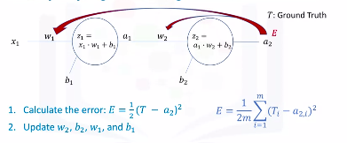

    > This is a total aggregate error.

4. Chain Rule
    
    Notice how $E$ is not directly a function of $w_2$. Through a [proof](https://github.com/bbearce/code-journal/blob/master/docs/notes/data_science/Coursera/keras/Images/artificial_neural_networks/Partial_Derivatives_Backpropagation.pdf) we can show that updating weights and biases is as follows (noticed small exponent errors...fyi):

    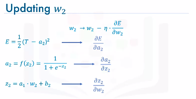
    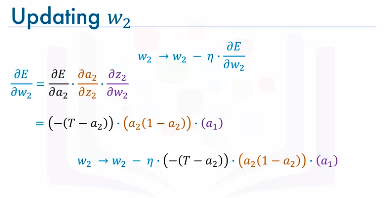

    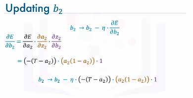
    
    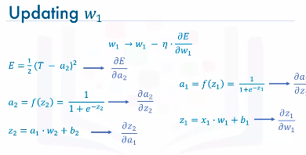
    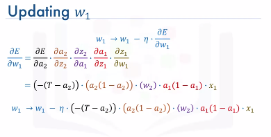
    
    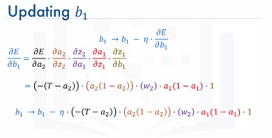
    
    Example:
    
    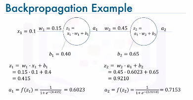

    Assume ground truth is $T=0.25$. Compute error between $a_2$ and $T$. Update weights and biases for predefined number of $epochs$ like 1000 for example or until error is under a certain threshold $\epsilon = 0.001$.

    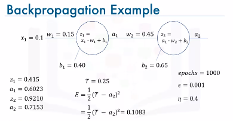

    Update w2  
    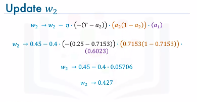

    Update b2  
    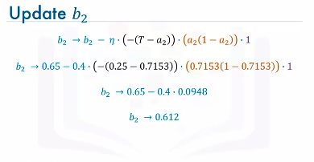

    Update w1  
    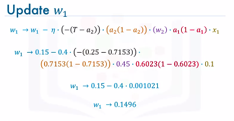

    Update b1  
    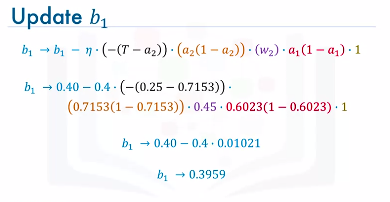
    

### Summary
1. Initialize the weights and biases to random values
2. Then, we iteratively repeat the following steps:
   1. Calculate the network output using forward propagation. 
   2. Calculate the error between the ground truth and the estimated or predicted output of the network. 
   3. Update the weights and the biases through backpropagation.
   4. Repeat the above three steps until the number of iterations or epochs is reached or the error between the ground truth and the predicted output is below a predefined threshold.

## Vanishing Gradient
There is a problem with the sigmoid activation function.
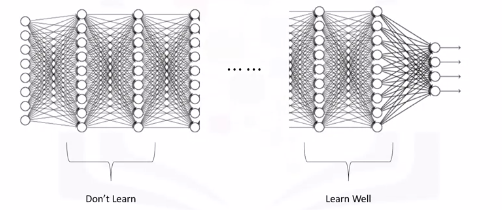

Recall from the previous video, with a very simple network of two neurons only, the derivatives of the error with respect to the weights were as follows:

$\frac{\delta E}{\delta w_1} = 0.001021$

$\frac{\delta E}{\delta w_2} = 0.05706$

Well it turns out that because we are using the sigmoid function as the activation function, then all the intermediate values in the network are between 0 and 1.

So when we do backpropagation, we keep multiplying factors that are less than 1 by each other, and so their gradients tend to get smaller and smaller as we keep on moving backward in the network. 

This means that the neurons in the earlier layers learn very slowly as compared to the neurons in the later layers in the network. The earlier layers in the network, are the slowest to train. The result is a training process that takes too long and a prediction accuracy that is compromised.

Accordingly, this is the reason why we do not use the sigmoid function or similar functions as activation functions, since they are prone to the vanishing gradient problem. 

## Activation Functions
These play a major role in the learning process of a neural network.

7 Types of activation functions you can use:
1. Binary step function
2. Linear Function
3. Sigmoid Function - most popular
4. Hyperbolic Tangent Function - most popular
5. ReLU (Rectified Linear Unit) - most popular
6. Leaky ReLU
7. Softmax Function - most popular

### Sigmoid Function
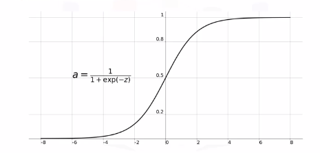

Sigmoid functions used to be widely used as activation functions in the hidden layers of a neural network. However, as you can see, the function is pretty flat beyond the +3 and -3 region. This means that once the function falls in that region, the gradients become very small.

Another problem with the sigmoid function is that the values only range from 0 to 1. This means that the sigmoid function is not symmetric around the origin. The values received are all positive. Well, not all the times would we desire that values going to the next neuron be all of the same sign. This can be addressed by scaling the sigmoid function, and this brings us to the next activation function: the hyperbolic tangent function.

### Hyperbolic Tangent Function
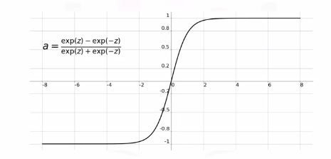

It is very similar to the sigmoid function. It is actually just a scaled version of the sigmoid function, but unlike the sigmoid function, it's symmetric over the origin. It ranges from -1 to +1. However, although it overcomes the lack of symmetry of the sigmoid function, it also leads to the vanishing gradient problem in very deep neural networks.

### ReLU Function
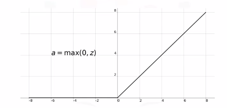

The rectified linear unit, or ReLU, function is the most widely used activation function when designing networks today.

In addition to it being nonlinear, the main advantage of using the ReLU, function over the other activation functions is that it does not activate all the neurons at the same time. 
 
According to the plot here, if the input is negative it will be converted to 0, and the neuron does not get activated. This means that at a time, only a few neurons are activated, making the network sparse and very efficient. Also, the ReLU function was one of the main advancements in the field of deep learning that led to overcoming the vanishing gradient problem.

### Softmax Function
Sigmoid type function that is handy for classification problems.

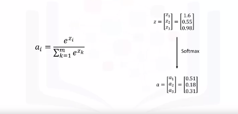

Maps outputs to between 0 and 1. This way, it is easier for us to classify a given data point and determine to which category it belongs.