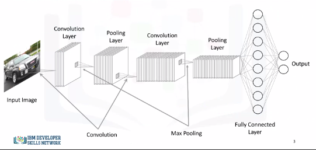
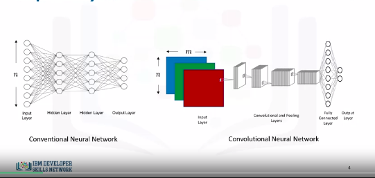
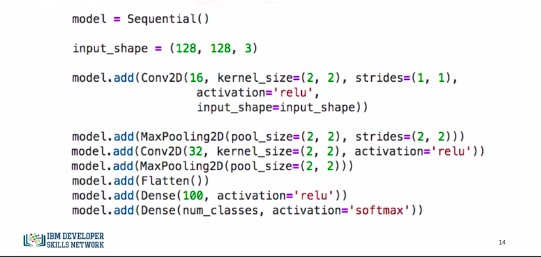
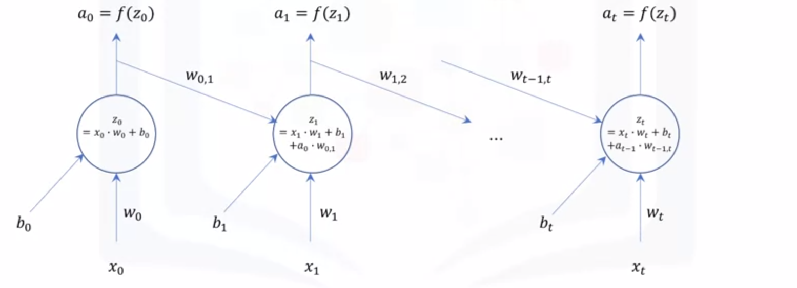
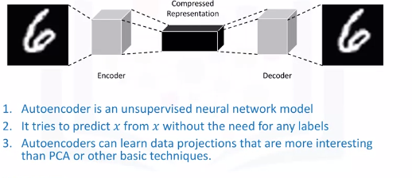

# Deep Learning Networks

## Shallow Versus Deep Neural Networks.md
* Shallow neural network consists of one hidden layer.
* Deep neural network consists of more hidden layers and has a large number of neurons in each layer.
* Why did deep learning take off just recently?

## Why Deep Learning Took Off
1. Advancement in field itself
2. Data is readily available
3. GPUs and compute power

## Supervised Learning
### Convolutional Neural Networks
* CNNs are similar to the typical NN.
  * Made up of neurons
  * Neurons combines inputs it receives
  * Fits output into activation function
* CNNs take inputs as images. (ALWAYS IMAGES)
* This allows us to incorporate properties that make the training process much more efficient.
* Solve problems involving image reconstruction, object detection, and other computer vision applications.


Typical CNN:  


CNN:  


We see different layers:
* Input Layer:
  * Usually n inputs
  * CNNs will have
    * $m$ x $n$ for grey scale
    * 3 x $m$ x $n$ for color images
* Convolution Layer
  * We define filters
    * We slide a kernel over an image and perform a dot product between the input image and kernel mask as it slides
  * Why not just flatten image in to a (1 x $m$ x $n$)? Why convolve?
    * We will end up with a massive number of parameters that will need to be optimized, and it will be super computationally expensive.
    * Also, decreasing the number of parameters would definitely help in preventing the model from overfitting the training data.
    * It is worth mentioning that a convolutional layer also consists of ReLU's which filter the output of the convolutional step passing only positive values and turning any negative values to 0.
* Pooling Layer
  * Main objective is to reduce spatial dimensions of data.
  * 2 types:
    * Max Pooling
      * For each kernel, we keep the max cell
    * Average Pooling
      * For each kernel, we keep the average of kernel cells
  * Pooling provides spatial variance which enables the NN to recognize objects in the image even if the object does not exactly resemble the original object.
* Fully Connected Layer
  * We flatten the output of the last convolutional layer and connect every node of the current layer with every other node of the next layer.
  * This layer takes output of previous layer (pooling, conv, relu, etc) and connects to nodes representing each class we want to predict.

#### Keras Code


* Conv2D(16...) means 16 filters. So kernel of (2,2) strides 1 pixel at a time and slides acros whole image. That is one filter pass. 15 more are completed.
  * _What kind of filter?_
* MaxPool, and assumes _max pooling_.
* Conv2D(32...) twice as many filters as first layer.
* MaxPool, max pooling again.
* Flatten output from layers so it can proceed to output layers.
* We add a 100 neuron FCL and then create an output layer with the num_classes we are searching for. It has a softmax activation function as well.


### Recurrent Neural Networks (RNNs)
So far, we have seen neural networks and deep learning models that see datapoints as independent instances. However, let's say you want to build a model that can analyze scenes in a movie. Well, you cannot assume that scenes in a movie are independent, and therefore, traditional deep learning models are not suitable for this application.

* Networks with loops that feed into itself
  * They don't just take a new input at a time, but also take in as input the output from the previous data point that was fed into the network. 



Essentially, we can start with a normal neural network. At time t = 0, the network takes in input x0 and outputs a0. Then, at time t = 1, in addition to the input x1, the network also takes a0 as input, weighted with weight w0,1, and so on and so forth. As a result, recurrent neural networks are very good at modeling patterns and sequences of data, such as texts, genomes, handwriting, and stock markets. These algorithms take time and sequence into account, which means that they have a temporal dimension. 


#### Long Short-Term Memory Model
* Popular example of an RNN is Long Short-Term Memory Model (LSTM)
* Applications include:
  1. Image Generation
  2. Handwriting Generation
  3. Automatic Captioning of Images
  4. Automatic Description of Videos


## Unsupervised Learning
### Autoencoders
* Autoencoding is a data compression algorithm where the compression and the decompression functions are learned automatically from data instead of being engineered by a human.
* Autoencoders are data specific, which means that they will only be able to compress data similar to what they have been trained on.
* Therefore, an autoencoder trained on pictures of cars would do a rather poor job of compressing pictures of buildings, because the features it would learn would be vehicle or car specific.
* Some interesting applications of autoencoders are data denoising and dimensionality reduction for data visualization.



It takes an image, for example, as an input and uses an encoder to find the optimal compressed representation of the input image. Then, using a decoder the original image is restored. So an autoencoder is an unsupervised neural network model. It uses backpropagation by setting the target variable to be the same as the input. 

#### Restricted Boltzman Machines
* A very popular type of autoencoders is the Restricted Boltzmann Machines or (RBMs)
* Applications include:
  1. Fixing imbalanced datasets
  2. Estimating missing values
  3. Automatic feature extraction


## Convolutional Neural Networks with Keras
### Convolutional Layer with one set of convolutional and pooling layers

```bash
# Setup Environment
cd ~/Desktop; rm -r temp; # To remove
cd ~/Desktop; mkdir temp; cd temp; pyenv activate venv3.10.4;
```

```python
import keras
from keras.models import Sequential
from keras.layers import Dense
from keras.utils import to_categorical

from keras.layers import Convolution2D # to add convolutional layers
from keras.layers import MaxPooling2D # to add pooling layers
from keras.layers import Flatten # to flatten data for fully connected layers

from keras.datasets import mnist
# load data
(X_train, y_train), (X_test, y_test) = mnist.load_data()

# reshape to be [samples]][width][height][pixels]
X_train = X_train.reshape(X_train.shape[0], 28, 28, 1).astype('float32')
X_test = X_test.reshape(X_test.shape[0], 28, 28, 1).astype('float32')

X_train.shape # (60000, 28, 28, 1)

X_train = X_train / 255 # normalize training data
X_test = X_test / 255 # normalize test data

# Next, let's convert the target variable into binary categories.
y_train = to_categorical(y_train)
y_test = to_categorical(y_test)

num_classes = y_test.shape[1] # number of categories

# Next, let's define a function that creates our model. Let's start with one set of convolutional and pooling layers.
def convolutional_model():
    # create model
    model = Sequential()
    model.add(Convolution2D(16, (5, 5), strides=(1, 1), activation='relu', input_shape=(28, 28, 1)))
    model.add(MaxPooling2D(pool_size=(2, 2), strides=(2, 2)))
    model.add(Flatten())
    model.add(Dense(100, activation='relu'))
    model.add(Dense(num_classes, activation='softmax'))
    # compile model
    model.compile(optimizer='adam', loss='categorical_crossentropy',  metrics=['accuracy'])
    return model

# Finally, let's call the function to create the model, and then let's train it and evaluate it.
## build the model
model = convolutional_model()

## fit the model
model.fit(X_train, y_train, validation_data=(X_test, y_test), epochs=10, batch_size=200, verbose=2)

## evaluate the model
scores = model.evaluate(X_test, y_test, verbose=0)
print("Accuracy: {} \n Error: {}".format(scores[1], 100-scores[1]*100))
```

### Convolutional Layer with two sets of convolutional and pooling layers

```python
def convolutional_model():
    # create model
    model = Sequential()
    model.add(Convolution2D(16, (5, 5), activation='relu', input_shape=(28, 28, 1)))
    model.add(MaxPooling2D(pool_size=(2, 2), strides=(2, 2)))
    model.add(Convolution2D(8, (2, 2), activation='relu'))
    model.add(MaxPooling2D(pool_size=(2, 2), strides=(2, 2)))
    model.add(Flatten())
    model.add(Dense(100, activation='relu'))
    model.add(Dense(num_classes, activation='softmax'))
    # Compile model
    model.compile(optimizer='adam', loss='categorical_crossentropy',  metrics=['accuracy'])
    return model

# Now, let's call the function to create our new convolutional neural network, and then let's train it and evaluate it.
## build the model
model = convolutional_model()

## fit the model
model.fit(X_train, y_train, validation_data=(X_test, y_test), epochs=10, batch_size=200, verbose=2)

## evaluate the model
scores = model.evaluate(X_test, y_test, verbose=0)
print("Accuracy: {} \n Error: {}".format(scores[1], 100-scores[1]*100))
```