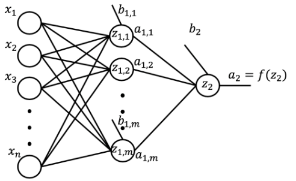

# Intro to Deep Neural Nets

## Applications
* Color Restoration
* Speech Reenactment
  * Synching lip movements in a video with an audio clip
  * Synthesizing a video to go along with an audio clip
    * You could pull audio from one video clip and sync with a synthesized video.
* Automatic hand writing generation
* Other Applications:
  * Automatic machine translation
  * Automatically adding sounds to silent movies
  * Object classification and detection in images
  * Self Driving Cars

## Neurons and Neural Networks


The main body of the neuron is called the **soma**, which contains the nucleus of the neuron. The big network of arms sticking out of the body is called the **dendrites**, and then the long arm that sticks out of the soma in the other direction is called the **axon**. The whiskers at the end of the axon are called the terminal buttons or synapses. So the dendrites receive electrical impulses which carry information, or data, from sensors or **terminal buttons** of other adjoining neurons. The dendrites then carry the impulses or data to the soma. In the nucleus, electrical impulses, or the data, are processed by combining them together, and then they are passed on to the axon. The axon then carries the processed information to the terminal button or synapse, and the output of this neuron becomes the input to thousands of other neurons.

Learning in the brain occurs by repeatedly activating certain neural connections over others, and this reinforces those connections. This makes them more likely to produce a desired outcome given a specified input. Once the desired outcome occurs, the neural connections causing that outcome become strengthened.

An artificial neuron behaves in the same way as a biological neuron. So it consists of a **soma, dendrites, and an axon** to pass on the output of this neuron to other neurons. The end of the axon can branch off to connect to many other neurons, but for simplicity we are just showing one branch here. The learning process also very much resembles the way learning occurs in the brain as you will see in the next couple of videos. Now that we understand the different parts of an artificial neuron, let's learn how we formulate the way artificial neural networks process information.


## Artificial Neural Nets


For a network of neurons, we normally divide it into different layers: the first layer that feeds the input into the network is obviously called the input layer. The set of nodes that provide the output of the network is called the output layer. And any sets of nodes in between the input and the output layers are called the hidden layers.

Three main topics are associated with artifical neural networks: 
* Forward Propogation
* Backpropagation
* Activation Functions

### Forward Propagation

Forward propagation is the process through which data passes through layers of neurons in a neural network from the input layer all the way to the output layer.

As shown here, the data flows through each neuron by connections or the dendrites. Every connection has a specific weight by which the flow of data is regulated.

Here **x1** and **x2** are the two inputs, they could be an integer or float. When these inputs pass through the connections, they're adjusted depending on the connection weights, **w1** and **w2**.

The neuron then processes this information by outputting a weighted sum of these inputs. It also adds a constant to the sum which is referred to as the **bias (b)**.

So, **z** here is the linear combination of the inputs and weights along with the bias, and **a** is the output of the network.

For consistency, we will stick to these letters throughout the course, so **z** will always represent the linear combination of the inputs, and **a** will always represent the output of a neuron. 

$a = f(z) = \frac{1}{1 + e^-z}$

Therefore, a better processing of the data would be to map the weighted sum to a nonlinear space. A popular function is the sigmoid function, where if the weighted sum is a very large positive number, then the output of the neuron is close to 1, and if the weighted sum is a very large negative number, then the output of the neuron is close to zero. Non-linear transformations like the sigmoid function are called activation functions. Activation functions are another extremely important feature of artificial neural networks. They basically decide whether a neuron should be activated or not.

In other words, whether the information that the neuron is receiving is relevant or should be ignored. The takeaway message here is that a neural network without an activation function is essentially just a linear regression model. The activation function performs non-linear transformation to the input enabling the neural network of learning and performing more complex tasks, such as image classifications and language translations.


For further simplification, I am going to proceed with a neural network of one neuron and one input. Let's go over an example of how to compute the output. Let's say that the value of x1 is 0.1, and we want to predict the output for this input. The network has optimized weight and bias where w1 is 0.15 and b1 is 0.4. The first step is to calculate z, which is the dot product of the inputs and the corresponding weights plus the bias. So we find that z is 0.415. The neuron then uses the sigmoid function to apply non-linear transformation to z. Therefore, the output of the neuron is 0.6023. For a network with two neurons, the output from the first neuron will be the input to the second neuron. The rest is then exactly the same. The second neuron takes the input and computes the dot product of the input, which is a1 in this case, and the weight which is w2, and adds the bias which is b2. Using a sigmoid function as the activation function, the output of the network would be 0.7153. And this would be the predicted value for the input 0.1. This is in essence how a neural network predicts the output for any given input. No matter how complicated the network gets, it is the same exact process. To summarize, given a neural network with a set of weights and biases, you should be able to compute the output of the network for any given input.

#### Forward Prop Code Ex
```bash
# Setup Environment
cd ~/Desktop; rm -r temp; # To remove
cd ~/Desktop; mkdir temp; cd temp; pyenv activate venv3.10.4;
```

From the videos, let's recap how a neural network makes predictions through the forward propagation process. Here is a neural network that takes two inputs, has one hidden layer with two nodes, and an output layer with one node.


Let's start by randomly initializing the weights and the biases in the network. We have 6 weights and 3 biases, one for each node in the hidden layer as well as for each node in the output layer.

**First Network:**
```python
import numpy as np # import Numpy library to generate 
import pprint as pp
from random import seed

weights = np.around(np.random.uniform(size=6), decimals=2) # initialize the weights
biases = np.around(np.random.uniform(size=3), decimals=2) # initialize the biases
```

Now that we have the weights and the biases defined for the network, let's compute the output for a given input, $x_1$ and $x_2$.

```python
x_1 = 0.5 # input 1
x_2 = 0.85 # input 2

print('x1 is {} and x2 is {}'.format(x_1, x_2))
# x1 is 0.5 and x2 is 0.85

```
Let's start by computing the wighted sum of the inputs, $z_{1, 1}$, at the first node of the hidden layer.

```python
z_11 = x_1 * weights[0] + x_2 * weights[1] + biases[0]

print('The weighted sum of the inputs at the first node in the hidden layer is {}'.format(z_11))
# The weighted sum of the inputs at the first node in the hidden layer is 1.577

# Second node
z_12 = x_1 * weights[2] + x_2 * weights[3] + biases[1]

print('The weighted sum of the inputs at the second node in the hidden layer is {}'.format(np.around(z_12, decimals=4)))
# The weighted sum of the inputs at the second node in the hidden layer is 1.074
```

Next, assuming a sigmoid activation function, let's compute the activation of the first node, $a_{1, 1}$, in the hidden layer.
```python
a_11 = 1.0 / (1.0 + np.exp(-z_11))

print('The activation of the first node in the hidden layer is {}'.format(np.around(a_11, decimals=4)))

# Second node
a_12 = 1.0 / (1.0 + np.exp(-z_12))
print('The activation of the second node in the hidden layer is {}'.format(np.around(a_12, decimals=4)))
# The activation of the second node in the hidden layer is 0.7454
```

Now compute $z_2$:
```python
z_2 = z_11 * weights[4] + z_12 * weights[5] + biases[2]
print('The weighted sum of the inputs at the node in the output layer is {}'.format(np.around(z_2, decimals=4)))
# The weighted sum of the inputs at the node in the output layer is 2.7104
```

Finally, activation:
```python
a_2 = 1.0 / (1.0 + np.exp(-z_2))
print('The output of the network for x1 = 0.5 and x2 = 0.85 is {}'.format(np.around(a_2, decimals=4)))
# The output of the network for x1 = 0.5 and x2 = 0.85 is 0.9376
```

In order to code an automatic way of making predictions, let's generalize our network.



A general network would take $n$ inputs, would have many hidden layers, each hidden layer having $m$ nodes, and would have an output layer. **Although the network is showing one hidden layer, we will code the network to have many hidden layers**. Similarly, although the network shows an output layer with one node, we will code the network to have more than one node in the output layer.

**Initialize a network:**
```python
n = 2 # number of inputs
num_hidden_layers = 2 # number of hidden layers
m = [2, 2] # number of nodes in each hidden layer
num_nodes_output = 1 # number of nodes in the output layer
```

```python

num_nodes_previous = n # number of nodes in the previous layer

network = {} # initialize network an an empty dictionary

# loop through each layer and randomly initialize the weights and biases associated with each node
# notice how we are adding 1 to the number of hidden layers in order to include the output layer
for layer in range(num_hidden_layers + 1): 
    # determine name of layer
    if layer == num_hidden_layers:
        layer_name = 'output'
        num_nodes = num_nodes_output
    else:
        layer_name = 'layer_{}'.format(layer + 1)
        num_nodes = m[layer]
    # initialize weights and biases associated with each node in the current layer
    network[layer_name] = {}
    for node in range(num_nodes):
        node_name = 'node_{}'.format(node+1)
        network[layer_name][node_name] = {
            'weights': np.around(np.random.uniform(size=num_nodes_previous), decimals=2),
            'bias': np.around(np.random.uniform(size=1), decimals=2),
        }
    num_nodes_previous = num_nodes

pp.pprint(network) # print network
```
Awesome! So now with the above code, we are able to initialize the weights and the biases pertaining to any network of any number of hidden layers and number of nodes in each layer. But let's put this code in a function so that we are able to repetitively execute all this code whenever we want to construct a neural network.

```python
def initialize_network(num_inputs, num_hidden_layers, num_nodes_hidden, num_nodes_output):
    num_nodes_previous = num_inputs # number of nodes in the previous layer
    network = {}
    # loop through each layer and randomly initialize the weights and biases associated with each layer
    for layer in range(num_hidden_layers + 1):
        if layer == num_hidden_layers:
            layer_name = 'output' # name last layer in the network output
            num_nodes = num_nodes_output
        else:
            layer_name = 'layer_{}'.format(layer + 1) # otherwise give the layer a number
            num_nodes = num_nodes_hidden[layer] 
        # initialize weights and bias for each node
        network[layer_name] = {}
        for node in range(num_nodes):
            node_name = 'node_{}'.format(node+1)
            network[layer_name][node_name] = {
                'weights': np.around(np.random.uniform(size=num_nodes_previous), decimals=2),
                'bias': np.around(np.random.uniform(size=1), decimals=2),
            }
        num_nodes_previous = num_nodes
    return network # return the network

small_network = initialize_network(num_inputs=5, \
                   num_hidden_layers=3, \
                   num_nodes_hidden=[3,2,3], \
                   num_nodes_output=1)
```

**Compute Weighted Sum At Each Node:**

```python
def compute_weighted_sum(inputs, weights, bias):
    return np.sum(inputs * weights) + bias


np.random.seed(12)
inputs = np.around(np.random.uniform(size=5), decimals=2)

print('The inputs to the network are {}'.format(inputs))
# The inputs to the network are [0.15 0.74 0.26 0.53 0.01]

weighted_sum = compute_weighted_sum(inputs, \
                     small_network['layer_1']['node_1']['weights'], \
                     small_network['layer_1']['node_1']['bias']
                     )

```

Compute Node Activation:
```python
def node_activation(weighted_sum):
    return 1.0 / (1.0 + np.exp(-1 * weighted_sum))

node_activation(weighted_sum)
```

**Forward Propagation**
> Put together for all nodes:

The final piece of building a neural network that can perform predictions is to put everything together. So let's create a function that applies the *compute_weighted_sum* and *node_activation* functions to each node in the network and propagates the data all the way to the output layer and outputs a prediction for each node in the output layer.

```python
def forward_propagate(network, inputs):
    layer_inputs = list(inputs) # start with the input layer as the input to the first hidden layer
    for layer in network:
        layer_data = network[layer]
        layer_outputs = [] 
        for layer_node in layer_data:
            node_data = layer_data[layer_node]
            # compute the weighted sum and the output of each node at the same time 
            node_output = node_activation(compute_weighted_sum(layer_inputs, node_data['weights'], node_data['bias']))
            layer_outputs.append(np.around(node_output[0], decimals=4))
        if layer != 'output':
            print('The outputs of the nodes in hidden layer number {} is {}'.format(layer.split('_')[1], layer_outputs))
        layer_inputs = layer_outputs # set the output of this layer to be the input to next layer
    network_predictions = layer_outputs
    return network_predictions


forward_propagate(small_network, inputs)
```
