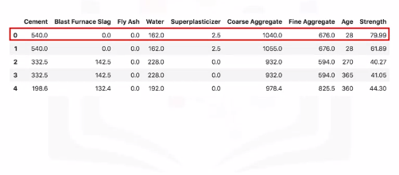
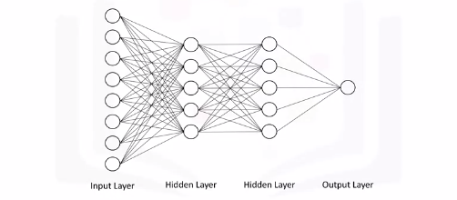
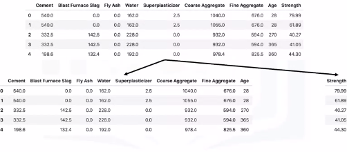
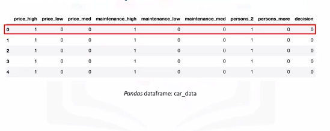
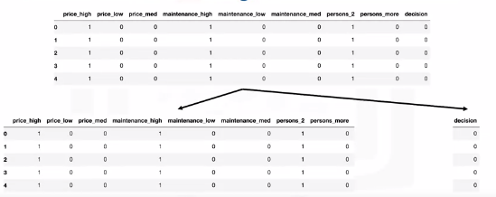
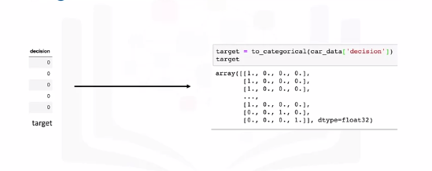
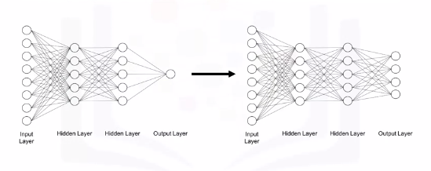
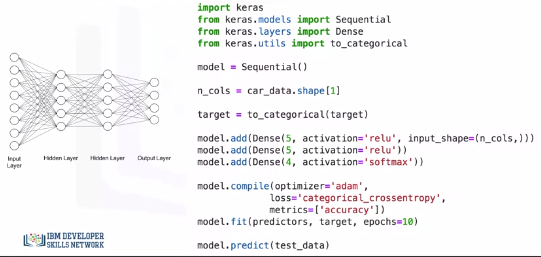
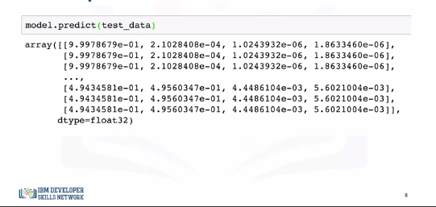

# Keras and Deep Learning Libraries

## Deep Learning Libraries
* Tensorflow - most popular IBM says...but this is pretty debatable...more github activity and enterprise use and can be debugged easier at large scales due to static graphs.
  * Keras - Easiest API to use and the go-to library for quick prototyping and fast development.
* Pytorch - Cousin of Lua-based Torch framework. Strong Tensorflow competitor. Released 2016 and is becoming more popular than Tensorflow in academic settings generally. 

## Regression Models with Keras

Let's take a look at a regression example. Here is a data set of the compressive strength of different samples of concrete based on the volumes of the different materials that were used to make them. 


 
So let's say we would like to use the Keras library to quickly build a deep neural network to model this dataset, and so we can automatically determine the compressive strength of a given concrete sample based on its ingredients.


So let's say that the deep neural network that we would like to create takes all the eight features as input, feeds them into a hidden layer of five nodes, which is connected to another hidden layer of five nodes, which is then connected to the output layer with one node that is supposed to output the compressive strength of a given concrete sample.

> Note that usually you would go with a much larger number of neurons in each hidden layer like 50 or even 100, but we're just using a small network for simplicity. 

Notice how all the nodes in one layer are connected to all the other nodes in the next layer. Such a network is called a **dense network**.



Before we begin using the Keras library, let's prepare our data and have it in the right format. The only thing we would need to do is to split the dataframe into two dataframes, one that has the predictors columns and another one that has the target column. We will also name them predictors and target. 


### Keras Code
```bash
# Setup Environment
cd ~/Desktop; rm -r temp; # To remove
cd ~/Desktop; mkdir temp; cd temp; pyenv activate venv3.10.4;
```

There are two models in the Keras library. One of them is the Sequential model and the other one is the model class used with the functional API. So to create your model, you simply call the Sequential constructor.

```python
import keras
from keras.models import Sequential
from keras.layers import Dense

# Because our network consists of a linear stack of layers, then the Sequential model is what you would want to use. This is the case most of the time unless you are building something out of the ordinary. 
model = Sequential()
n_cols = concrete_data.shape[1] # Assuming you have the csv

# Now building your layers is pretty straightforward as well. For that, we would need to import the "Dense" type of layers from "keras.layers". Then we use the add method to add each dense layer. We specify the number of neurons in each layer and the activation function that we want to use. 
model.add(Dense(5, activation='relu', input_Shape=(n_cols,)))
model.add(Dense(5, activation='relu'))
model.add(Dense(1))

# Now for training, we need to define an optimizer and the error metric.

# As for the minimization algorithm (optimizer), there are actually other more efficient algorithms than the gradient descent for deep learning applications. One of them is "adam". One of the main advantages of the "adam" optimizer is that you don't need to specify the learning rate that we saw in the gradient descent video. 
model.compile(optimizer='adam', loss='mean_squared_error')
model.fit(predictors, target)

predictors = model.predict(test_data)

```

## Classification Models with Keras
Let's say that we would like to build a model that would inform someone whether purchasing a certain car would be a good choice based on the price of the car, the cost to maintain it, and whether it can accommodate two or more people. So, here is a dataset that we are calling "car_data".



### One Hot Encoding
The data already has one-hot encoding to transform each category of price, maintenance, and how many people the car can accommodate, into separate columns. So the price of the car can be either high, medium, or low. Similarly, the cost of maintaining the car can also be high, medium, or low, and the car can either fit two people or more.

If you take the first car in the dataset, it is considered an expensive car, has high maintenance cost, and can fit only two people. The decision is 0, meaning that buying this car would be a **bad choice**. A decision of 1 means that buying the car is **acceptable**, a decision of 2 means that buying the car would be a **good decision**, and a decision of 3 means that buying the car would be a **very good decision**. 


We will use the same neural network.

### Predictors and Target



However, with Keras, for classification problems, we can't use the target column as is; we actually need to transform the column into an array with binary values similar to one-hot encoding like the output shown here. We easily achieve that using the "to_categorical" function from the Keras utilities package. 



In other words, our model instead of having just one neuron in the output layer, it would have four neurons, since our target variable consists of four categories. 


In terms of code, the structure of our code is pretty similar to the one we use to build the model for our regression problem. We start by importing the Keras library and the Sequential model and we use it to construct our model. 

We also import the "Dense" layer since we will be using it to build our network. 

The additional import statement here is the "to_categorical" function in order to transform our target column into an array of binary numbers for classification. Then, we proceed to constructing our layers. We use the add method to create two hidden layers, each with five neurons and the neurons are activated using the ReLU activation function. 




>  Notice how here we also specify the softmax function as the activation function for the output layer, so that the sum of the predicted values from all the neurons in the output layer sum nicely to 1. 

Then in defining our compiler, here we will use the categorical cross-entropy as our loss measure instead of the mean squared error that we use for regression, and we will specify the evaluation metric to be "accuracy". "accuracy" is a built-in evaluation metric in Keras but you can actually define your own evaluation metric and pass it in the metrics parameter.

Then we fit the model. Notice how this time we're specifying the number of epochs for training the model. Although we didn't specify the number of epochs when we built a regression model, but we could have done that. Finally, we use the predict method to make predictions. Now the output of the Keras predict method would be something like what's shown here.




Now the output of the Keras predict method would be something like what's shown here.

For each data point, the output is the probability that the decision of purchasing a given car belongs to one of the four classes. 

For each data point, the probabilities should sum to 1, and the higher the probability the more confident is the algorithm that a datapoint belongs to the respective class.

So for the first data point or the first car in the test set, the decision would be 0 meaning not acceptable, since the first probability is the highest, with a value of 0.99 or close to 1, in this case.

Similarly, for the second datapoint, the decision is also 0 or not acceptable, since the probability for this class is the highest, again with a value of 0.99 or almost 1. 

For the first three datapoints, the model is very confident that purchasing these cars is not acceptable. 

As for the last three datapoints, the decision would be 1 or acceptable, since the probabilities for the second class are higher than the rest of the classes. 

But notice how the probabilities for decision 0 and decision 1 are very close. Therefore, the model is not very confident but it would lean towards accepting purchasing these cars. In the lab part, you will get the chance to build your own regression and classification models using the Keras library, so make sure to complete this module's lab components.


FINSIH STUDYING!!! DIDN'T FINISH UNDERSTANDING THIS!