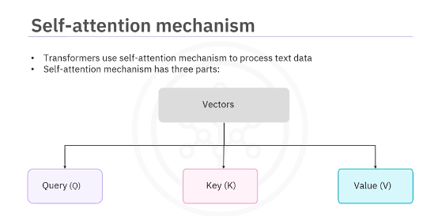
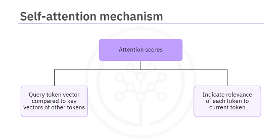
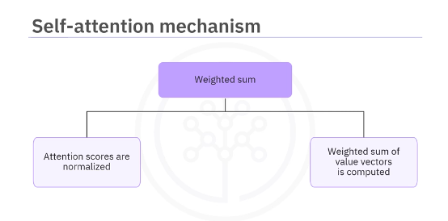
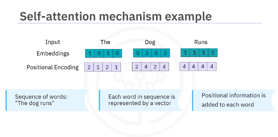
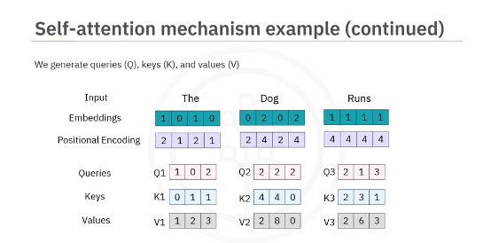
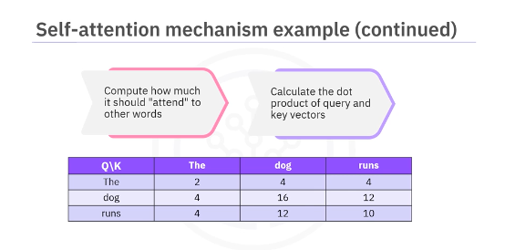
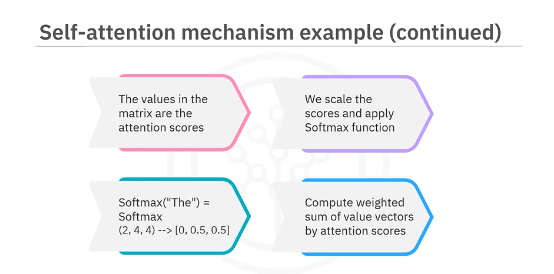
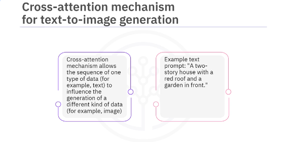
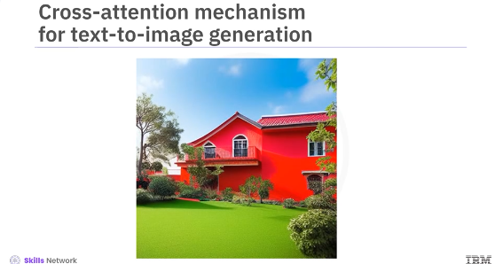
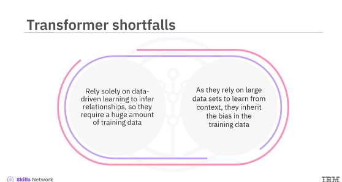

# Transformers

## Overview

Neural network architecture that has revolutionized natural language processing (NLP) and beyond. They are used for creating the deep learning models that power AI tools such as ChatGPT/Gemini Unlike traditional recurrent neural networks (RNNs) and convolutional neural networks (CNNs), Transformers excel at capturing long-range dependencies in sequential data, making them ideal for tasks like machine translation, text summarization, question answering, and text-to-image generation. Different types of transformers include generative pre-trained models used in ChatGPT, bidirectional transformers (BERT) used in Google Search and Google Translate, and image transformers used in products such as Adobe Photoshop.

The key innovation in transformers is the **attention mechanism**. This mechanism allows the model to weigh the importance of different parts of the input sequence when processing each input or token.

The self-attention mechanism has three parts. First, the query, key, and value vectors, identified as Q, K, and V, respectively, are generated for each input token. Q represents the word we are focusing on. K is for all other words and V contains the information to be passed to the next layer.

Second are the **attention scores**. The query vector of a token is compared to the key vector of all other tokens using a dot product. This results in a set of attention scores, indicating each token's relevance to the current token.

Third is the **weighted sum** The attention scores are normalized and a weighted sum of the value vectors is computed to obtain the context vector for the current token.

Let's take an example to understand the self-attention mechanism. We start with the sequence of words, the dog runs. Each word in the sequence is represented by a vector or an embedding in some internal vector space, like so. To each embedding, a position vector is added to retain the positional information of the word in the sentence. 

We generate queries, keys, and values from each input embedding vector as displayed here.

For each word, we compute how it should attend to every other word by calculating the dot product of the query and key vectors. As displayed in this matrix:

The values in this matrix can be called the attention scores. Next, we scale the score and apply the softmax function to normalize the scores and turn them into probabilities, as displayed here. Then, for each word, we compute the weighted sum of the value vectors weighted by the attention scores. These weighted sums are used to create a new contextualized vector representation.

Transformers are also extensively used for text-to-image generation based on another form of attention mechanism known as the cross-attention mechanism. The cross-attention mechanism allows the sequence of one type of data, such as a text prompt, to influence the generation of the sequence of another type of data, such as image data.

Given a prompt like a two-story house with a red roof and a garden in front, we want to generate an image that matches this description.

First, the self-attention mechanism learns the contextualized embedding from the entire sentence. These embeddings are then passed through the transformer encoder which gives us a sequence of queries (Q) representing the text. Next, the transformer model for images (such as DALL-E), uses a cross-attention mechanism for image generation based on Q. Lastly, DALL-E generates an image using a variant of the auto-regressive model. The model predicts the next part of the image based on the text prompt and previously generated image parts. The image transformer model doesn't just look for a stored image that matches the text description but synthesizes a new image based on understanding the input. The output image may contain novel combinations of objects that may not exist in the real world such as a horse with legs made of bamboo. It can also combine unrelated concepts into a single image. For example, we can provide a prompt such as a turtle driving a car and it can create a picture of a turtle sitting in the driver's seat and driving a car even though such a thing doesn't exist. It can also generate multiple variants of an image from the same output giving us creative variability. Unlike RNNs which process data sequentially, transformers can be parallelized, significantly speeding up training. This makes them particularly effective for tasks like machine translation, text generation, and other NLP applications. In contrast, RNNs process data sequentially, limiting parallelization and making them slower to train. While RNNs are suitable for tasks with shorter dependencies, they struggle with long-range context and can suffer from vanishing gradients. Transformers excel in handling complex relationships across long sequences, making them the preferred choice today. But these groundbreaking capabilities do not come without caveats.

As transformers rely solely on data-driven learning to infer relationships, they require a huge amount of training data to generalize well to new tasks. This brings us to one of the transformer's major shortfalls. As they rely on large datasets to learn from context, they inherit the bias in the training data. Despite these shortcomings, transformers have been one of the most important neural network developments of current times and have been instrumental in providing accessibility to the power of neural networks to the general public. In this video, you learned that:

* Transformers are a type of neural network architecture that has revolutionized the field of natural language processing. 
* Transformers excel at capturing long-range dependencies and sequential data, making them ideal for machine translation, text summarization, question answering, and text-to-image generation. 
* To process text data, transformers use a self-attention mechanism. A self-attention mechanism has three parts: the query, key, and value vectors; the attention scores; and the weighted sum. 
* For text-to-image generation, transformers use the cross-attention mechanism. Transformers can process data in parallel, which significantly speeds up their training, making them particularly effective for tasks like machine translation, text generation, and other NLP applications. 
* One major shortfall of transformers is that they rely on large datasets to learn from context and, therefore, inherit the bias in their training data.

## Lab Transformers
[DL0101EN-4-1-Transformers-with-Keras-py-v1.ipynb](JupyterNotebooks/DL0101EN-4-1-Transformers-with-Keras-py-v1.ipynb)