# 1D Tensors

Tensors are arrays that are the building blocks of a neural network. In this video, we will learn the basics of 1D tensors such as types, indexing and slicing, generic operations, universal functions. Let's start by understanding what a 1D tensor is.

A 0D tensor is just a number. 1D tensor is an array of numbers. (a row in a db or a time series for example).

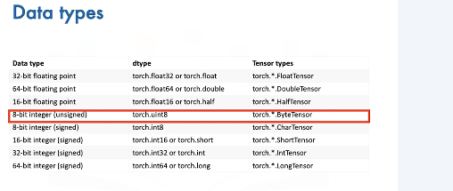

We can create a tensor in the following manner. 
First, we import Torch. Next, we create a Python list with the following elements, 7, 4, 3, 2, 6. We then cast this list to a PyTorch tensor using the constructor for tensors. And that's it. It's that simple to create a tensor in PyTorch. We can access the data via an index in the tensor. As with lists, we can access each element with an integer and a square bracket. 

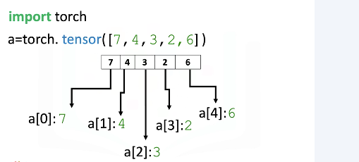

We can use the data attribute Dtype to find the type of data that is stored within the tensor. We can use the method type to find the type of the tensor. 
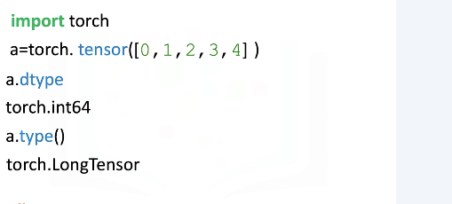

In this example, we create a float tensor, as the elements in the list are floats. We can use the data attribute Dtype to find the type of data that is stored within the tensor. We can use the method type to find the type of the tensor.  
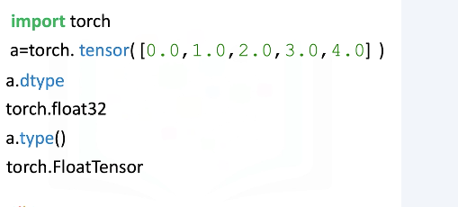

We can also specify the data type of a tensor within the constructor. We can specify the data type using the parameter Dtype. Even though the list contains floats, the Dtype of the tensor is int32.

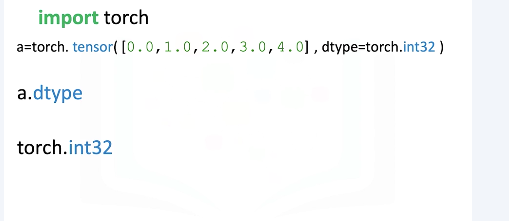

We can also explicitly create a tensor of a specific type. In this example, we create a float tensor explicitly using the float tensor method. Now let's check the type of tensor. We see the type of the tensor is a float tensor. When we print out A, we can see the decimals were added to the numbers in the tensor. 

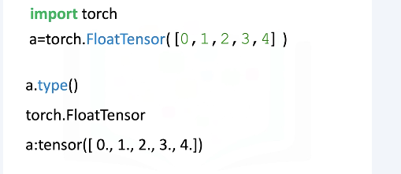

We can also change the type of the tensor. Consider the following tensor of long type. We can convert the type of the tensor to float using the type method passing in the argument torch.floatTensor. We can verify the type of the tensor has changed. 

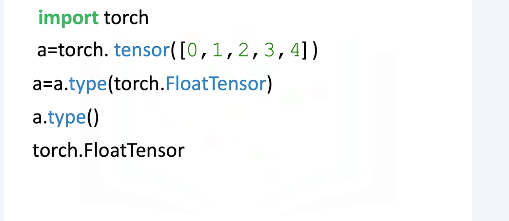

We can cast the following list to a tensor. The method size gives us the number of elements in the tensor. As there is a 5 elements, the result is 5. The attribute and dimension represents the number of dimensions or the rank of the tensor. In this case, rank of the tensor is 1.

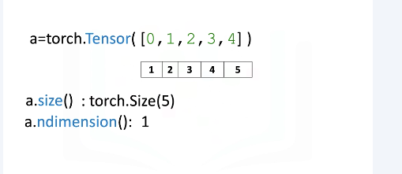

In many cases, you will require 2D tensors as inputs to your neural networks. Thus, you might need to convert your 1D tensors to 2D tensors before you could use them as inputs. 

Here we have a PyTorch tensor with 5 elements in it. The dimension of this tensor is 1. We will convert this tensor into a 2D tensor using the view method in PyTorch. The first argument of the view method represents the number of rows in this case, 5, and the second element represents the number of columns, in this case, 1. If we didn't know that the original tensor had 5 elements in it, we could use a value of minus 1 for the first argument and PyTorch will infer the number of rows in the new tensor for us. Thus, if we now check the dimension of the acol tensor using the endimension method in PyTorch, we will see it has a dimension of 2.
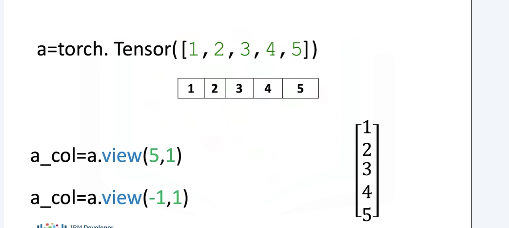

 In this example, the tensor has 6 elements in it. As before, we can reshape the tensor using the view method as there is 6 elements in the original tensor. We pass 6 as the first argument to the view method for creating 6 rows and 1 as the second argument to create one column. Similarly, we could have used a minus 1 instead of 6. 
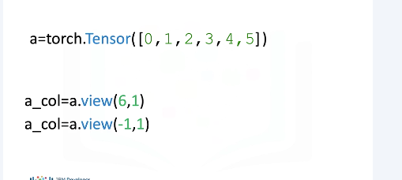

It's not difficult to convert PyTorch tensors to NumPy arrays and Python lists and then convert them back. This gives PyTorch the ability to work within the Python ecosystem. Many Python libraries use NumPy arrays. Consider the following NumPy array. We can convert a NumPy array to a Torch tensor using the function from_numpy. We can convert the Torch tensor back to NumPy arrays using the method numpy. Let's represent NumPy array with a blue box and the Torch tensor with a red box, and back_to_numpy with a green box. back_to_numpy points to the variable Torch tensor. The variable Torch tensor points to the variable NumPy array, therefore if you change the variable NumPy array, both Torch tensor and back_to_numpy will change. You will see an example of this in the lab.
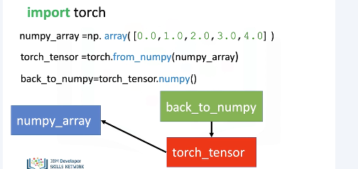

 We can convert a Pandas series to a tensor in a similar manner. We simply use the attribute values to convert the series to a NumPy array. We then use the function fromNumPy to convert it to a tensor. 

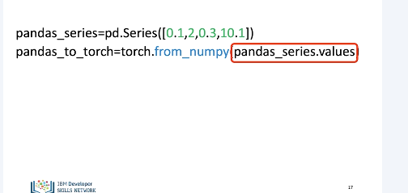

We can use the method toList to return a list from a tensor.  
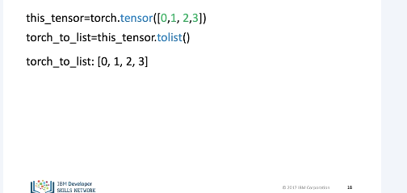

Individual values of a tensor are also tensors. Consider the tensor new.tensor. The first element of new.tensor is a tensor and is given by the following. Similarly, the second element of new.tensor is also a tensor and is given by the following. In many cases, we would like to work a Python number instead of tensors. For this, we can use the method item to return a number. For example, we can return the number of the first value. Similarly, we can do it for the second value.
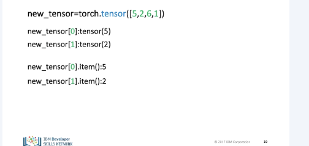

Let's review some indexing and slicing methods that you can use to access a particular value or set of values stored in a tensor. Consider the following tensor. We can change the first element of the tensor to 100 as follows. The tensor's first value is now 100. We can change the fifth element of the tensor as follows. The fifth element is now 0.
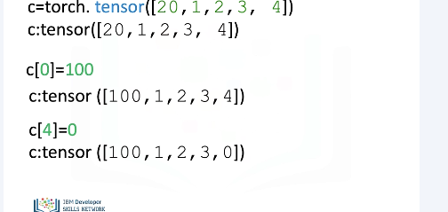

 We can slice PyTorch tensors just like Python lists. The elements of the array correspond to the following index. We can select the elements from 1 to 3 and assign it to a new torch tensor D as follows. The elements in D correspond to the following indexes, and similar to lists, we do not count the element corresponding to the last index. 

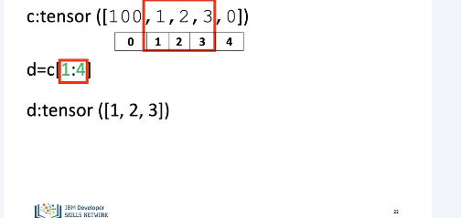
 
 We can assign indexes in a tensor to new values as follows. The tensor C now has new values. 

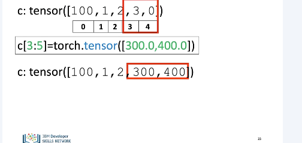

PyTorch makes it easy to do many operations that are commonly performed in neural networks. Let's review some of these operations on one-dimensional tensors. We will look at many of the operations in the context of Euclidean vectors to make things more interesting. 

Vector addition is a widely used operation. Consider the vector U with two elements or components. The components are distinguished by the different colors. Similarly, consider the vector V with two components. In vector addition, we create a new vector, in this case we call it Z. The first component of Z is the addition of the first component of vectors U and V. Similarly, the second component is the sum of the second components of U and V. This new vector, Z, is now a linear combination of the vector Y and V.

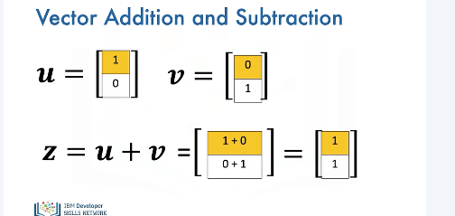

 To perform vector addition in PyTorch, we simply do it by defining the tensors U and V and then adding them up. It should be noted that the tensors should be of the same type. 

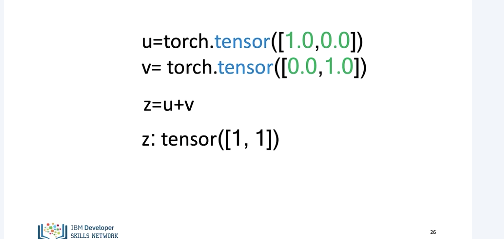

Vector multiplication with a scalar is another commonly performed operation. Consider the vector Y. Each component is specified by a different color. We simply multiply the vector by a scalar value, in this case, 2. Each component of the vector is multiplied by 2. Thus, in this case, each component is doubled.  
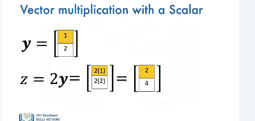

In PyTorch, we can simply multiply a tensor by a single line of code as follows. 
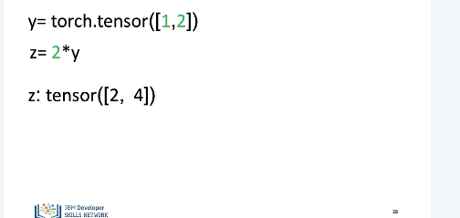

Hadamard product is another widely used operation. Consider the following tensors or vectors. The result of the Hadamard product of U and V is a new vector, Z. The first component of Z is the product of the first element of U and V. Similarly, the second component is the product of the second element of U and V. The resultant vectors consists of the entry-wise product of U and V.
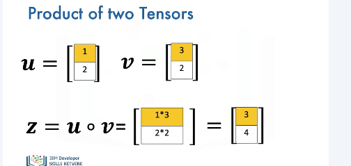

 In PyTorch, we can also perform Hadamard product with just one line of code and assign it to a variable Z. 
 
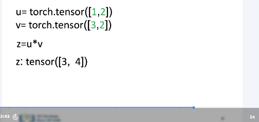
 
The dot product is another widely used operation used in neural networks. Consider the vectors U and V. The dot product is a single number that represents how similar the two vectors are. We multiply the first component from V and U. We then multiply the second component and add the result together. The result is a number that represents how similar the two vectors are. Just a note, we will represent the dot product as follows.

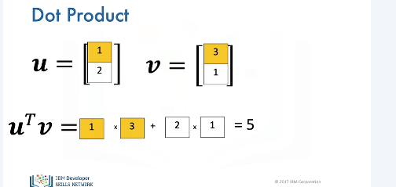

 We can also perform dot product using the PyTorch function dot and assign it the tensor result as follows. 
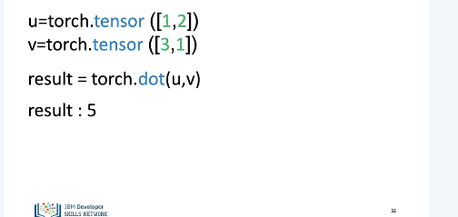
 
Consider a tensor U. The tensor contains the following elements. If we add a scalar value to the tensor, PyTorch will add that value to each element in the tensor. This property is known as broadcasting. 
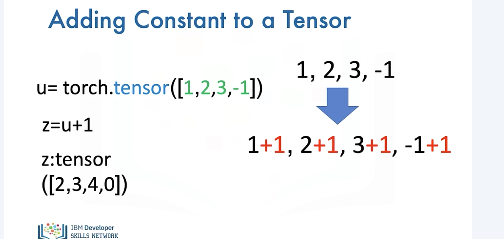

We can also apply functions to Torch tensors. We will teach you how to do so, but we will not cover in-place operations. Consider the tensor A. We can calculate the mean or average value of all the elements in A using the method mean. This corresponds to the average of all the elements. In this case, the result is zero. 

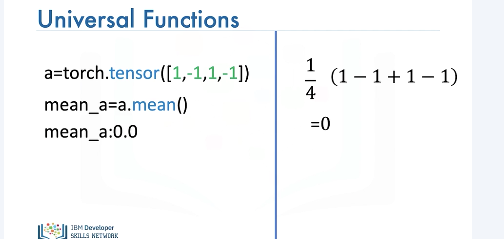

There are many other functions. For example, consider the tensor B. We can find the maximum value using the method max. We can see the largest value is 5. Therefore, the method max returns a 5. We can use Torch to create functions that map tensor to new Torch tensors. 

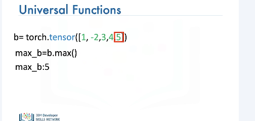

Let's implement some code on the left side of the screen and use the right side of the screen to demonstrate what's going on with vectors. We can access the value of pi in NumPy as follows. We can create the following Torch tensor in radians. This array corresponds to the following vector. We can apply the function sine to the tensor x and assign the values to the tensor y. This applies the sine function to each element in the tensor. This corresponds to applying the sine function to each component of the vector. The result is a new tensor, y, where each value corresponds to a sine function being applied to each element in the tensor, x. 

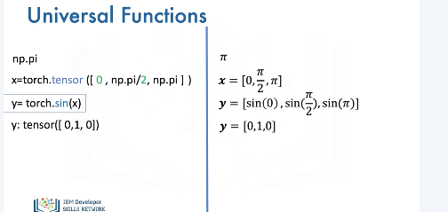

A useful function for plotting mathematical functions is line space. Line space returns evenly spaced numbers over a specified interval. We specify the starting point of the sequence, the ending point of the sequence. The parameter steps indicates the number of samples to generate, in this case, 5. 

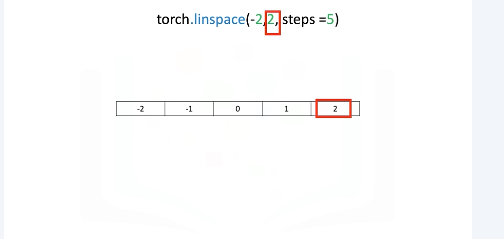

The space between samples is 1. If we change the parameter num to 9, we get 9 evenly spaced numbers over the interval from minus 2 to 2. The result is the difference between subsequent samples is 0.5 as compared to the example before. 
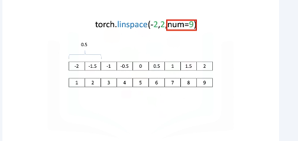

We can use the function line space to generate 100 evenly spaced samples from the interval 0 to 2 pi. We can use the pytorch function sine to map the tensor x to a new tensor, y. We can import the library pyplot to plt to help us plot the function. As we are using a Jupyter notebook, we use the command matplotlib inline to display the plot. The following command plots a graph. The first input corresponds to the x value. We have to convert the tensor to a numpy array using the method numpy. The second input corresponds to the values for the vertical or y-axis. We convert the values. Similarly, we have to convert it to a numpy array using the method numpy.  

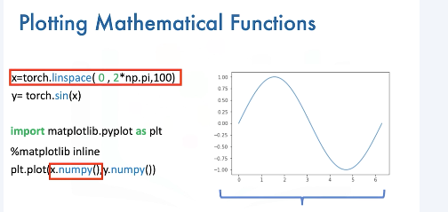

## Lab
[https://github.com/bbearce/code-journal/blob/master/docs/notes/data_science/Coursera/pytorch/JupyterNotebooks/1%201_1Dtensors_v2.ipynb](https://github.com/bbearce/code-journal/blob/master/docs/notes/data_science/Coursera/pytorch/JupyterNotebooks/1%201_1Dtensors_v2.ipynb)