# 2D Tensors

In this video we will focus on two-dimensional tensors. We will cover the following topics.

* Examples of two-dimensional tensors
* Tensor creation in 2D
* Indexing and slicing of 2D tensors
* Basic operations on 2D tensors.

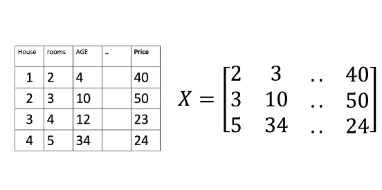

A 2D tensor can be viewed as a container that holds the numerical values of the same type. Consider the following database of housing information. Each column of the database contains features or attributes such as number of rooms, age of the house, and price of the house. Each row represents a different house. We can represent this data with a tensor X in 2D. In 2D, tensors are essentially matrix. Each row of the tensor corresponds to a different sample and each column of the tensor corresponds to a feature or attribute. 

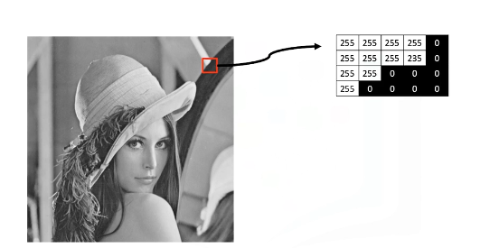

We can also represent grayscale images as 2D tensors. The image intensity values can be represented as numbers between the range 0 to 255. 0 corresponds to the color black and 255 corresponds to the white color. These numerical values are stored as a grid. Like a database, we can store them in a tensor. 

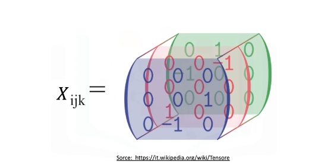

Tensors can be extended to any number of dimensions such as 3 dimensions, 4 dimensions, and so on. In this course, we will also deal with some basic 3D tensors. A 3D tensor is essentially a combination of three 1-dimensional tensors.

Consider a color image composed of three color components blue, green, red. Like a grayscale image, each color component is made up of different intensity values that can be represent as a tensor. 

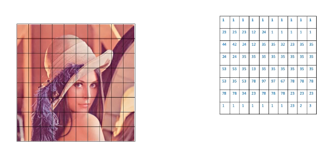

This matrix contains the intensity values of the blue channel in the picture. Similarly, this one (no fig as it's obvious) has the intensities for the green channel and this one (no fig as it's obvious) has intensities for the red channel. Now let's look at how we can create a tensor in 2D. 

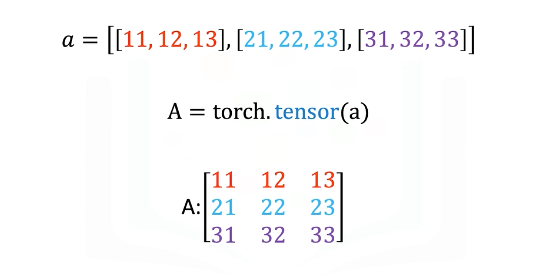

Consider the list A. The list contains three nested lists, each of equal size. Each list is color-coded for simplicity. We can cast the list to a torch tensor as follows. It is helpful to visualize a torch tensor as a rectangular matrix and each nested list corresponds to a different row of the torch tensor. 

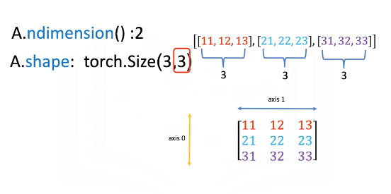

We can use the method nDim to obtain the number of dimensions of a torch tensor. The dimension of a tensor is sometimes also referred to as its rank. The first list represents the first dimension of the tensor. This list contains another set of lists and that is represented as the second axis or dimension of the tensor. The shape attribute of a tensor returns the number of rows and columns of the tensor. The first element corresponds to the number of rows in the rectangular tensor of A, which in this case is 3. 

The second element corresponds to the number of columns in the rectangular tensor. The convention is to label the vertical axis 0 and the horizontal axis 1 as follows. 

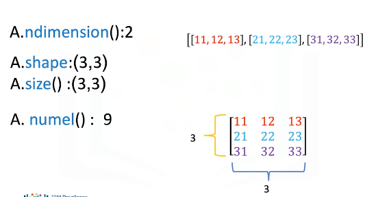

You can use the size method to get the shape of a tensor. 

The numel method can be used to obtain the number of elements in a tensor. We see there are three rows and three columns in the following tensor. Multiplying the number of columns and rows together, we get that the total number of elements is 9. Let's discuss about indexing and slicing of 2D tensors.

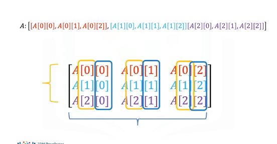

We can use rectangular brackets to access the different elements of a tensor. The following image demonstrates the relationship between the list representation and the indexing conventions. Using the rectangular representation, the first index corresponds to the row index, the second index corresponds to the column index. 

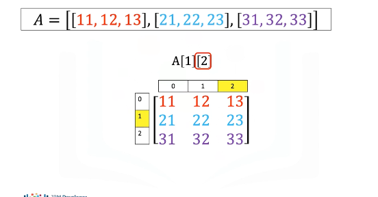

We can also use single brackets to access the individual elements of a tensor as follows. Let's see some examples. Consider the following syntax. This index corresponds to the second row, and this index corresponds to the third column, and the value represented by this particular row and column combination of the tensor is 23. 

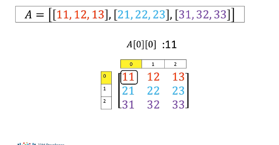

Let's consider this example. This index corresponds to the first row, and the second index corresponds to the first column, and the value is 11. 

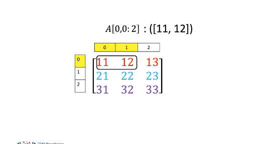

We can also use slicing in 2D tensors. The first index corresponds to the first row, the second index represents the first two columns, and we extract the elements 11 and 12 from the tensor. 

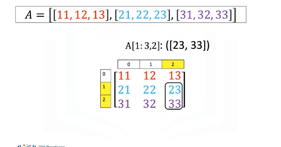

Consider this example. The first index corresponds to the last two rows, the second index accesses the last column. 

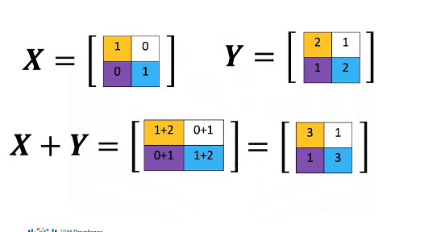

Now, let's discuss some basic tensor operations in two dimensions. As before, the tensors must be of the same type. Let's start by adding two tensors. The process is identical to matrix addition. 

Consider the following tensor X. Each element of X is colored differently. Consider another tensor Y, and each element is also colored differently. We can add the tensors. This corresponds to adding the elements in the same position, i.e., adding elements having the same color boxes together. The result is a new tensor that is of the same size as tensor X or Y. Each element in this new tensor is the sum of the corresponding element in X and Y. 

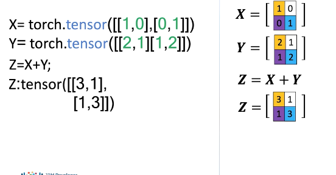

To add two tensors in PyTorch, we first define the tensor X and the second tensor Y. We add the tensors as follows. The result is identical to matrix addition. 

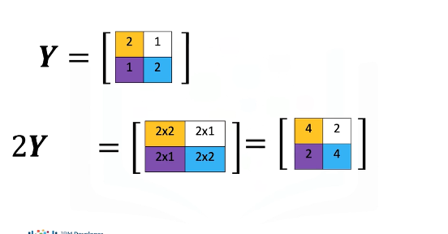

Multiplying a tensor by a scalar is identical to multiplying a matrix by a scalar. Consider the tensor Y. If we multiply the tensor by the scalar 2, we are simply multiplying every element of Y by 2. The result is a new tensor of the same size, where each element is multiplied by 2. 

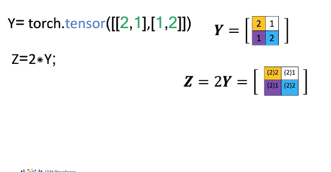

Consider the following tensors Y in PyTorch. We multiply the tensor by a scalar as follows, and assign it to the variable Z. The result is a new tensor, where each element is multiplied by 2. 

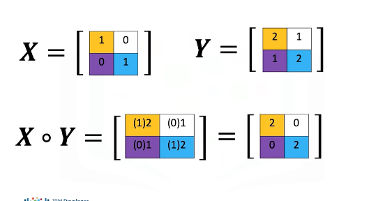

Multiplication of two tensors corresponds to an element-wise product, or Hadamard product. Consider the following tensors X and Y. Element-wise product corresponds to multiplying each of the elements in the same position, i.e. multiplying elements contained in the same color boxes in X and Y. The result is a new tensor that is the same size as tensor X or Y. Each element in this new tensor is the product of the corresponding elements in X and Y. 

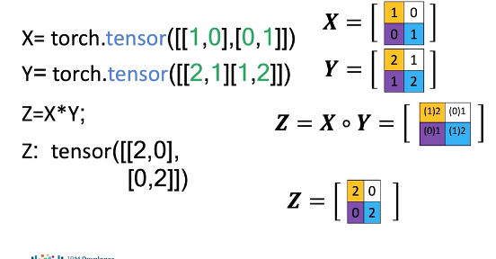

To perform Hadamard product in PyTorch, we first define the tensors X and Y. We calculate the product and assign it to the variable Z as follows. The result is identical to Hadamard product. 

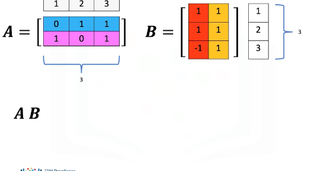

We can also perform matrix multiplication with tensors. Matrix multiplication is a little more complex, but let's provide a basic overview. Consider the matrix A, where each row is a different color. 
Also consider the matrix B, where each column is a different color. According to the rules of linear algebra, before we multiply matrix A by matrix B, we must make sure that the number of columns in matrix A, in this case 3, must be equal to the number of rows in matrix B, in this case 3. 

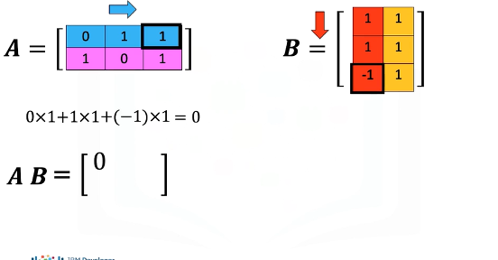

To obtain the i-th row and j-th column of the new matrix, upon multiplying A and B, we need to take the dot product of the i-th row of A with the j-th column of B. To obtain the element in the first row and first column of the new matrix, we take the dot product of the first row of A with the first column of B as follows. The result is 0. 

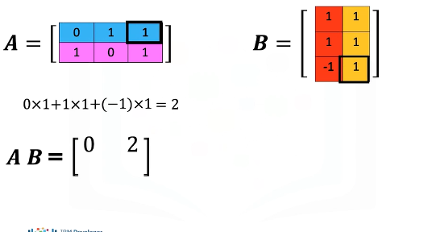

For the first row and the second column of the new matrix, we take the dot product of the first row of the matrix A, but this time we use the second column of matrix B. The result is 2. 

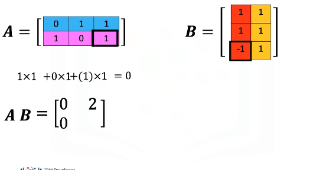

For the second row and first column of the new matrix, we take the dot product of the second row of the matrix A with the first column of matrix B. The result is 0. 

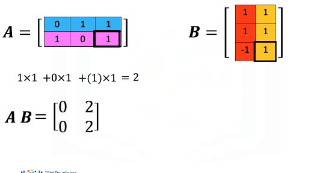

Finally, for the second row and the second column of the new matrix, we take the dot product of the second row of the matrix A with the second column of matrix B. The result is 2. 

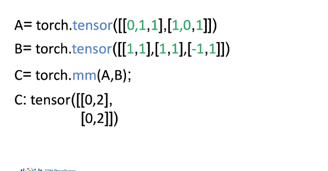

In PyTorch, we can define the tensors A and B. We can perform matrix multiplication using the mm method in PyTorch and assign the result to a new tensor C. The result is tensor C, which corresponds to matrix multiplication of tensor A and B.

There are many other operations you can perform on 2D tensors in PyTorch. Check out the labs and documentation for more. 