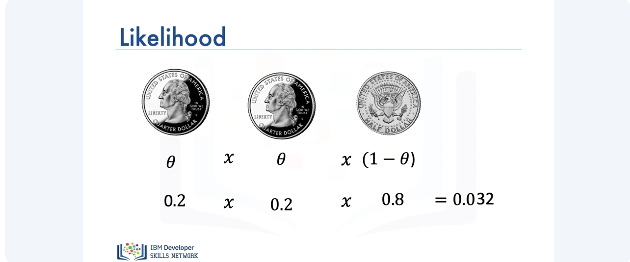
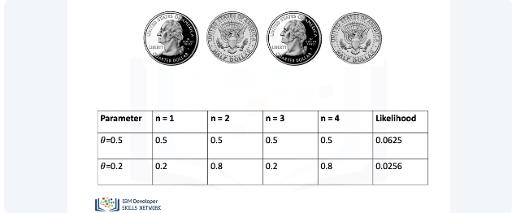
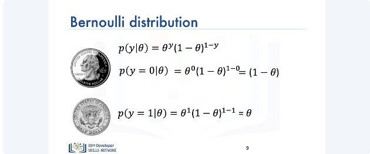
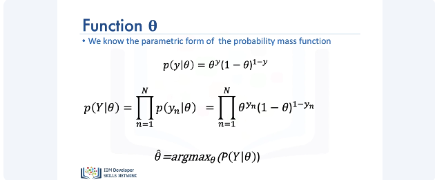
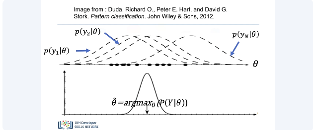
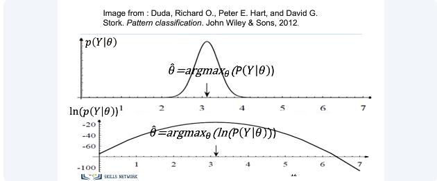
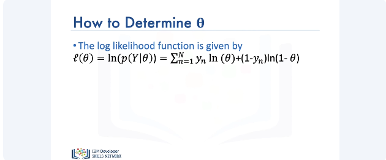

# Bernoulli Distribution and Maximum Likelihood Estimation

Consider a biased coin flip. The probability of heads is given by 0.2 and the probability of tails is given by 0.8. It turns out that we can represent both probabilities with one parameter, which we'll denote by theta. Theta is also known as the Bernoulli parameter. The probability of heads, simply, is given by theta and the probability of tails is given by 1 minus theta.

We can calculate the likelihood of a sequence of events by multiplying the probability of each individual event to obtain the likelihood. Consider the following sequence of three events. For the first flip, we have a head and the probability of observing a head is 0.2. Consider the second flip. We observe a second head. For calculating the likelihood of this sequence, we can simply multiply 0.2 by 0.2. For the third flip, we obtain a tail and the probability of observing one is 0.8. To obtain the likelihood of these sequence of events, we simply multiply 0.2 times 0.2 times 0.8, which equals to 0.032. 

Now let's consider the case where we don't actually know the values of the parameter theta. To start, we'll consider two sample values of theta, i.e., theta equals to 0.5 and theta equals to 0.2. We have the first flip. The likelihood of observing a head for the first Bernoulli parameter is 0.5 and for the second parameter is 0.2. We observe a second flip. In this case, it's a tails. For the parameter theta equals 0.5, the value of the likelihood is given by 0.25. And for the parameter theta equals 0.2, the value of the likelihood is given by multiplying 0.2 with 0.8, which is 0.16. For the third flip, we observe a head again. The likelihood value for the parameter theta equals 0.5 is 0.125 and the value for the parameter of the 0.2 is 0.032. Finally, for the fourth flip, we observe a tail. Thus, for the following sequence, the likelihood values for the two parameters equal 0.0625 and 0.0256, respectively. Notice that amongst the two values of the likelihood, the value of likelihood corresponding to the parameter theta equals 0.5 is larger compared to the other value. This intuitively makes sense as well. In the real world, if you flip a coin, the probability of getting a head or tail is equally likely. Thus, the value of the likelihood given by the parameter theta equals 0.5 is more likely to occur. So it turns out, we can estimate the actual parameter by considering parameter values that maximize our likelihood.

We can represent our sequence of events by a mathematical function known as the Bernoulli distribution. Further, we can denote the event of getting a head by 0 and the event of getting a tail by 1. Thus, the probability of y equals 0 for a specific value of theta is given by, which equals. Similarly, the probability of y equals 1, i.e., tail is given by. Note that both the probabilities are functions of theta. 

So, from the previous coin example, we had the following expression for the probability of y for a specific value of theta. Here, y could have two possible values, i.e., 0 and 1. Generalizing this equation for any value of y, we get (equation), and substituting the probability equation for y from above, we get the following. Thus, our goal is to find a value of theta that maximizes this function. 

It is helpful to visualize as follows. Each of the individual probabilities is a mathematical function. Multiplied together, the likelihood function is represented by the overlapping values and the goal is to find the value of the parameter that maximizes this expression.

It is usually difficult to maximize the likelihood function. The log of the likelihood function is much simpler to deal with. As the log function is monotonically increasing, the location of the maximum value of the parameter remains in the same position.

The expression for the log of the likelihood function is given by. We can use this equation to obtain the value of theta that maximizes the likelihood. That's it. Thank you for watching this video. 