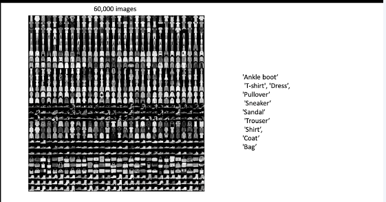
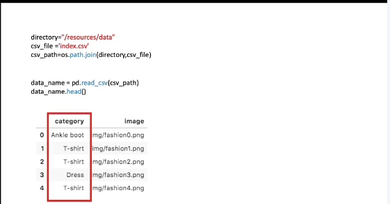
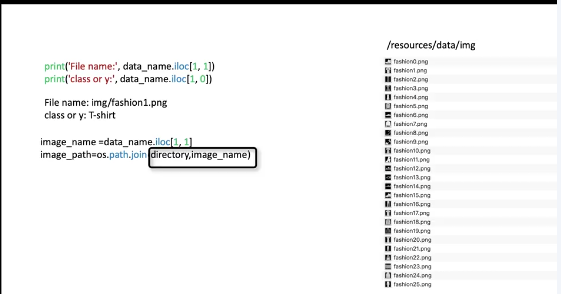
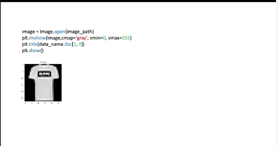
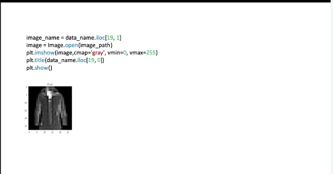
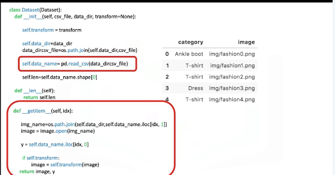
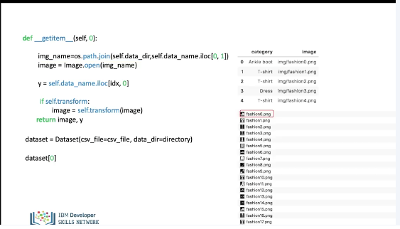
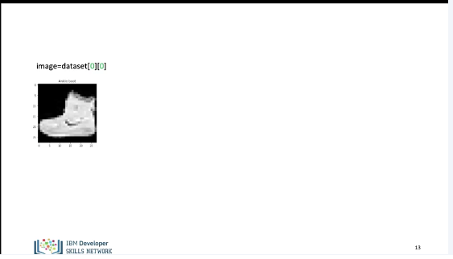
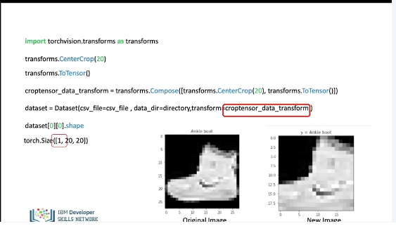
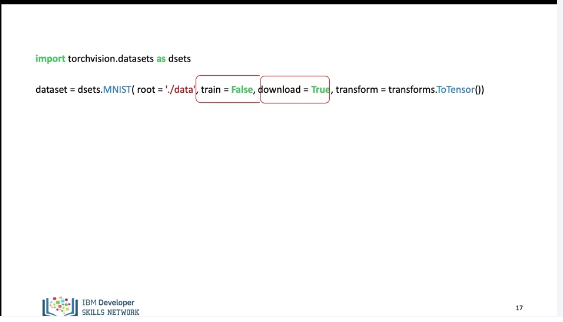

# Dataset

In this video we will build datasets for images, some of the techniques learned here can be applied to larger datasets as well In this video we will review: The Dataset Class for images, Torch Vision Transforms, Torch Vision Datasets. Lets build a dataset for images. Lets first review the components that we will need.

```python
from PIL import Image
import pandas as pd
import os
from matplotlib.pyplot import imshow
from torch.utils.data import Dataset, DataLoader
```

We will import the following libraries. 



In this video we will use Zalando’s Fashion-MNIST training set of 60,000 28x28 grayscale images of clothing. The data set has 10 types of label or classes. 



The path to the csv file with the labels for each image can be obtained as follows: You can load the CSV file and convert it into a dataframe, using the Pandas function read_csv(). You can view the dataframe using the method head. The first column of the dataframe corresponds to the type of clothing. This is the class or label. The second column is the name of the image file corresponding to that item of clothing.



You can obtain the image file name and class of the second image To load the image, you need the directory and the image name. In this case we now have the path of the first image.




You can then use the function Image.open to store the image to the variable image and display the image and class or label.



You can repeat the process for the 20th image.



The process of building a dataset class for images is similar but we do not load all images into memory, we can also apply similar techniques to larger datasets. 
In the constructor we simply create a Pandas data frame as a attribute “data names”. Let's take a look at the get item method, when we create an object and iterate through it.



We create a dataset object, this loads the csv file with the name and class of image. We call the first sample. In this case the value for “1 d x” is zero. We load the image path. We then load the image using the path. The variable image now contains fashion0.png, we assign the image label or class to y, then we return the image and label y as a tuple.



We can assign the image to the variable image, we can also see the label or class. 



Torch Vision has a set of widely used pre build transforms, that are used on images. We import the module, the first transform will crop the image by taking a 20 by 20 piece of the image. The image would look something like this. The second transform will convert the image to a tensor. Instead of applying the transforms directly, we can compose the transform. we can then apply the transform object in to the dataset in the constructor. There is an extra dimension representing the sample.



Torch Vision also has pre built datasets that are commonly used to compare models. We import the the dataset module from torch vision, we create the dataset object. In this case, we use the MNIST dataset. The parameter root is the Root directory of the dataset. The parameter train indicates, if you would like to use the training or testing dataset, true means you are using the training dataset false indicates the test dataset. If the download parameter is set to true, the object downloads the dataset from the internet and puts it into the root directory. If the dataset is already downloaded, it is not downloaded again in this case, we convert the image to a tensor. (Music) 


## Lab

[https://github.com/bbearce/code-journal/blob/master/docs/notes/data_science/Coursera/pytorch/JupyterNotebooks/1%203%202_Datasets_and_transforms.ipynb](https://github.com/bbearce/code-journal/blob/master/docs/notes/data_science/Coursera/pytorch/JupyterNotebooks/1%203%202_Datasets_and_transforms.ipynb)

[https://github.com/bbearce/code-journal/blob/master/docs/notes/data_science/Coursera/pytorch/JupyterNotebooks/1%203%203_pre-Built%20Datasets_and_transforms_v2.ipynb](https://github.com/bbearce/code-journal/blob/master/docs/notes/data_science/Coursera/pytorch/JupyterNotebooks/1%203%203_pre-Built%20Datasets_and_transforms_v2.ipynb)