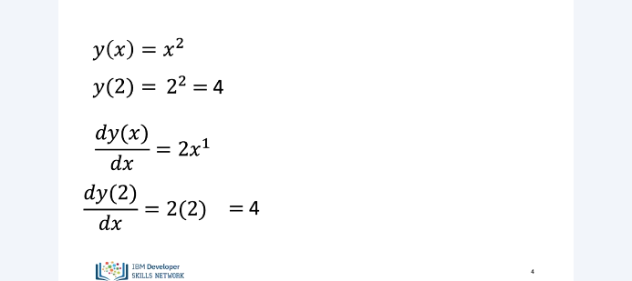
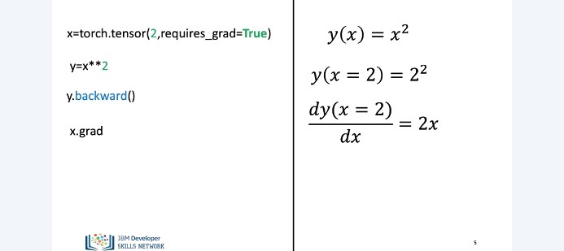
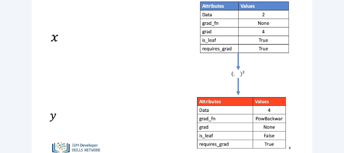
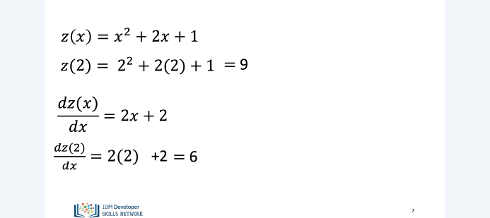
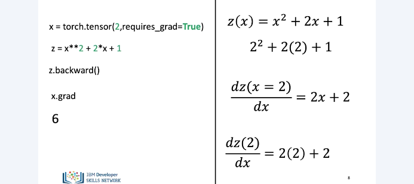
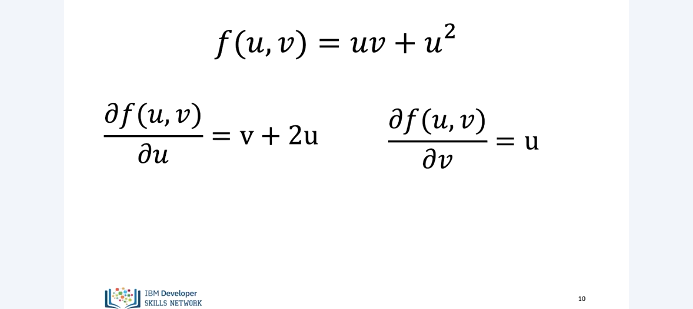
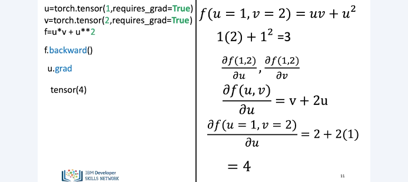
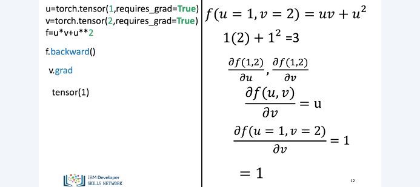

# 2D Tensors

In this module we will learn about differentiation in pytorch and this will be used for generating parameters in neural networks. We’ll start by covering simple derivatives and then delve deeper into partial derivatives. So let’s learn about derivatives. Consider the function y, which is a quadratic function in X. When we calculate the value of this function at x = 2, the function evaluates to 4. Now let’s calculate the derivative of this function. According to the rules of calculus, we take the power of x i.e. in this case 2, bring it in front of x, multiply x with 2 and reduce the power of x by 1. Thus the derivative of this function equals to 2 times x. Evaluating the derivative at x = 2, we see that it’s value equals to 4.

Now, let’s try to calculate this derivative in pytorch. First, we create a new tensor x and specify its value as 2. We do so because we want to evaluate functions and derivatives of x for the value of x equals 2. Notice that when creating x we also specify the parameter of requires_grad and set it to True in the tensor constructor. Doing so essentially tells PyTorch that we would be using evaluating functions and derivatives of x using this value of x Next, we create a new tensor y and specify that y is equal to x square. This creates a new tensor Y for us, which is equal to the squared function of x.

Since we specified the value of X equal to 2, the value of Y equals to 4. For calculating the derivative of y we call the backward function in py torch on y. The backward function first calculates the derivative of y and then evaluates it for the value of x equals 2 From the previous slide, we learnt that the derivative of x square is equal to 2x Now to evaluate the derivative of y at x equals 2, we need to call the grad attribute on x. Doing so takes the value of x equals 2 and plugs it in y’s derivative Finally, giving us the result of 4. 

Behind the scenes, pytorch calculates derivatives by creating a backwards graph. It is a particular type of graph in which the tensors and the backwards functions are the nodes in the graph. Based upon whether a particular tensor is a leaf or not in the graph, pytorch evaluates the derivative of that tensor.

If the leaf attribute for a tensor is set to True, pytorch won’t evaluate its derivative. We won’t get too much into the details of the how the backwards graph is constructed and used but the aim here was to provide you with a high level understanding of how pytorch uses this graph for calculating derivatives. So, here’s how the tensors x and y look internally in pytorch once we create them. As you can see here, each tensor has a specific set of attributes. The data attribute holds the data of the tensor. The grad attribute will hold the gradient or derivative value once it is calculated. The gradient function attribute points to a node in the backwards graph.

The is leaf attribute is used for denoting whether a particular tensor is a leaf in the graph or not. We discussed about the requires_grad attribute on the previous slide. Using all of these attributes, along with the backwards graph, pytorch calculates the derivative of the tensor y based upon x’s value. 

Let’s do another example. Here we have z, a function of x. Evaluating z at x equals to 2, the value of z equals 9. Calculating the derivative of of z based upon the rules of calculus. And evaluating it at x equal 2, we get the result of 6. 

Here’s how we would do this in pytorch. 

Now, let’s talk about partial derivatives Here we have a function of two variables u and v Based upon the rules of calculus, the derivative of f with respect to u equals v plus 2u. When differentiating f with respect to u we treat v as a constant and apply the rules of derivatives of f. Similarly, when we differentiate f with respect v, we treat u as a constant and using the rules of calculus this derivative equals u.

Similar to what we had earlier, we define the u and v tensors with the initial values of 1 and 2 respectively. We also define the f tensor, the value of f equals 3. calling the backward function on f, it will calculate the two partial derivatives of f with respect to u and v and evaluate then at the values 1 and 2. 

Calling the grad function on u will calculate the derivative of f with respect to u. and evaluate it with the values of 1 and 2 for u and v respectively.

Here’s a similar process for calculating the derivative of f with respect to v. We have only scratched the surface see the labs, for more examples. 

