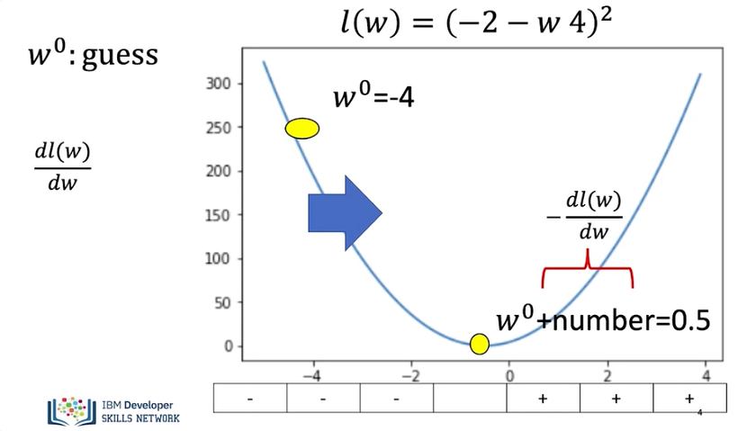
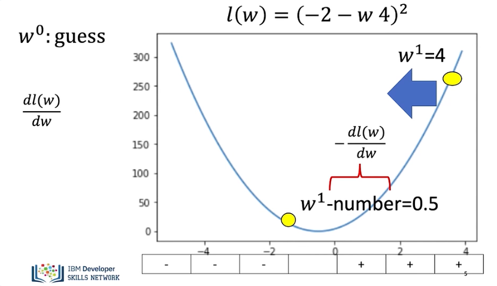
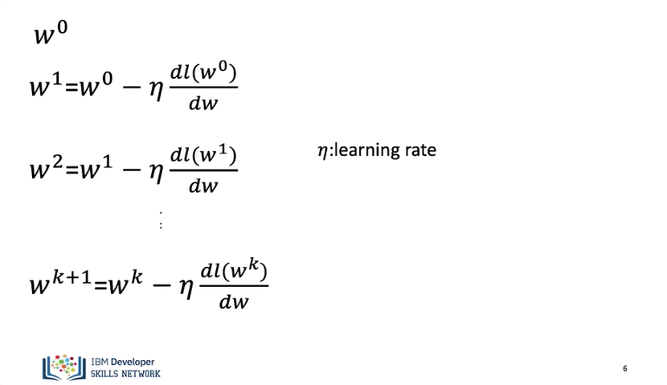
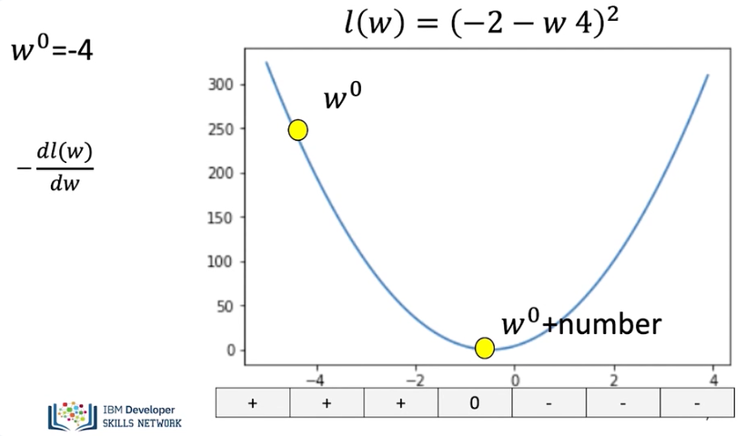
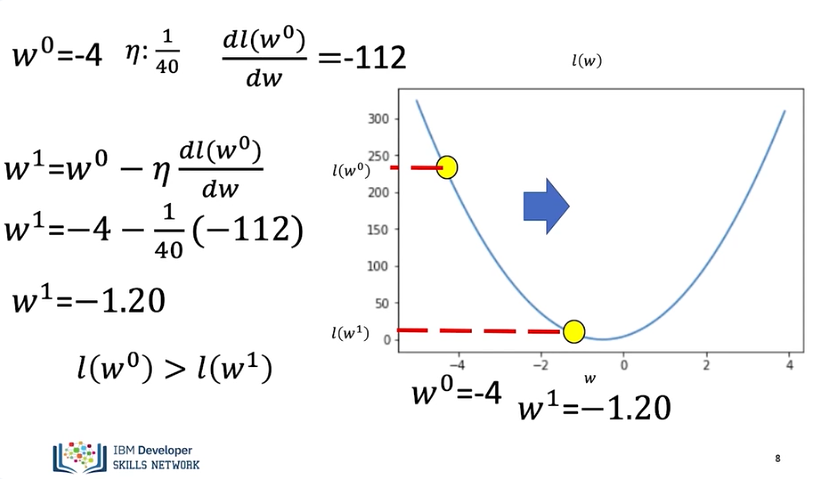
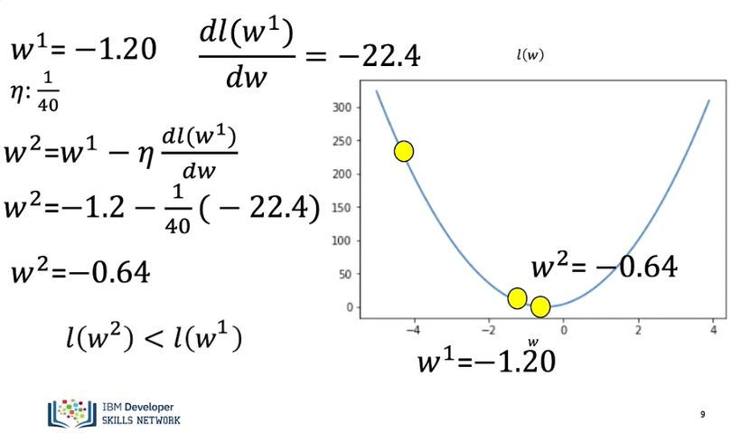
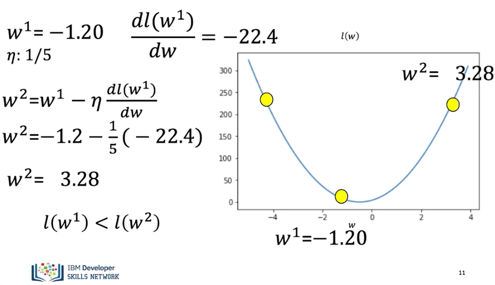
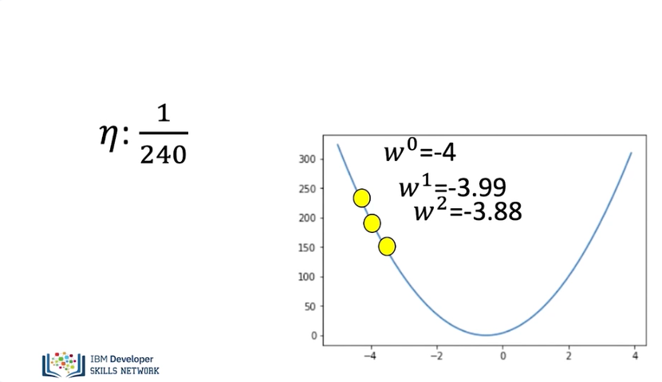
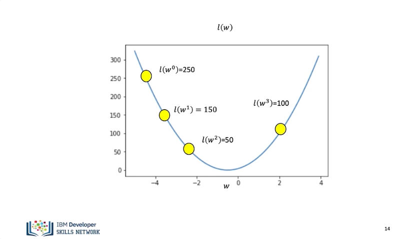
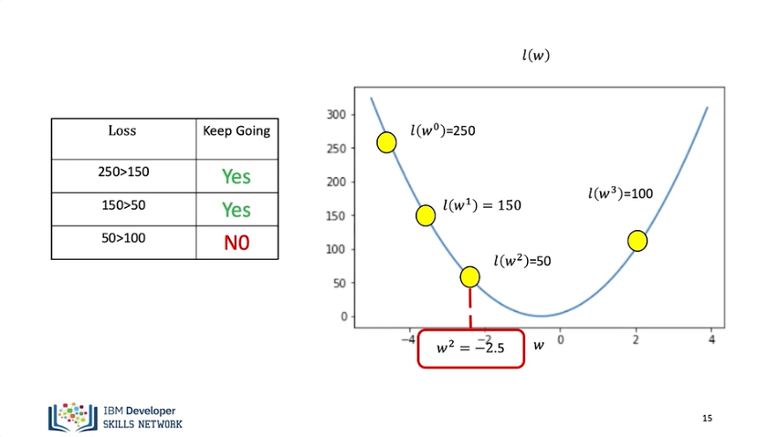

# Gradient Descent

Gradient descent is a method to find the minimum of a function. It can be applied to functions with multiple dimensions, but let's look at the example of just one dimension. In this video, we will review what's gradient descent, problems with the learning rate, and to stop gradient descent. What's gradient descent? 

Gradient descent is a method to find the minimum of a function. Consider the loss function. If we start off with a random guess for the slope parameter, we use the superscript to indicate the guess number. In this case, it is our first guess, so it is zero. We have to move our guess in the positive direction. We can move the slope in that direction by adding a positive number. Examining the sign of the derivative, it is the opposite sign of the number. Therefore, we can add the number proportional to the negative of the slope. 

Subtracting the derivative works if we are on the other side of the minimum. In this case, we would like to move in the negative direction. We can move the parameter value to the negative direction by adding a negative number to the parameter. Examining the sign of the derivative, it is the opposite sign of the number. Therefore, we can add an amount proportional to the negative of the derivative. 

In gradient descent, we iteratively calculate this equation. We start off with a guess. We update the parameter by adding a value proportional to the derivative. We update the parameter again. We can express the process as follows. The parameter ETA is the learning rate and tells us how much we need to jump. Let us clarify the process with an example. 

We start off with a guess of -4. 

The value for the derivative at -4 is -112. We will use the following value for the learning rate. We calculate the first iteration. The value of the parameter for the first iteration is -1.20. The value for this parameter has a smaller loss. We can see the loss is lower after the first iteration. 

For the next iterations, we use the previous parameter estimate of -1.2. We update the parameter value using the update rule. The value for the parameter is now -0.64. The loss function is closer to the minimum. The loss value continues to get smaller. 

Let's see problems with the learning rate. If we choose a learning rate that's too big, sometimes we miss the minimum. Let's say we use a learning rate of 1 over 5. We update the parameter value using the update rule. The value for the parameter is 3.28. The loss function now has a higher value. Now the loss value gets larger. 

Sometimes we can set the learning rate too small. Let's see what happens when we set the learning rate to 1 over 240. For every iteration, the value of the parameter hardly changes. In this case, it will take a lot of iterations to reach the minimum value. We will learn how to select the learning rate. There are several ways to stop the process of gradient descent. Let's go over a few popular ways to stop gradient descent. 

We can run gradient descent. For a set number of iterations is a popular way. In this case, we run it for 3 iterations. But for the final iteration, we miss the minimum. 

Another method to stop gradient descent is to see if the loss starts increasing. Let's record a few iterations of gradient descent and record the results in the table. For the first value, the loss is 250. We calculate the first iteration. We see the loss for this iteration is 150 less than the previous iteration. For the second iteration, the loss is also decreasing. We repeat the process. Examining the table, we see the loss is 50 and still decreasing. So, we keep going. The loss is now 100. This value is larger than 50, so we stop. We use the value of the parameter corresponding to loss of 50. The value is approximately -2.5. You will learn more about gradient descent throughout the course.

