# Linear Classifiers

Let’s say we have a set of samples each consisting of a certain number of features. Further let’s assume each sample belongs to a particular class. 

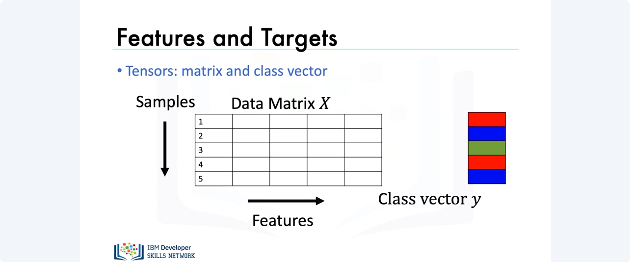

Logistic regression is about predicting which class a particular sample belongs to based upon its features. Here is a visual representation of this concept: We store the set of features for each sample in a matrix, the columns represent different features, the rows represent different samples. We also have a class vector y, and this class vector can take on discrete values which we’ll represent with three different colors. So in this case, we have three classes, i.e. red class, blue class and the green class. 
Each element of y represents the class of each sample in the data matrix X. 

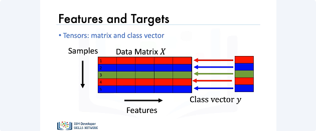

Thus, we see that the first element of y corresponds to the class of the first sample or the first row of X. The second element of y corresponds to the class label for the second sample or the second sample of X. Similarly, the third, fourth and fifth elements of y correspond to the class labels of the third, fourth and fifth rows of X.

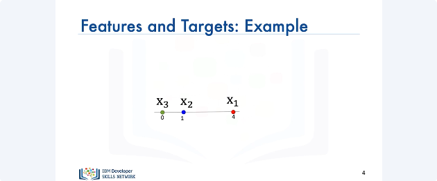

We can also denote each sample in the data matrix X as a point on the number line. For example, if sample “x1” or the first sample had a value of 4 and belonged to the red class we could plot the point as follows. Similarly, if sample “x2” had a value of 1 and belonged to the blue class we would plot the point as follows. Sample “x3” belongs to the green class and has a value of zero.

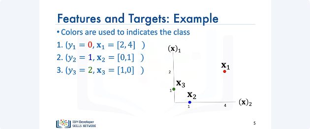

Further, we can also plot these points in a 3D plane.

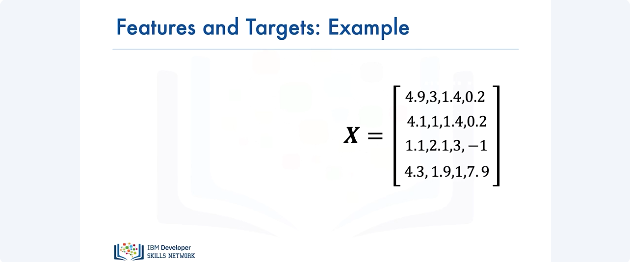

Like regression, we'll represent the points as a matrix where each row in the matrix represents a different sample. 

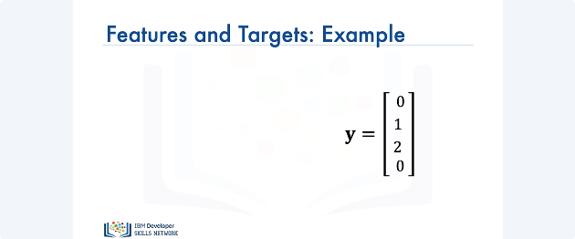

Our vector Y will contain discrete values, in this case, 0, 1 and 2, and this represents the actual class colors from the previous example. 

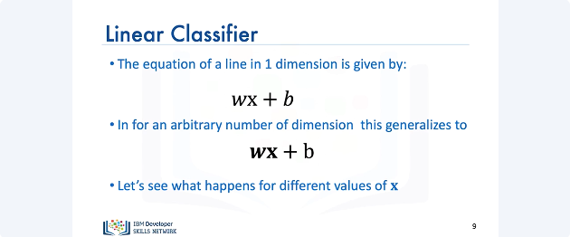

Now let’s talk about two class linear classifiers in general. The equation of a line in one dimension is given by the following. Here w represents the weight term and b represents the bias term. 
For arbitrary dimensions this equation generalizes to: For the equation in 3D, w and x represent vectors. Now, let’s see what happens when we have different values of x.

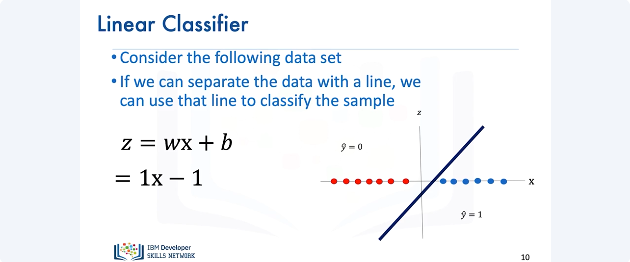

In the following data set, we have two different classes. Class one is denoted in red and class two is denoted in blue. If we can separate this data using a line, we could use that line for our classification. Consider the following line, it is evident that all the samples of the red class are on one side of the line and all the samples of the blue class are on the other side of the line. Let’s look at the equation of our line i.e. one x minus one. If we pick a value of x on the right side of the line, the value of z will be positive. Similarly, if we pick a value of x on the left side of the line, the value of z will be negative. Thus, if a data set can be separated by a line the data set is said to be linearly separable. Let’s verify this with an example. Let's say we choose the value of x to be 3. We plug it into the equation of our line and find that the value of Z is 2. Let’s try another example. Let's say we choose the value of x to be -2. 
We plug it into the equation of our line and find that the value of Z is -3. 

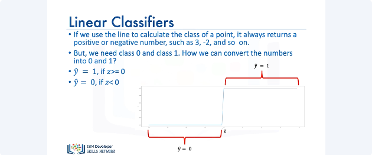

If we use this line to calculate the class of the points, it always returns real numbers such as -1, 3, -2, and so on. But we need a class between 0 and 1. So how do we convert these numbers? We'll use something called the threshold function. If Z is greater than 0, it will return a 1 and if Z is less than 0, it will return a 0.

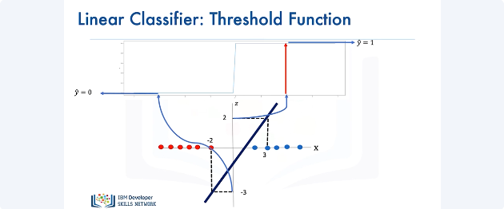

Let's combine our linear classifier with the threshold function. If we plug in the value of x as 3; the value of Z is 2, we pass it through the threshold function and we get a 1. Similarly, If we plug in the value of x as -2 the value of Z is -3 we pass it through the threshold function and we get a 0.

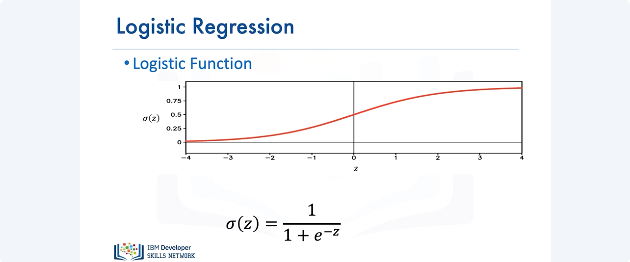

Now let’s talk about logistic regression. The logistic function resembles the threshold function and is given by the following expression known as the sigmoid function. It has better performance, then the threshold function for reasons we will discuss later. If the value of Z is a very large negative number, the expression is approximately 0. And for a very large positive value of Z, the expression is approximately 1. And for everything in the middle, the value is between 0 and 1. 

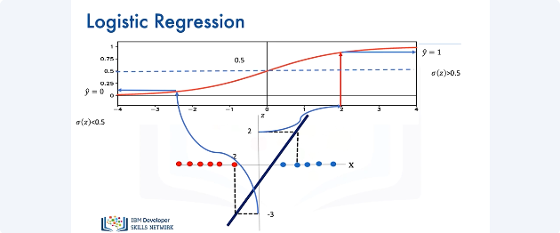

To determine “y hat" as a discrete class, we use a threshold shown by the line. If the output of the logistic function is larger than 0, we set the prediction value yhat to one, if its less we set “y hat” to 0. Let's try out some values of X that we used previously with the linear classifier.

If we set x equal to 3 in the equation of the line, we get the value of Z as 2, we pass it through the sigmoid function and since the value of the sigmoid function, is greater than 0.5, we set yhat to 1. Similarly, If we plug in the value of x as -2, the value of Z is -3 we pass it through the sigmoid function we see the result is less than 0.5 so we set “y hat” to 0. 

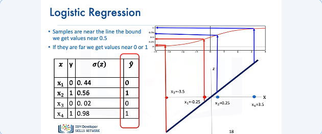

If the points are very close to the center of the line, the value for the sigmoid function is very close to 0.5, this means that we are not certain if the class is correct and if the points are far away, the value for the sigmoid function is either 0 or 1, respectively this means we are certain about the class. We can apply the threshold to get the class "y hat". 

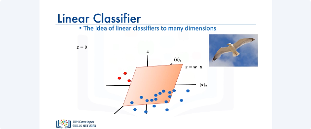

Linear classifiers can be used for classifying samples in any dimension, let's look at the 2d case. Instead of a line to classify samples, we use a plane or hyperplane. If you look at the bird's eye view of the plane i.e., Z equals 0, we can also see that as a line. 

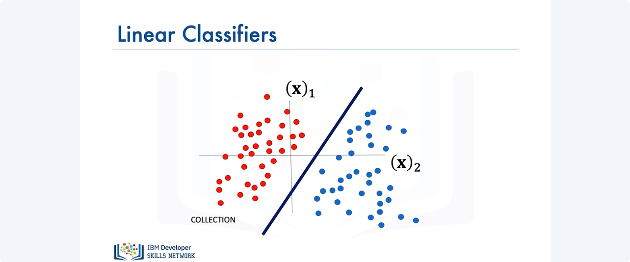

We can visualize the plane at z = 0 as a line. This line can be used for separating the data. If you're on one side of the plane, you would get a negative value. Passing that into the threshold function, you get a 0.

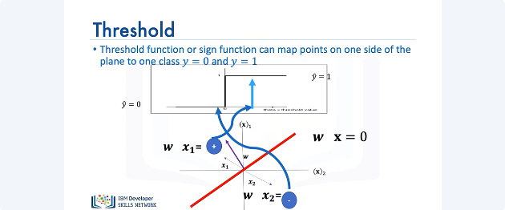

If you're the other side of the plane, you would get a positive number passing into the threshold function, you'll get a one. Now, lets use a logistic function then apply a threshold.

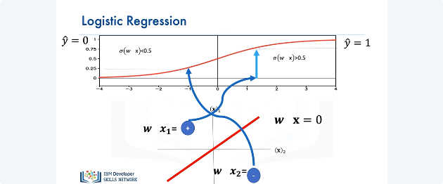

We can plug a negative value of Z into the logistic function, the value of the logistic function will be less than 0.5. When passing the output of the logistic function through a threshold and we get a value for yhat of zero. Similarly, if the value of Z is positive the value of the logistic function is grater than 0.5; The value is larger then 0.5, passing it through a threshold and we get a value of one for "Y hat ".

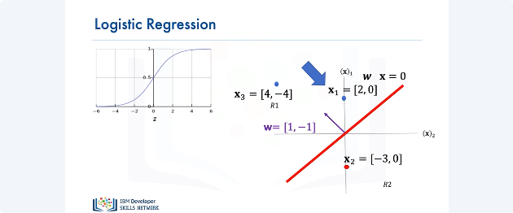

We can also represent the logistic function as a probability. Consider the following point, The probability that yhat equals 1 for x1 is given by the following probability function. Similarly, we can calculate the probability of yhat equals 0 for x1. Similarly, we can calculate the value for x2. 