# Linear Regression Multiple Output

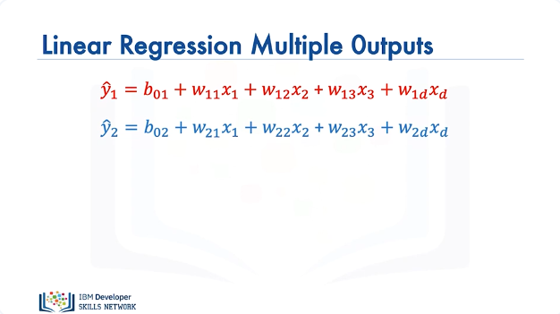

In this section we will review Linear Regression with Multiple Outputs. In this video we will discuss Linear regression with Multiple Outputs, with respect to Pytorch. We'll discuss custom modules With Single and Multiple Samples. We have the following linear equation as a function of the tensor or vector x. We have the second linear equation that is a function of the tensor or vector x, but this equation has a different set of parameters.

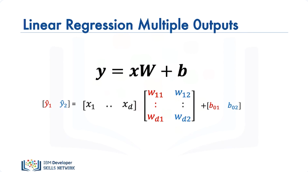

We can express the operation with matrix operations, where the parameters are stored in a matrix W. Let's see how to make a prediction, as before lets focus on the shape of the output or set of samples. 

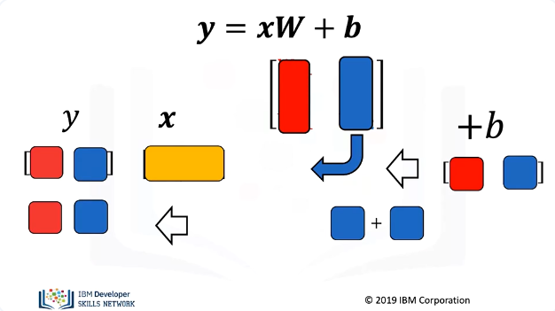

Let's represent the sample x with orange, we will represent the first column of the matrix in red representing the weights of the first function. We perform the dot product of x with the first column of the matrix W, we get a scaler value. We represent the bias term of the linear function in red, we add that value to the result of the dot products first operation. We get the output of the first equation. We will represent the second column of the matrix in blue, we perform the dot product of x and the row column, we get a scaler value. We represent the bias term of the second linear function in blue, we add that value to the result of the first operation We get the result of the first equation. 

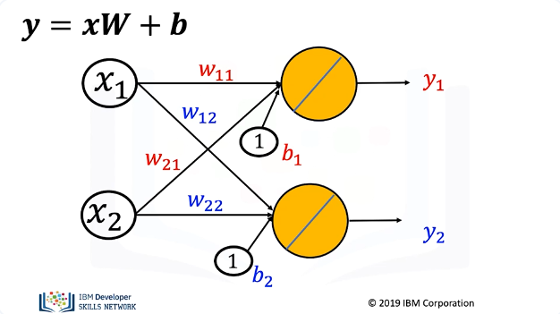

The following directed graph is also helpful to understand dot product. The nodes represent features and the edges represent parameters. These edge represents the outputs of the function.

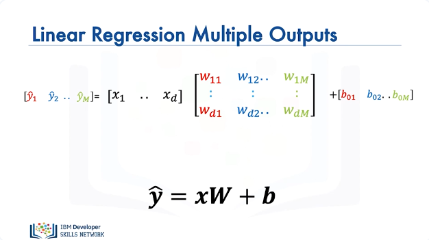

We can use this method to represent M linear functions with D inputs. The matrix has M columns and D rows. 

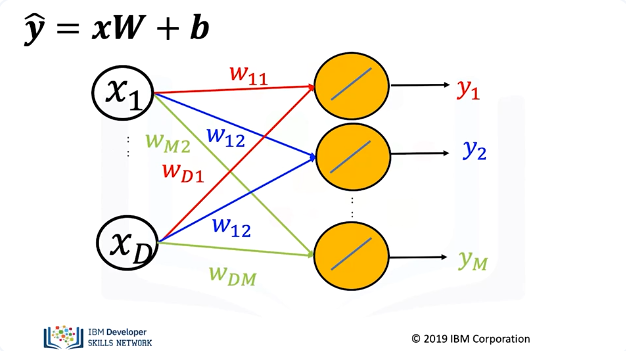

We can also use the graph to represent the data. 

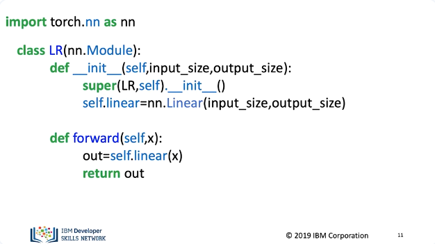

Let's see how to create a Custom Module. The class for our linear model has not changed but we will alter the parameter when we create the object or model. In the constructer the input dimension will be the number of features and the output dimension will be the number of outputs. These are used in the linear constructor with in the class 

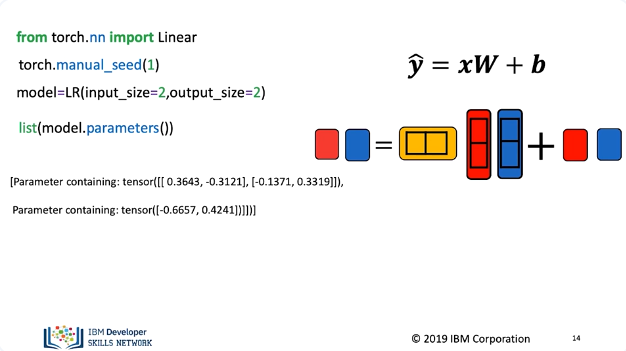

Just like before we will create a linear regression object with two dimensions. This is the number of rows of x and the parameter matrix w. We will set our features equal to 2, this is the number of columns of x and the number of bias terms. We can view the parameters, we have the weights or columns of the matrix and the bias terms.

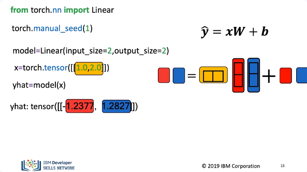

We can create a 2d input tensor, we make a prediction, the result is two outputs as specified in the image. For one tensor, we get two tensor outputs.

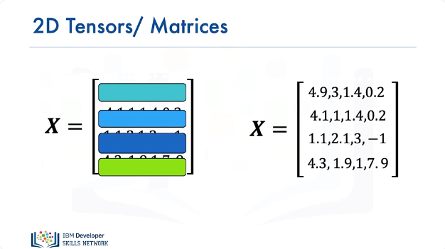

For multiple samples the process is identical, each vector or 1D tensor can be represented as a row in a matrix or two dimensional tensor. We will use colors to represent each row. 

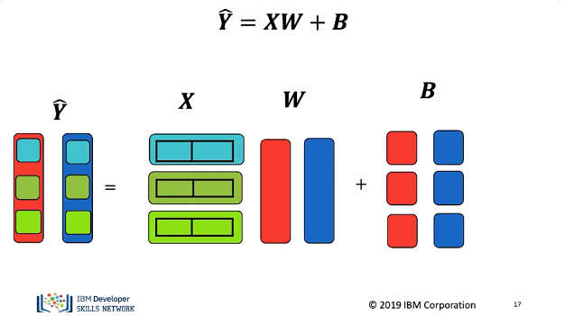

Let's use the colours to represent the output for multiple samples this time Y is a matrix or 2D tensor, in this case as there are two rows, there are two columns in Y as before, each column will represent an output. Each row in X is a sample, the number of columns of X still equals the number of rows of W. There are only two bias terms. We add the bias to each sample we can represent this as a matrix or using python broadcasting.

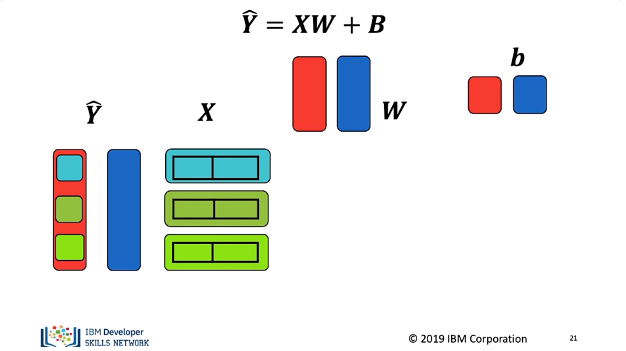

The first output of the first sample is the dot product of the first columnwith the first row of X, the result is a scalar or number. We then add the bias term, the result is the first sample of the output. For the first output of the second sample, we find the dot product of the first column with the second row of X the result is a scalar or number. We then add the bias term, the result is the second sample of the first output. The process is identical for the final sample. The second output will be the second column of Y and each sample output will be the row. Let's look at the first samples second output.

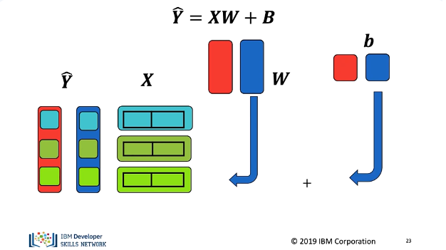

The second output of the first sample is the dot product of the second column with the first row of X the result is a scalar or number. We then add the bias term. The result is the second output sample in the first row second column of Y. The process is identical for the second sample except we use the second row of X. Finally the process is identical for the final sample.

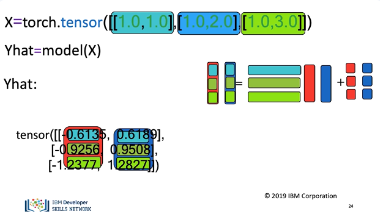

In Pytorch we create a tensor with two columns and three rows, using colors to help clarify the process, we call the object. It performs a linear transformation, we get the following output. The correspondence with the colors is as follows. In the next video we will see how to train the model. 

## Lab

[https://github.com/bbearce/code-journal/blob/master/docs/notes/data_science/Coursera/pytorch/JupyterNotebooks/4%203%20multi-target_linear_regression.ipynb](https://github.com/bbearce/code-journal/blob/master/docs/notes/data_science/Coursera/pytorch/JupyterNotebooks/4%203%20multi-target_linear_regression.ipynb)