# Linear Regression Pytorch

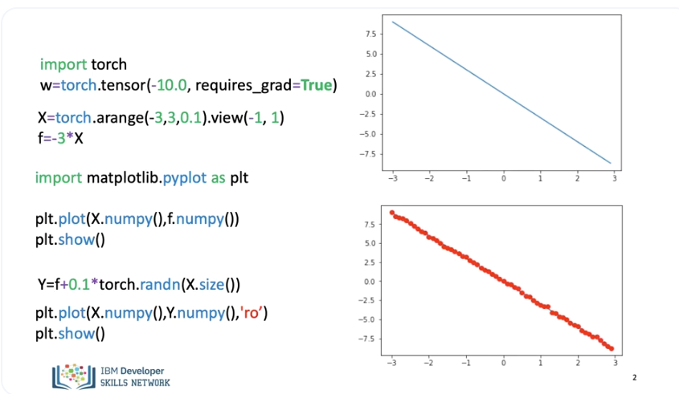

There are several ways to perform gradient descent in PyTorch. Let's do it the hard way to get a better understanding, in this video we will just use the slope. We will create a PyTorch tensor, we set the option requires grad = to true. as we are going to learn the parameters via gradient descent. We will create some X values, we will map them to a line with a slope of -3. We use the view command to add an additional dimension. We plot the line, the method “numpy()” converts it to a numpy array, this allows us to use matplot lib. We add some random noise, we plot the data points over the line. 

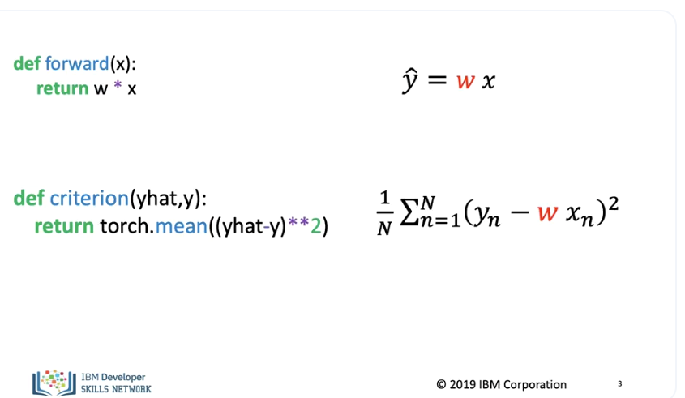

We define the forward function, this is the equation of a line. We define the criterion function or cost function. 

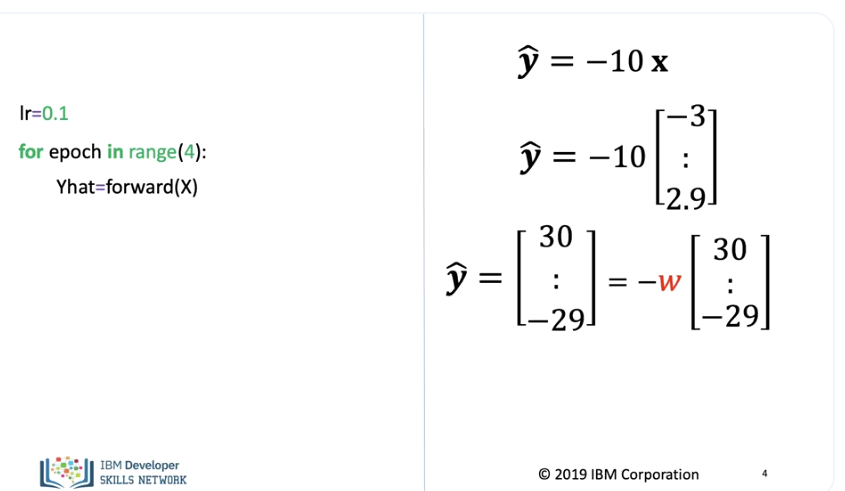

We set a learning rate of 0.1, every time you go through the data it's called an Epoch we will perform 4 epochs. The function multiplies the tensor by the parameter w, as the variable has set required to true, PyTorch knows its a variable so it's helpful to think about the value in its symbolic form i.e a variable. 

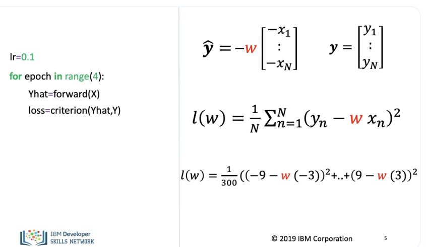

We add the cost function, although we set the value for the parameter w to be -10. as the parameter requires grad is set to true PyTorch will be able to differentiate it. Even though this is technically the cost we will refer to it as the loss in the code to stay consistent with the PyTorch documentation. 

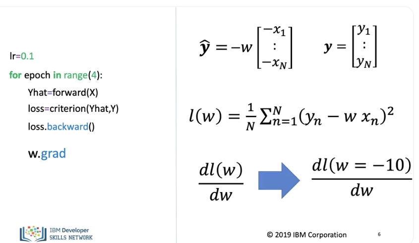

We call the method backwards on the loss this calculates the derivative with respect to all the variables in the loss function, to gain access to the derivative with respect to the parameter w, we use the method grad. This will give us the derivative at the point -10.

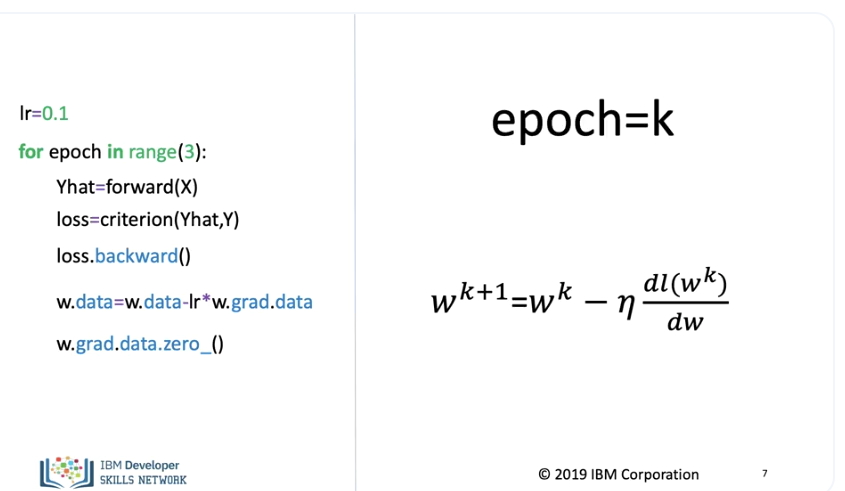

We can update the parameter in the following line of code, the attribute .data. gives us access to the data contained in the variable. We set the gradient to zero for the next iteration, this is due to the fact that Pytorch calculates the gradient in a iterative manner. In this example epoch equals k, now lets run a few iterations. 

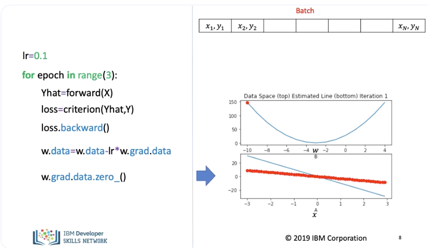

The top plot on the right shows the cost function for different values of the parameter, the red dot shows the value for the average loss when the parameter or slope is -10. 

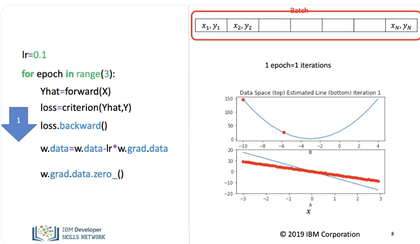

In the bottom plot, the red dots shows the data points and the blue line shows the function generated, using the parameter value of -10. We perform one iteration, in this case 1 iteration = 1 epoch. 

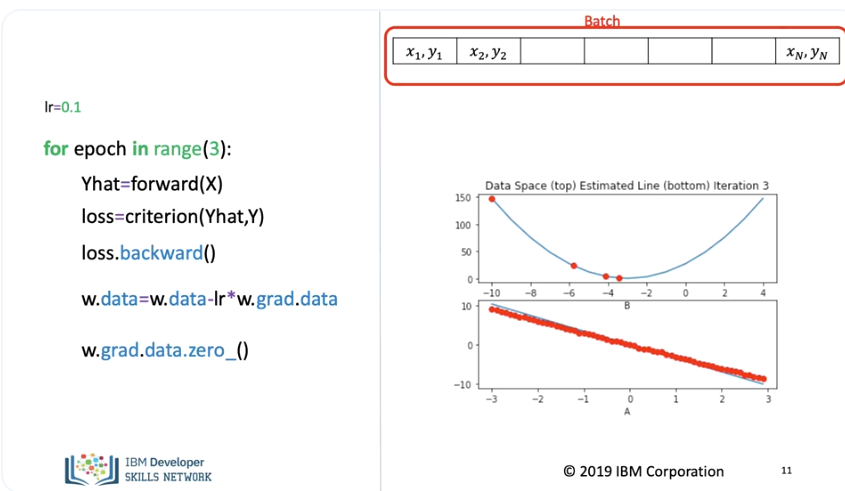

The parameter value updates and the average loss decreases and the estimated line gets closer to the data points. We repeat the process for the next iteration or epoch. We use every sample for the cost function. The average loss value decreases and the line better tracks the data points. We repeat the process for the next iteration as we use all the data 1 iteration is equal to one input. The line adjusts slightly and the cost decreases accordingly. To better understand this slowdown, its helpful to look at the tangent line at the points for different iterations. Just a reminder, a tangent line slope is equal to the derivative.

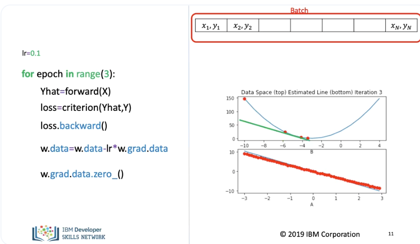

For the first point, the slope is large as such the jump is large. For the third iteratio,. the slope is much smaller so the decrease of the average loss is much smaller. 

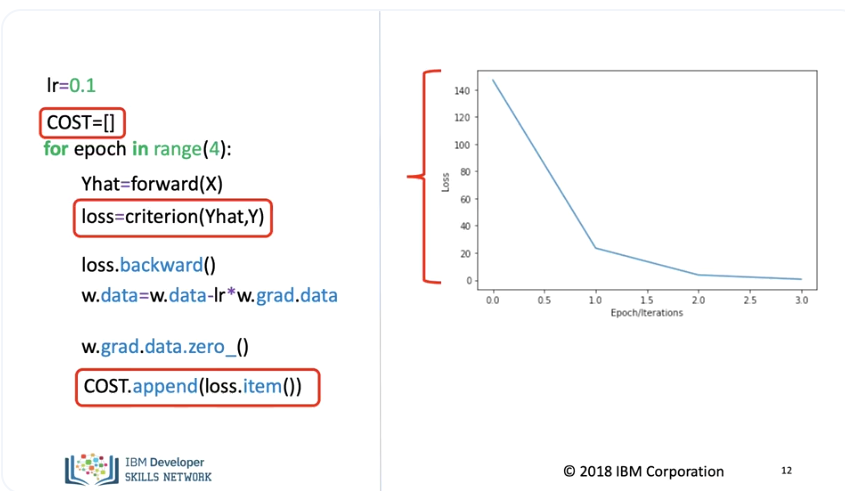

As our models get more complicated, it gets more difficult to plot the COST or average loss for each parameter, one alternative is to look at the COST for every iteration. 
We create a list and append the loss for every iteration, we use item to obtain the loss as a Python number. We can plot the average loss out for every iteration, the height is the loss. 

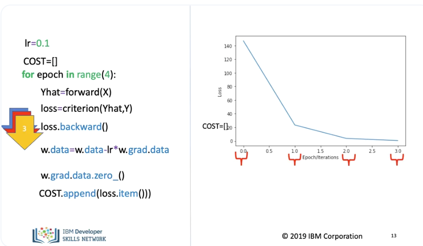

The horizontal axis corresponds to each iteration. We start with the initial value, for each iteration we calculate the loss In this case, the matplot lib function interpolates the results. 

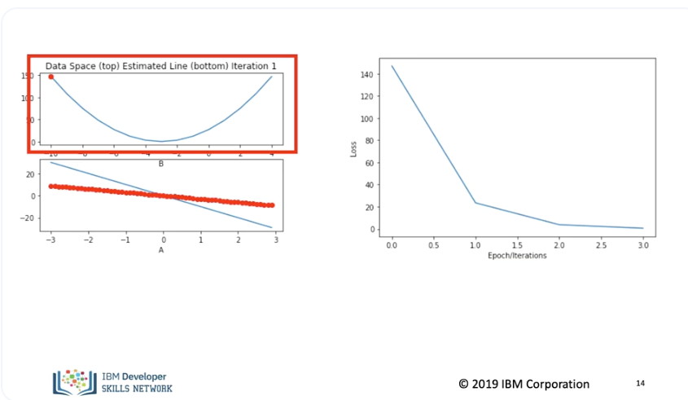

The top left plot shows the cost function, in the bottom left plot, we see the data points in red and the estimated line in blue. The right plot shows the average loss or cost for each iteration. 

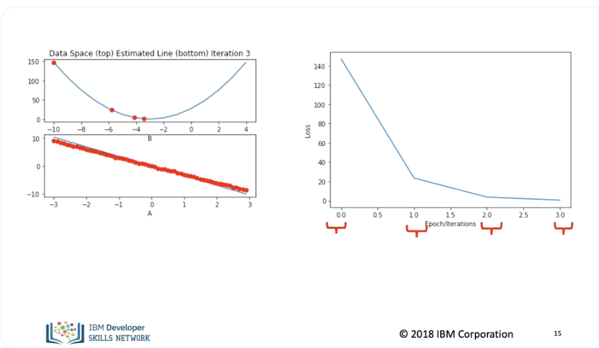

We see in both plots the average loss or cost decreases for each iteration. (Music) 