# Linear Regression Pytorch

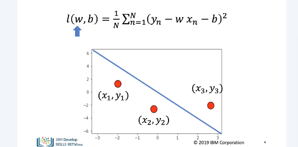

The cost is the average loss or total loss. Mathematically it looks like this. It is a funtion of the slope. The slope controls the relationship between x and y. The bias controls the horizontal offset. 

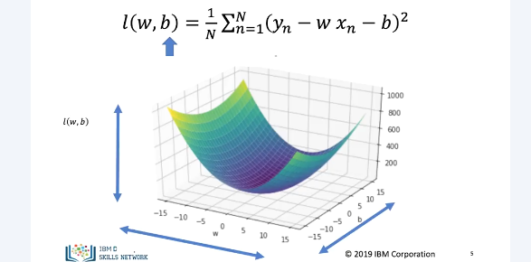

In true linear regression, the cost function is of 2 variables, the slope and bias. We can plot as a surface. One axis is slope and the other is bias with height as cost.

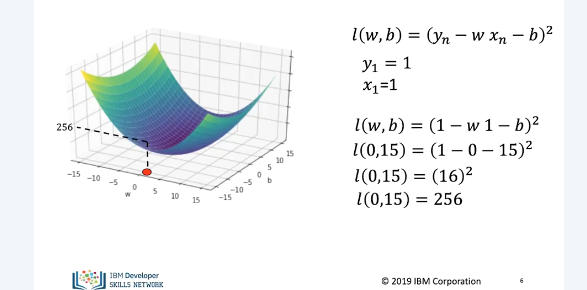

In this example, for one sample, the loss is the same as the cost. The value for x and y is 1. l is expression and cost of loss func. For slope of 0 and bias of 15 we have the following point. Applying cost func, we get 256

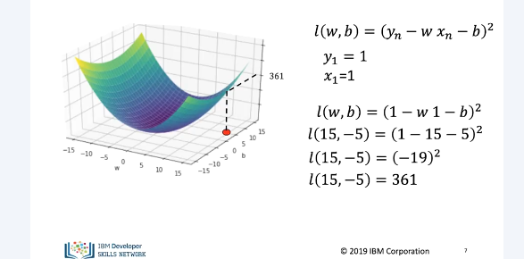

In this example, we have a y and x value of 1. In this example cost is 361.

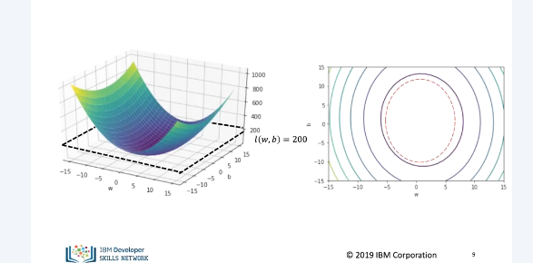

Contour plots give you a birds eye view of the cost function. In this case w is horizontal axis and b is vertical. Keep in mind the 

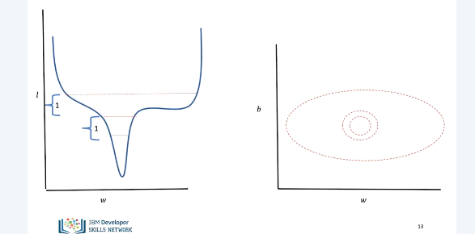

Now we take a vertical versus horizontal slice to see loss versus w. We can see the contour at the same time on the right. Contour lines represent similar changes in loss. Therefore if contour lines start getting far apart the loss is changing more slowly. Close together is fast.

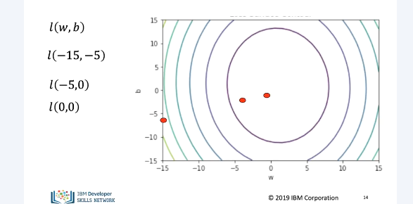

The following 3 points are different parameter values we can see for each iteration. The sample value is decreasing. 

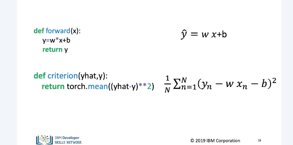

Let's minimize the hard way. Define MSE for the value on the line.

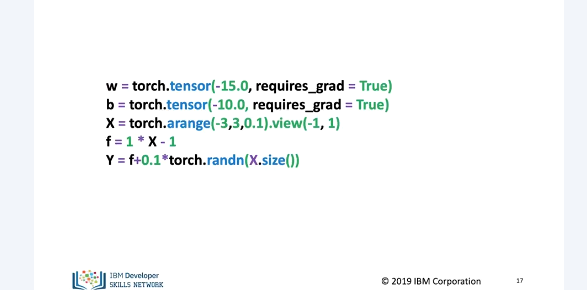

Initialize tensors for w, b, x and y values.

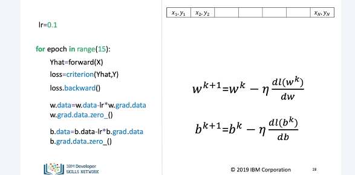

The process is identical to last val but we also do bias term.

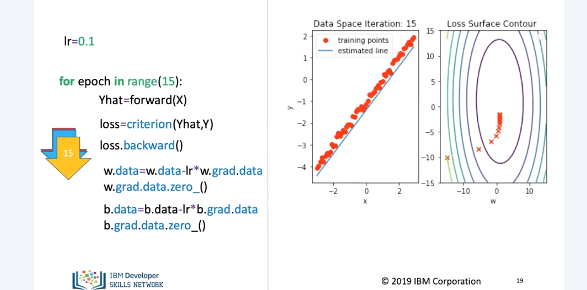

7 iterations in, w and b are closer but not perfect. 15 in, the line is close to perfect.

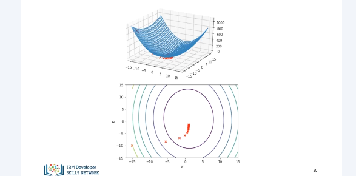

We can see the correspondence between the loss surface and contour lines.

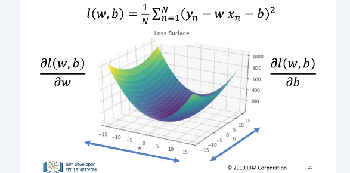

In general the derivative of a multi variate function with respect to any one variable is called a partial derivative.

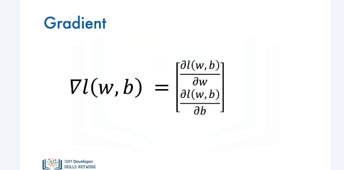

A vector of all partial derivatives is called the gradient.

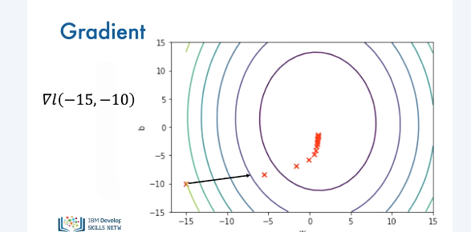

The gradient is perpendicular to contour lines and points to the greatest change. It also points to the direction of the next iteration.
