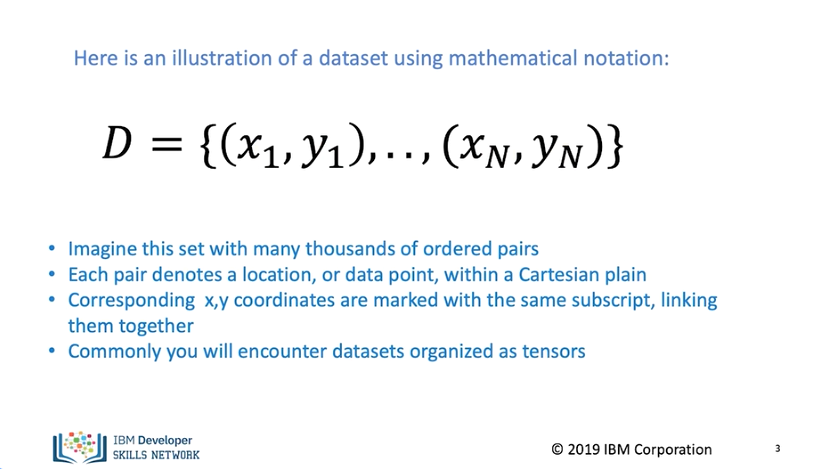
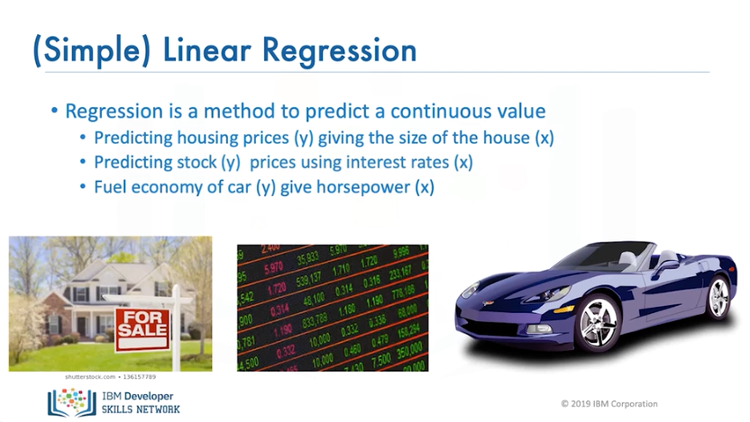
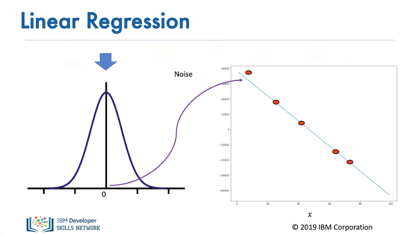
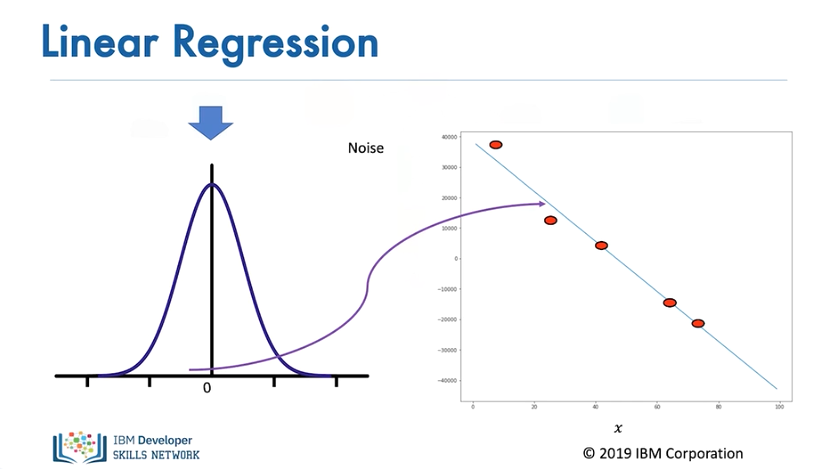
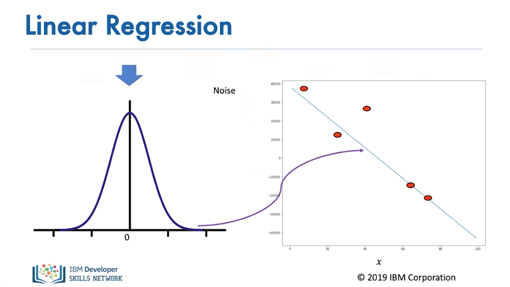
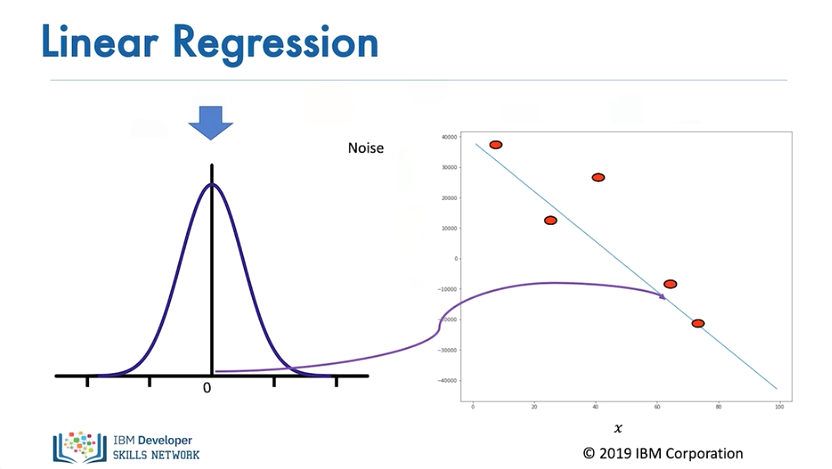
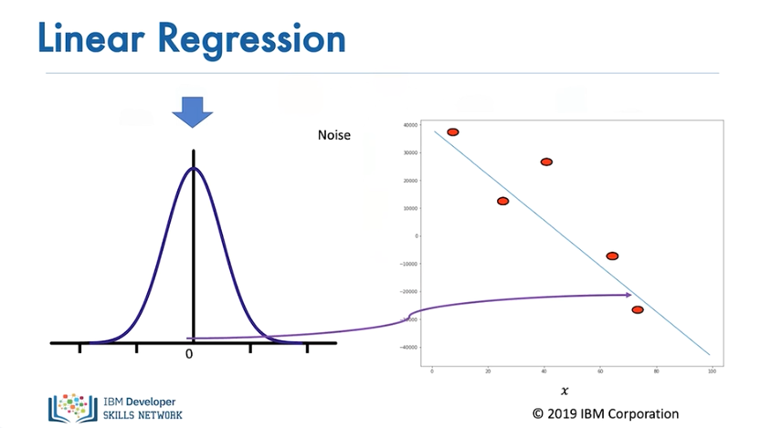
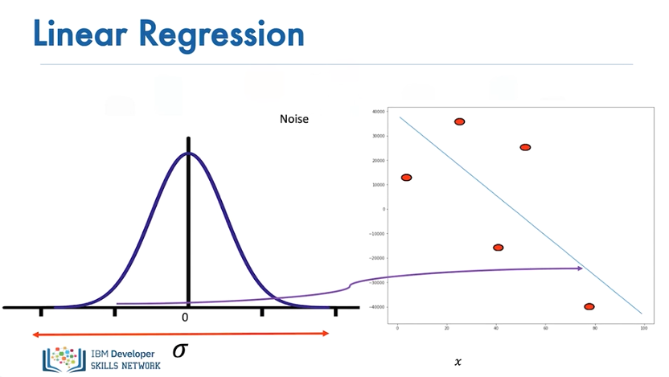
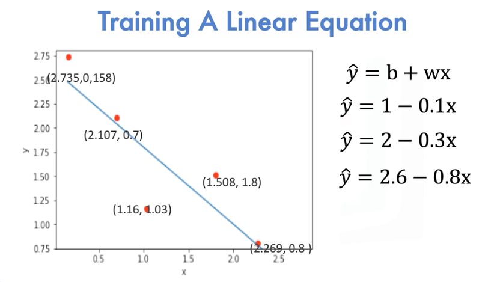
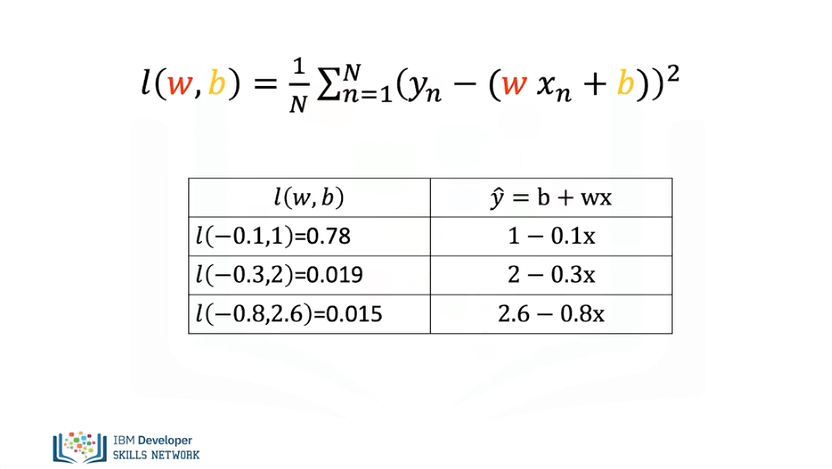

# Linear_Regression_Training

In this video, we will go over the process of learning parameters for linear regression. This is called training. In this module, we will review what is a dataset, the noise assumption, provide an overview of training. We use a dataset of examples. In this case, we have n points with x and y values. We will use these examples to learn the linear relationship, or line, between x and y. When x is only one dimension, linear regression is sometimes referred to as simple linear regression. Imagine this set with many thousands of ordered pairs. Corresponding x-y coordinates are marked with the same subscript, linking them together. Subscripts range from n equals 1 to n with n defining the set size. Commonly, you will encounter datasets organized as tensors.

Example of simple linear regression datasets include predicting housing sizes, giving the size of the house. The variable y is the house price, and x is the size. Predicting stock prices using interest rates. In this case, y is the stock price, and x is the interest rate. Fuel economy of cars give horsepower. Y is the fuel economy, and x is the horsepower.

Even if the linear assumption is correct, there is always some error. We take this into account by assuming a small random value is added to the point on the line. This is called noise. For linear regression, the particular type of noise is Gaussian. 

The figure on the left shows the distribution of the noise. The horizontal axis shows the value added, and the vertical axis illustrates the probability that the value will be added. 

Usually, a small positive value is added

...or a small negative value. Sometimes large values are added

...but for the most part, the values added are near zero.

The more significant the standard deviation, or the more dispersed the distribution is, the more the samples deviate from the line.

In linear regression, we plot the points on the Cartesian plane. We would like to come up with a linear function for x that can best represent the points. In this example, the line does not do a good job. This line does a slightly better job at fitting the points. Finally, this line does the best at fitting all the points. A more systematic way of finding the best line can be determined by minimizing a function.

The following is the Average Loss, Mean Squared Error, or COST function. It is a function of the slope and bias. As we plug in different slope and biases, we get different values. It turns out the line with the best fit has the smallest value for this function. Now let's see how to minimize this cost. 

