# Logistic Regression Cross Entropy Loss

In this video, we'll talk about the cross-entropy loss. This will be our total loss or cost function for logistic regression, but we'll also apply it to other models for classification. In this video, we will talk about Problem with Mean Squared Error. First, we'll talk about Maximum Likelihood Estimation, and then we'll see how to go from Maximum Likelihood Estimation to calculating cross-entropy loss, then train the model PyTorch. Here we'll do it just for logistic regression, but the same methodology applies to all the models that involve classification. When training linear classifiers, we want to minimize the number of misclassified samples. This is because if our classifier classifies a high number of samples incorrectly during training, it would not work well on actual test data. Thus, we want to minimize the loss. The loss for our linear classifier is calculated using the loss function, which is also known as the cost function. 

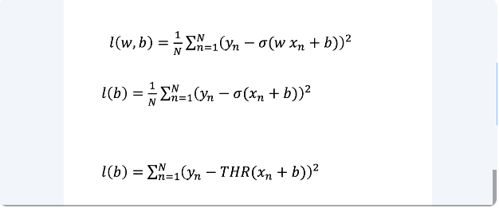

The loss function looks something like this. It looks pretty similar to linear regression, except we have this little logistic term here. This equation looks pretty daunting, so let's do a simplified example, where we'll only focus on the bias term, which is also known as the B-term of the linear classifier. We'll also look at how the threshold function behaves, so that it's a little easier to understand.

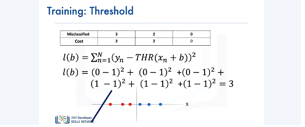

Now let's see how we can calculate the loss of the threshold function we have here. From the previous slide, the mathematical formula for calculating the loss function is as follows. Beyond the mathematical formula, let's try to have an intuitive understanding of what the loss function is actually calculating. Here we have three red samples and three blue samples. The red samples are the ones that have been misclassified. Going back to the mathematical representation of our loss function, the Yn term equals to 0 for the red samples and 1 for the blue samples. The value of the threshold function for all of these samples equals to 1. Plugging in the values of Yn and the threshold function for all these samples in the formula of the loss function, and summing all the values, we get that the loss of this threshold function for three misclassified samples is equal to 3. We can denote the number of misclassified samples versus the cost or loss in a table like this. 

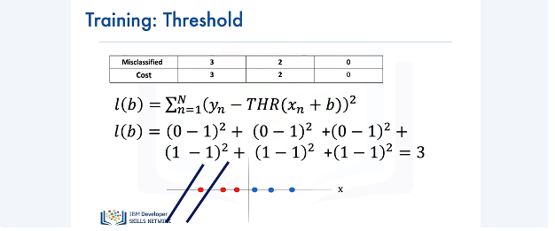

Generalizing for this particular threshold function, if we had two misclassified samples, our cost would be 2,

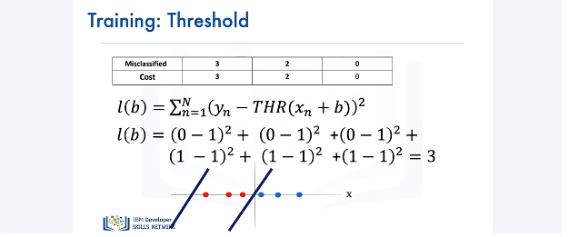

and had we had zero misclassified samples, our cost would be 0.

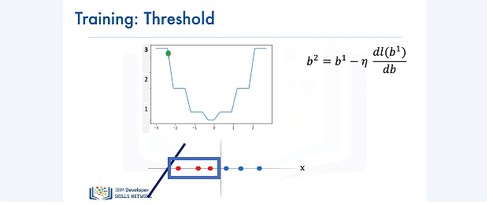

Now let's see the plot of the cost of the threshold function. We have the gradient descent item from our bias parameter B. The value for the cost for a specific line is given by the green ball. 

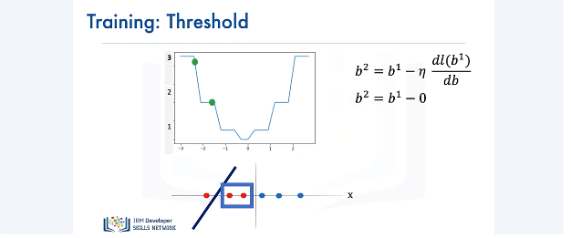

If we move the line a little, we have two misclassified samples for the threshold function. But now, notice something interesting happens to the cost function. The value falls in a region where we have a flat line on the cost function. The gradient in this region is 0. We do not want this to happen. When something like this happens, the parameter will get stuck in the region, thereby resulting in none of the parameter values getting updated for the classifier. As a result, we will have two misclassified samples. 

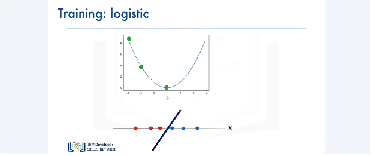

Instead of using the threshold function, let's consider using the sigmoid function. We'll see the advantage of using this function for classification. Here's a plot of the cost of the sigmoid function. Notice how the curve is smooth compared to the curve of the threshold function. Using the sigmoid function for classification, we have three misclassified samples here. Note the corresponding value of the cost denoted by the green ball on the curve. Now if we move the line by a little, we see that we have two misclassified samples, and the corresponding value of the cost is in a smooth region, not in a flat region. Finally, if we move the line even more to the right so that we have no misclassified samples, the value of the loss is always smooth and only flat in the minimum, resulting in better parameter values and less misclassified samples. 

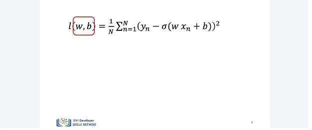

Let's look at the cost surface for two parameters W and B. 
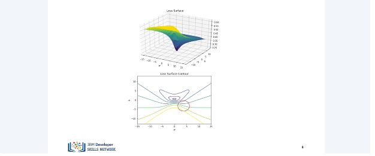

It turns out, unlike the one-parameter case, the cost surface for logistic regression with the squared loss is flat. If you look closely at the surface, there are a lot of contour lines around this region, 

but not as many around this region, which implies a flat surface. If we start random initialization in a good location (below), our algorithm will converge to a minimum, 

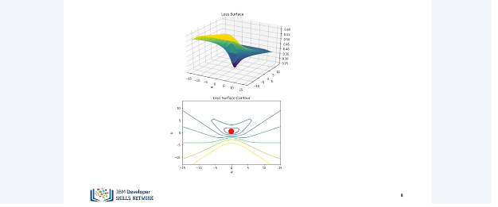

but if we start our initialization in the bad region (flat part in the south part 2 figs above), nothing will happen. Let's see what happens if we use maximum likelihood estimation to estimate the parameter.

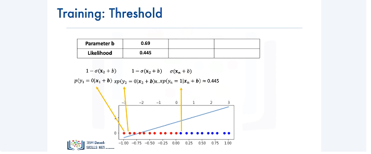

We have a classification dataset here and will only focus on the bias parameter. The sample of Y in this dataset belong to either one of two classes, either red or blue. Class 0 is represented by red and class 1 is denoted by blue. We can calculate the likelihood for this dataset as follows. As the logistic function gave us the probability of Y being equal to 0 or 1, we can calculate the likelihood using this, which equals to 0.445. 

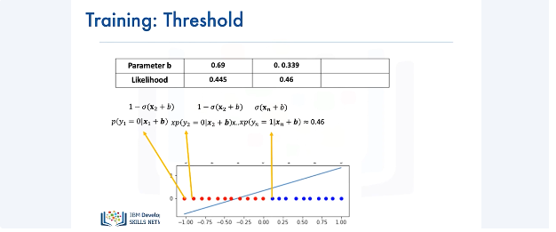

Now, let's consider another line, which seems to be better at classifying the training data with a different value for the bias parameter. As with the previous case, we can calculate the likelihood as follows, and the likelihood value equals 0.46 for this case. 

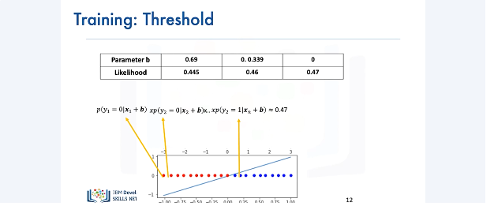

And for the final line, which seems to be the best one, the value of… The likelihood's value is 0.47. Our goal is to obtain the parameters that maximize the likelihood function. 

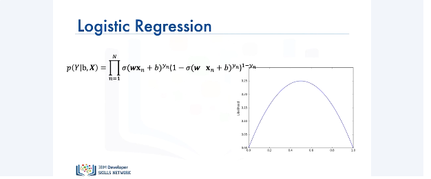

So just like flipping a coin, you can come up with an expression for the likelihood and here's an idealized plot of just one parameter. We want to find the maximum point. 

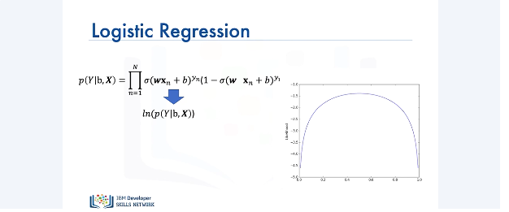

If we take the log, as you can see, it didn't affect the position of the maximum, just the shape of the function. 

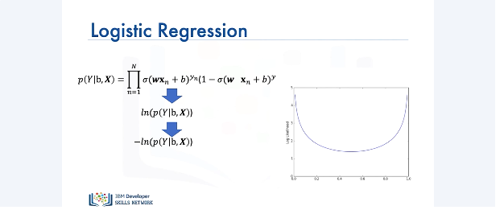

And if we want to minimize something, we simply multiply it by a negative number. If you notice carefully, the location of the minimum is in the same place as the position of the maximum. 

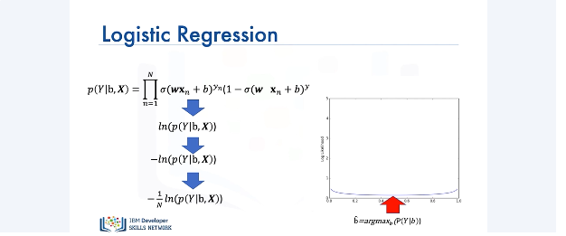

And we can simply average it out. It turns out, the minimum of this function corresponds to the maximum value of the likelihood.

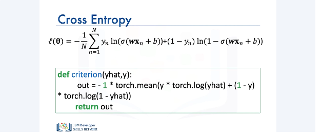

The final expression is the cross-entropy loss, or cost. Here's the actual expression, where theta represents the weights and biases, and we can implement it in PyTorch as follows. 

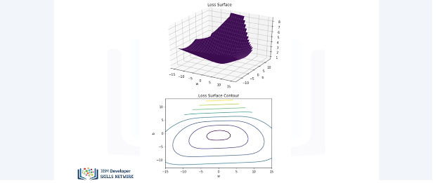

Here's the corresponding contour plot of the equation we just implemented in PyTorch. There's contours all over the plot surface, and it will only be flat at the minimum. Now we'll cover how to perform logistic regression in PyTorch. 

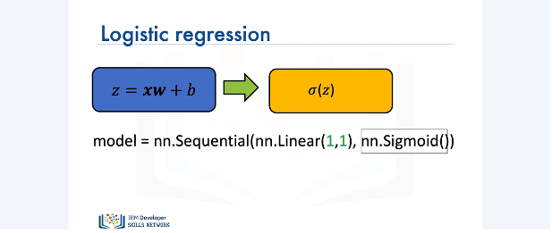

To perform logistic regression, first we need to create a model. In PyTorch, we can create a logistic regression model using the sequential method. In this case, we have a one-dimensional input and a one-dimensional output. The linear model is then passed to the sigmoid function, finally producing a one-dimensional output.

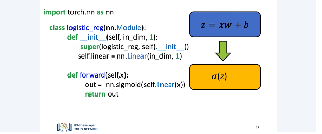

Another way to create a model for logistic regression is by defining our own custom model using the nn.module package. The initialization of this class will be based upon the input dimension and the output dimension, which in our case would be 1.

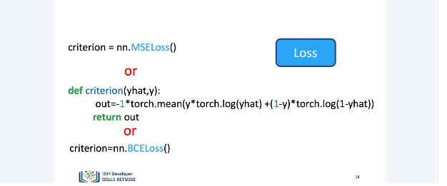

Next, we define our forward pass function. The forward pass refers to calculating the predicted output value by our model based upon the input. We apply the sigmoid function to our intermediate linear output z in order to convert it to sigmoid probabilities. Next, we need to define our loss function. The loss function is used for updating the weight parameter of the model so that we end up with the best model for performing logistic regression. We can use mean squared error or MSE. PyTorch has an inbuilt method for doing this. We can use nn.mseloss method for calculating the loss as a mean squared error. PyTorch also has some other functions for calculating loss. We saw this formula for calculating the cross-entropy. Instead of writing this verbose formula all by ourselves, we can instead use PyTorch's inbuilt nn.bceLoss function for calculating the loss. We are very close to performing logistic regression. Just a few more steps and we'll be done. 

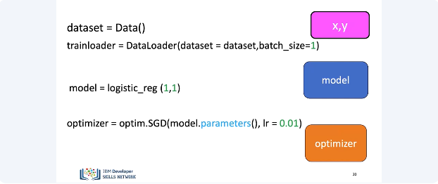

We start by loading our dataset. We then create the logistic regression model. Since both our input and output dimensions are equal to 1, we pass 1 and 1 to the constructor of our model class. We use the Stochastic Gradient Descent Optimizer, also abbreviated as SGD, for updating the model parameters. We specify the learning rate as 0.01 for the parameter updates. 

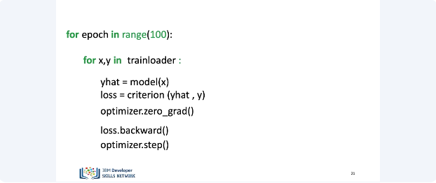

Finally, here's all the code you will need for performing logistic regression in PyTorch. Let's understand what this code does. We run this code for 100 epochs. For each iteration, we load the x and y from the dataset. We then pass the input i.e. x to our model and get a predicted value, i.e. y-hat from the model. Next, we calculate the loss based upon our selected criteria for selecting the best model. We then get the gradients for the parameters using the loss.backward function and finally update the parameter using the optimizer.step function. By the end of 100 epochs, we would have the best model based upon the above criteria for performing logistic regression. Just a final note, the output produced by our model will have a value between 0 and 1. We will perform some thresholding in the lab to get the actual class values. Thank you for watching this video. 

## Lab

[https://github.com/bbearce/code-journal/blob/master/docs/notes/data_science/Coursera/pytorch/JupyterNotebooks/5%202%202bad_inshilization_logistic_regression_with_mean_square_error_v2.ipynb](https://github.com/bbearce/code-journal/blob/master/docs/notes/data_science/Coursera/pytorch/JupyterNotebooks/5%202%202bad_inshilization_logistic_regression_with_mean_square_error_v2.ipynb)

[https://github.com/bbearce/code-journal/blob/master/docs/notes/data_science/Coursera/pytorch/JupyterNotebooks/5%203_cross_entropy_logistic_regression_v2.ipynb](https://github.com/bbearce/code-journal/blob/master/docs/notes/data_science/Coursera/pytorch/JupyterNotebooks/5%203_cross_entropy_logistic_regression_v2.ipynb)

## Final Project

[https://github.com/bbearce/code-journal/blob/master/docs/notes/data_science/Coursera/pytorch/JupyterNotebooks/Neural%20Network%20for%20Breast%20Cancer%20Classification.ipynb](https://github.com/bbearce/code-journal/blob/master/docs/notes/data_science/Coursera/pytorch/JupyterNotebooks/Neural%20Network%20for%20Breast%20Cancer%20Classification.ipynb)

[https://github.com/bbearce/code-journal/blob/master/docs/notes/data_science/Coursera/pytorch/JupyterNotebooks/Final%20Project%20League%20of%20Legends%20Match%20Predictor.ipynb](https://github.com/bbearce/code-journal/blob/master/docs/notes/data_science/Coursera/pytorch/JupyterNotebooks/Final%20Project%20League%20of%20Legends%20Match%20Predictor.ipynb)