# Logistic Regresson Prediction

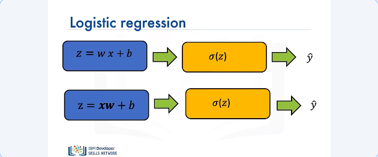

In logistic regression, we have a linear function, we pass the output to the logistic function and get our estimate as Y hat. We can also apply logistic regression to equations of vectors involving dot products. The output of logistic regression is still one dimensional. Now, let's talk about two ways through which we can create a logistic function in PyTorch. 

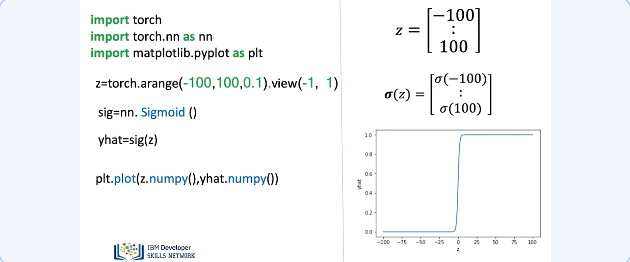

The first way is using the module torch dot nn. So, let's create some data. We use the object constructor nn dot sigmoid and this creates a sigmoid object for us. We input our tensor to the sigmoid object to get our local estimate. Here's a plot of our local estimate. 

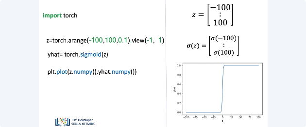

The second way to create a logistic function in py torch is by simply using torch module. We have our same input tensor, in this case our sigmoid is an actual function so we pass our tensor as an input to the sigmoid function and get an output. Here's a plot of the output.

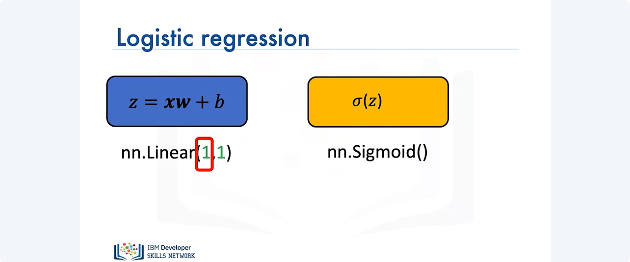

Till now we have focused on creating logistic functions in PyTorch. Now let's see how we can create logistic regression models in PyTorch using the nn dot sequential package. The nn dot sequential package is a really fast way to build your logistic regression models. So we start with a linear constructor and we also have a sigmoid constructor. Our input is 1 dimensional. 

We use a sequential constructor as follows to produce our model. The first parameter that is passed as input to our sequential constructor is the linear constructor and the second parameter is the sigmoid constructor. We then produce our model. Behind the scenes, this takes tensor x, produces the intermediate output z and then passes z to the sigmoid function. Which then produces our output estimate y hat. 

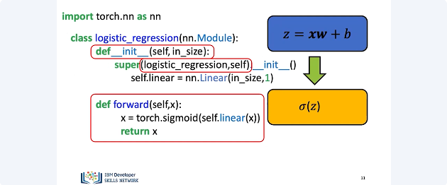

We can also build custom modules in PyTorch by sub-classing the nn dot module package. Here is a custom module built by sub-classing nn dot module. It is called logistic regression. It is pretty similar to linear regression. We construct our linear object using the nn dot linear constructor. The only difference is that our output will already have the sigmoid function. And this will apply the sigmoid function to our intermediate output for producing the final output. 

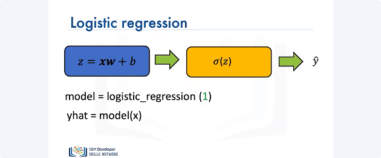

We can create a model for our custom module by using the constructor as follows. We pass in 1 as the argument to the constructor, since our input is 1 dimensional. This will produce a linear output on which the sigmoid function will be applied. To produce our final output y hat. 

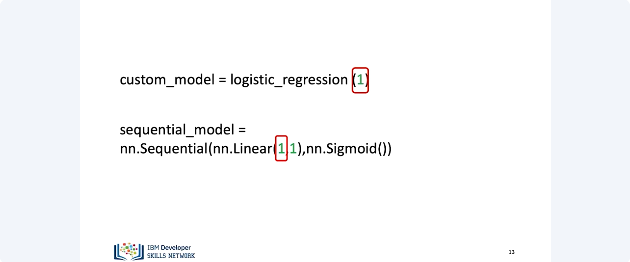

Here’s a side by side comparison of our custom model and the sequential model. We create the custom model by calling the logistic regression module we wrote from scratch. We pass in one to the constructor as our input is one dimensional. Similarly, we create our sequential model using the existing nn dot sequential package. Again, we pass in one to the linear constructor as our input is one dimensional. Both of these models will produce the same output at the end. 

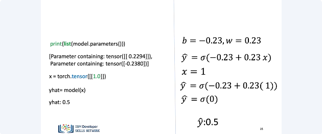

Now let’s learn about how we can make predictions in PyTorch. 
Let’s consider some sample values of model parameters. Based upon our previous examples, b and w were our model parameters. The exact values of the parameters are shown on the left i.e. 0.2294 and -0.2380 but we’ll approximate them to 0.23 and -0.23 respectively. Let's consider an input tensor x of 1 dimension containing the value 1. We apply an model to the input tensor. First, the input tensor is passed to a linear function and the intermediate output is passed to the sigmoid function. Finally, producing an output. 

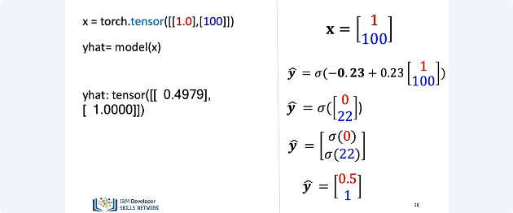

Now, let's consider a multi sample as an input. Making a prediction on multi sample inputs is very similar to the case of a single sample input. We apply a model to our multi sample input x. The model applies a linear function to each element of the input and then passes it to the sigmoid function. Finally producing an output containing multiple elements. Each of the elements in the output corresponds to a single sample of the input.

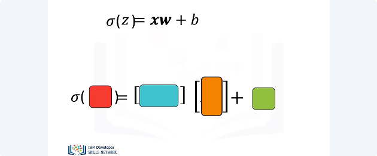

We can also apply logistic regression to multidimensional inputs. Let's look at the 2D case. The 2D model behaves similar to its 1D counter part.

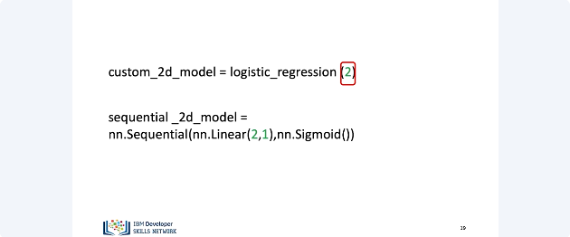

Just like the 1D case, instead of 1, we now pass 2 to our custom logistic regression module since our input is 2 dimensional. Similarly, for creating a sequential 2d model, we pass in 2 to the linear constructor since our input is 2 dimensional.

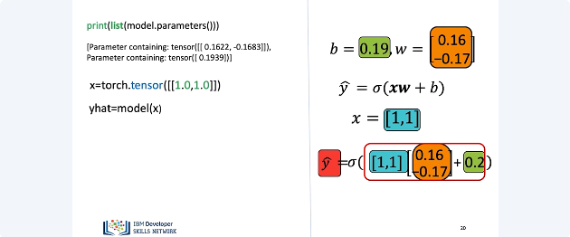

Let’s consider some sample values of model parameters for 2 dimensional inputs. Here b and w are the model parameters. The exact values of the parameters are shown on the left. And we can approximate the values as on the right. Now, let’s consider our model. For a 2 dimensional input, we apply an model to the input tensor. First, the input tensor is passed to a linear function and the intermediate output is passed to the sigmoid function. 

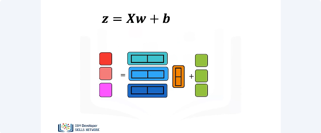

Finally, producing an output. We do the same thing for multiple samples of 2 dimensional inputs except that: We apply the sigmoid function to each intermediate output.

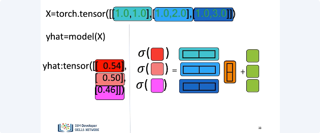

We have the X tensor here – a multi dimensional multi sample input. We apply the model to x, which in turn applies the linear function and sigmoid function to each intermediate output. And we get three final outputs. 