# Loss

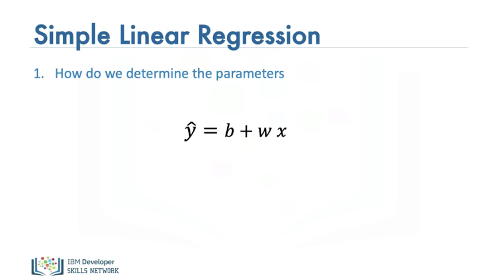

In the video, we will review Loss. Loss is a precursor to cost. In order to determine the parameters, we have our linear function, we would like to determine the values of the parameters i.e the slope and bias.

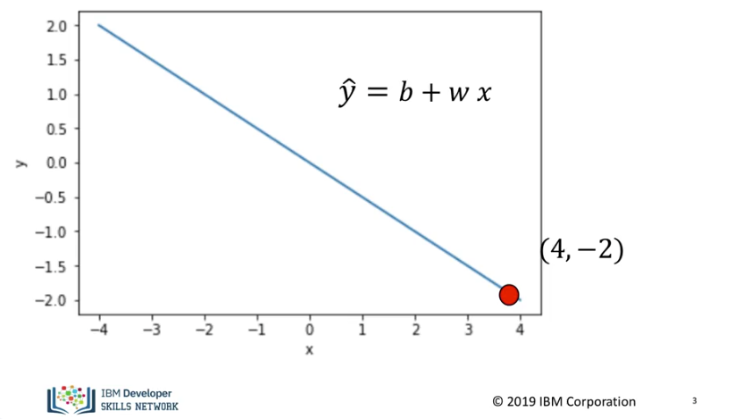

Let's start off with a simple example with just one sample as shown in the graph. The value for x is -2 and the value y is 4 We would like to come up with the slope and bias. Actually this is an overdetermined problem, i.e there are an infinite number of solutions, in order to make the problem easier let's just try to determine the slope. 

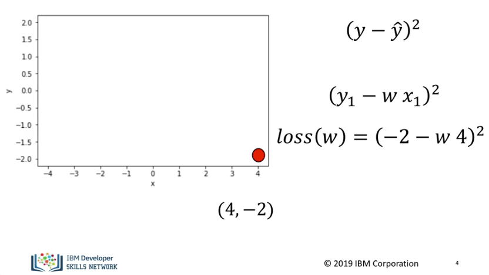

In order to find the parameter we need to find how good our model is, a quantity that is near zero when our model provides a good estimate and large when our model estimate is bad, we call this quantity the loss. We do this by subtracting our model estimate by the actual value, we then square it. Its essentially finding the distance from the model estimate from the actual value we are trying to predict. We would like to determine the parameter, in this case, the slope that minimizes this value. This is a function of our parameter. In the training phase, y and x are given. In the final form, our function looks like this, It's referred to as a criterion function or loss function. The goal is to determine the parameter or slope that minimizes this function. 

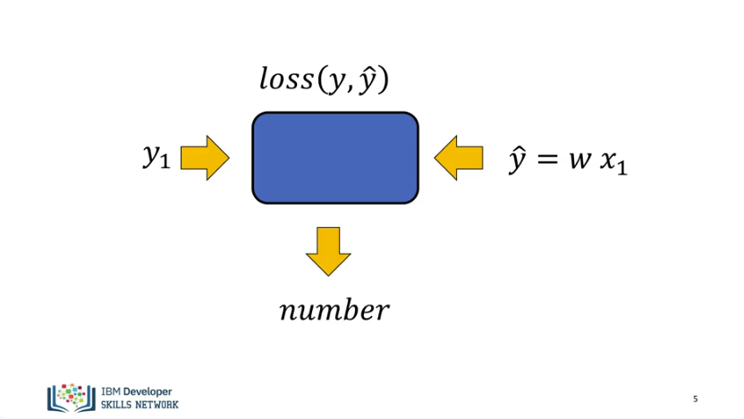

Generally loss is a function that takes your true input. And your predicted or estimated input. It then provides you with a number that lets you know how good your estimate is. It's helpful to think of the loss as a function of the parameter you would like to learn.

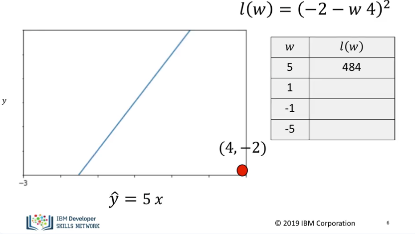
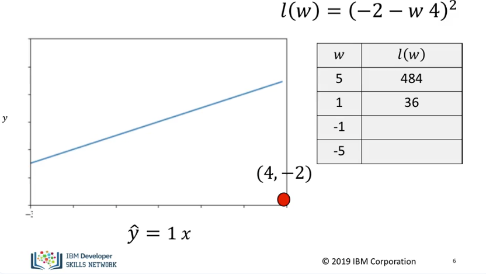
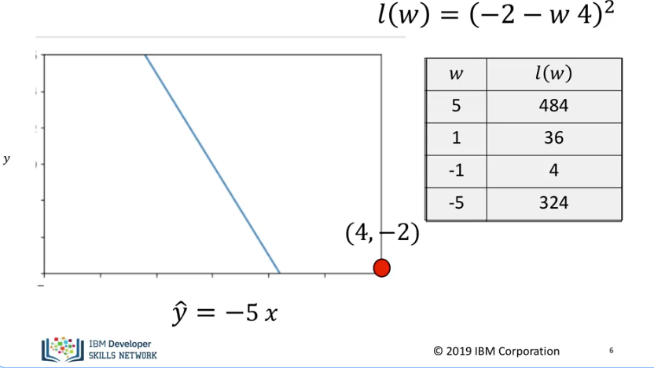

The table on the right shows some possible values of our parameter and the value of the loss generated. We see the line created for these values. We see the closer the line gets to the point the smaller the loss becomes. It's difficult to randomly get values, so let's come up with a more systematic way of minimizing the error. 

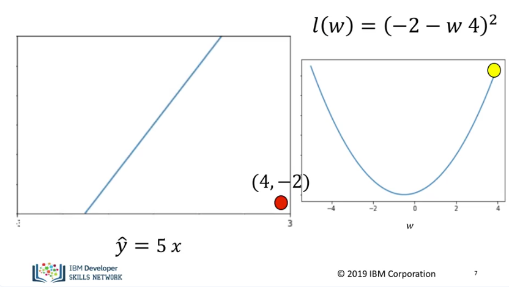

It’s helpful to display the loss function on the right, it's shaped like a concave bowl. This is referred to as the parameter space, the left contains different lines corresponding to different parameters. Selecting a slope of 5, we see the line is far from the data point. In the data space, the value of the loss function is relatively large. 

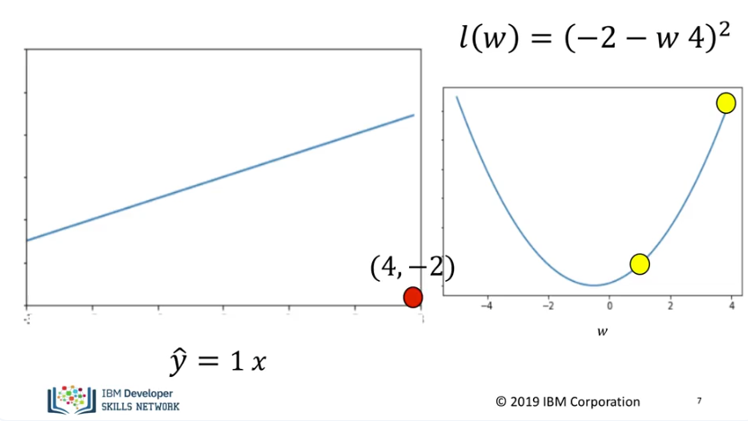

Selecting a slope of 1 we see the value for the loss is near the minimum of the parameter space. 

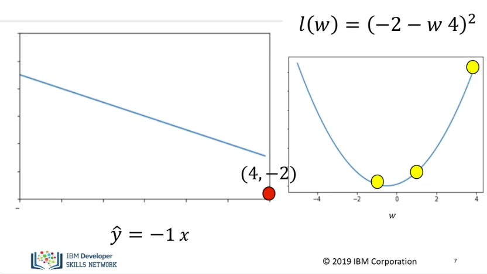

Selecting a slope of -1, the result gets much closer to the minimum of the loss function and we are much closer to the loss curve. 

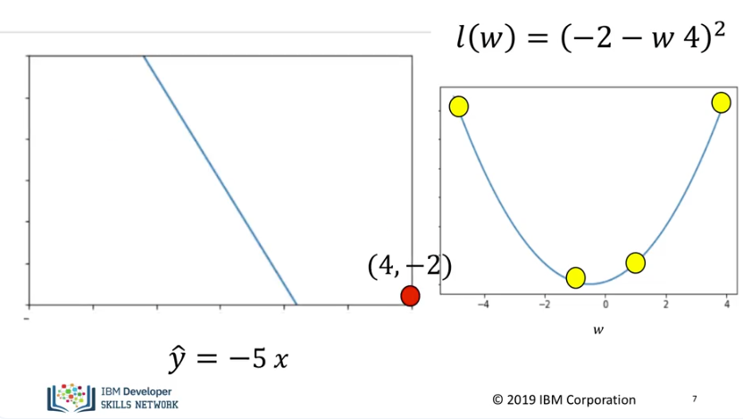

A slope of -5, we see we are at a much higher point on the loss curve and the line is much farther away from the data point. Therefore we would like to find the minimum value of the loss function.

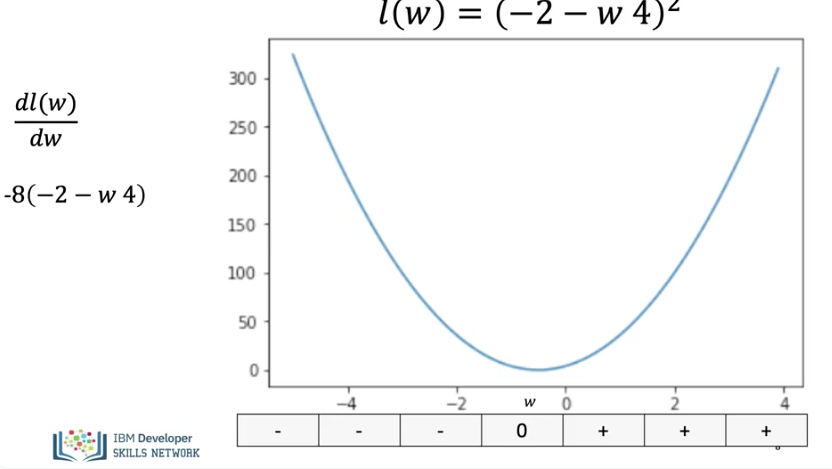

If we look at the derivative of the loss function, we see there is a negative value on the left side of the minimum and a positive value on the right side of the minimum. Finally, there is a zero at the minimum. 

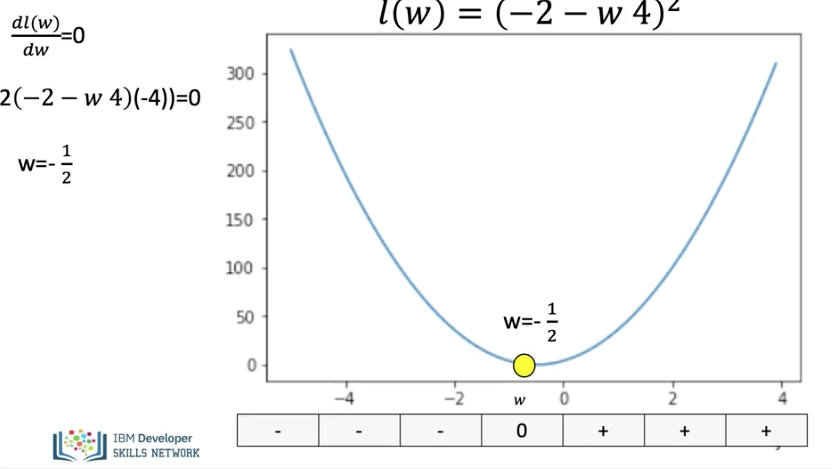

We can actually find the best value for the slope by setting the derivative = 0. We find the algebraic expression for the derivative. Do some algebra, and we get the best value for the slope, but we will not be able to do this for more complex deep learning models. But we can still use the derivative to help us find the minimum. 

