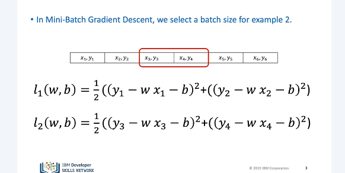
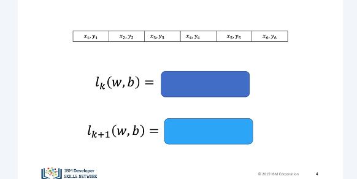
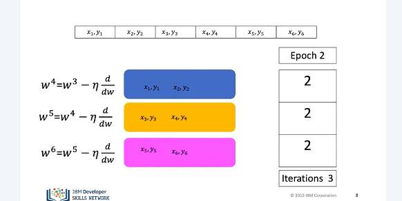
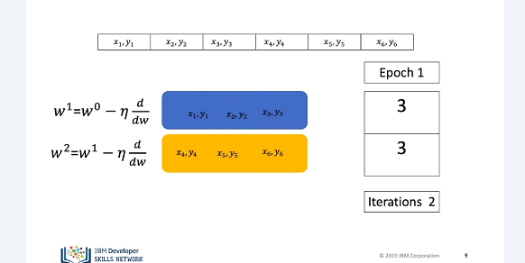
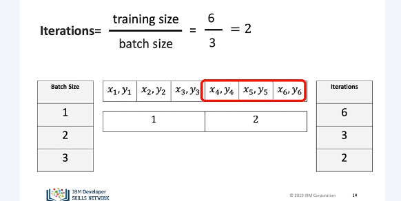
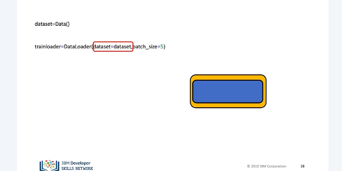
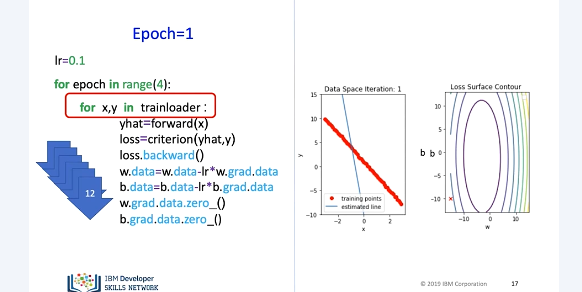
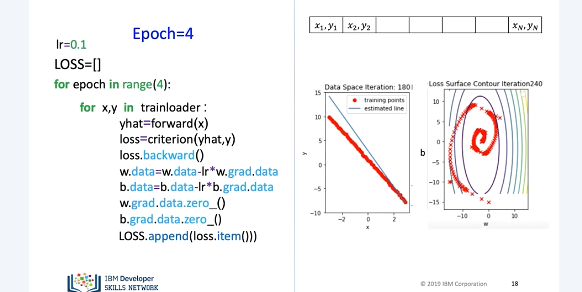
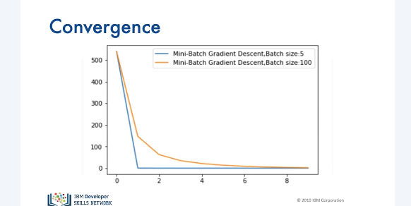

# Mini Batch Gradient Descent

It has many advantages. One important one that it will allow you to process larger datasets that you will not be able to fit into memory because it splits up the dataset into smaller samples. 

In this video, we will review basics of mini-batch gradient descent. Mini-batch gradient descent in PyTorch. In mini-batch gradient descent, we use a few samples at a time. For each iteration, it's helpful to think about it as if you are minimizing a mini-cost function for each iteration. 
For the first iteration, the cost is given by… For the second iteration, the cost function is given by… 

In mini-batch gradient descent, the relationship between batch size, number of iterations, and epochs is a little more complicated. Let's see a few examples. Let's start with a batch of two. Let's use the following boxes to represent the cost, or total loss. 

Let's do the first epoch. For the first iteration, we use the first two samples. For the second iteration, we use the second two samples. For the third iteration, we use the last two samples. Therefore, with a batch size of two, to complete one run, or epoch, through the data, it took three iterations. For the second epoch, it also takes three iterations.

In this case, our batch size is three. It only takes two iterations to complete one epoch. For the second epoch, it also takes two iterations. Let's see how we can determine the number of iterations for different batch sizes and epochs. 

To obtain the number of iterations, we simply divide the number of training examples by the batch size. Let's verify that. 
For a batch size of one, we get six iterations. We can verify this pictorially. We see for each iteration, we use one sample. For a batch size of two, it takes three iterations. We can verify this pictorially. Each iteration uses two samples. Finally, for a batch size of three, it takes two iterations. Again, we can verify this pictorially. 

In PyTorch, the process of mini-batch gradient descent is almost identical to stochastic gradient descent. We create a dataset object. We also create a dataloader object. In the parameter, we add the dataset object. We simply change the batch size parameter to the required batch size, in this case, five. 

For each iteration, the parameters are updated using five samples at a time. We repeat the process for the next set of samples. The estimated line changes, and the loss decreases. We repeat the process for four more epochs. 

We can store the loss value in a list and record it. We can use it to track our model progress. This can be thought of as an approximation to our cost. 

The following plot shows the cost or average loss with different batch sizes. We see that different batch sizes change how long it takes the cost to stop decreasing. This is called the convergence rate. 

## Lab

[https://github.com/bbearce/code-journal/blob/master/docs/notes/data_science/Coursera/pytorch/JupyterNotebooks/3%202_mini-batch_gradient_descent_v3.ipynb](https://github.com/bbearce/code-journal/blob/master/docs/notes/data_science/Coursera/pytorch/JupyterNotebooks/3%202_mini-batch_gradient_descent_v3.ipynb)