# Multiple Linear Regression Prediction

We will review Multiple Linear Regression in multiple dimensions and how to build these models using PyTorch. Linear is perhaps the most often used function in PyTorch and is key to building neural networks. In this video we will review: Linear regression in Multiple dimensions The problem of prediction, with respect to PyTorch will review the Class Linear and how to build custom Modules using nn.Modules.

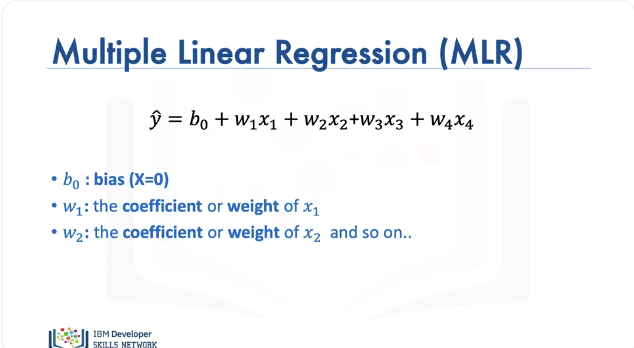

In Multiple linear regression we have multiple predictor variables, in this example we have 4 predictor variables, then:

* We have the bias
* w1: coefficient or the weight $x_1$
* w2: coefficient or the weight $x_2$ and so on.

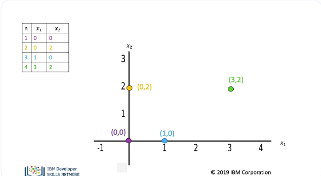

In general weight and bias are parameters of our model that we obtain via training. The table contains different samples of the predictor variables $x_1$ and $x_2$. The position of each point is placed on the 2D plane, colour coded accordingly. 

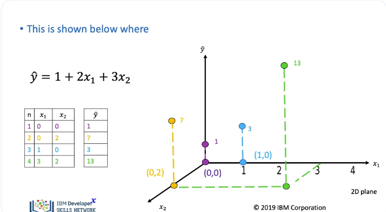

Each sample of the predictor variables $x_1$ and $x_2$ will be mapped to a new value $Y$. The new values of $Y$ (y-hat) are mapped in the vertical direction, with height proportional to the value that y-hat takes. 

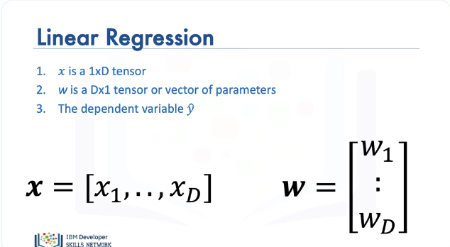

We can express the operation as a linear transformation, x is a 1 by D tensor or vector and is sometimes referred to as a feature, w is a D by 1 tensor or vector of parameters y-hat is the dependent variable. Using dot product we can express the equation in terms of vector operations.

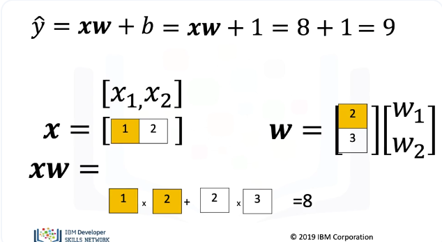

Consider the following example with the bias equal to one. We perform the dot product of x and w. This multiplies the first component of x and w. We then add the product of the second component of w and x. 
We then add the bias, the result is 9.

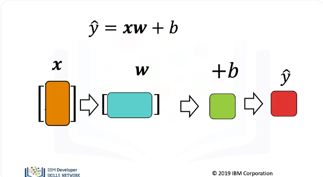

The most important property is the shape. The number of columns of x, Must be the same as the number of rows of w. We then add b We perform the dot product operation, then add b, the result is y-hat.

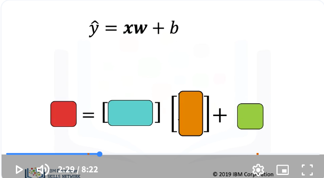

We will use the colour representation to help us to understand the relationship between the shape and the parameters.

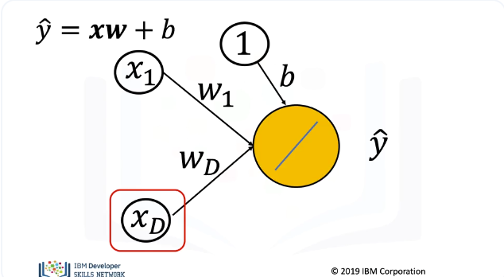

The following directed graph is also helpful to understand dot product. Nodes represent features and the edges represent parameters. These graphs will be used later to help us understand neural networks. In this case we have 2 dimensions. We can extend it to D arbitrary dimensions.

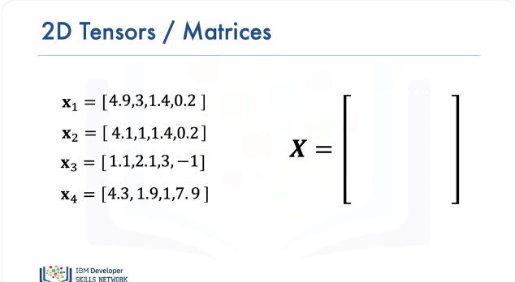

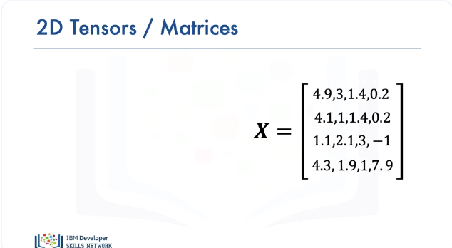

We can perform linear regression on multiple samples of tensors or vectors, in this case we have 4 samples, each sample has 4 columns. This is the output of a train loader object with 4 samples We have the tensor or Matrix represented with an upper-case X. The first sample corresponds to the first row in the matrix. The second sample corresponds to the 2nd row in the matrix, and so on.

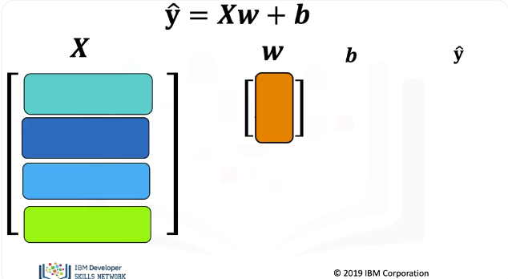

For multiple samples, the regression equation is a linear transformation. y and b are vectors or row tensors, one row for each sample. Let’s use the colour representation of dot product to get a better idea of what is going on. In the following image, each sample in the matrix X is represented by a different colour, essentially a different shade of green or blue. The parameter is orange. Notice that y-hat is bold as it’s a vector or multi dimensional tensor.

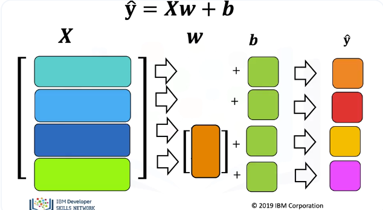

For the first sample we perform dot product with the first row of the matrix and the parameter. We then add the bias term, we then get the prediction for the first sample. For the second sample, we take the dot product of the parameter vector, we then add the bias term. We then get the prediction for the second sample. We repeat the process for the third and fourth sample, taking the dot product and adding the bias term, each sample produces a new prediction. 

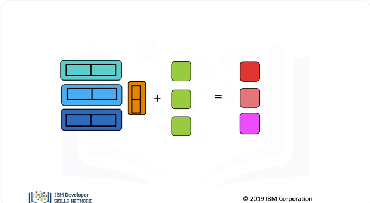

In summary, the number of columns of X and number of weights must be the same in this case too. Although there is only one bias, we add the bias term to each dot product using a vector in green. And there are as many predictions as samples or columns in X. 

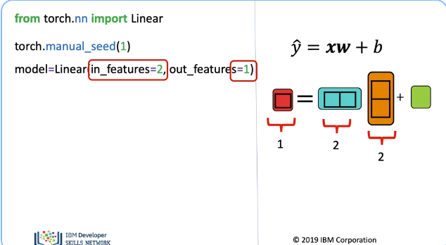

Let us use the useful class linear to perform linear regression in multiple dimensions. We import linear from the nn package. The weights and bias are randomly initialized, to get the same results every time we run the code, we use the random seed. We will learn how parameters are obtained in the next section. We will create a model object using the constructer linear, the parameter “in – features” is the size of each input sample or the number of columns, “out features” is size of each output sample, it essentially creates a linear function. The linear produces the following function. Let’s use the following diagram to represent the shape. The parameter “in features” represents the number of columns of x, and the number of model weights, “Out features” is the size of outputs in this case one. 

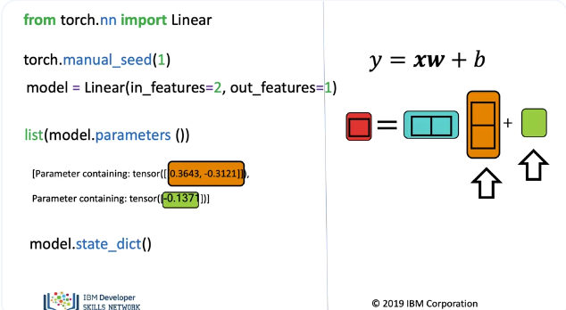

The method parameters, this gives us the model parameters; the first is the slope, the second the bias, we have to apply the Python function list to get an output as the method is lazily evaluated. We can see the linear weights and the bias. In the lab, you can also use the method “state dict”.

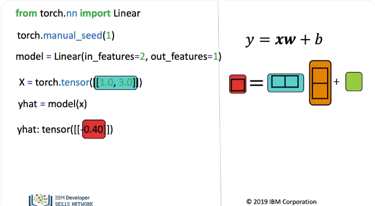

We can create an input tensor, this is a row vector or tensor with two columns. We apply the linear object, the result is a a 1x1 tensor corresponding to the prediction. 

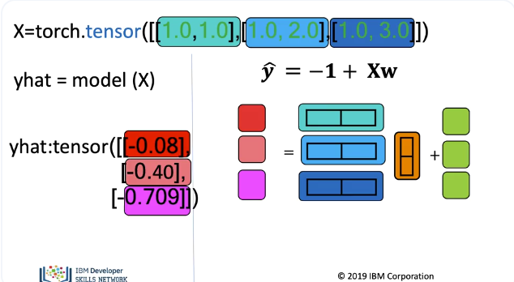

We can apply linear regression to multiple samples, we create a tensor where each row is a different sample. As before we use different colours to represent the different samples, we apply the model object, as we have three inputs, the output is three rows. The actual output is a tensor with three rows and one column, corresponding to the following colours.

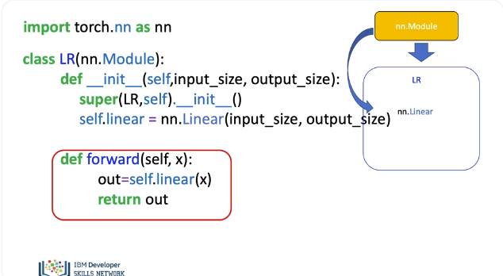

In PyTorch it is customary to make a custom module, in the context of regression it will behave almost identical to the linear object. This may seem a little redundant, but this will be required later when be build neural networks. Custom modules are classes; these classes are the subclass or children of the package “nn.Modules”. In this case, we call our custom module LR. We make the Class a child of “nn.Modules”. As a result, it inherits all the methods and attributes. In the object constructor, the argument is the size of the input and output, x and y respectively. We call the “super” in the constructor, this allows us to create objects from the package nn.Module inside the object, without initializing it explicitly. We can now create an object of type linear, the arguments are set via the object constructor We assign it to self.linear. We can now call the object of type linear anywhere in the class. We use the function forward to produce a prediction. We will not have to call the forward method explicitly, just use parenthesis as it behaves like the call method in Python.

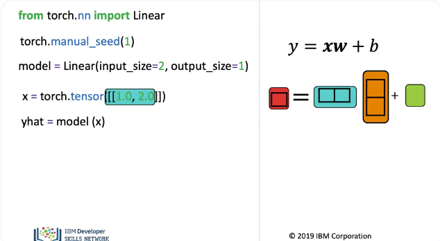

We create our custom module or class. This behaves like the linear object, the parameters “in-features” is two and “out-features” is one. This object behaves like linear, we can make a prediction for one sample. 

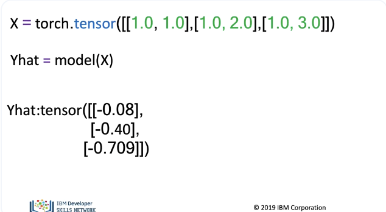

Or we can make predictions for multiple samples.

## Lab

[https://github.com/bbearce/code-journal/blob/master/docs/notes/data_science/Coursera/pytorch/JupyterNotebooks/4%201%20multiple_linear_regression_prediction_v2.ipynb](https://github.com/bbearce/code-journal/blob/master/docs/notes/data_science/Coursera/pytorch/JupyterNotebooks/4%201%20multiple_linear_regression_prediction_v2.ipynb)