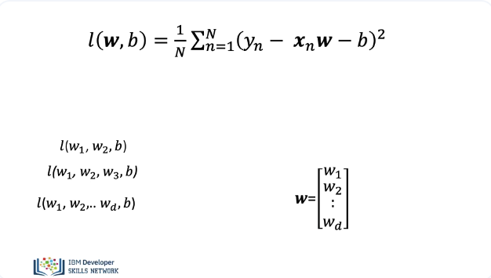
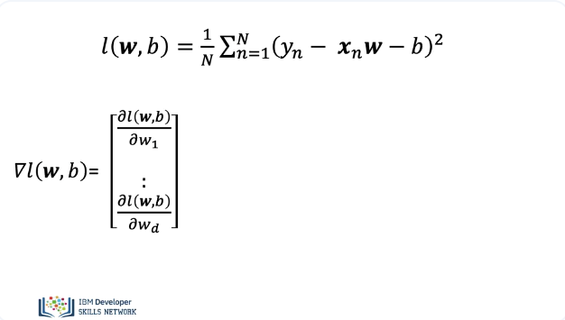
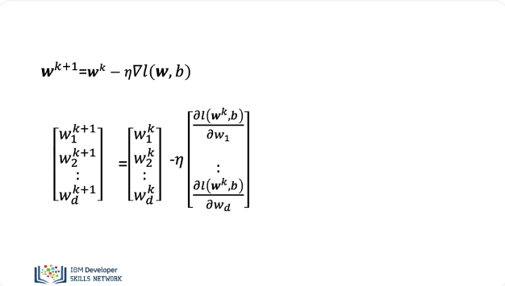
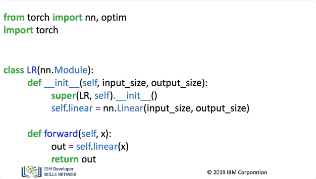
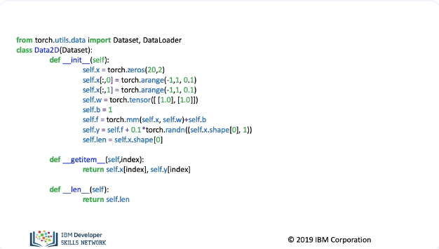
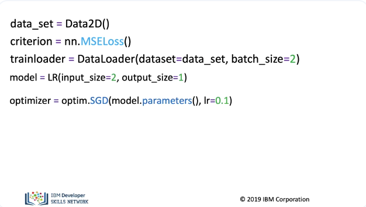
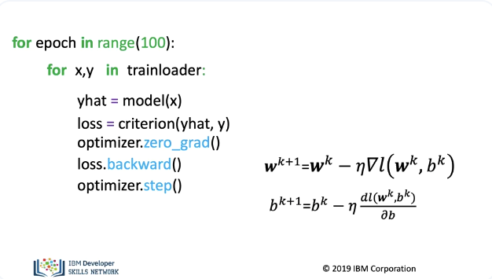
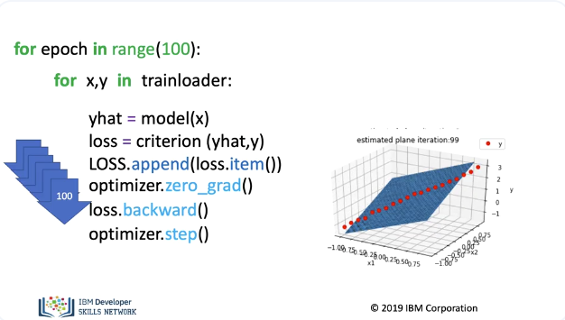

# Multiple Linear Regression Training

We will review the training procedure for Multiple Linear Regression. In this video, we will review: Cost function and gradient descent for Multiple Linear Regression, (don't worry the math is not that important). And how to calculate the cost function and perform gradient descent in PyTorch.

Mathematically the cost function looks like this: The dot product between w and x is a scaler. If x has dimensions of 2, then the cost function has three parameters: 2 weights and one bias. The weights are usually represented as a vector. If x has dimensions of 3 then the cost function has 4 parameters: 3 weights and one bias. This generalizes this for x of d dimensions. 

We have the gradient of the loss function with respect to the weights and the bias. 

The update for the equation is now a vector. The update the weights is given by the following equation. 

Now let us see how to train the model in PyTorch We import all the libraries we need. The linear class is the same one that we used in previous sections. 

We will use the Data2D class to create a dataset object. Our dataset had two dimensions for the input x. 

We then create a dataset object. We then create a criterion or cost function We create a train loader object with a batch size of two. When we create our model for the dimension, we specify two input features and one output and create an optimizer with a learning rate of 0.1.

Just like before. We loop through every epoch. We obtain the samples for each batch. We make a prediction. We calculate our loss or cost. We set the gradient to zero; this is due to the way PyTorch calculates the gradient. We differentiate the loss with respect to the parameters. We apply the method step; this updates the parameters. This performs the vector operation. 

We can represent the model as a plane essentially a line in two dimensions, the training data points are in red. We see the plane is not a good fit. We run 100 epochs. 

After the 100 epochs, we see the plane is much better at tracking the data points. Now let's see how to make multiple predictions.

## Lab

[https://github.com/bbearce/code-journal/blob/master/docs/notes/data_science/Coursera/pytorch/JupyterNotebooks/4%202%20multiple_linear_regression_training_v2.ipynb](https://github.com/bbearce/code-journal/blob/master/docs/notes/data_science/Coursera/pytorch/JupyterNotebooks/4%202%20multiple_linear_regression_training_v2.ipynb)