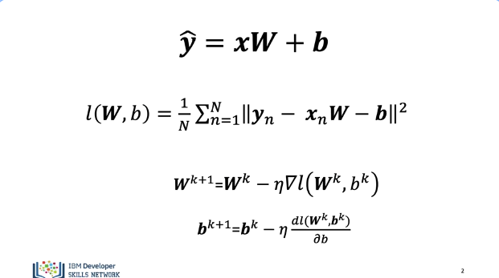
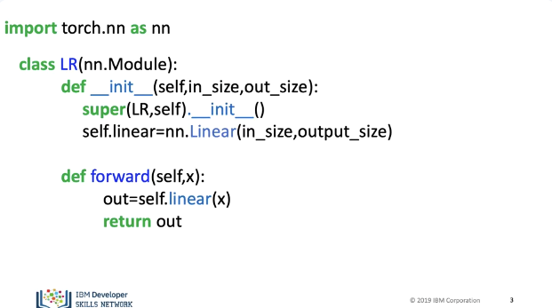
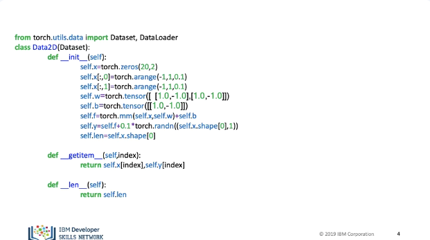
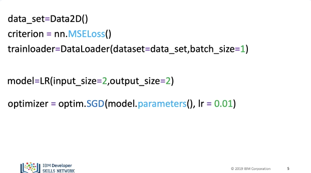
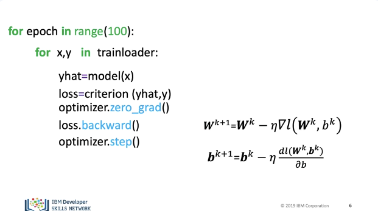

# Multiple Output Linear Regression Training

In this video we will review how to train a Linear Regression model with Multiple Outputs.  Our targets y and our predictions “yhat” are vectors. The cost function is the sum of squared distance between are prediction and our target y.  We update the weights, the only difference is W is a matrix, the bias terms are also vectors.

Our Custom module or class is the same. 

Our dataset class will generate two targets. 

We create a data set object, we then create a criterion or cost function,  We create a train loader object with a batch size of one.  When we create our model for the dimension we specify two input features and two outputs. Finally we have the optimizer.

Just like before, we have the first loop for every epoch.  We obtain the samples for each batch, we make a prediction, we calculate our loss or cost.  We set the gradient to zero; this is due to how PyTorch calculates the gradient.  We differentiate the loss with respect to the parameters. We apply the method step; this updates the parameters. This performs the vector operations. See the labs for the results.  

## Lab

[https://github.com/bbearce/code-journal/blob/master/docs/notes/data_science/Coursera/pytorch/JupyterNotebooks/4%204%20training_multiple_output_linear_regression.ipynb](https://github.com/bbearce/code-journal/blob/master/docs/notes/data_science/Coursera/pytorch/JupyterNotebooks/4%204%20training_multiple_output_linear_regression.ipynb)