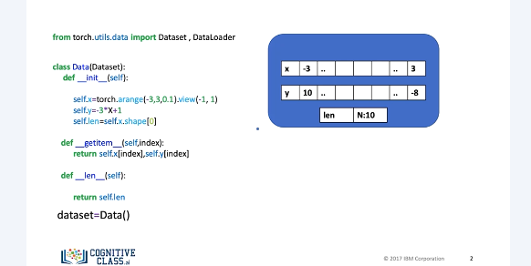
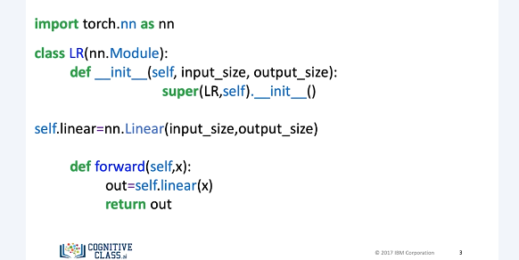
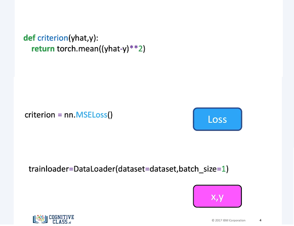
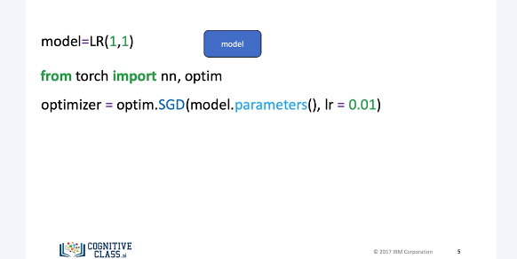
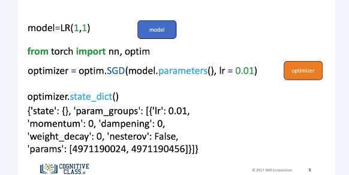
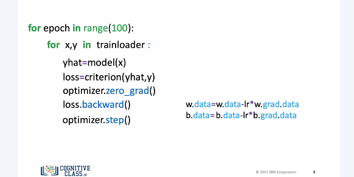
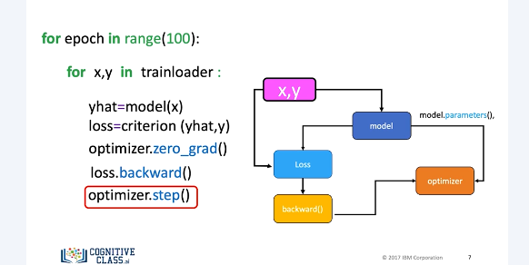

# Optimizer

This will be one of the standard ways to perform the different variations of gradient descent in PyTorch. You will use these steps in the rest of the course. 

We create a dataset object for handling our data. 

We create a custom module or class as a subclass of the nn.module. 

We then create a criterion or cost function, but for this case we will import the function from nn.modules. Let us represent it with the following block. We create a trainloader object. We will represent the samples with the following box. 

We create a model. We will represent it with the following box. We import OptmPkg for Torch. We construct an optimizer object, in this case SGD stands for Stochastic Gradient Descent. This will hold the current state and will update the parameters based on the computer gradients. You use the method parameters from the model object as an input to the constructor. This contains all the learnable parameters. There are also optimizer specific options, in this case the learning rate. Later on we will discuss more options. 

We will represent this optimizer with an orange box. Similar to the model, the optimizer has a state dictionary. We can access it as follows. The state underscore dict is a function that allows us to display and update the learnable parameters in our model. 

Just like before, we have the first loop for every epoch. We obtain the samples for each batch. We make a prediction. We calculate our loss or cost. We set the gradient to zero. This is due to how PyTorch calculates the gradient. We differentiate the loss with respect to the parameters. We apply the method step. This updates the parameters. The last two-line optimizer dot step essentially performs the following lines of code. This seems a little overkill now, but this will become more important as models get more complex. 

Let's use the following diagram to help clarify the process. When we created the optimizer object, we entered the learnable parameters via the parameters method. We loaded the samples. The model takes x to produce an estimate, y-hat. We will calculate the loss function. In the diagram, we represent this connection between the loss and the model with an edge. Loss backward differentiates the loss. Although we did not create an explicit connection between the optimizer and the loss, under the hood, optimizer dot step will update the parameters. We represent this link with an edge between backward, optimizer, and model. 
Most training in PyTorch will follow this methodology. 

