# Stochastic_Gradient_Descent.md

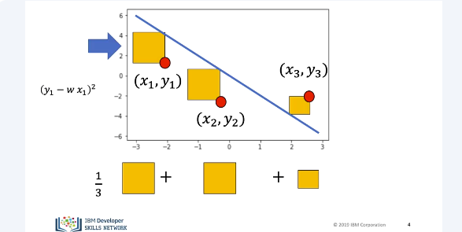

In batch gradient descent, we find the parameters w&b that minimize the entire cost function mathematically. But let's see what happens if we minimize the parameters with respect to just one sample, the line moves accordingly. 

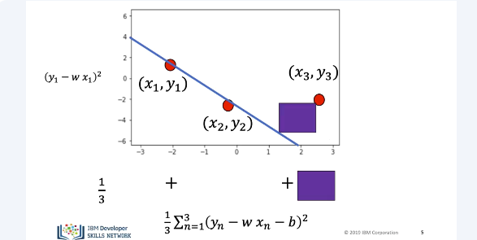

For this toy example, we see that minimizing the error with respect to the first sample, minimizes the error with respect to the second sample. Conversely, it will increase the error with respect to sample three. 

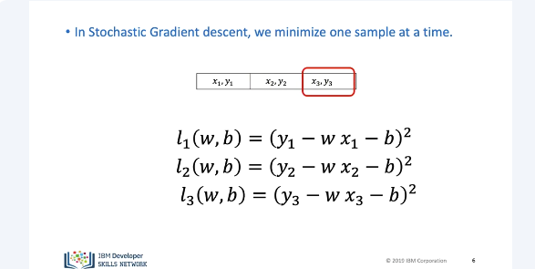

We are minimizing the cost or total loss, one sample at a time. Each time we go through the data, we call it an epoch. For the first iteration we use, the first sample the cost is. For the second iteration, we use the second sample, the cost is, and so on. We are actually approximating the cost or we are minimizing the sum or average loss of each sample. 

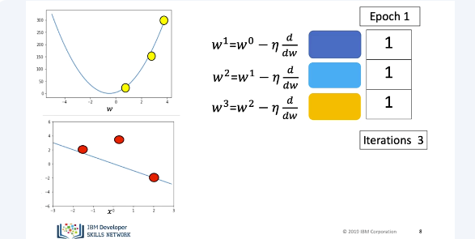

Let's use the following squares to represent the estimate of our cost function. Let's see an example with three samples, in this case one epoch. We will use the following point for the first iteration. We update the parameter and the loss or cost decreases. We see the line changes accordingly. We run the second iteration. We use the second sample, the value of the parameters change the loss decreases. The line changes accordingly. We run the next value of the iteration. We input the sample. This time the sample value is an outlier. This time, the loss increases. This is exhibited in the data space. This is sometimes a problem with Stochastic Gradient Descent. Value of the approximate cost will fluctuate rapidly with each iteration. 

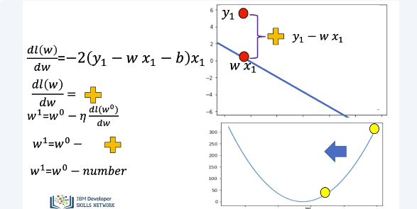

The expression for the gradient is similar to gradient descent. It is proportional to the data distance from the point. In this case, the value is positive. After going through each value, the parameter is updated. The parameter that decreases the loss is obtained. Let's see how to perform Stochastic Gradient Descent in PyTorch. 

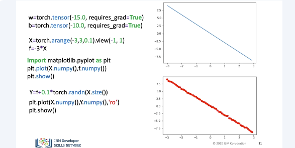

We will create a PyTorch Tensor. We set the option requires grad equal to true as we are going to learn the parameters via gradient descent. We'll create some X values, we'll map them to align with a slope of minus three. We use the view command to add a dimension. We plot the line, the method NumPy converts it to a numpy array. This allows us to use matplotlib. We add some random noise, we plot the data points. 

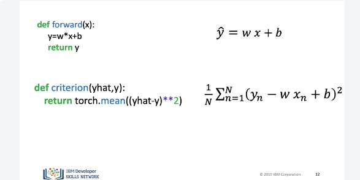

We define the forward function. This is the equation of the line. We define the criterion function or cost function. Again, we will refer to it as the loss to stay consistent with a PyTorch documentation. 

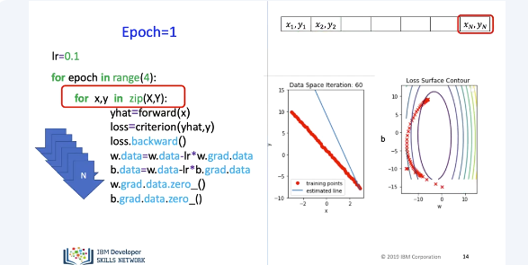

As before, we will run through the data multiple epochs. In this case, four. We can see the data space and parameter space. The first values for the slope and the buyers are located here. For the first epoch, we run through the first nested loop, we perform an update step using the first sample. For the next iteration, we use the second sample. We continue until each sample point has been used. We can overlay different parameter values over the contours. As the parameter value changes, the line gets closer to the data. 

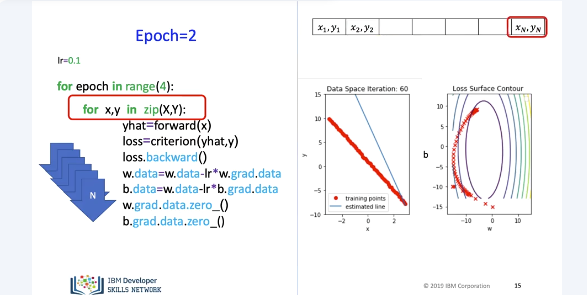

For the second epoch, we run through the first nested loop again. We perform an update step using the first sample. For the next iteration, we use the second sample. We continue until each sample point has been used. The parameter value has updated accordingly. Looking at the data space, we see the slope as well as the bias has changed. We can plot the different values of the parameters as points on the surface contours again. For the third epoch, we repeat the process. 

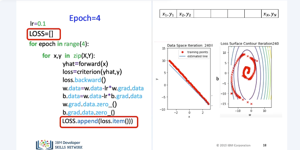

We repeat the process for the final epoch. We can store the loss value in a list and record it. We can use it to track our model progress. This can be thought of as an approximation to our costs. 

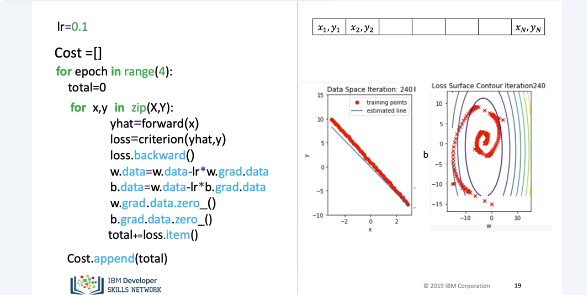

We can calculate the cost. We can store the cost in a list. We accumulate the loss in total. We can calculate the cost. We can store the cost in a list. We accumulate the loss in total. We append the cost value for each epoch. We reset the total after each epoch. Now let's see how to perform Stochastic Gradient Descent using the DataLoader. 

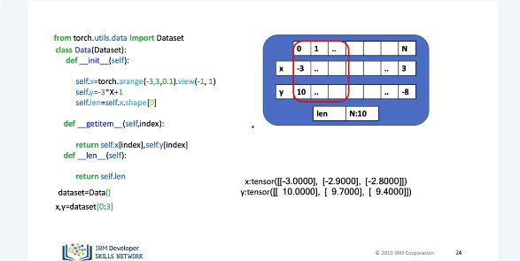

We can create an instance of our data set object. Let's use the box to represent the object and it's important data attributes. The values of our features and targets are created in the object constructor. We also store the number of samples in the attribute length. We can apply the function length L and it will return the length. The result is 10. Just like before, the square brackets with the index as arguments can return tensors. We can obtain the first element of the target and feature. The square bracket acts as a method call to the method get the item with the index as the argument. Let's put the index on our box representation. The result is a tensor, corresponding to that index. We can also apply slicing. We can obtain the first three samples of the target and features. Let's put the index on our box representation. The result is tensors corresponding to that index or return. We can iterate through the data set directly, but let's get used to using the DataLoader. 

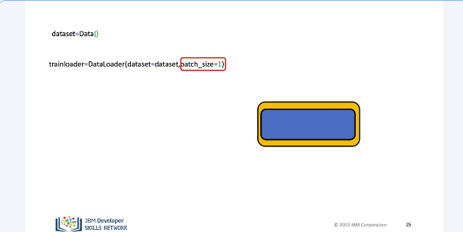

We can create a DataLoader object. We will represent it with a box. The input to the constructor is the data set object. The DataLoader extends the functionality of the data set class. We set the batch size equal to one. The result is a Python, the iterable trainloader. Let's compare the two codes. 

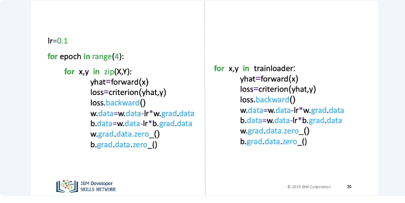

Instead of iteration through the tensors, we iterate through the DataLoader object.