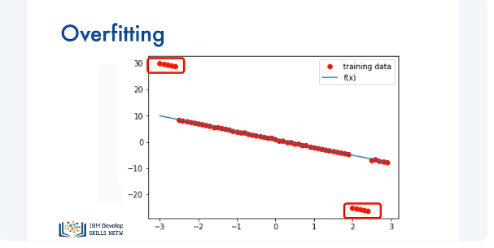
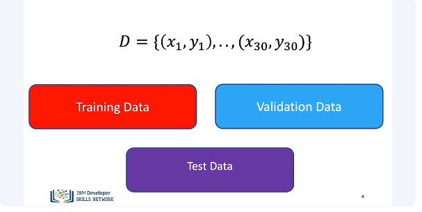
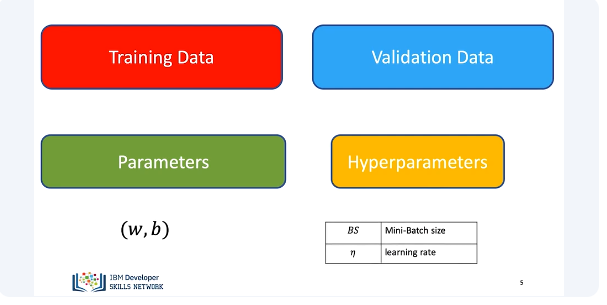
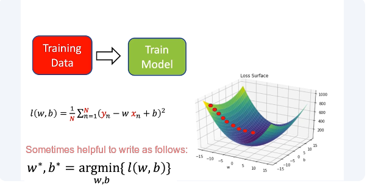
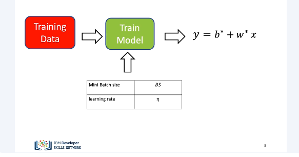
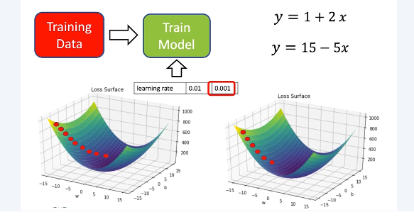
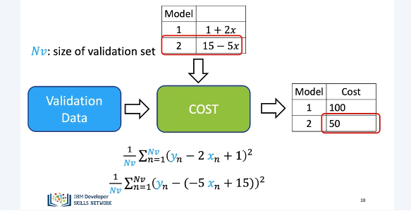
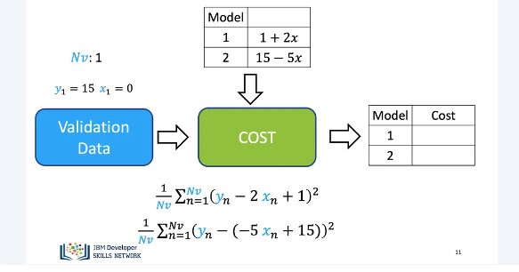
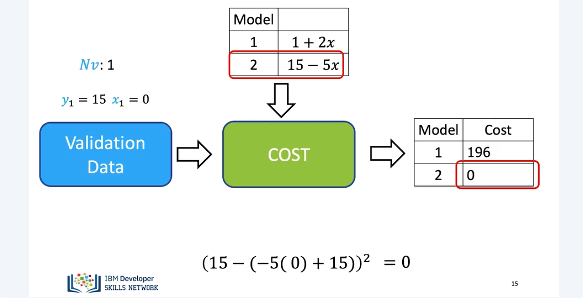
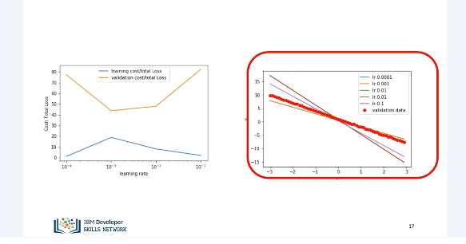

# Training, Validation and Test Split

Overfitting is when the model fits well within a limited set of data points, but does not fit data outside of that limited set, such as outliers. Overfitting usually occurs when complex model performs excellently on datasets it was trained on, but performs poorly on datasets that it wasn't trained on. Consider the following data points generated from the line in blue. 

The following points do not seem to come from the line. This could be an error or some kind of noise. We split the data into three parts. 
The training data, this is the data we were using before. We use a part of the dataset as validation data, and then we will use the remaining part of the dataset as test data. To find the best model, we randomly split the dataset up. The training data, this is the data we were using before. In this section, we will discuss validation data. We also have the test data. Test data shows how your model performs in the real world. We will not discuss this in the video. 

You use your training data to get model parameters via training. For example, you get your bias and slope parameters via gradient descent, but there are elements related to your model that you can change. These are called hyperparameters. For example, the learning rate and batch size. We are using training data to train the model. We have our cost or average loss function. 

We can view this as a surface. We minimize this via gradient descent. It's sometimes helpful to write it as follows. The superscript stars indicate the parameters that maximize the values. 

In order to train the model, we require several hyperparameters, including mini-batch size and learning rate. We use the validation data to determine these parameters. Let's see an example. 

We try two learning rates. We use the first learning rate. We train the model with gradient descent. We get our first model. We try a second learning rate. We train the second model. We obtain the second model. If we use the training data, we would select the second model.

We then calculate the validation data for both models to calculate the cost. Where NV is the size of a validation set, we calculate the cost for model 1. We calculate the cost for model 2. We select the model that minimized the cost on the validation error. 

Consider the following example with one sample of validation data. The value of Y1 is 15, and the value of X is 0. 

For one sample, the equation for the cost on the validation data simplifies to… We calculate the cost for the first model. We get a value of 196. We calculate the cost for the second model. In this case, the loss is 0. As result, we use the second model. 

In the following plot, we see the cost for the training data in blue and the validation data in orange. The X-axis represents the different learning rates. Using the test data does not always generate the best values. The following plot shows the validation data points in red and different line generated with different learning rates. We see the line that corresponds to the minimum cost for the test data is actually the one with the peak cost for the validation data. The line estimated using this learning rate is not a good fit for the generated points. We see the line that corresponds to the minimum of the validation data, actually the peak of the training loss. But the estimated line is much closer to the test data. Just a reminder that usually the split is done randomly, and in this case, we performed the split deterministically to make the results easier to understand. 