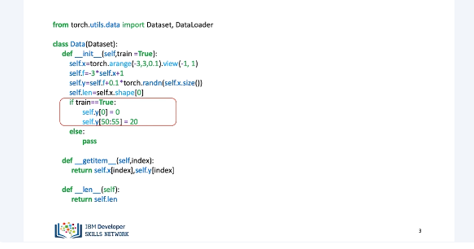
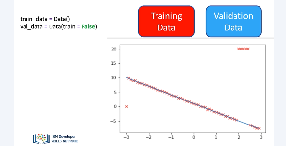
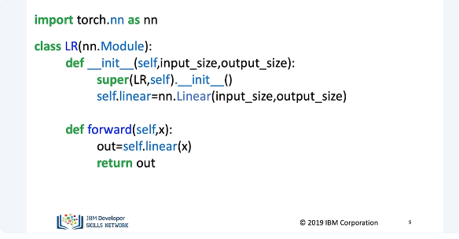
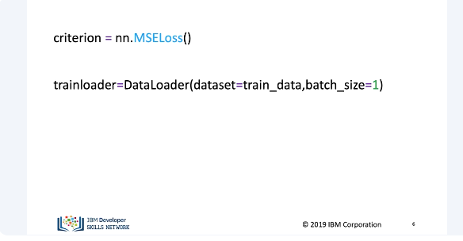
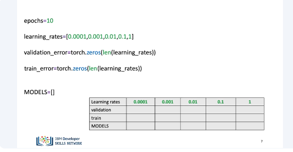
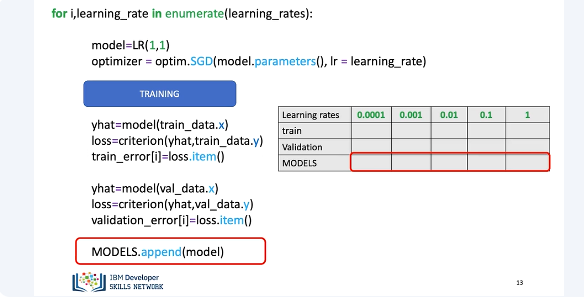
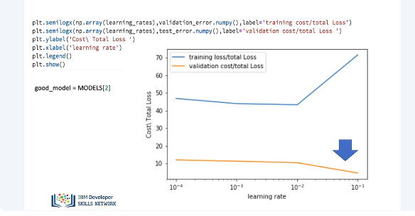
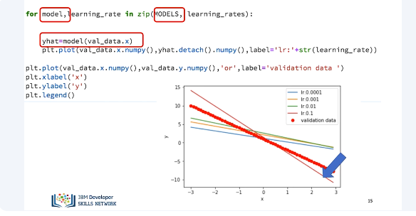

# Training, Validation and Test Split wiht PyTorch

In this video, we will learn how to train, validate, and save your model. This is a guide of one of the many ways you can train, validate, and save your model. Usually, we split up our data randomly, but to illustrate overfitting for such a simple model, we will split the data deterministically. We'll create some artificial data in a dataset class. The class will include the option to produce training data and validation data. The training data will include outliers. We would like to model the following linear function. 

We can see the outliers. We create two dataset objects, one that contains training data, and a second that contains validation data. Assume that the training data has the outliers. Overlay the training points in red over the function that generated the data. Address the outliers at x equals minus 3 and around x equals 2. 

We create a custom module for linear regression.

We create A, our criterion, with our trainloader object. 

In this example, we will only adjust the learning rate. We will use 10 epochs, create a list with different learning rates, and a tensor for the training and validating cost, or total loss. We will include the list Models, which stores the training model for every value of the learning rate. We will use the following table to help visualize everything. 

This will be our training loop. We discussed how to train the PyTorch way the last section, so let's represent those lines of code with a box. We will use the following table to help keep track of all the metrics.  The first for loop we enumerate through all the learning rates. Essentially, we are trying a different learning rate for each iteration. We will create a model and an optimizer. For each iteration, a new value of the optimizer will be created. We will make a prediction using the training data and calculate the loss and store it in train error. You may not be able to use dataset.x and dataset.y for a larger dataset. Here the item method from loss is to get the numerical value from the loss. We will make a prediction using the validation data and calculate the loss and store it in validation error. Just to note, ValData.x and ValData.y contains all our data. This step is only feasible if we can hold all our data in memory. In some cases, we will need to include a data loader loop through the data. We do this in other sections. We append the model into a list. 

We plot the training loss and validation loss for each learning rate. We see the third learning rate provides the smallest loss using the validation data. We can obtain the best model from the list as follows. 

We can iterate for each model in the list. We produce a prediction by using the validation data for each model. We can plot the data. We see the line with the optimal learning rate is nearest to all the points. There are other methods we can use to improve our model and we can even save the model. We'll cover this in the next set of videos. 

## Lab

[https://github.com/bbearce/code-journal/blob/master/docs/notes/data_science/Coursera/pytorch/JupyterNotebooks/3%206_training_and_validation_v3.ipynb](https://github.com/bbearce/code-journal/blob/master/docs/notes/data_science/Coursera/pytorch/JupyterNotebooks/3%206_training_and_validation_v3.ipynb)