# Cost

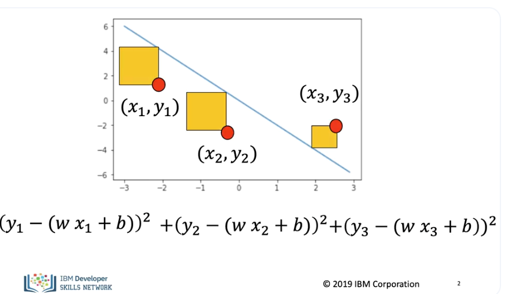

In this section, we will review the cost function. When using the cost. instead of determining the value of the parameter for one sample, we select parameters that minimize the loss value for multiple points. We can visualize it with little squares whose area is the same as the error. Sometimes we divide the error or loss by the number of samples in this case three. In this course we will use both the total as well as the average. 

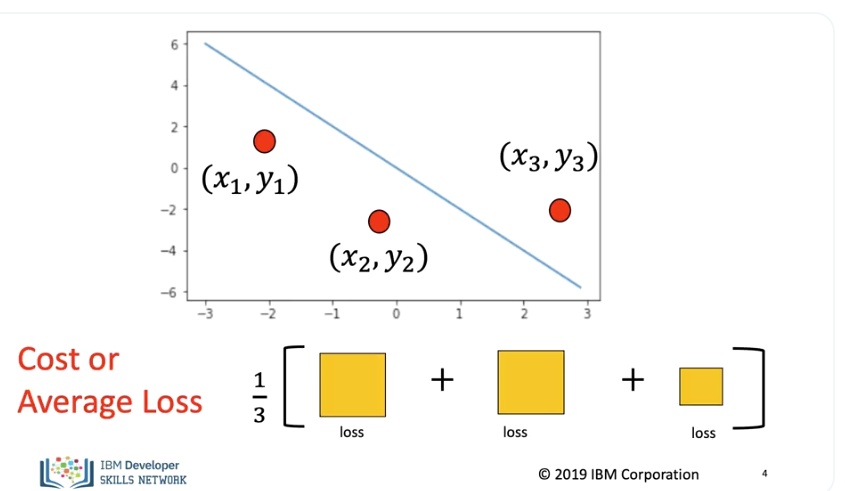

Pictorially we are just finding the average area of each square. The sum of the Loss is called the cost. Sometimes we will refer to is the total or average loss. As much of the PyTorch documentation refer to it as the loss function, we will use the symbol L.

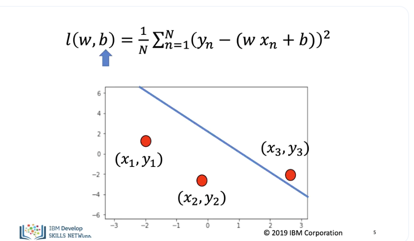

Symbolically the cost function looks like this, it is a function of the slope The slope controls the relationship between x and y, the bias, controls the horizontal offset. 

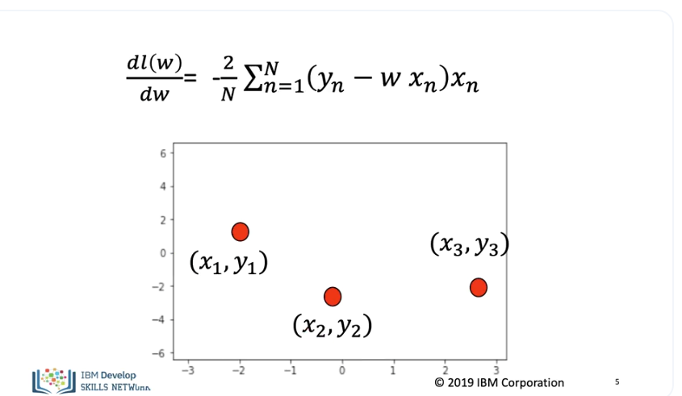

We can perform gradient descent on the cost function as, the derivative of the cost function is.

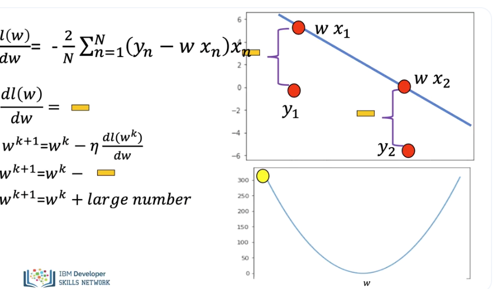

Let's see what happens when we take a few iterations of gradient descent with just the slope. Let's consider the example where we just examine the slope, taking the derivative we get the following expression, the actual line or data space is shown on the top right, the cost function with respect to the slope is on the bottom. Examining the value of the derivative we see its negative, as both samples produce the same negative numbers and we are adding them the magnitude is quite large. 

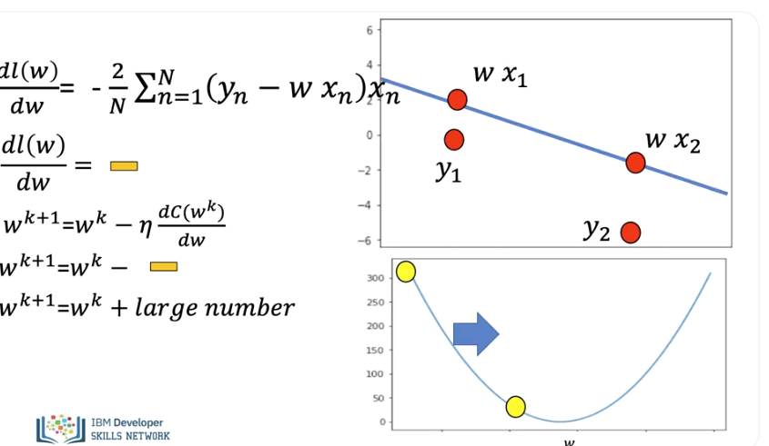

We see the parameters is updated by adding a large positive value, the loss is updated, and the jump is relatively large. As we update the parameter the predicted line gets closer to the data points. 

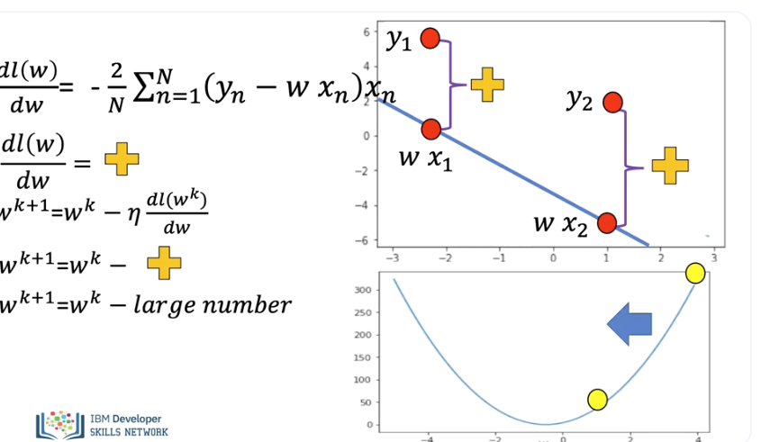

In this example, the data point is on the other side of the line. If we take the derivative we see the result is positive. As both samples produce the same positive numbers and we are adding them, the magnitude is quite large. Performing the update step we add a large negative number, therefore the parameter value decreases by a large amount.

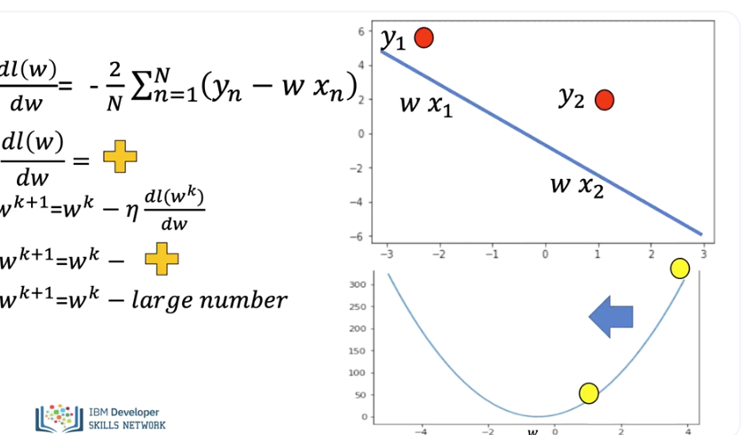

After the parameter value is updated the line gets closer.

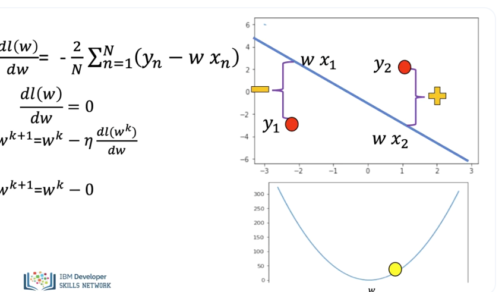

In this example one data point is on one side of the line and the other data point is on the other. As one value is positive and the second is negative the derivative is near zero.

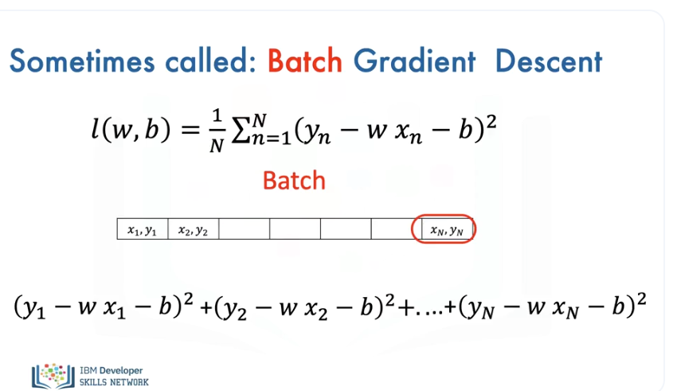

All the samples in the training set are called a Batch. As we use all the samples, we sometimes call gradient descent batch gradient descent.

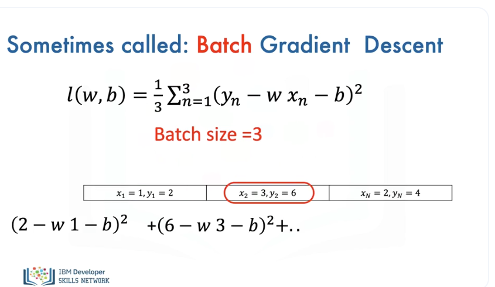

Here is an example where the batch size is three. 
We use all the samples to calculate the loss, then find the derivative. (Music) 