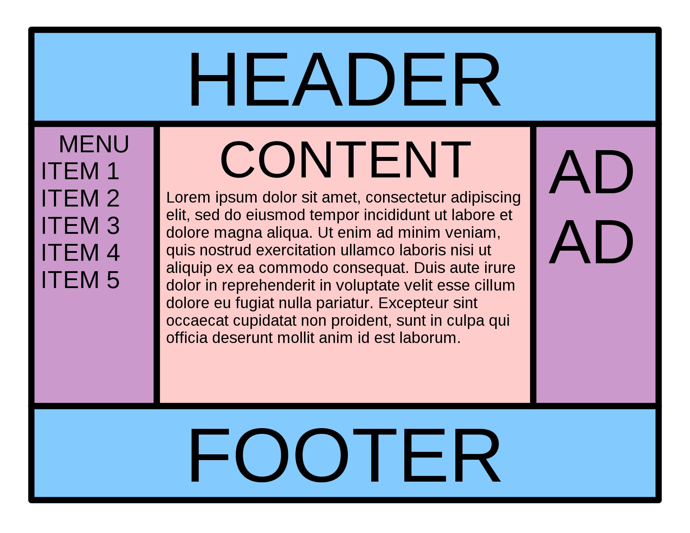
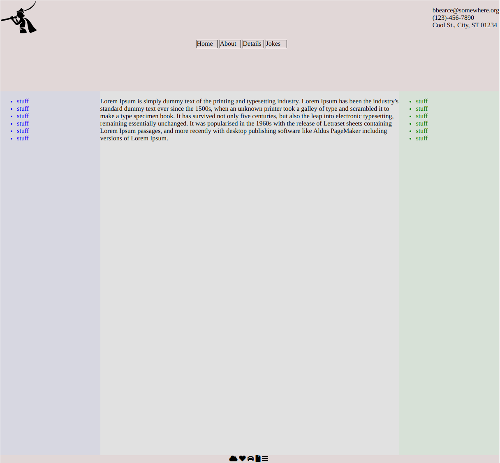

# The Holy Grail



This is apparently a hard style to make...or it was. Now that HTML5 and CSS3 have made lots of updates, styling is easier now. Below is my implementation of this layout.

*Preview*


Let's discuss what happened. First the HTML layout.
## HTML

```html
<!DOCTYPE html>
<html>
<head>
    <title>New Site</title>
    <link rel="stylesheet" href="./style.css"></link>
    <script src="https://kit.fontawesome.com/36fc456441.js" crossorigin="anonymous"></script>

</head>
<body>

    <header>
        <i class="fab fa-pied-piper-alt fa-5x"></i>

        <ul class=contact-info>
            <ul>bbearce@somewhere.org</ul>
            <ul>(123)-456-7890</ul>
            <ul>Cool St., City, ST 01234</ul>
        </ul>

        <ul class=navbar>
            <li>Home</li>
            <li>About</li>
            <li>Details</li>
            <li>Jokes</li>
        </ul>       
    </header>

    <div class=content>
        <div class=left>
            <ul>
                <li>stuff</li>
                <li>stuff</li>
                <li>stuff</li>
                <li>stuff</li>
                <li>stuff</li>
                <li>stuff</li>
            </ul>
        </div>

        <div class=middle>
            <p>Lorem Ipsum is simply dummy text of the printing and typesetting industry. Lorem Ipsum has been the industry's standard dummy text ever since the 1500s, when an unknown printer took a galley of type and scrambled it to make a type specimen book. It has survived not only five centuries, but also the leap into electronic typesetting, remaining essentially unchanged. It was popularised in the 1960s with the release of Letraset sheets containing Lorem Ipsum passages, and more recently with desktop publishing software like Aldus PageMaker including versions of Lorem Ipsum.</p>
        </div>

        <div class=right>
            <ul>
                <li>stuff</li>
                <li>stuff</li>
                <li>stuff</li>
                <li>stuff</li>
                <li>stuff</li>
                <li>stuff</li>
            </ul>            
        </div>
    </div>

    <footer>
        <div class=icons>
            <i class="fas fa-cloud"></i>
            <i class="fas fa-heart"></i>
            <i class="fas fa-car"></i>
            <i class="fas fa-file"></i>
            <i class="fas fa-bars"></i>
        </div>
    </footer>

    


    <script type="text/javascript" src="./javascript.js"></script>
</body>
</html>

```

## CSS

```html
```

## JS

```javascript
```