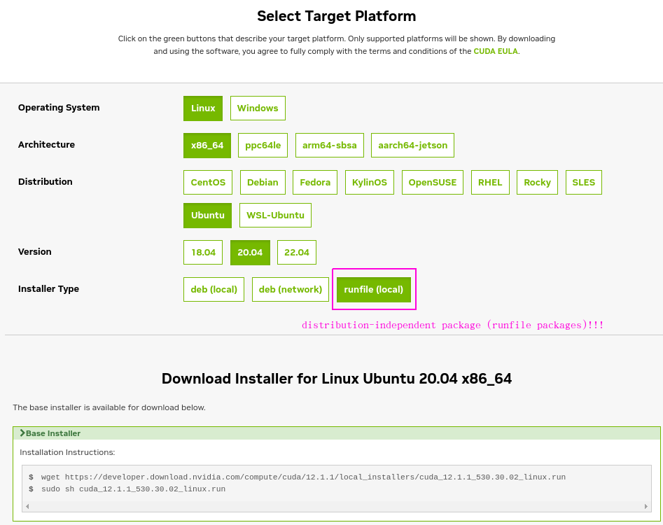

# NVIDIA and CUDA Setup

## Intro
This almost never works however I did just get it to work so I will document what worked.

First (extremely abbreviated):

1. Deployed Azure VM Type: ```Standard NC6s v3 (6 vcpus, 112 GiB memory)```  
2. Expanded the disk (not required but I ran out of room some how)  
```bash
azureuser@gpu-worker:~$ sudo sh cuda_12.1.1_530.30.02_linux.run

Extraction failed.
Ensure there is enough space in /tmp and that the installation package is not corrupt
Signal caught, cleaning up
```
so...you need more than ```8GB``` of disk space...

> Use these docs : [docs.nvidia.com](https://docs.nvidia.com/cuda/cuda-installation-guide-linux/index.html)


## Following along (summary)
### 2.1. Verify You Have a CUDA-Capable GPU
```bash
$ lspci | grep -i nvidia
0001:00:00.0 3D controller: NVIDIA Corporation GV100GL [Tesla V100 PCIe 16GB] (rev a1)
```

Sweet we are good to go.

### 2.2. Verify You Have a Supported Version of Linux
```bash
x86_64
DISTRIB_ID=Ubuntu
DISTRIB_RELEASE=20.04
DISTRIB_CODENAME=focal
DISTRIB_DESCRIPTION="Ubuntu 20.04.3 LTS"
NAME="Ubuntu"
VERSION="20.04.3 LTS (Focal Fossa)"
ID=ubuntu
ID_LIKE=debian
PRETTY_NAME="Ubuntu 20.04.3 LTS"
VERSION_ID="20.04"
HOME_URL="https://www.ubuntu.com/"
SUPPORT_URL="https://help.ubuntu.com/"
BUG_REPORT_URL="https://bugs.launchpad.net/ubuntu/"
PRIVACY_POLICY_URL="https://www.ubuntu.com/legal/terms-and-policies/privacy-policy"
VERSION_CODENAME=focal
UBUNTU_CODENAME=focal
```

Ubuntu 20+ is fairly new as of 06_02_2023 so I'd say yes...

### 2.3. Verify the System Has gcc Installed
```bash
$ gcc --version
gcc (Ubuntu 9.4.0-1ubuntu1~20.04.1) 9.4.0
Copyright (C) 2019 Free Software Foundation, Inc.
This is free software; see the source for copying conditions.  There is NO
warranty; not even for MERCHANTABILITY or FITNESS FOR A PARTICULAR PURPOSE.
```

I think I had to install but that was trivial:
```bash
$ sudo apt install gcc
```

### 2.4. Verify the System has the Correct Kernel Headers and Development Packages Installed

Under the ubuntu section I used:
```bash
sudo apt-get install linux-headers-$(uname -r)
```

### 2.5. Install MLNX_OFED
Totally skipped this section...don't know what it is...

### 2.6. Choose an Installation Method
Secret sauce right here!

...from docs

"The CUDA Toolkit can be installed using either of two different installation mechanisms: distribution-specific packages (RPM and Deb packages), or a ```distribution-independent package (runfile packages)```.

The distribution-independent package has the advantage of working across a wider set of Linux distributions, but does not update the distribution’s native package management system. The distribution-specific packages interface with the distribution’s native package management system. It is recommended to use the distribution-specific packages, where possible."

> I'm sure the distribution-specific is better but it wasn't working and I don't have time for that...so independent it is! A little confusing but the link you want is in the next section...so on we go.

### 2.7. Download the NVIDIA CUDA Toolkit

The NVIDIA CUDA Toolkit is available at [https://developer.nvidia.com/cuda-downloads](https://developer.nvidia.com/cuda-downloads).



Code of course:
```bash
wget https://developer.download.nvidia.com/compute/cuda/12.1.1/local_installers/cuda_12.1.1_530.30.02_linux.run

sudo sh cuda_12.1.1_530.30.02_linux.run
```


### YaY! it worked right?

Of course not. Why would such a good UI with filters let you down...2023 baby...life ain't perfect yet.........so here we go wtf...

#### First Error: Disk space
```bash
azureuser@gpu-worker:~$ sudo sh cuda_12.1.1_530.30.02_linux.run

Extraction failed.
Ensure there is enough space in /tmp and that the installation package is not corrupt
Signal caught, cleaning up
```

Add more space...

#### Second Error: Nouveau???

We have to disable the Nauveau kernel driver. Enter the [stack](https://askubuntu.com/questions/841876/how-to-disable-nouveau-kernel-driver). This discussion led to this link [NVIDIA developer zone](http://docs.nvidia.com/cuda/cuda-installation-guide-linux/index.html#pre-installation-actions). The thing is this is the same guide we've been using! However [WHAT YOU NEED](https://docs.nvidia.com/cuda/cuda-installation-guide-linux/index.html#disabling-nouveau) is much further down.

```bash
azureuser@gpu-worker:~$ cat /var/log/cuda-installer.log
[INFO]: Driver not installed.
[INFO]: Checking compiler version...
[INFO]: gcc location: /usr/bin/gcc

[INFO]: gcc version: gcc version 9.4.0 (Ubuntu 9.4.0-1ubuntu1~20.04.1) 

[INFO]: Initializing menu
[INFO]: nvidia-fs.setKOVersion(2.15.3)
[INFO]: Setup complete
[INFO]: Installing: Driver
[INFO]: Installing: 530.30.02
[INFO]: Executing NVIDIA-Linux-x86_64-530.30.02.run --ui=none --no-questions --accept-license --disable-nouveau --no-cc-version-check --install-libglvnd  2>&1
[INFO]: Finished with code: 256
[ERROR]: Install of driver component failed. Consult the driver log at /var/log/nvidia-installer.log for more details.
[ERROR]: Install of 530.30.02 failed, quitting


.... we need to look in  /var/log/nvidia-installer.log ....


azureuser@gpu-worker:~$ cat /var/log/nvidia-installer.log
nvidia-installer log file '/var/log/nvidia-installer.log'
creation time: Fri Jun  2 20:09:52 2023
installer version: 530.30.02

PATH: /tmp/makeself.qlAaARJl:/usr/local/sbin:/usr/local/bin:/usr/sbin:/usr/bin:/sbin:/bin:/snap/bin

nvidia-installer command line:
    ./nvidia-installer
    --ui=none
    --no-questions
    --accept-license
    --disable-nouveau
    --no-cc-version-check
    --install-libglvnd

Using built-in stream user interface
-> Detected 6 CPUs online; setting concurrency level to 6.
-> Installing NVIDIA driver version 530.30.02.
ERROR: The Nouveau kernel driver is currently in use by your system.  This driver is incompatible with the NVIDIA driver, and must be disabled before proceeding.  Please consult the NVIDIA driver README and your Linux distribution's documentation for details on how to correctly disable the Nouveau kernel driver.
WARNING: One or more modprobe configuration files to disable Nouveau are already present at: /usr/lib/modprobe.d/nvidia-installer-disable-nouveau.conf, /etc/modprobe.d/nvidia-installer-disable-nouveau.conf.  Please be sure you have rebooted your system since these files were written.  If you have rebooted, then Nouveau may be enabled for other reasons, such as being included in the system initial ramdisk or in your X configuration file.  Please consult the NVIDIA driver README and your Linux distribution's documentation for details on how to correctly disable the Nouveau kernel driver.
-> For some distributions, Nouveau can be disabled by adding a file in the modprobe configuration directory.  Would you like nvidia-installer to attempt to create this modprobe file for you? (Answer: Yes)
-> One or more modprobe configuration files to disable Nouveau have been written.  For some distributions, this may be sufficient to disable Nouveau; other distributions may require modification of the initial ramdisk.  Please reboot your system and attempt NVIDIA driver installation again.  Note if you later wish to re-enable Nouveau, you will need to delete these files: /usr/lib/modprobe.d/nvidia-installer-disable-nouveau.conf, /etc/modprobe.d/nvidia-installer-disable-nouveau.conf
ERROR: Installation has failed.  Please see the file '/var/log/nvidia-installer.log' for details.  You may find suggestions on fixing installation problems in the README available on the Linux driver download page at www.nvidia.com.
```

Notice lots of text about Nouveau...Let's fix that.

##### Section: 8.3.6. Ubuntu
Create a file at /etc/modprobe.d/blacklist-nouveau.conf with the following contents:

```bash
blacklist nouveau
options nouveau modeset=0
```

Regenerate the kernel initramfs:

```bash
sudo update-initramfs -u
```

I restarted the VM after that. Not sure if that was necessary but the stack over flow discussion recommended it.


```bash
azureuser@gpu-worker:~$ sudo sh cuda_12.1.1_530.30.02_linux.run
 Installation failed. See log at /var/log/cuda-installer.log for details.
```

Mother....!

#### Third Error: install make
```bash
azureuser@gpu-worker:~$ cat /var/log/cuda-installer.log
...

[ERROR]: Install of driver component failed. Consult the driver log at /var/log/nvidia-installer.log for more details.
[ERROR]: Install of 530.30.02 failed, quitting


azureuser@gpu-worker:~$ cat /var/log/nvidia-installer.log
...

ERROR: Unable to find the development tool `make` in your path; please make sure that you have the package 'make' installed.  If make is installed on your system, then please check that `make` is in your PATH.
ERROR: Installation has failed.  Please see the file '/var/log/nvidia-installer.log' for details.  You may find suggestions on fixing installation problems in the README available on the Linux driver download page at www.nvidia.com.
```

Ok this one is easy:
```bash
azureuser@gpu-worker:~$ sudo apt install make
```

#### Success!

```bash
azureuser@gpu-worker:~$ sudo sh cuda_12.1.1_530.30.02_linux.run
===========
= Summary =
===========

Driver:   Installed
Toolkit:  Installed in /usr/local/cuda-12.1/

Please make sure that
 -   PATH includes /usr/local/cuda-12.1/bin
 -   LD_LIBRARY_PATH includes /usr/local/cuda-12.1/lib64, or, add /usr/local/cuda-12.1/lib64 to /etc/ld.so.conf and run ldconfig as root

To uninstall the CUDA Toolkit, run cuda-uninstaller in /usr/local/cuda-12.1/bin
To uninstall the NVIDIA Driver, run nvidia-uninstall
Logfile is /var/log/cuda-installer.log

```

As they suggest add paths to PATH and LD_LIBRARY_PATH. Add this to ~/.bashrc
```bash
# cuda
export PATH=/usr/local/cuda-12.1/bin:$PATH
export LD_LIBRARY_PATH=/usr/local/cuda-12.1/lib64:$LD_LIBRARY_PATH
```

```bash
azureuser@gpu-worker:~$ nvidia-smi
Fri Jun  2 20:24:58 2023       
+---------------------------------------------------------------------------------------+
| NVIDIA-SMI 530.30.02              Driver Version: 530.30.02    CUDA Version: 12.1     |
|-----------------------------------------+----------------------+----------------------+
| GPU  Name                  Persistence-M| Bus-Id        Disp.A | Volatile Uncorr. ECC |
| Fan  Temp  Perf            Pwr:Usage/Cap|         Memory-Usage | GPU-Util  Compute M. |
|                                         |                      |               MIG M. |
|=========================================+======================+======================|
|   0  Tesla V100-PCIE-16GB            Off| 00000001:00:00.0 Off |                  Off |
| N/A   22C    P0               34W / 250W|      0MiB / 16384MiB |      0%      Default |
|                                         |                      |                  N/A |
+-----------------------------------------+----------------------+----------------------+
                                                                                         
+---------------------------------------------------------------------------------------+
| Processes:                                                                            |
|  GPU   GI   CI        PID   Type   Process name                            GPU Memory |
|        ID   ID                                                             Usage      |
|=======================================================================================|
|  No running processes found                                                           |
+---------------------------------------------------------------------------------------+
```
