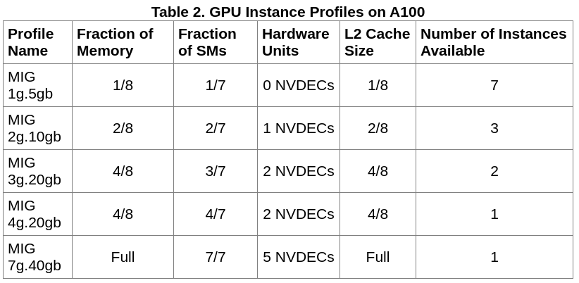
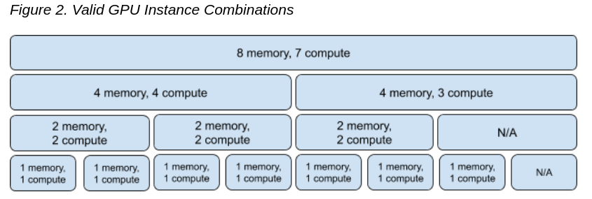
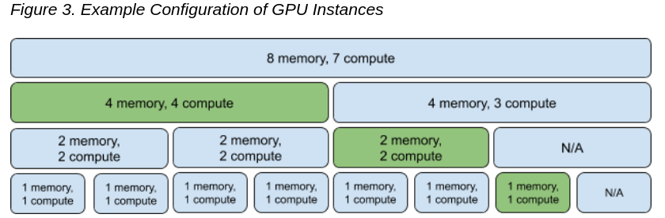
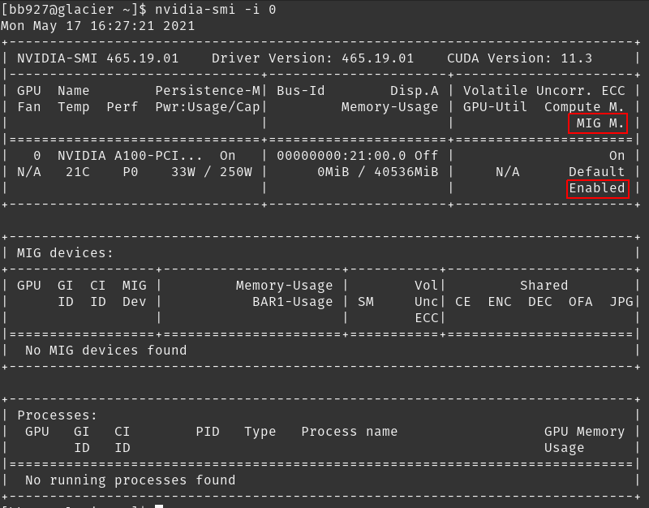
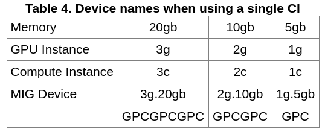

# A100 Multi-Instance GPU

[Source](https://docs.nvidia.com/datacenter/tesla/mig-user-guide/index.html)

## Intro

Terminology:

* SM: A streaming multiprocessor (SM) executes compute instructions on the GPU. There are 7.
* GPU Engine: A GPU engine is what executes work on the GPU. The most commonly used engine is the Compute/Graphics engine that executes the compute instructions.
* GPU Slice: A GPU slice is the smallest fraction of the GA100 GPU that combines a single GPU memory slice and a single GPU SM slice.
* GPU Instance (GI): A GPU Instance (GI) is a combination of GPU slices and GPU engines (DMAs, NVDECs, etc.).
* Compute Instance: A GPU instance can be subdivided into multiple compute instances. A Compute Instance (CI) contains a subset of the parent GPU instance’s SM slices and other GPU engines (DMAs, NVDECs, etc.). The CIs share memory and engines.


Configurations available:


All configuration combinations:


Example Configuration:


Things to consider:

* MIG functionality is provided as part of the NVIDIA GPU driver starting with the CUDA 11.0 / R450 release.
* No GPU to GPU P2P (either PCIe or NVLink) is supported
* CUDA applications treat a Compute Instance and its parent GPU Instance as a single CUDA device.

Currently, the NVIDIA kernel driver exposes its interfaces through a few system-wide device nodes. Each physical GPU is represented by its own device node - e.g. nvidia0, nvidia1 etc. This is shown below for a 2-GPU system.

```     
    /dev
    ├── nvidiactl
    ├── nvidia-modeset
    ├── nvidia-uvm
    ├── nvidia-uvm-tools
    ├── nvidia-nvswitchctl
    ├── nvidia0
    └── nvidia1  
```

## Getting Started

### Turning on MIG and inspecting the GPUs
MIG can be managed programmatically using NVIDIA Management Library (NVML) APIs or its command-line-interface, nvidia-smi. Note that for brevity, some of the nvidia-smi output in the following examples may be cropped to showcase the relevant sections of interest.

Summary for each GPU:
> By default, MIG mode is not enabled on the NVIDIA A100. For example, running nvidia-smi shows that MIG mode is disabled:

GPU 1:
```
nvidia-smi -i 0
```

GPU 2:
```
nvidia-smi -i 1
```

MIG mode can be enabled on a per-GPU basis with the following command: nvidia-smi -i <GPU IDs> -mig 1
> Need ```sudo```. MIG mode can be enabled on a per-GPU basis with the following command: nvidia-smi -i <GPU IDs> -mig 1. The GPUs can be selected using comma separated GPU indexes, PCI Bus Ids or UUIDs. If no GPU ID is specified, then MIG mode is applied to all the GPUs on the system. Note that MIG mode (Disabled or Enabled states) is persistent across system reboots.

```
nvidia-smi -i 0 -mig 1
```



### List GPU Instances\Profiles

```
sudo nvidia-smi mig -lgip
```
Ex:
```
[bb927@glacier ~]$ sudo nvidia-smi mig -lgip
Your password [ bb927 ] : 
+--------------------------------------------------------------------------+
| GPU instance profiles:                                                   |
| GPU   Name          ID    Instances   Memory     P2P    SM    DEC   ENC  |
|                           Free/Total   GiB              CE    JPEG  OFA  |
|==========================================================================|
|   0  MIG 1g.5gb     19     7/7        4.75       No     14     0     0   |
|                                                          1     0     0   |
+--------------------------------------------------------------------------+
|   0  MIG 2g.10gb    14     3/3        9.75       No     28     1     0   |
|                                                          2     0     0   |
+--------------------------------------------------------------------------+
|   0  MIG 3g.20gb     9     2/2        19.62      No     42     2     0   |
|                                                          3     0     0   |
+--------------------------------------------------------------------------+
|   0  MIG 4g.20gb     5     1/1        19.62      No     56     2     0   |
|                                                          4     0     0   |
+--------------------------------------------------------------------------+
|   0  MIG 7g.40gb     0     1/1        39.50      No     98     5     0   |
|                                                          7     1     1   |
+--------------------------------------------------------------------------+
```

List the possible placements available using the following command:
```
sudo nvidia-smi mig -lgipp
```
Ex:
```
[bb927@glacier ~]$ sudo nvidia-smi mig -lgipp
GPU  0 Profile ID 19 Placements: {0,1,2,3,4,5,6}:1
GPU  0 Profile ID 14 Placements: {0,2,4}:2
GPU  0 Profile ID  9 Placements: {0,4}:4
GPU  0 Profile ID  5 Placement : {0}:4
GPU  0 Profile ID  0 Placement : {0}:8
```
> The command shows that the user can create two instances of type 3g.20gb (profile ID 9) or seven instances of 1g.5gb (profile ID 19).

### Create GPU Instances

Before starting to use MIG, the user needs to create GPU instances using the ```-cgi``` option. One of three options can be used to specify the instance profiles to be created:

1. Profile ID (e.g. 9, 14, 5)
2. Short name of the profile (e.g. 3g.20gb
3. Full profile name of the instance (e.g. MIG 3g.20gb)

Once the GPU instances are created, one needs to create the corresponding Compute Instances (CI). By using the ```-C``` option, ```nvidia-smi``` creates these instances.

> When only a single CI is created (that consumes the entire compute capacity of the GI), then the CI sizing is implied in the device name. ```-C``` is the same as ```--default-compute-instance``` and does not require a value.



> Each GI can be further sub-divided into multiple CIs as required by users depending on their workloads. The table below highlights what the name of a MIG device would look like in this case. The example shown is for subdividing a 3g.20gb device into a set of sub-devices with different Compute Instance slice counts.


> Also note that, the created MIG devices are not persistent across system reboots. Thus, the user or system administrator needs to recreate the desired MIG configurations if the GPU or system is reset. 


Example:

```
sudo nvidia-smi mig -cgi 9,3g.20gb -C -i 0
Successfully created GPU instance ID  2 on GPU  0 using profile MIG 3g.20gb (ID  9)
Successfully created compute instance ID  0 on GPU  0 GPU instance ID  2 using profile MIG 3g.20gb (ID  2)
Successfully created GPU instance ID  1 on GPU  0 using profile MIG 3g.20gb (ID  9)
Successfully created compute instance ID  0 on GPU  0 GPU instance ID  1 using profile MIG 3g.20gb (ID  2)
```

List the GPU Instances:
```
sudo nvidia-smi mig -lgi
```

List the GPU Compute Instances:
```
sudo nvidia-smi mig -lci
```

### Destroy GPU Instances

You can specify GPU instances to delete ```-dci```
```
sudo nvidia-smi mig -dgi -gi 1,2 -i 0
Successfully destroyed GPU instance ID  1 from GPU  0
Successfully destroyed GPU instance ID  2 from GPU  0
```
Or Compute Instances ```-dgi```
```
sudo nvidia-smi mig -dci -ci 0 -gi 1,2 -i 0
```