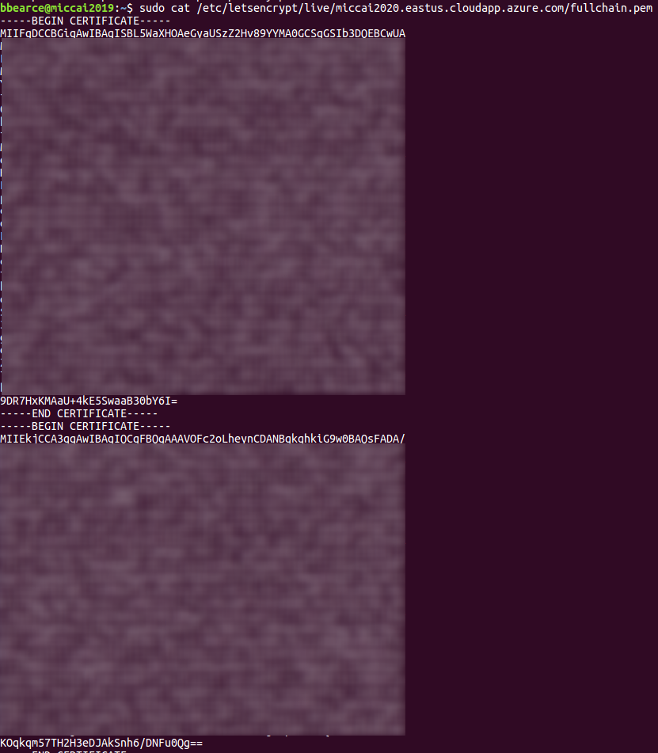
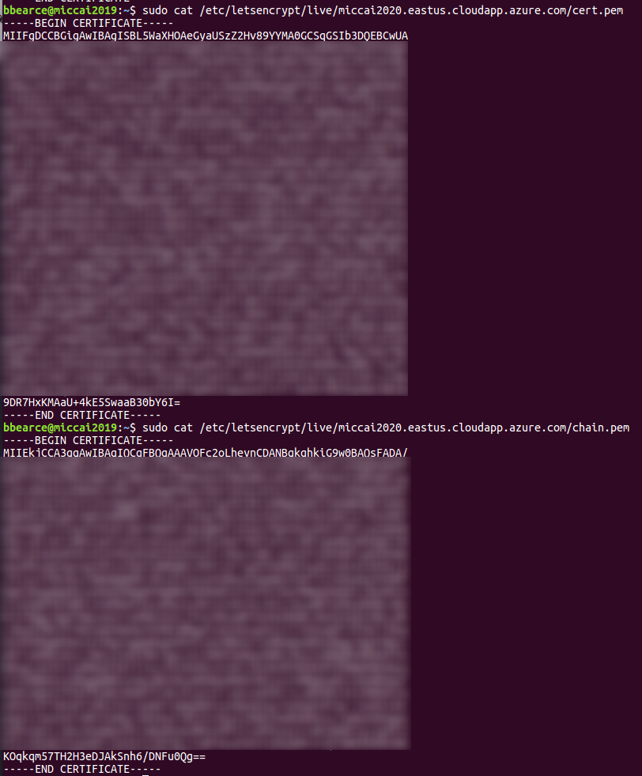
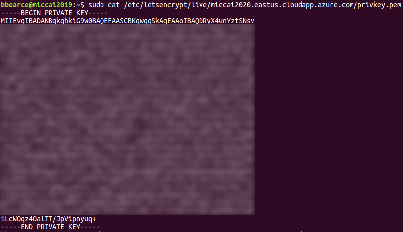

# TLS Security

> Courtesy of [cloudfare](https://www.cloudflare.com/learning/ssl/transport-layer-security-tls/)

## Summary

### What is Transport Layer Security (TLS)?
Transport Layer Security, or TLS, is a widely adopted security protocol designed to facilitate privacy and data security for communications over the Internet. A primary use case of TLS is encrypting the communication between web applications and servers, such as web browsers loading a website. TLS can also be used to encrypt other communications such as email, messaging, and voice over IP (VOIP). In this article we will focus on the role of TLS in web application security.

TLS was proposed by the Internet Engineering Task Force (IETF), an international standards organization, and the first version of the protocol was published in 1999. The most recent version is TLS 1.3, which was published in 2018.

### What’s the difference between TLS and SSL?
TLS evolved from a previous encryption protocol called Secure Socket Layer (SSL), which was developed by Netscape. TLS version 1.0 actually began development as SSL version 3.1, but the name of the protocol was changed before publication in order to indicate that it was no longer associated with Netscape. Because of this history, the terms TLS and SSL are sometimes used interchangeably.

### What’s the difference between TLS and HTTPS?
HTTPS is an implementation of TLS encryption on top of the HTTP protocol, which is used by all websites as well as some other web services. Any website that uses HTTPS is therefore employing TLS encryption.

### Why should you use TLS?
TLS encryption can help protect web applications from attacks such as data breaches, and DDoS attacks. Additionally, TLS-protected HTTPS is quickly becoming a standard practice for websites. For example, the Google Chrome browser is cracking down on non-HTTPS sites, and everyday Internet users are starting to become more wary of websites that don’t feature the HTTPS padlock icon.

### How does TLS work?
TLS can be used on top of a transport-layer security protocol like TCP. There are three main components to TLS: Encryption, Authentication, and Integrity.

* **Encryption:** hides the data being transferred from third parties.  
* **Authentication:** ensures that the parties exchanging information are who they claim to be.  
* **Integrity:** verifies that the data has not been forged or tampered with.  

A TLS connection is initiated using a sequence known as the TLS handshake. The TLS handshake establishes a cypher suite for each communication session. The cypher suite is a set of algorithms that specifies details such as which shared encryption keys, or session keys, will be used for that particular session. TLS is able to set the matching session keys over an unencrypted channel thanks to a technology known as public key cryptography. 

The handshake also handles authentication, which usually consists of the server proving its identity to the client. This is done using public keys. Public keys are encryption keys that use one-way encryption, meaning that anyone can unscramble data encrypted with the private key to ensure its authenticity, but only the original sender can encrypt data with the private key.

Once data is encrypted and authenticated, it is then signed with a message authentication code (MAC). The recipient can then verify the MAC to ensure the integrity of the data. This is kind of like the tamper-proof foil found on a bottle of aspirin; the consumer knows no one has tampered with their medicine because the foil is intact when they purchase it.


### How does TLS affect web application performance?
Because of the complex process involved in setting up a TLS connection, some load time and computational power must be expended. The client and server must communicate back and forth several times before any data is transmitted, and that eats up precious milliseconds of load times for web applications, as well as some memory for both the client and the server.

Thankfully there are technologies in place that help to mitigate the lag created by the TLS handshake. One is TLS False Start, which lets the server and client start transmitting data before the TLS handshake is complete. Another technology to speed up TLS is TLS Session Resumption, which allows clients and servers that have previously communicated to use an abbreviated handshake.

These improvements have helped to make TLS a very fast protocol that shouldn’t noticeably affect load times. As for the computational costs associated with TLS, they are mostly negligible by today’s standards. For example, when Google moved their entire Gmail platform to HTTPS in 2010, there was no need for them to enable any additional hardware. The extra load on their servers as a result of TLS encryption was less than 1%.

### How to start implementing TLS on a website
All Cloudflare users automatically have HTTPS protection from Cloudflare. Via Universal SSL, Cloudflare offers free TLS/SSL certificates to all users. Anyone who doesn't use Cloudflare will have to acquire an SSL certificate from a certificate authority, often for a fee, and install the certificate on their origin servers.

For more on how TLS/SSL certificates work, see What is an SSL certificate?

## Get a CA Certificate

Notes to self sign for testing, but in practice I still see the "Not Secure" when useing this method, though https will work:
> [Source](https://www.digitalocean.com/community/tutorials/openssl-essentials-working-with-ssl-certificates-private-keys-and-csrs#about-certificate-signing-requests-(csrs))

Useful Stackoverflow article discussing file extensions and protocols\file types:
> [Helpful! - from serverfault](https://serverfault.com/questions/9708/what-is-a-pem-file-and-how-does-it-differ-from-other-openssl-generated-key-file)

In summary, there are four different ways to present certificates and their components:

* PEM - Governed by RFCs, its used preferentially by open-source software. It can have a **variety of extensions (.pem, .key, .cer, .cert, more)**
* PKCS7 - An open standard used by Java and supported by Windows. Does not contain private key material.
* PKCS12 - A Microsoft private standard that was later defined in an RFC that provides enhanced security versus the plain-text PEM format. This can contain private key material. Its used preferentially by Windows systems, and can be freely converted to PEM format through use of openssl.
* DER - The parent format of PEM. It's useful to think of it as a binary version of the base64-encoded PEM file. Not routinely used very much outside of Windows.


> [Also Helpful!](https://certbot.eff.org/docs/using.html#where-are-my-certificates)

Above link is from certbot, a CA, and has useful notes regarding locations of certificates once generated and definitions of each file type. The follows notes are for generating certificates from them.

### Generate a Self-Signed Certificate
Use this method if you want to use HTTPS (HTTP over TLS) to secure your Apache HTTP or Nginx web server, and you do not require that your certificate is signed by a CA.

This command creates a 2048-bit private key (```domain.key```) and a self-signed certificate (```domain.crt```) from scratch:

```bash
openssl req \
       -newkey rsa:2048 -nodes -keyout domain.key \
       -x509 -days 365 -out domain.crt
```

The ```-x509``` option tells ```req``` to create a self-signed cerificate. The ```-days 365``` option specifies that the certificate will be valid for 365 days. A temporary CSR is generated to gather information to associate with the certificate.

### Talks about the CSR and getting a real CA verified key pair.

> source [a2hosting](https://www.a2hosting.com/kb/security/ssl/generating-a-private-key-and-csr-from-the-command-line)


### CA Authority: certbot 

> [Source](https://certbot.eff.org/lets-encrypt/ubuntuxenial-other)

#### SSH into the server

SSH into the server running your HTTP website as a user with sudo privileges.

#### Add Certbot PPA
You'll need to add the Certbot PPA to your list of repositories. To do so, run the following commands on the command line on the machine:

```bash
sudo apt-get update
sudo apt-get install software-properties-common
sudo add-apt-repository universe
sudo add-apt-repository ppa:certbot/certbot
sudo apt-get update
```

#### Install Certbot
Run this command on the command line on the machine to install Certbot.

```bash
sudo apt-get install certbot
```

#### Choose how you'd like to run Certbot
Are you ok with temporarily stopping your website?

Yes, my web server is not currently running on this machine.
Stop your webserver, then run this command to get a certificate. Certbot will temporarily spin up a webserver on your machine.

```bash
sudo certbot certonly --standalone
```

This gives this output:
```bash
bbearce@miccai2019:~$ sudo certbot certonly --standalone
Saving debug log to /var/log/letsencrypt/letsencrypt.log
Plugins selected: Authenticator standalone, Installer None
Starting new HTTPS connection (1): acme-v02.api.letsencrypt.org
Please enter in your domain name(s) (comma and/or space separated)  (Enter 'c'
to cancel): miccai2020.eastus.cloudapp.azure.com
Cert not yet due for renewal

You have an existing certificate that has exactly the same domains or certificate name you requested and isn't close to expiry.
(ref: /etc/letsencrypt/renewal/miccai2020.eastus.cloudapp.azure.com.conf)

What would you like to do?
- - - - - - - - - - - - - - - - - - - - - - - - - - - - - - - - - - - - - - - -
1: Keep the existing certificate for now
2: Renew & replace the cert (limit ~5 per 7 days)
- - - - - - - - - - - - - - - - - - - - - - - - - - - - - - - - - - - - - - - -
Select the appropriate number [1-2] then [enter] (press 'c' to cancel): 2
Renewing an existing certificate

IMPORTANT NOTES:
 - Congratulations! Your certificate and chain have been saved at:
   /etc/letsencrypt/live/miccai2020.eastus.cloudapp.azure.com/fullchain.pem
   Your key file has been saved at:
   /etc/letsencrypt/live/miccai2020.eastus.cloudapp.azure.com/privkey.pem
   Your cert will expire on 2020-08-02. To obtain a new or tweaked
   version of this certificate in the future, simply run certbot
   again. To non-interactively renew *all* of your certificates, run
   "certbot renew"
 - If you like Certbot, please consider supporting our work by:

   Donating to ISRG / Let's Encrypt:   https://letsencrypt.org/donate
   Donating to EFF:                    https://eff.org/donate-le
```

Notice where it put the cert:
```bash
/etc/letsencrypt/live/miccai2020.eastus.cloudapp.azure.com/
```

```bash
bbearce@miccai2019:~$ sudo ls /etc/letsencrypt/live/miccai2020.eastus.cloudapp.azure.com/
cert.pem  chain.pem  fullchain.pem  privkey.pem  README
```

The README has this info:

```bash
bbearce@miccai2019:~$ sudo cat /etc/letsencrypt/live/miccai2020.eastus.cloudapp.azure.com/README
This directory contains your keys and certificates.

`privkey.pem`  : the private key for your certificate.
`fullchain.pem`: the certificate file used in most server software.
`chain.pem`    : used for OCSP stapling in Nginx >=1.3.7.
`cert.pem`     : will break many server configurations, and should not be used
                 without reading further documentation (see link below).

WARNING: DO NOT MOVE OR RENAME THESE FILES!
         Certbot expects these files to remain in this location in order
         to function properly!

We recommend not moving these files. For more information, see the Certbot
User Guide at https://certbot.eff.org/docs/using.html#where-are-my-certificates.


```

Let's look inside just to get a feel for what is going on:

#### fullchain


#### cert and chain


> Note how the fullchain is really just the cert and chain together in one file.

#### privkey



If you need to keep my web server running.
If you have a webserver that's already using port 80 and don't want to stop it while Certbot runs, run this command and follow the instructions in the terminal.

```bash
sudo certbot certonly --webroot
```


#### Install your certificate
You'll need to install your new certificate in the configuration file for your webserver.


## Renew
```bash
$ sudo certbot renew
```
Ex:
```bash
azureuser@spie-aapm-nci-dair:~/src/MedICI/codalab$ sudo certbot renew
Saving debug log to /var/log/letsencrypt/letsencrypt.log

- - - - - - - - - - - - - - - - - - - - - - - - - - - - - - - - - - - - - - - -
Processing
/etc/letsencrypt/renewal/spie-aapm-nci-dair.westus2.cloudapp.azure.com.conf
- - - - - - - - - - - - - - - - - - - - - - - - - - - - - - - - - - - - - - - -
Renewing an existing certificate for spie-aapm-nci-dair.westus2.cloudapp.azure.com

- - - - - - - - - - - - - - - - - - - - - - - - - - - - - - - - - - - - - - - -
Congratulations, all renewals succeeded: 
  /etc/letsencrypt/live/spie-aapm-nci-dair.westus2.cloudapp.azure.com/fullchain.pem (success)
- - - - - - - - - - - - - - - - - - - - - - - - - - - - - - - - - - - - - - - -
azureuser@spie-aapm-nci-dair:~/src/MedICI/codalab$ ls certs
fullchain.pem  privkey.pem
azureuser@spie-aapm-nci-dair:~/src/MedICI/codalab$ mv certs/fullchain.pem certs/fullchain_old.pem 
azureuser@spie-aapm-nci-dair:~/src/MedICI/codalab$ mv certs/privkey.pem certs/privkey_old.pem 
azureuser@spie-aapm-nci-dair:~/src/MedICI/codalab$ ls certs
fullchain_old.pem  privkey_old.pem
azureuser@spie-aapm-nci-dair:~/src/MedICI/codalab$ sudo cp /etc/letsencrypt/live/spie-aapm-nci-dair.westus2.cloudapp.azure.com/privkey.pem certs/
azureuser@spie-aapm-nci-dair:~/src/MedICI/codalab$ sudo cp /etc/letsencrypt/live/spie-aapm-nci-dair.westus2.cloudapp.azure.com/fullchain.pem certs/
azureuser@spie-aapm-nci-dair:~/src/MedICI/codalab$ ls certs
fullchain.pem  fullchain_old.pem  privkey.pem  privkey_old.pem

```

