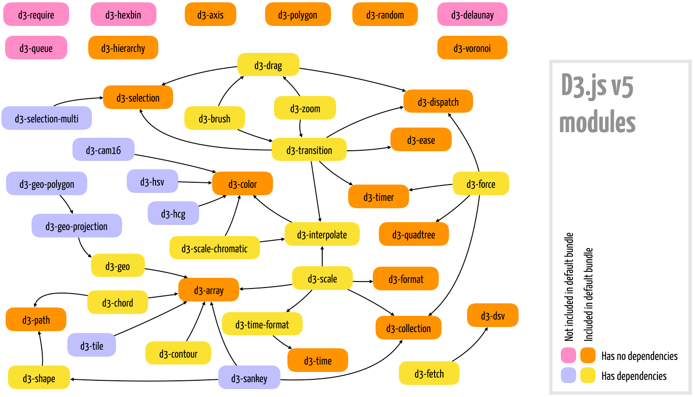

> Source [github](https://github.com/PacktPublishing/Learn-D3.js/)

## What is D3?
D3 Stands for Data Driven Documents. It is a javascript library but not a charting library. It focuses on the data. It will replace the DOM API and libraries such as jQuery. It uses data to drive everything. Data is first. "This API is also used to bind and dispatch events, and to generate animated transitions. It can also parse different data formats, such as JSON and CSV, perform general data manipulation on objects and arrays.

A typical D3.js script uses CSS selectors to select HTML or SVG elements and binds them to individual data items, removing, updating, or appending graphical elements automatically, when necessary. From the intro it seems you use CSS to create a selection object on a group of HTML tags and then bind data to them. You can also make a selection bound to data when the HTML doen't exist yet and have the HTML created automatically.

Use [https://d3js.org/](https://d3js.org/) and click on any of the hexagon example to be taken to a tutorial. Two other platforms are [https://www.bl.ocks.org](https://www.bl.ocks.org) and [https://www.observablehq.com](https://www.observablehq.com) which contain interactive tutorials.

## Environment Setup

### npm
```bash
$ npm install d3
```

From there in my home directory is:
```bash
$ ls node_modules/d3/dist/
d3.js  d3.min.js  d3.node.js  package.js
```

Just source the *min* after copying it to your development directory as follows:
```html
<script src="js/d3/d3.v5.min.js"></script>
```

### CDN link

You can also just source it from the internet if you always have internet:
```html
<script src="https://d3js.org/d3.v5.min.js"></script>
```

### Simple Web Server with node
For simple examples using the file system to open the file is enough, but for larger ones that load external files, it is better to use a web server.

```bash
$ npm install http-server -g
```

Once installed move to the working directory and execute:
```bash
$ http-server
```

> I had an issue running ```http-server``` out of the box and this [thread](https://github.com/nodejs/node-v0.x-archive/issues/3911) fixed it.

Ex: Create a sim link called *node* that points to *nodejs*
```bash
bbearce@bbearce-XPS-15-9560:~/Desktop/D3_tutorials$ sudo ln -s /usr/bin/nodejs /usr/bin/node
bbearce@bbearce-XPS-15-9560:~/Desktop/D3_tutorials$ http-server
Starting up http-server, serving ./
Available on:
  http://127.0.0.1:8080
  http://192.168.0.46:8080
Hit CTRL-C to stop the server
``` 

Notice:
```bash
bbearce@bbearce-XPS-15-9560:~/Desktop/D3_tutorials$ ls -la /usr/bin/node
lrwxrwxrwx 1 root root 15 Feb 27 22:53 /usr/bin/node -> /usr/bin/nodejs
bbearce@bbearce-XPS-15-9560:~/Desktop/D3_tutorials$ ls -la /usr/bin/nodejs
-rwxr-xr-x 1 root root 11187096 Aug  9  2018 /usr/bin/nodejs
```

>Don't forget about codepen and jsfiddle as possible development environments

## Hello World

Put this is the body tag and then the js in a separate doc and source or put it in a script tag.
HTML
```html
<svg id="chart" width="600" height="200"></svg>
```
### Constant
```js
const array = [100, 200, 300, 350, 375, 400, 500];

d3.select("#chart")  // select #chart
.selectAll("circle") // declares the elements we would like to create; Really this selects all circle elements in the <svg> tag but there are none so the selection is empty
.data([100])         // sets data to drive element creation
.enter()             // creates a selection to add elements per data item
.append("circle")    // appends an element of this type to each data item
.attr("r", "10")     // sets "r" attribute
.attr("cy", 100)     // sets "cy" attribute
.attr("cx", d => d)  // sets "cx" attribute (same as function(d){ return d }); This is being set by the data;
```

### Binding
>(we changed [100] in .data() to array)

```js
const array = [100, 200, 300, 350, 375, 400, 500];

d3.select("#chart")
        .selectAll("circle")
        .data(array)         // here we change [100] to array for multiple circles
        .enter()
        .append("circle")
        .attr("r", "10")
        .attr("cy", 100)
        .attr("cx", d => d)
```

### Update
Now skip a line and add this code after the selection. After 2 seconds there is a 1/4 second transition.
```js
setTimeout(function() {
    d3.select("#chart").selectAll("circle")
      .data([50, 75, 125, 225, 325, 425, 450])
        .attr("r", 5)
        .attr("cx", d => d)
        .style("fill", "red")
}, 2000)
```

One very nice feature of D3 is how simple it is to animate transitions. You just need to chain a ```transition()``` command before the attributes and styles that changed. The default transition takes a quarter of a second.

```js
setTimeout(function() {
        d3.select("#chart").selectAll("circle")
                .data([50, 75, 125, 225, 325, 425, 450])
                .transition().duration(1000)
                .attr("r", 5)
                .attr("cx", d => d)
                .style("fill", "red")
        }, 2000)
```

You'll notice the transition is much smoother now, taking time to switch to red dots.

### Modules (microlibraries)

You can load select libraries like so:

```html
<script src="https://d3js.org/d3-selection.v1.min.js"></script>
<script src="https://d3js.org/d3-transition.v1.min.js"></script>
```

But if you need axes, maps, and other features, you will require more modules and dependencies. In this case, either use the default bundle, or set up a development environment where you can install each module using npm, since it automatically includes any dependencies.

```js
npm install module-name
```



### Data Manipulation

The following modules listed are used to generate, manipulate, transform, parse, and format data, in the form of numbers, text, arrays, objects, and files. They are all included in the default d3.js bundle:

| Module         | Bundled (d3v5) | Description                                                                                                                                                    |
|----------------|----------------|----------------------------------------------------------------------------------------------------------------------------------------------------------------|
| d3-array       | Yes            | Several array utilities that extend the basic ES6 functions, optimized for use with datasets. Dependencies: none.                                              |
| d3-collection  | Yes            | Maps and sets optimized for use with datasets; functions for object collections and nesting data. Dependencies: none.                                          |
| d3-random      | Yes            | Random number generators. Dependencies: none.                                                                                                                  |
| d3-dsv         | Yes            | Parser functions for delimiter-separated data. Dependencies: none.                                                                                             |
| d3-interpolate | Yes            | Several functions for interpolating numbers, colors, strings, and so on. Dependencies: d3-color.                                                               |
| d3-scale       | Yes            | Generator functions to map data dimensions to graphical dimensions. Dependencies: d3-array, d3-collection, d3-format, d3-interpolate, d3-time-format, d3-time. |
| d3-time        | Yes            | API for operations with time (intervals, ranges, and so on). Dependencies: none.                                                                               |
| d3-format      | Yes            | Locale-sensitive methods for number formatting. Dependencies: none.                                                                                            |
| d3-time-format | Yes            | Locale-sensitive methods for date/time formatting. Dependencies: d3-time. 

### Documents Manipulation

These are core modules in D3 used to select and manipulate HTML or SVG elements by providing a concise API to the DOM. With these modules, you can select and filter elements (using CSS selectors), create elements, append, insert, or remove from the DOM tree, add attributes and contents, change styles or classes, connect event handlers, and join data. Practically any D3 application uses at least d3-selection.

| Module             | Bundled (d3v5) | Description                                                                                                                                                                   |
|--------------------|----------------|-------------------------------------------------------------------------------------------------------------------------------------------------------------------------------|
| d3-selection       | Yes            | Contains the essential DOM API for selection and manipulation of DOM elements. Dependencies: none.                                                                            |
| d3-selection-multi | No             | Adds optional support for setting multiple attributes, styles, or properties in selections and transitions using an object syntax. Dependencies: d3-selection, d3-transition. |

>There are more located [here](https://subscription.packtpub.com/book/web_development/9781838645571/1/ch01lvl1sec12/modules-microlibraries)

There are:  

* colors  
* ajax  
* 2D geometry graphing API  
* Spherical geometry and geometrical maps  
* Layouts: node-link hierarchies, graphs, trees, networks, flow diagrams, tiles, and Voronoi diagrams  
