> Source [github](https://github.com/PacktPublishing/Learn-D3.js/tree/master/Chapter02)

# Technical Fundamentals

This chapter covers fundamental standard web technologies used by D3: SVG, JavaScript (ES 2015), HTML Canvas and standard data formats such as JSON and CSV. It is intended as a general reference to these topics.

Most data visualizations created with D3.js generate SVG graphics. Good knowledge of SVG is important to make the most of D3, but you only really need to know the basics.

## 1) SVG

SVG stands for Scalable Vector Graphics. It’s an XML-based image format that describes graphics using geometrical attributes. Unlike HTML5 Canvas, which is another standard for vector graphics, SVG primitives are made of individual XML elements described using tags and attributes. It is also object-based and provides a DOM, which allows CSS styling, dynamic shape creation and manipulation, and coordinate transforms using JavaScript or CSS.

Scalable Vector Graphics (SVG)
SVG stands for Scalable Vector Graphics. It’s an XML-based image format that describes graphics using geometrical attributes. Unlike HTML5 Canvas, which is another standard for vector graphics, SVG primitives are made of individual XML elements described using tags and attributes. It is also object-based and provides a DOM, which allows CSS styling, dynamic shape creation and manipulation, and coordinate transforms using JavaScript or CSS.

To control SVG elements with D3 you should understand basic SVG syntax and rules, how a document is structured, how each element is rendered, the effects caused by attributes and styles, as well as nesting and transformation rules.

All the code used in this section is available in the SVG/ folder, from the GitHub repository for this chapter. You can see the results simply loading the pages in your browser.

 
### Viewport

SVG graphics context (viewport)
When SVG is embedded in HTML it creates a viewport.

Ex (note the light grey style):

```html
<style>
    svg {
        border: solid 1px lightgray;
        background-color: hsla(240,100%,50%,0.2)
    }
</style>
<body>
<h2>SVG viewport</h2>
    <svg width="600" height="300"></svg>
</body>
```

You can also create an SVG element using the DOM API, or D3, which is much simpler. The result is identical:

```html
<body>
    <script>
        d3.select("body").append("svg").attr("width", 400).attr("height", 300);
    </script>
</body>
```

### Shapes

Shapes are positioned in the viewport using x and y coordinates. They described by XML tags like ```<rect>```, ```<circle>```, ```<ellipse>```, ```<path>```, ```<polygon>``` and others. You create SVG graphics by placing these tags inside the ```<svg>``` element. Each supports attributes that configure their position in the viewport, and specific properties for each shape, such as radii, vertices or dimensions.

A circle can be drawn in SVG using the ```<circle>``` element and at least the r attribute (radius). If you don't provide any other attributes, you will only see the lower-right quarter of the circle, since the default coordinates for its center will be (0,0).

To illustrate an important js and raw html equivalency we will show code to draw 4 circles in the exact same way:

HTML:
```html
<svg width="400" height="300">
    <circle r="25"></circle>
    <circle cx="250" cy="200" r="50"></circle>
    <circle cx="50"  cy="50"  r="20"></circle>
    <circle cx="400" cy="300" r="50"></circle>
</svg>
```
JS:
```js
const svg = d3.select("body")
                .append("svg")
                .attr("width", 400)
                .attr("height", 300);

svg.append("circle").attr("r", 25);
svg.append("circle").attr("cx", 250).attr("cy", 200).attr("r", 50);
svg.append("circle").attr("cx", 50).attr("cy", 50).attr("r", 20);
svg.append("circle").attr("cx", 400).attr("cy", 300).attr("r", 50);
```

### Fills and Strokes

Shapes have default black fill colors and transparent stroke borders, unless you assign different color strings to the SVG attributes (or CSS properties) fill and stroke.

In the following SVG, three straight lines were drawn using the mandatory x1/y1 and x2/y2 attributes for <line> elements. They would be invisible it the stroke attribute wasn't present. A stroke-width has a default value of 1.

```html
<svg width="400" height="300">
    <line x2="400" stroke="red"  stroke-width="5"/>
    <line y2="150" stroke="blue" stroke-width="5"/>
    <line x2="200" y2="150" stroke="black" stroke-width="1"/>
</svg>
```

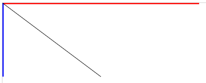

>You can also style with css:

```css
line {
    stroke-width: 20px; /* Overrides attr */
}
```
>Note lines at edge of screen might appear thinner as half the width could be off screen

You can also apply CSS class and style attributes to different SVG objects. For example, consider the following CSS class declarations:

```css
.reds {
    fill: red;
}
.semitr {
    fill-opacity: 0.5;
}
```

Since the following rectangles each belong to one or more of these classes, they will inherit the style properties declared for each class:

```html
<svg width="600" height="200">
    <rect x="50" y="50" width="90" height="90" class="semitr"/>
    <rect x="200" y="50" width="175" height="100" rx="40" ry="40" 
          class="reds semitr"/>
    <rect x="450" y="25" width="100" height="150" class="reds"/>
</svg>
```
One class applies the red fill, the other applies 50% transparency. The rectangle in the middle belongs to both classes, so it's both red and semi-transparent, as follows:

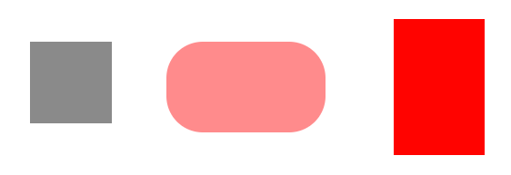

### Transparency

Transparency
When objects overlap in SVG, the code order determines which element will appear over the other. Preceding siblings are always overlapped by siblings that are declared after them. The CSS z-index property doesn’t work in SVG. To move an object to the front, you have to modify the DOM tree.

You can see through objects that overlap by changing their transparency. You can apply opacity levels to fills and strokes separately, using fill-opacity or stroke-opacity, or for the entire object using opacity. All attributes require a value between 0 (invisible) and 1 (opaque). An alternative, which achieves the same result, is to use the alpha component in rgba or hsla color strings (for example, ‘rgba(255, 0, 0, 0.5)’).

The three squares below apply different transparency parameters on fills and strokes:

```html
<rect x="50" y="50" height="100" width="100" rx="10" ry="10"
      stroke="red" stroke-width="10" fill-opacity="0"/>
<rect x="75" y="75" height="100" width="100" rx="10" ry="10"
      fill="gray" stroke="black" stroke-width="10" fill-opacity=".7"/>
<rect x="100" y="100" height="100" width="100" rx="10" ry="10"
      fill="yellow" stroke="blue" stroke-width="10" stroke-opacity=".6"/>
```

In the following code, two thin vertical rectangles appear behind a wide horizontal rectangle, and two other vertical rectangles appear in front of it:

```html
<rect x="300" y="50" height="150" width="25"/>
<rect x="400" y="50" height="150" width="25" fill-opacity=".5"/>

<rect x="250" y="100" height="50" width="300"
      fill="red" stroke="orange" stroke-width="10" stroke-opacity=".5" />

<rect x="350" y="50" height="150" width="25"/>
<rect x="450" y="50" height="150" width="25" fill-opacity=".5"/>
```

The following image shows the result:
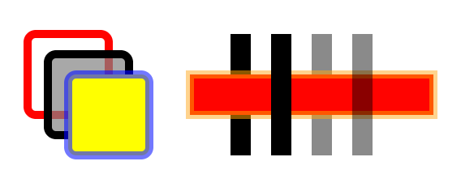


Drawing rectangles with different fills, strokes and transparency. Code: 7-rect-opacity.html.

### Ellipses

Ellipses have a center in cx and cy like circles, but also have two radii, which are set with rx and ry. The following code creates three ellipses in different positions.

```html
<svg width="600" height="300">
    <ellipse cx="150" cy="100" rx="150" ry="100"
             fill="yellow" fill-opacity="0.5"
             stroke="blue" stroke-width="1" stroke-dasharray="5 5"/>
    <ellipse cx="400" cy="150" rx="75" ry="125"
             fill="red" fill-opacity="0.2"
             stroke="red" stroke-width="5" stroke-opacity="0.5"/>
    <ellipse cx="400" cy="250" rx="150" ry="40"
             fill="black" fill-opacity="0"
             stroke="green" stroke-width="20" stroke-opacity="0.2" />
</svg>
```

The preceding code produces the following result:
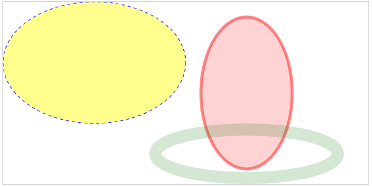
Ellipses created with SVG. Code: SVG/8-ellipse.html.


### Polygons and polylines

Polygons (```<polygon>```) and polylines (```<polyline>```) render closed or open shapes using straight lines specified by a list of vertices passed in the points attribute. The only difference between them is that polygons close the shape. To close a polyline you need to repeat the initial coordinates. They also have a fill-rule attribute that controls the winding order, and determines if a hole will be drawn inside the shape when an outline crosses with itself.

The following code creates two polygons. The second one has a fill-rule that will reveal a hole:

```html
<svg width="600" height="300">
  <polygon  
      points="150,150 50,150 100,20 150,50 200,200 50,200 20,154 48,82 32,20"
      fill="blue"/>
  <polygon  
     points="450,150 350,150 400,20 450,50 500,200 350,200 320,154 348,82 332,20"
     fill="red" fill-rule="evenodd"/>
</svg>
```
The result is shown as follows:
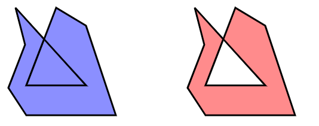

Polygons created with SVG. The second polygon uses fill-rule=”even-odd” and reveals a hole. Code: SVG/10-polygon.

### Paths
With paths you can draw open and closed shapes mixing lines, curves and arcs using a compact drawing language in the d attribute of the ```<path>``` element. It can be used to create arbitrary paths mixing straight lines and curves:

```html
<path d="M100,200 C200,50 300,100 300,200 L400,250 500,100"
      fill="yellow"
      stroke="red"
      stroke-width="4"/>
```

Don't worry about all those numbers and letters in the d attribute. It's the most important part of the path, but it can always be generated for you. Most of the shape generators you will use in D3 to create lines, pie slices and other arbitrary shapes generate path strings that you can use in the d attribute.

The simple ```<path>``` above renders the image below (the dots are added separately and show the control points):

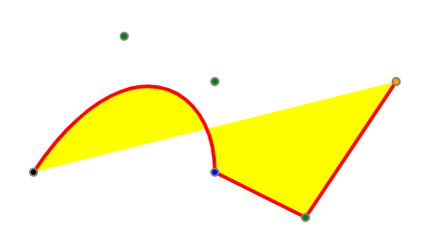

A curve described by a <path> element. Code: SVG/11-path-line.html.

### Text

Unlike HTML, you can't simply insert text inside any element. You have to create text objects using the ```<text>``` element with text contents. You can position text using x and y attributes, but you must remember that y is actually the baseline (default). If y is zero or not present, only the parts of the text that extend below the baseline will be visible inside the graphics context.

This example places both text and a rectangle in the same position:

```html
<rect x="0" y="0" height="36" width="200"/>
<text font-size="36" x="0" y="0" fill="lightgray">ghijklmnop</text>
```

The following illustration shows the result, at left. Note that only the parts of the text that extend below the baseline actually appear over the rectangle. The other two examples show text with a different baseline alignment: alignment-baseline="middle" and alignment-baseline="hanging".

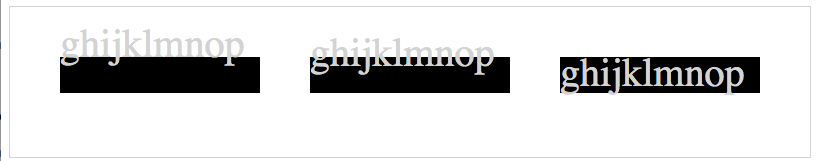

Drawing text in SVG and the baseline. Code: SVG/14-text.html.

You can also align text horizontally using the text-anchor attribute. The following illustration describes properties and values used to align text horizontally or vertically. If you intend to rotate text relative to its position, these parameters will affect the result.


Properties for aligning text. Code: SVG/15-text-align.html.

**It's best to configure baselines and alignments in CSS instead of using XML attributes.**

If your text spans multiple lines, you can use the ```<tspan>``` element inside ```<text>``` to move words or letters to positions relative to the parent ```<text>``` element (see SVG/16-tspan.html).

### Group containers

You can group several shapes in SVG with the ```<g>``` element. It's analogous to a ```<div>``` in HTML. This is an invisible element and it's positioned at the center of coordinates. CSS properties applied to a group affect all the objects it contains. You can also apply matrix transforms to groups to move, rotate and scale all its contents. A group container can also contain other group containers.

In the following SVG, circles and ellipses are in a group, and rectangles are in another. The color of the elements in each group is declared in CSS, and they are translated, scaled and rotated together:

```html
<style>
    svg { border: solid 1px lightgray; }
    #bars { fill: red;}
    #round { opacity: .7; fill: blue; }
</style>
<body>
<svg width="600" height="300">
    <g id="bars" transform="translate(0,100) rotate(-90, 100, 150)">
        <rect x="100" y="150" height="20" width="150"></rect>
        <rect x="100" y="180" height="20" width="100"></rect>
        <rect x="100" y="210" height="20" width="200"></rect>
    </g>
    <g id="round" transform="translate(200,100) scale(.3) ">
        <circle cx="280" cy="220" r="50"></circle>
        <ellipse cx="150" cy="90" rx="80" ry="50"></ellipse>
    </g>
</svg>
</body>
```


The following screenshot shows the groups before applying any transforms or styles to their groups (at left), and after applying the transforms and styles from the code above (right):

>Left pic is without the ```<g>``` tags or with no arguments to them if they are there.

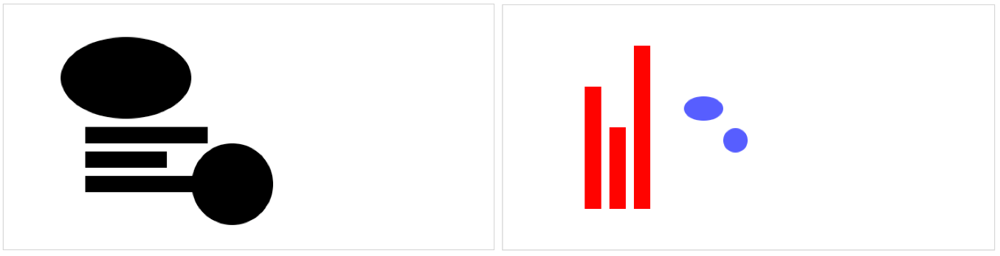

Applying styles and transforms to grouped shapes. Code: SVG/18-groups-transforms.html.

Styles applied directly to individual elements in the groups have precedence and will override any styles declared at the group level. Positions of elements inside the group are always relative to the coordinate system introduced by any transforms applied to the group.

### Reusing objects: use and defs
An SVG can have a ```<defs>``` header containing shapes, groups and other elements that will not be displayed. Filters, clipping masks, gradients and reusable shapes are usually declared in the ```<defs>``` header. You will need to assign an id to each element you wish to reuse later.

The element can be displayed later declaring the ```<use>``` element outside the ```<defs>``` block. This element references an existing element by id using standard xlink notation.

In the following example, two rectangles are created at 0.0. Since they are in the ```<defs>``` header, they will not be displayed. Each is previously configured with colors, dimensions and position. Outside the ```<defs>``` header, each element is displayed twice when referenced by each ```<use>``` element, translating each one to a different position:

```html
<svg width="600" height="200">
    <defs>
        <rect id="black"  x="0" y="0" width="20" height="20" 
              fill="rgb(64,32,32)" />
        <rect id="white" x="0" y="0" width="20" height="20" 
              fill="rgb(255,225,200)" />
    </defs>
    <g transform="translate(10,10) scale(3)">
        <use xlink:href="#black" />
        <use xlink:href="#white" transform="translate(20)"/>
        <use xlink:href="#white" transform="translate(0,20)"/>
        <use xlink:href="#black"  transform="translate(20,20)"/>
    </g>
</svg>
```

The result is shown in the following image. You can use this to create a checkerboard.
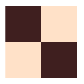

Reusing objects with ```<defs>``` and ```<use>```. Code: SVG/22-defs-use.html.

You will rarely use ```<defs>``` and ```<use>``` in D3, but placing reusable code such as clipping masks, filters and gradients in a ```<defs>``` header is good practice.

Matrix transforms
Matrix transforms are used to scale, translate, skew or rotate any shape or group, or the entire SVG viewport. Transform commands are functions used in the transform XML attribute, in text notation and separated by spaces, for example:

```html
<g transform="translate(100,100) scale(3) rotate(-90)"> … </g>
```
The order is significant. If you call scale(.5) and then rotate(90), the result will be different if you call them in the reverse order.

In translate(), scale() and skew(), the first parameter is an x coordinate value, and the second, if present, the y coordinate. In rotate(), the first parameter is an angle in degrees, and the next two parameters, if present, are the coordinates of the center of rotation (if not present, the object will rotate around 0,0 and may disappear from the viewport if the angle is big enough). Flipping an object can be achieved by scaling with negative values for x and/or y.

The translate() transform can be used to move groups to different positions. In this case, the x and y coordinates of each object should be considered relative to the group. When creating objects that will be treated as a group, you might also choose to position all objects at the origin (not declaring any x or y coordinates, or use only values relative to the group) to later control the position using translate()

You can also apply transforms as CSS styles, but you will need to use explicit units for degrees and distances, for example:

```html
<g style="transform: translate(100px,100px) scale(3) rotate(-90deg)"> … </g>
```
Consider the following SVG drawing of a pair of SVG coordinate axes:

```html
<g id="coords">
    <line x1="10" y1="10" x2="200" y2="10" />
    <line x1="10" y1="10" x2="10" y2="150" />
    <text x="200" y="20">x</text>
    <text x="20" y="150">y</text>
</g>
```
The following images show the results of applying translate, rotate/scale and skew to an image of the SVG coordinate axes, compared to the original object(in black):
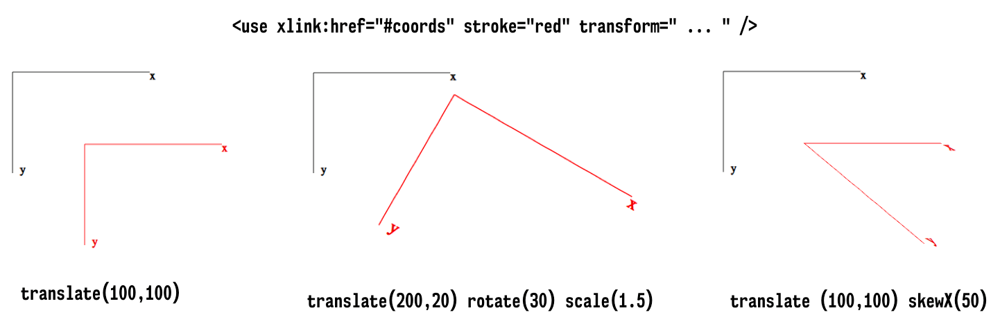

Applying transforms to shapes and groups. Code: SVG/19-translate.html, 20-scale-rotate.html, 21-skew.html.

### Configuring the SVG viewport
You can configure the SVG viewport by changing the values in the viewBox attribute (which can also be used in some reusable SVG elements). The viewBox attribute contains four numbers separated by spaces. The first two are the center of coordinates, which default to 0 0, and the last two are the width and height, which default to the declared or default height and width of the SVG. If present, this attribute can move the viewport to a different position and its scale.

For example, if you have an SVG with dimensions 400x300, the default viewport will be 0 0 400 300. If you declare a viewBox of 0 0 800 600, all the objects inside the SVG will be displayed at half the size, since a declared value of 100 is no longer 1/4 of the viewport's width, but 1/8. You can also change the origin of coordinates. For example, you can move it to the center of the SVG and position elements with negative coordinates if you have a viewBox of -200 -150 400 300 (remember that the coordinates start at the top-left corner).

Consider the following SVG:

```html
<svg width="400" height="300" viewBox="...">
   <line x1="0" y1="-300" x2="0" y2="300"/>
   <line y1="0" x1="-400" y2="0" x2="400"/>
   <rect x="-130" y="-130" height="20" width="200" fill="red"/>
   <rect x="130" y="-130" height="200" width="20" fill="blue"/>
   <rect x="0" y="100" height="20" width="200" fill="green"/>
   <rect x="-130" y="-65" height="200" width="20" fill="orange"/>
</svg>
```

The images below show what would appear on the screen, depending on the values you include for the viewBox attribute. The first one is the default.
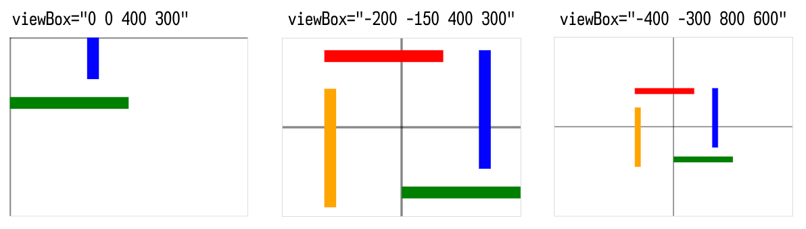

Scaling and translating the viewport with the viewBox attribute. Code: SVG/26-viewBox-default.html, 28-viewBox-center.html, 28-viewBox-scaled.html

You may rarely use viewBox with D3 since you can achieve the same results using matrix transforms, which are simpler.

### Gradients

Linear gradients are created perpendicular to a line, so it requires the same attributes as the ```<line>``` element. Radial gradients use circle attributes. Gradients should declare at least one child ```<stop>``` with a non-zero offset and stop-color different than black, since the default color is black and the default offset is zero. Typically, gradients declare two or more stop colors. Gradients are used used as a fill or stroke value. They are usually defined in ```<defs>``` with an id that can be referenced later using url(#id).

The following SVG code declares two gradients and applies one of them to a square, and the other to a circle:

```html
<svg width="600" height="300">
    <defs>
        <linearGradient x2="1" id="rainbow">
            <stop offset="0" stop-color="rgb(255,0,0)" />
            <stop offset="0.25" stop-color="rgb(255,255,64)" />
            <stop offset="0.5" stop-color="rgb(64,255,64)" />
            <stop offset="0.75" stop-color="rgb(64,64,255)" />
           <stop offset="1" stop-color="rgb(128,0,255)" />
        </linearGradient>
        <radialGradient cx="0.35" cy="0.35" r="1" id="glow">
            <stop offset="0" stop-color="rgb(255,255,255)" />
            <stop offset="0.5" stop-color="rgb(0,128,255)" />
            <stop offset="1" stop-color="rgb(128,0,255)" />
        </radialGradient>
    </defs>

    <rect x="0" y="0" width="200" height="200" 
          fill="url(#rainbow)" transform="translate(50,50)"/>
    <circle cx="100" cy="100" r="100" 
          fill="url(#glow)" transform="translate(300,50)"/>
</svg>
```
The result is shown in the following screenshot:
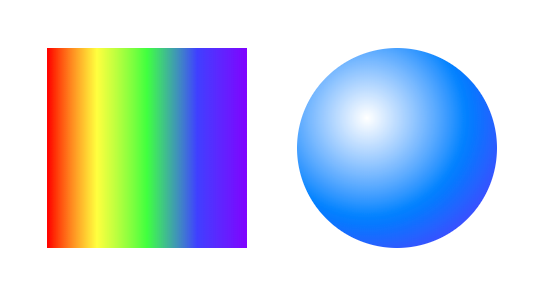

Linear and radial gradients. Code: SVG/23-gradient.html.

### Clipping
A clipping mask is created with any shape declared inside the ```<clipPath>``` element. This is usually done in ```<defs>```, setting an id for the clipping mask that can be referenced in the object that should be clipped, using url(#id) inside a clip-path attribute, as shown below:

```html
<svg width="425" height="425">
    <defs>
        <clipPath id="poly">
            <circle r="139" cx="200" cy="199"/>
        </clipPath>
    </defs>

    <!-- Clipped image -->
    <image x="25" y="25"
           height="350" width="350"
           xlink:href="../Data/Images/pluto.jpg"
           clip-path="url(#poly)"/>
</svg>
```
The following SVG screenshots show the circular clipping mask above applied to an image. The SVG at left shows the original image and the clipped image is shown at right.

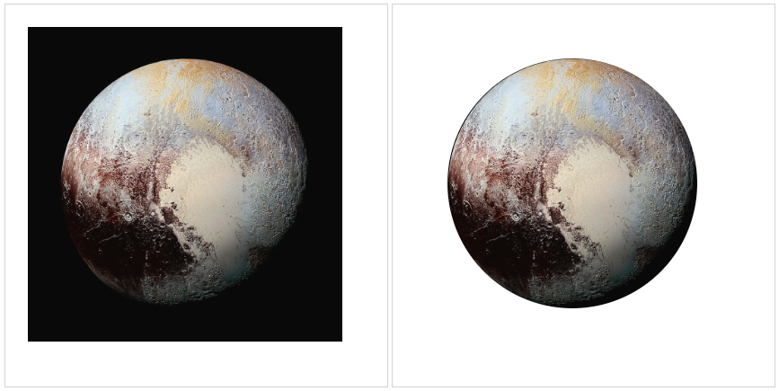

Clipping an image in SVG. Code: SVG/24-clipping.html.

 

### Filters
SVG filters can be applied to any shapes, text or images. They are usually created in the ```<defs>``` header with an id that can be referenced via url(#id) using the filter attribute. The ```<filter>``` element can contain several different filter types and you can also create composite filters. The following example creates two different configurations for the ```<feGaussianBlur>``` filter, applied to a text element and a circle:

```html
<svg width="600" height="300">
    <defs>
        <filter id="filter1">
            <feGaussianBlur stdDeviation="7" />
        </filter>
        <filter id="filter2" x="-100" y="-100" height="200" width="200">
            <feGaussianBlur stdDeviation="0,5" in="SourceGraphic" />
        </filter>
    </defs>
    <text id="text" font-size="40" fill="black" x="50" y="60" 
          filter="url(#filter2)">Do you need glasses?</text>

    <g id="stardot" transform="translate(100,25) scale(0.5)">
        <polygon id="star" points="250,0 400,500 0,200 500,200 100,500" 
                 fill="red" fill-rule="evenodd"/>
        <circle  id="circ" cx="250" cy="283" r="75" fill="blue" 
                 filter="url(#filter1)" />
    </g>
</svg>
```
The result is shown as follows:
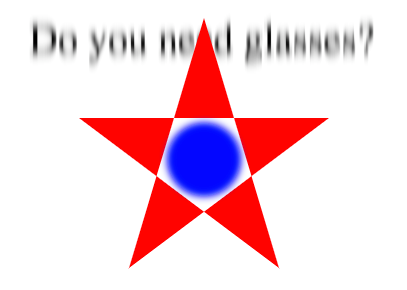

A Gaussian blur filter applied to different shapes. Code: SVG/25-filter.html.

An SVG example
The following code uses several SVG elements described in this section to draw some shapes, shadows, gradients and text:

```html
<svg width="300" height="300">
    <defs>
        <filter id="shadow">
            <feDropShadow style="flood-color: green" 
                          dx="5" dy="5" stdDeviation="3"/>
        </filter>
        <linearGradient id="grad" x1="0" y1="0" x2="100%" y2="0">
            <stop offset="0%" stop-color="magenta"/>
            <stop offset="100%" stop-color="yellow"/>
        </linearGradient>
        <clipPath id="circle">
            <circle r="40" cx="175" cy="75"/>
        </clipPath>
    </defs>

    <!-- rectangle -->
    <rect x="50" y="50" height="50" width="50"
          fill="red"
          stroke="blue"
          stroke-width="10"
          stroke-opacity="0.5"/>

    <!-- dashed shape -->
    <path id="path1"
          d="M150,200 L150,150 L100,150 C100,200 150,250 200,250 L200,200 Z"
          stroke-dasharray="5 2 1 2"
          stroke-width="2"
          stroke="blue"
          fill="none"
          style="filter:url(#shadow)"/>

    <!-- gray quarter-circle -->
    <path d="M0,0 L0,-100 A100,100 0 0,0 -100,0 L0,0 Z"
          transform="translate(100,250) scale(0.5) "
          stroke="red"
          stroke-opacity=".5"
          stroke-width="4"
          fill-opacity=".2"/>

    <text fill="url(#grad)" font-size="20" x="200" y="100">
        Scalable
        <tspan dy="20" x="200">Vector</tspan>
        <tspan dy="20" x="200">Graphics</tspan>
    </text>

    <image x="125" y="25" height="100" width="100"
           xlink:href="../Data/Images/pluto.jpg"
           clip-path="url(#circle)"
           opacity="0.75"/>

    <!-- raindow half-circle -->
    <path d="M100,200 C100,100 250,100 250,200"
          transform="scale(0.6) rotate(180,295,225) "
          fill="url(#grad)"/>
</svg>
```

Compare this code and the following image it generates it with an identical image created using D3 (SVG-with-D3/29-example.html) and HTML Canvas (Canvas/1-canvas-svg-compare.html):

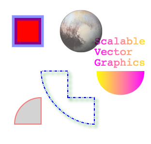

An image created using SVG. Code: SVG/29-example.html.


## 2) Essential JavaScript data structures

I'm actually going to organize this somewhere else to help with my code journal.

[Link to the Basics](../../../basics.md)


## 3) HTML Canvas

HTML5 Canvas
Most of your D3 applications will render graphics using SVG, but several shape generators in SVG can also generate Canvas, and you may choose to use Canvas in all or part of your application to improve performance if you have memory problems due to excessive objects created in the DOM.

To draw using Canvas you need to create a ```<canvas>``` element in your page. You can do that using plain HTML:

```html
<body>
   <canvas id="canvas" width="400" height="300"></canvas>
</body>
```

Or using D3:

```js
d3.select("body").append("canvas").attr("width", 400).attr("height", 300);
```

If you declare the Canvas element in HTML, you can reference it by its ID using the DOM or D3:

```js
const canvas = d3.select("#canvas").node(); // node() returns the DOM object
```

Once you have a canvas object, you obtain a 2D graphics context and start drawing:

```js
const ctx    = canvas.getContext("2d");
```
 
Practically all the Canvas API consists of methods and properties called from the graphics context. Before drawing, you set properties such as ```font```, ```fillStyle```, ```strokeStyle```:

```js
ctx.fillStyle = "red";
ctx.strokeStyle = "rgba(255,127,0,0.7)"; 
ctx.lineWidth = 10;
```

And then **fill** or **stroke** rectangles and arbitrary paths containing lines and curves. The following commands will draw a red 50x50 pixel square with a 10 pixel wide yellow semi-transparent border at position 50,50:
 
```js
ctx.fillRect(50,50,50,50); 
ctx.strokeRect(50,50,50,50);
```

You can also draw other shapes, text and images on the same canvas. The context properties will not change unless they are redefined or a previously saved context is restored.

It's a good practice to save the context to the stack before applying properties or transforms, and restore it when you are done drawing an object. This allows you to always start with a clean context:

>Note: So far the below code does nothing that I can see with my eyes.

```js
ctx.save();
ctx.transform(50,60);
ctx.scale(2);
// …
ctx.restore();
// starting with a new context
```

| Property or method                                    | Description                                                                                           |
|-------------------------------------------------------|-------------------------------------------------------------------------------------------------------|
| fillStyle                                             | Sets the color to be used in fill() commands.                                                         |
| strokeStyle                                           | Sets the color to be used in stroke() commands.                                                       |
| lineWidth                                             | Sets the line width to be used in stroke() commands.                                                  |
| lineCap                                               | Sets the style of the line caps: can be butt (default), round or square.                              |
| textAlign                                             | Sets the alignment for text: can be start (default), center, end, left or right.                      |
| textBaseline                                          | Sets the baseline for text: can be middle, hanging, top, bottom, ideographic or alphabetic (default). |
| font                                                  | Sets the font to be used in text commands, using the compact CSS font syntax.                         |
| globalAlpha                                           | Sets the global opacity (0 = transparent, 1 = opaque) for the context.                                |
| shadowBlur, shadowColor, shadowOffsetX, shadowOffsetY | Sets shadow properties. Default shadow color is transparent black. Default numeric values are zero.   |
| setLineDash(dasharray)                                | Sets the dash array (alternating line and space lengths) for strokes.                                 |
| translate(x,y)                                        | Sets the current translate transform for the context.                                                 |
| scale(x,y)                                            | Sets the current scale transform for the context.                                                     |
| rotate(angle)                                         | Sets the current rotate transform for the context.                                                    |
| save()                                                | Saves the state of the current context (pushes into a stack).                                         |
| restore()                                             | Restores the state of the last context that was saved (pops it from the stack).                       |

The ```fillRect()``` command is typically used to clear the entire canvas before redrawing, but you can also use it to draw arbitrary rectangles. The following table lists methods you can use to draw rectangles, draw text and images:

| Method                       | Description                                                                  |
|------------------------------|------------------------------------------------------------------------------|
| fillRect(x,y,w,h);           | Fills a rectangle. Typically used to clear the Canvas on redrawing.          |
| strokeRect(x,y,w,h)          | Draws a border around a rectangle.                                           |
| fillText(text,x,y);          | Fills text at position x, y (depends on current textAlign and textBaseline). |
| strokeText(text, x, y);      | Draws a border around text.                                                  |
| drawImage(image, x, y, w, h) | Draws an image at x,y with width w and height h.                             |

Canvas context methods used to draw rectangles, text and images

A path is a series of commands to move to points, draw lines, curves or arcs. To draw a path you need to first call ```ctx.beginPath()```, then call a sequence of commands that move to points, draw lines and curves, and when you are done you can close the path (if it's a closed path) and call ```fill()``` and/or ```stroke()``` to draw it using the current styles. The following table lists several commands you can use in a path:

| Method                                                         | Description                                                                                                           |
|----------------------------------------------------------------|-----------------------------------------------------------------------------------------------------------------------|
| beginPath()                                                    | Starts a path.                                                                                                        |
| closePath()                                                    | Closes a path.                                                                                                        |
| moveTo(x,y)                                                    | Moves the cursor to a position in the path.                                                                           |
| lineTo(x,y)                                                    | Moves the cursor to a position in the path, drawing a line along the way.                                             |
| bezierCurveTo(c1x,c1y,c2x,c2y,x,y) quadraticCurveTo(cx,cy,x,y) | Draws curves with one (quadratic) or two (Bezier) control points in a path.                                           |
| arc(x,y,r,sa,ea)                                               | Draws an arc by specifying the center, radius, start and end angles in a path.                                        |
| arcTo(sx,sy,r,ex,ey)                                           | Draws an arc by specifying the coordinates of the starting point, the radius and the coordinates of the ending point. |
| rect(x,y,w,h)                                                  | Draws a rectangle in a path with coordinates of top-left corner, width and height.                                    |
| clip()                                                         | Creates a clipping region with the shapes drawn by the path that will affect objects that are drawn afterwards.       |
| fill()                                                         | Fills a path with the current color. Call this to fill the path when done.                                            |
| stroke()                                                       | Strokes the path with the current color. Call this to stroke the path when done.                                      |


### A Canvas Example

The following code uses several of the methods above to draw different shapes on the same Canvas context. It draws some shapes, text, images and paths, and applies transforms, shadows, clipping and gradients. Compare it to the example shown before in SVG that draws the image (see  ```Canvas/1-canvas-svg-compare.html```):


```js
const canvas = document.getElementById("canvas");
const ctx    = canvas.getContext("2d");

// rectangle
ctx.save(); // save default context

ctx.fillStyle = "#ff0000";
ctx.strokeStyle = "blue";
ctx.lineWidth = 10;

ctx.fillRect(50,50,50,50);

ctx.globalAlpha = 0.5;
ctx.strokeRect(50,50,50,50);

// dashed shape
ctx.restore();
ctx.save();

ctx.strokeStyle = "blue";
ctx.lineWidth = 2;
ctx.shadowBlur = 6;
ctx.shadowColor = "green";
ctx.shadowOffsetX = ctx.shadowOffsetY = 5;
ctx.setLineDash([5,2,1,2]);

ctx.beginPath();
ctx.moveTo(150,200);
ctx.lineTo(150,150);
ctx.lineTo(100,150);
ctx.bezierCurveTo(100,200,150,250,200,250);
ctx.lineTo(200,200);
ctx.closePath();
ctx.stroke();

ctx.restore();
ctx.save();

// quarter-circle
ctx.translate(100,250);
ctx.scale(0.5, 0.5);
ctx.strokeStyle = "red";
ctx.lineWidth = 4;
ctx.globalAlpha = 0.5;

ctx.beginPath();
ctx.moveTo(0,0);
ctx.lineTo(0,-100);
ctx.arcTo(-100,-100,-100,0,100);
ctx.lineTo(0,0);
ctx.stroke();

ctx.globalAlpha = 0.2;

ctx.beginPath();
ctx.arc(0,0,100,3.14,-1.57,false);
ctx.lineTo(0,0);
ctx.closePath();
ctx.fill();

ctx.restore();
ctx.save();

// text and half-circle
const text = "Canvas"
ctx.translate(250,150);
ctx.font = "24px monospace";
const textWidth = ctx.measureText(text).width;
const gradient = ctx.createLinearGradient(-50,-50,-50 + textWidth,-50);
gradient.addColorStop(0,"magenta");
gradient.addColorStop(1, "yellow");

ctx.fillStyle = gradient;
ctx.shadowColor = "transparent";

ctx.fillText(text, -45, -5);

ctx.scale(1.1, 1.1)
ctx.rotate(3.14);

ctx.beginPath();
ctx.arc(0,0,40,3.14,0,false);
ctx.fill();

ctx.restore();
ctx.save();

// image and clip
ctx.beginPath();
ctx.arc(175,75,40,0,6.28,false);
ctx.clip();

const image = new Image(100,100);
image.onload = function() {
    ctx.globalAlpha = 0.75;
    ctx.drawImage(this, 125, 25, this.width, this.height);
}
image.src = "reuse.png";
ctx.save();
```
>I don't have the pluto pic so the code won't show the planet.

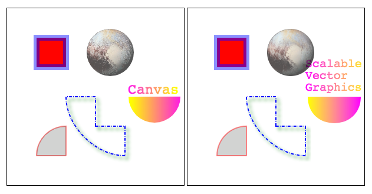

## Data Formats

Data used in visualizations are usually distributed in a standard format that can be shared. Even when the data is served from a database, the data is usually delivered in some standard format. Popular proprietary formats such as Excel spreadsheets are common, but most statistical data is stored or delivered in CSV, XML or JSON formats.

### CSV

You can load and parse CSV in D3 using the ```d3.csv()``` function.

```js
const csv = d3.csv("Data/continents.csv")
csv
```

output:

```js
Promise {<resolved>: Array(7)}
__proto__: Promise
[[PromiseStatus]]: "resolved"
[[PromiseValue]]: Array(7)
0: {continent: "North America", population: "579024000", areakm2: "24490000"}
1: {continent: "Asia", population: "4436224000", areakm2: "43820000"}
2: {continent: "Europe", population: "738849000", areakm2: "10180000"}
3: {continent: "Africa", population: "1216130000", areakm2: "30370000"}
4: {continent: "South America", population: "422535000", areakm2: "17840000"}
5: {continent: "Oceania", population: "39901000", areakm2: "9008500"}
6: {continent: "Antarctica", population: "1106", areakm2: "13720000"}
columns: (3) ["continent", "population", "areakm2"]
length: 7
__proto__: Array(0)
```

### XML

**XML – eXtensible Markup Language** is a very popular data format. Ajax responses from web services are usually returned as text or XML. It has standard native support in JavaScript via the **DOM (document object model)** APIs and doesn't require additional parsing. Although it is still common to find data in XML format, CSV and JSON alternatives, if available, are usually smaller and easier to work with.

```xml
<continents>
    <continent>
        <name>North America</name>
        <population>579024000</population>
        <area unit="km">24490000</area>
    </continent>
    <continent>
        <name>Asia</name>
        <population>4436224000</population>
        <area unit="km">43820000</area>
    </continent>
    <continent>
        <name>Antarctica</name>
        <population>1106</population>
        <area>13720000</area>
    </continent>
</continents>
```

```js
const xml = d3.xml("Data/continents.xml")
```
> Not sure how to parse but who uses XML anymore gosh!

### JSON

JSON stands for JavaScript Object Notation. It looks a lot like a JavaScript Object, but it has stricter formation rules. It's probably the easiest format to work with. It's compact and easy to parse, and it's gradually replacing XML as a preferred data format in Web Services. The data file containing continent data is shown below in JSON format (```Data/continents.json```).


```bash
[
    {
        "continent": "North America",
        "population": 579024000,
        "areakm2": 24490000
    },{
        "continent": "Asia",
        "population": 4436224000,
        "areakm2": 43820000
    },{
        "continent": "Europe",
        "population": 738849000,
        "areakm2": 10180000
    },{
        "continent": "Africa",
        "population": 1216130000,
        "areakm2": 30370000
    },{
        "continent": "South America",
        "population": 422535000,
        "areakm2": 17840000
    },{
        "continent": "Oceania",
        "population": 39901000,
        "areakm2": 9008500
    },{
        "continent": "Antarctica",
        "population": 1106,
        "areakm2": 13720000
    }
]
```

JSON is the preferred format for data manipulation in JavaScript. There are many online tools you can use to transform CSV and XML files into JSON.

You can load and parse JSON in D3 using the ```d3.json()``` function.

```js
Promise {<resolved>: Array(7)}
__proto__: Promise
[[PromiseStatus]]: "resolved"
[[PromiseValue]]: Array(7)
0: {continent: "North America", population: 579024000, areakm2: 24490000}
1: {continent: "Asia", population: 4436224000, areakm2: 43820000}
2: {continent: "Europe", population: 738849000, areakm2: 10180000}
3: {continent: "Africa", population: 1216130000, areakm2: 30370000}
4: {continent: "South America", population: 422535000, areakm2: 17840000}
5: {continent: "Oceania", population: 39901000, areakm2: 9008500}
6: {continent: "Antarctica", population: 1106, areakm2: 13720000}
length: 7
__proto__: Array(0)
```

> Note that both csv and json loaded an easy to work with object. Just try to xml code....It'll make you sick.