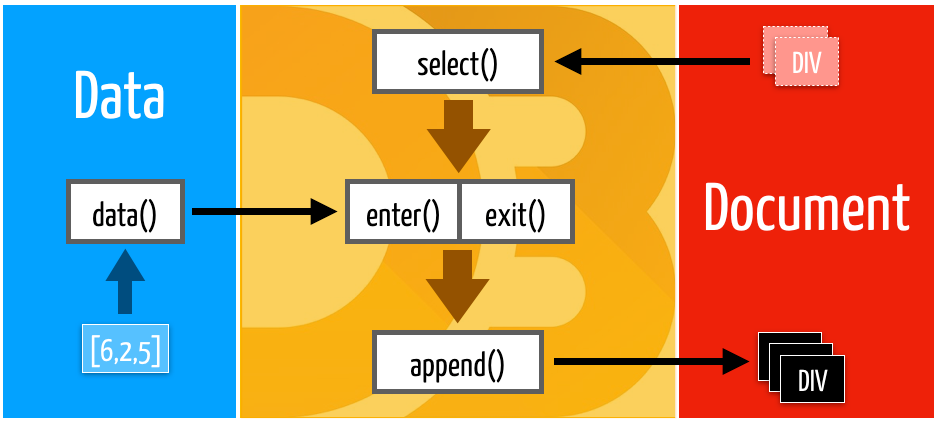
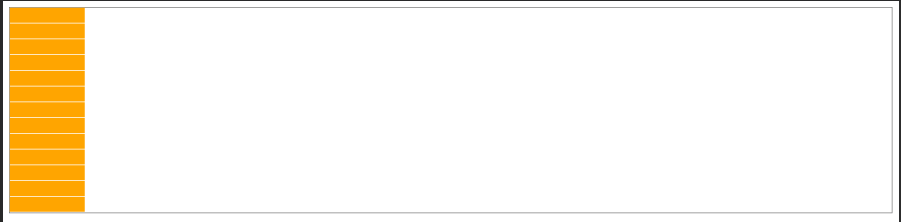
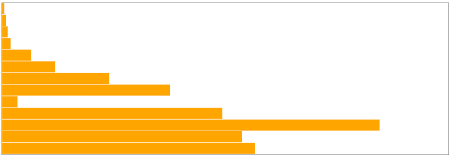
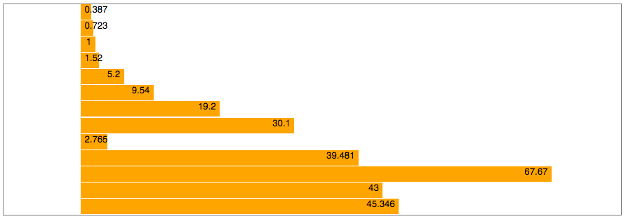
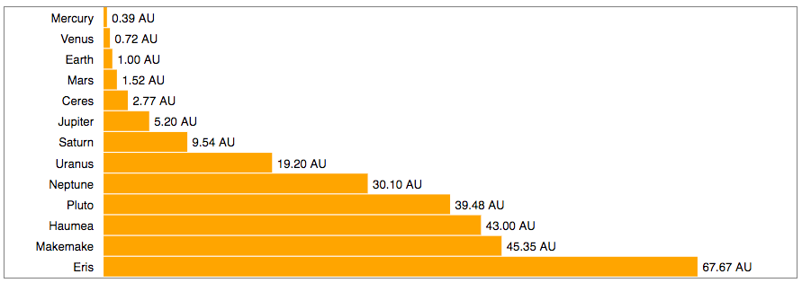
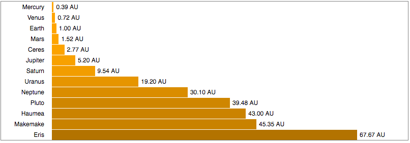

> Source [github](https://github.com/PacktPublishing/Learn-D3.js/tree/master/Chapter03)

## Selecting and Binding Data

### Selecting and appending

The selection methods ```select()``` and ```selectAll()``` receive a CSS selector expression and return a D3 handle for a node or a set of nodes. You can convert the D3 handle into a DOM object calling ```node()``` or ```nodes()```.

Add the following HTML to the ```<body>``` of your HTML file (or use Selecting/1-select.html):

```html
<p>See results in console log.</p>
<div id="section">
    <p class=first>Paragraph 1</p>
    <p>Paragraph 2</p>
</div>
<p>Paragraph 3</p>
```

Now you can use the JavaScript console (or a ```<script>``` block in your page) to type in the following code, which shows how ```select()``` and ```selectAll()``` can be used:

```js
const div = d3.select("#section");       // selects element with the 
                                         // "section" ID
const domDiv = div.node();               // converts the object into a 
                                         // DOM node
const firstP = d3.select("p");           // selects the first <p> 
                                         // in the page
const allParagraphs = d3.selectAll("p"); // selects all four <p> nodes 
                                         // in the page
const allPDom = allParagraphs.nodes();   // converts selection into 
                                         // DOM nodelist

const sectionParagraphs =
         d3.select("div")
                 .selectAll("p");       // selects the two <p> nodes 
                                        // inside <div>
```

A selection object serves as a handle to elements in your page. You can use it to change their styles, properties, attributes, classes, and contents, using methods that can receive static or dynamic values (using functions) as parameters. The following examples demonstrate some of these methods (see ```Selecting/2-attributes-styles.html```):

```js
div.style('border', 'solid blue 2px'); // draws blue border around <div>
firstP.classed('big', true);           // adds class ‘.big’ to 
                                         first paragraph 
firstP.text('This is paragraph zero'); // replaces contents of 
                                         first paragraph
allParagraphs.style('font-weight', 'bold'); // applies style to set 
                                              of paragraphs


// this looks promising, however there is nothing tagged with class "first" so nothing happes
d3.select('.first') // selects first element of class ‘.first’
        .attr('title', 'Tooltip')                  // adds an attribute
        .style('font-variant', 'small-caps')       // applies a style
        .html('This is a <b>bold</b> paragraph.'); // replaces contents with HTML
```

The ```select()``` method will always return only **one** object (if the selector matches more items, only the first will be returned). The ```selectAll()``` method returns a collection, which can be iterated with the ```each()``` method, which receives a callback function, which receives up to three parameters. Inside the function, ```this``` refers to the current DOM element, and ```d3.select(this)``` wraps it in a D3 selection object, which can be manipulated with selection methods, as follows:

```js
sectionParagraphs.each(function(d, i) {     // i is the index
     d3.select(this).classed('red', true);
     console.log(`Paragraph ${i}: `, this); // this refers to the current element
 });
 ```

This code applies the class ```.red``` to each element of a collection. If you open the JavaScript console, it will print each element and its index (starting in zero).

You can also use selection methods to modify the DOM tree. Calling ```remove()``` on a D3 selection removes elements in the selection. You can call ```append()``` on a selection to add an element as its last child, or use ```insert()``` to add the new element in a position determined by a selector passed as the second argument. These methods are demonstrated as follows (see ```Selecting/3-append-remove.html)```:

```js
d3.select("#section")     // current context is element with id #section
  .insert("p", '.first') // add a <p> before the child being of class ‘.first’
  .append('a')           // context is now <p>; inserts an <a> in <p>
  .attr('href', 'https://d3js.org') // context is now <a> 
  .text("D3 website");   // contents of the <a> element

d3.select('div')            // context is first <div> in page
   .select('p:last-of-type') // context is now last <p> in <div>
   .remove(); // context is detached <p> (parentNode is null)

const div = d3.select('div')

div.append("p")             // adds a new <p> as last child of selected <div>
    .text("New paragraph");  // sets the text contents of <p>

d3.select("body")     // selects the <body> element of the page
    .insert("h1", "*")  // adds a new <h1> as the first child (before *)
    .text("New title"); // sets the text contents of <h1>

d3.select("body")
    .append("h2")       // adds a new <h2> as the last child
    .text("Footer");
```
The ```append()``` and ```insert()``` methods can also be chained, since they return the nodes they added. You just have to pay attention to the current so you don't modify or add data to the wrong elements. The ```remove()``` method returns the removed selection (a node or a set of nodes) after it's detached from the DOM (**null** parent).

D3 selections are not limited to HTML. In fact, they are most commonly applied to SVG elements, but can also be used with any embedded XML. This was a brief introduction. In Chapter 4, **Data Binding**, we will explore these methods in detail.

### Binding Data

D3 makes it almost trivial to bind data to DOM elements. Data binding requires calling at least two of the following four methods in the context of a selection:

* ```data(array)``` or ```datum(object)```: Receives an array or an object/value that contains data that should be mapped to DOM elements  
* ```join()```, ```enter()``` or ```exit()```: Binds the data to DOM elements by populating an update array returned as a selection of elements that should be added or removed from the document  

The ```exit()``` method returns a selection of unbound elements. After an ```exit()```, ```remove()``` is usually called, which removes the entire selection. The ```enter()``` method returns a selection of placeholders for new elements that need to be created. After an ```enter()```, either ```append()``` or ```insert()``` is called, which connects the elements to the DOM tree. The ```join()``` method is a magic method that replaces ```enter()``` and ```exit()```, automatically updating, removing, or adding elements, as necessary.

Once data is connected to an element, the attributes, style, and contents of each element can be modified using the ```attr()```,```style()```,```text()```, and ```html()``` methods that take a callback function as the second argument. This binding process is illustrated as follows:



Let's try an example. Create an HTML page with this code in the ```<body>``` and open it in a browser (or use ```Binding/1-binding.html```):

In a ```<script>``` block, create this array of numbers (or type it in your JavaScript console):

```js
const numbers = [6, 2, 5, 7, 9];
```

The following code will bind each number in the array to a paragraph. The data will be copied to an internal array and can be used to change the attributes, styles, or contents of the existing paragraphs:

```js
const selection = d3.select("#section")
                    .selectAll("p")
                    .data(numbers);
```

The ```data()``` method returns the current selection. The value of each item in the array is received as the first parameter of a callback function in attr(),style(),text(), and so on. The text() method is used in the following code that replaces the contents of each paragraph with the first two values of the array:

```js
selection.text(d => d); // binds to existing paragraphs (update)
```

But we need more paragraphs, since we have five elements of data. By calling ```enter()```, a new selection is created with three more placeholder nodes, containing the remaining data, but not yet mapped to any element:

```js
const newSelection = 
     selection.enter(); // binds data to a selection of placeholders
```
We can't just call ```text()``` on the selection yet. First, we need to append or insert those elements into the DOM tree. You call ```append()``` only once, and it will be executed three times. Now, you can use ```text()``` to print the paragraph with the data:

```js
newSelection.append("p")
             .text(d => d); // binds to new paragraphs (enter)
```

Normally, the entire selecting-binding-appending process is written as a chain of commands. The following code achieves the same result, using the same array and paragraphs (see ```Binding/3-chain-text.html```):

```js
d3.select("body")         // select the body element
    .select("div")        // select the first div element inside <body>
    .selectAll("p")       // select all <p> elements (there are two)
    .data(numbers)        // load the data from the numbers array
    .text(d => d)         // set contents of existing paragraphs
    .enter()              // bind remaining data to array with 3 elements
    .append("p")          // add 3 new <p> elements to end of <div>
    .text(d => d);        // set the contents of the new paragraphs
```

It's simpler (and more common, when using D3) to use JavaScript  (and not HTML) to create **all** of the elements you need. After all, data is dynamic and you won't always know how many items you have to display. Most of the time, HTML is just used to provide the basic structure, such as the ```<body>``` tag, a container ```<div>```, or ```<svg>```.

The following code achieves the same result starting with an empty ```<body>``` tag (and the same data array). The ```<div>``` and all the ```<p>``` are created using D3 commands (see ```Binding/4-empty-binding.html```):

```js
d3.select("body")        // select the body element
    .append("div")       // append a div element inside <body>
    .selectAll("p")      // select all <p> elements (there are none)
    .data(numbers)       // load the data from the numbers array
    .enter()             // bind the data to enter array with 5 placeholders
    .append("p")         // create 5 new <p> elements and add to end of <div>
    .text(d => d);       // set the contents of the new paragraphs
```

Note that even though there are no ```<p>``` elements in the page, the ```selectAll("p")``` command is still necessary, since it provides the selection context for the data binding. The ```selectAll()``` command can use any CSS selectors to locate its elements, but it should return a selection containing the same type of elements added by the ```append()``` command.

As you have seen, once you have data bound to DOM elements, you can use the data to change attributes, styles, classes, and properties, using callbacks. The callback function has a second parameter that contains the index of the data array, which is used in the following example to change the contents and style of list items:

```js
d3.select("body")         // select the body element
    .append("ul")         // append an <ul> element inside <body>
    .selectAll("li")      // select all <li> elements (there are none)
    .data(numbers)        // load the data from the numbers array
    .enter()              // create an enter array with 5 objects
    .append("li")         // create 5 new <li> elements and append to <ul>
    .text(function(d, i) {
        return "Item " + (i+1) + ": " + d;
    })
    .style("font-size", function(d, i) {
    return ((i+2) * 5) + "pt";
    });
```

The result is shown in the following screenshot:


D3 used to create and style new elements from data. Code: ```Binding/5-callbacks.html```.

Callback functions also have a third parameter that contains the array of elements in the selection. You might need it if you want to obtain the current element when using arrow functions, since the ```this``` reference in these functions doesn't refer to the current element:

```js
.text( (d, i, nodes) => console.log("Current element: " + nodes[i]) );
```

You can easily reuse the preceding code with different types of data. If you have an array of objects containing values of different types, you don't need to convert it to an array of numbers. You can directly pass the entire object array to the ```data()``` method, and later select which properties of each object you wish to use. For example, you can use practically the same code that was shown previously to display the contents of the following array:

```js
const distances = [
    {name: "Mercury", distance: 0.387},
    {name: "Venus", distance: 0.723},
    {name: "Earth", distance: 1},
    {name: "Mars", distance: 1.52},
    {name: "Jupiter", distance: 5.2},
    {name: "Saturn", distance: 9.54},
    {name: "Uranus", distance: 19.2},
    {name: "Neptune", distance: 30.1},
    {name: "Ceres", distance: 2.765},
    {name: "Pluto", distance: 39.481},
    {name: "Eris", distance: 67.67},
    {name: "Haumea", distance: 43},
    {name: "Makemake", distance: 45.346}
];
```

The object array is received by the ```data()``` command. Each array item is available as the first parameter of the callback, which can be used to extract the property that contains the data (see ```Binding/6-object-array.html```):

```js
d3.select("body")    // select the body element
    .append("ul")     // append an <ul> element inside <body>
    .selectAll("li")  // select all <li> elements (there are none)
    .data(distances)  // load the data from the numbers array
    .enter()          // bind the data to enter array with 5 placeholders
    .append("li")     // create <li> from enter selection and append to <ul>
    .text(function(d, i) {
        return d.name + ": " + d.distance;
    });
```
Since D3 Version 5.8, you can replace ```enter().append(element)``` in simple binding operations, as shown with the ```join(element)``` method (see ```Binding/7-join.html```):

```js
d3.select("body") 
   .append("ul") 
   .selectAll("li") 
   .data(distances) 
   .join("li")  // obtains enter selection and appends 5 new <li> elements
   .text(function(d, i) {
       return d.name + ": " + d.distance;
   });
```

The preceding code will generate an HTML list with the data.

## Creating a bar chart with D3 and HTML

Now that you have had a quick introduction to D3's basic data-binding mechanisms, let's create some full data visualization examples that will demonstrate the power of D3. You should know HTML very well, so we will start with a simple bar chart using HTML and CSS. Later, we will repeat the exact same procedure using SVG, the main standard used by D3 to create visualizations.

All the code for these examples is available in the GitHub repository for this chapter.

### Binding data to HTML

In this example, we will draw a horizontal bar chart using HTML ```<div>``` elements. The colors and length of each bar are controlled by CSS, which we can configure using the ```selection.style()``` command. We will use the object array containing planetary distances from the last example. First, let's create a style sheet with classes for the ```bar-chart``` and each individual ```bar```:

```html
<style>
    .bar-chart {
        border: solid 1px gray; /* a gray border around the container */
        position: relative;
    }
    .bar {
        height: 20px;
        background-color: orange;
        position: absolute;
    }
</style>
```

The bars are positioned absolutely. Since each bar has an equal height (20px), we need to position each bar slightly below the previous one. This can be achieved by setting the value for the CSS ```top``` property (in pixels) so that it contains the sum of the heights of all the previous bars, plus an extra pixel to keep them slightly apart. The ```top``` property can be dynamically calculated as proportional to each entry's array index, using a callback in ```selection.style()``` (see ```HTML_Bar/1-bar-chart.html```):

```js
d3.select("body")
    .append("div").attr("class", "bar-chart")                 // container div for the chart
    .style("height", () => distances.length * 21 + "px")      // set chart height
    .selectAll("div").data(distances)                         // binds data
    .enter().append("div")                                    // appends a div for each data element
    .attr("class", "bar")                                     // these divs are the bars of  the chart
    .style("top", (d,i) => i * 21 + "px")                     // stacks bars 
    .style("width", "100px")                                  // fixed width
```

output:



This prints all the bars, one on top of the other, but they all have the same static width! We need to use a callback to change the width of each individual bar. In a bar chart, the actual width should be **proportional** to the distance. A solution would be to multiply each value by 10. This will make the smallest bar three pixels wide, and the largest over 670 pixels:

```js
.style("width", d => (d.distance * 10) + "px")
```

Now, the lengths of the bars are proportional to the data values. This code is in ```HTML_Bar/2-bar-width.html```. The result is shown as follows:




HTML bar chart with D3: Drawing DIVs and using the data to change the CSS width. Code: ```HTML_Bar/2-bar-width.html```

### Scales
What if a new planet is discovered that is 10 times the largest distance? The bars wouldn't fit and their widths would need to be recalculated! D3 also provides a solution for this: ```scales```.

Scales are mappings between different dimensions. In our case, we have to deal with two dimensions: the dimension of the data, called the ```domain```, and the dimension of the graphics context where the data will be displayed, called the ```range```. Before using a scale, you have to configure its domain and range. There are several different kinds of scales in D3, including linear and logarithmic scales, with many configuration options.

A scale is created with a special generator function available in the ```d3-scale``` module. To use this module, you need to load several dependencies, so let's replace the ```<script>``` tag with the default bundle:

```html
<script src="https://d3js.org/d3.v5.min.js"></script>
```

To create a scale function, you call a special generator function. A linear scale function can be created using the following:

```js
const barScale = d3.scaleLinear();
```
 

To use the scale function you created, you pass a value as the argument and receive the converted result:

```js
const result = barScale(45); // returns 45
```

This will return ```45```, because the scale hasn't been configured yet (the default scale is 1:1). To configure the scale, you need to call two methods to set up the domain (data dimensions) and range (graphical dimensions). Each method receives an array. For example, we can set up the domain as follows:

```js
barScale.domain([0, 100]); // input domain from 0 to 100
```

This fits all the distances in our data. The range is set up in a similar fashion:

```js
barScale.range([0, 600]); // output domain from 0 to 600
```

This means that zero is mapped to zero, and 100 **astronomical units (AU)** is mapped to 600 (pixels). Intermediate values will be interpolated.

If you now call ```barScale(45)```, you will get ```270```. We can use the scale to convert the distances in AU to pixels, replacing the previous expression with a scale conversion (see ```HTML_Bar/3-scales.html```):

```js
.style("width", d => barScale(d.distance) + "px");
```

### Array utilities

We chose 100 as the upper limit in our scale domain because it's larger than any of the distances in the data, but the choice was rather arbitrary. We could have chosen the largest value in the array. If you have hundreds of lines of data, you can use JavaScript array functions (see **Chapter 1, Introduction**) to find out the maximum value.

D3 also includes a collection of array manipulation functions that extend JavaScript's native functions. Some look similar but may be more efficient for data manipulation (for example, by ignoring ```null```, ```NaN```, and ```undefined``` values). In order to use them, you need the d3-array module (which is also part of the default bundle).

Here, we changed the configuration of our ```barScale()``` function so that it uses the largest distance from the ```distances``` object array as the upper value for the domain. This is achieved with by calling the ```d3.max()``` function, which receives an array and an accessor function for each array element, as follows:

```js
const barScale = d3.scaleLinear()
                   .domain([0, d3.max(distances, d => d.distance)]) 
                   .range([0, 600]);
```

The ```d3.max()``` function will scan the ```distances``` array and compare the ```distance``` property of each object, returning the largest one.

There are many more useful functions in **d3-array**, which we will cover in the next chapter. Two of them, ```d3.descending(a,b)``` and ```d3.ascending(a,b)```, are used to provide a sorting rule for JavaScript's native ```sort()``` method. We can use it to sort the array by the distance:

```js
distances.sort((a,b) => d3.ascending(a.distance, b.distance));
```

See and run the code after these transformations in ```HTML_Bar/4-max-sort.html```.

### Adding labels
Since the ```<div>``` elements in HTML can contain text, you can call the ```text()``` method for each ```<div>``` and set its contents based on the data:

```js
d3.select("body")
        .append("div").attr("class", "bar-chart")
        // ...all previous code to build chart
        .text(d => d.distance); // display distance in the <div>
```

With CSS, we can right-align the text and adjust the fonts. Since these styles are static and don't change with the data, instead of calling ```style()``` for each property, you should use a style sheet:

```html
<style>
    /* ... */
    .bar {
        height: 20px;
        left: 100px;
        background-color: orange;
        position: absolute;
        text-align: right;
        padding: 0 5px;
        font-family: sans-serif;
        font-size: 9pt;
    }
</style>
```

As a result, the labels are placed inside the bars, as follows:


Adding labels to the bars. Code: ```HTML_Bar/5-labels.html```.

### More labels, formatting, and colors

Each object in our data array also contains a name property that can be used to label each bar. To position text outside the bar, we will need to refactor the code so that each data entry contains a container ```<div>```, which will be bound to the data values. This entry ```<div>``` will then contain three other ```<div>``` elements: a category label (the name of the planet), the bar, and a value label (the distance). Classes will be used to identify each ```<div>```. The following style sheet contains the static properties for these elements:

```html
<style>
    .bar-chart {         /* The container <div> for the entire chart */
        border: solid 1px gray;
        position: relative;
        width: 800px;
    }
    .entry {             /* a container <div> for each data entry */
        position: absolute;
        width: 100%;
    }
    .bar {               /* the colored rectangle */
        height: 20px;
        top: 1px;
        left: 100px;
        background-color: orange;
        position: absolute;
    }
    .label {             /* a text label */ 
        padding: 4px 5px;
        font-family: sans-serif;
        font-size: 9pt;
        position: absolute;
        height: 20px;
    } 
    .category {           /* the category text label at left (name) */
        text-align: right;
        width: 80px;
    }
    .value {              /* the value text label at right (distance) */
        text-align: left;
    }
</style>
```

Since each entry ```<div>``` has three children, we need to keep a reference to its selection so that the child elements can be appended. The following code saves references for each one of the container ```<div>``` elements. The ```chart``` constant contains a selection of the root ```<div>``` element, and the ```entries``` constant contains the selection of all entry ```<div>``` elements:

```js
// selects the entire chart (one node)
 const chart = d3.select("body")
                 .append("div").attr("class", "bar-chart")
                 .style("height", distances.length * 21 + "px");

 // selects each entry (a nodelist)
 const entries = chart.selectAll("div").data(distances)
         .enter().append("div")
         .attr("class", "entry")
         .style("top", (d,i) => i * 21 + "px");
```

You can now use the ```entries``` constant to append the child elements to each entry ```<div>``` (see ```HTML_Bar/6-entries.html```):

```js
entries.append("div").attr("class", "label category")
        .text(d => d.name);

entries.append("div").attr("class", "bar")
        .style("width", d => barScale(d.distance) + "px");

entries.append("div").attr("class", "label value")
        .style("left", d => (barScale(d.distance) + 100) + "px")
        .text(d => d.distance + " AU");
```

Each ```append()``` shown is called once for each entry. The attributes, style, and text are set using the data that was bound to the parent container.

You can add child elements without having to break the selection chain with the ```selection.each()``` method, which calls a function for each entry. Inside it, you can obtain a selection to the current element using ```d3.select(this)```. The following code produces the same result (see ```HTML_Bar/7-entries-each.html```):

```js
entries.each(function(d) { 
    const entry = d3.select(this); // the current entry
    entry.append("div").attr("class", "label category")
         .text(d.name);

    entry.append("div").attr("class", "bar")
         .style("width", barScale(d.distance) + "px");

    entry.append("div").attr("class", "label value")
         .style("left", (barScale(d.distance) + 100) + "px")
         .text(d.distance + " AU");
});
```

We can improve the rendering of the labels by formatting the numbers to display only two decimal places, using the ```d3.format()``` generator function (from the ```d3-format``` module). The following code creates a function ```fmt()``` that can be used to format numbers:

```js
const fmt = d3.format(".2f");
```

Now, we can use it to format the distances:

```js
.text(d => fmt(d.distance) + " AU");
```
The final result is shown as follows:


Adding category names and placing the formatted label values outside the bars. Code: ```HTML_Bar/7-entries-each.html```

### Changing colors

The **d3-colors** module contains functions to generate, convert, and transform colors. Passing any CSS-compatible color representation to ```d3.color()``` generates an object with methods that can be used to modify the color. The ```darker()``` and ```brighter()``` methods receive a value between 0 (no change) and 1 (maximum change) to adjust the lightness component of a color and return a hexadecimal color string.

Let's use this feature to darken the bars when the distance from the sun increases. We will need a scale that maps the ```distance``` domain to the [0-1] range, which contains the values accepted by the ```darker()``` function:

```js
colorScale = d3.scaleLinear()
        .domain([0, d3.max(distances, d => d.distance)])
        .range([0,1])
```

Now, this colorScale can be used to generate different tones for the bars:

```js
entry.append("div").attr("class", "bar")
    .style("width", barScale(d.distance) + "px")
    .style("background-color", d3.color('orange')
    .darker(colorScale(d.distance)))
```

See the code in ```HTML_Bar/8-colors.html```. The result is shown as follows:


Changing bar colors with the distance. Code: ```HTML_Bar/8-colors.html```

### Loading external files

Usually, your data will come from external files that need to be loaded with an Ajax request. You can, of course, use jQuery or ECMAScript ```fetch()``` commands (and promises, if you need to load multiple files). After loading, you will also need to parse the data and convert it into JavaScript arrays and objects. D3 again provides a more efficient solution in the ```d3-fetch``` module: a set of convenient methods for loading and parsing files in popular formats, such as XML, JSON, or CSV. The ```d3-fetch``` module is also included in the default bundle.

The planetary data we used in the previous examples is actually part of a larger JSON file containing several properties for planets, asteroids, and satellites. The basic structure of this file (```Data/sol_2016.json```) is shown as follows:

```js
{
     "star":{…},
     "planets":[
         {
             "id":"p1",
             "name":"Mercury",
             "diameterKm":4879, 
             "semiMajorAxisAU":0.387, 
             …
            },{
             "id":"p2",
             "name":"Venus",
             "diameterKm":12104, 
             "semiMajorAxisAU":0.723, 
               …
            }, …
 }
 ```

You can load the data using the ```d3.json()``` function. After it loads and parses the file, it will become available in a callback provided as a parameter to the ```then()``` method (which is a JavaScript promise).

We don't need all the loaded data. The distance used in our examples is stored in the property called ```semiMajorAxisAU```. After loading the file, we can filter the dataset to only save the ```semiMajorAxisAU``` and ```name``` properties. The following code demonstrates this. It loads the file, and it then uses the data obtained in the ```then()``` callback to loop through the planets array, adding only the chosen properties to a new object and pushing it into an array. The array is used to create an HTML list with these properties (see``` Loading/1-loading-json.html```):

```js
//d3.json("../Data/sol_2016.json") // if you down load it
d3.json("https://raw.githubusercontent.com/PacktPublishing/Learn-D3.js/master/Chapter03/Data/sol_2016.json") // if you use the git hub data. This is so cool!
        .then(function(data) {
            const planets = [];
            data.planets.forEach(function(obj) {
                planets.push({
                    name: obj.name,
                    distance: obj.semiMajorAxisAU
                });
            });
            draw(planets);
        });

function draw(distances) {
    d3.select("body").append("ol")
      .selectAll("li")
      .data(distances)
      .join("li")
      .text(d => d.name + " (" + d.distance + " AU)");
}
```

To apply this to our chart, you just need to replace the contents of the ```draw()``` method shown with the entire code used in the previous examples (except for the distances array). See an example in ```HTML_Bar/9-load-json.html```. As an exercise, try feeding the bar chart with a list of Jupiter's moons, instead of the planets (use ```data.planets[4].satellites``` to obtain the array, and the ```semiMajorAxisKm``` property as the distance, and ```d3.format(",.0f")``` to format the distance values).

Full Example:

```js
d3.json("https://raw.githubusercontent.com/PacktPublishing/Learn-D3.js/master/Chapter03/Data/sol_2016.json") // if you use the git hub data. This is so cool!
        .then(function(data) {
            const planets = [];
            data.planets.forEach(function(obj) {
                planets.push({name: obj.name, distance: obj.semiMajorAxisAU});
            });
            draw(planets);
        });

function draw(distances) {
    const barScale = d3.scaleLinear()
    .domain([0, d3.max(distances, d => d.distance)]) 
    .range([0, 600]);

    const colorScale = d3.scaleLinear()
        .domain([0, d3.max(distances, d => d.distance)])
        .range([0,1])

    // selects the entire chart (one node)
    const chart = d3.select("body")
    .append("div").attr("class", "bar-chart")
    .style("height", distances.length * 21 + "px");

    // selects each entry (a nodelist)
    const entries = chart.selectAll("div").data(distances.sort((a,b) => d3.ascending(a.distance, b.distance)))
    .enter().append("div")
    .attr("class", "entry")
    .style("top", (d,i) => i * 21 + "px");


    entries.each(function(d) { 
    const entry = d3.select(this); // the current entry
    const fmt = d3.format(".2f"); // format for each entry

    entry.append("div").attr("class", "label category")
    .text(d.name);

    entry.append("div").attr("class", "bar")
    .style("width", barScale(d.distance) + "px")
    .style("background-color", d3.color('orange')
                        .darker(colorScale(d.distance)))

    entry.append("div").attr("class", "label value")
    .style("left", (barScale(d.distance) + 100) + "px")
    .text(d => fmt(d.distance) + " AU");
    });
}
```

## Creating a bar chart with D3 and SVG

It's easy to create a horizontal bar chart in HTML. It's a bit trickier to make a vertical one, and quite challenging to create other charts, such as line charts, pie charts, and network diagrams, since HTML wasn't intended for vector graphics. **While you can create such charts using HTML and CSS, it's not at all simple, nor is it recommended**. You can, of course, use Canvas, but there are no graphical DOM elements to bind in Canvas. Canvas is used in D3 charts, but mostly for performance optimization. **D3 works best with SVG**.

The same bar chart that we created with HTML can be created with SVG. Do you think you can do it? Why not try it as an exercise before proceeding? You already learned how to use D3 and HTML, and you know the basics of SVG rectangles, attributes, and styles. That's all you need!

Most of the code is the same. You can reuse the scales, formatting function, sorting function, and JSON parsing code. The CSS will be simpler, since positioning is done in SVG. You only need to change the selection code, replacing the bar ```<div>``` element with ```<rect>```, text label ```<div>``` elements with ```<text>```, and container ```<div>``` elements with ```<g>```. Remember to use fill (and not background-color) to fill the bars.

The same step-by-step files that were used in the HTML example are available for the SVG example in the ```SVG_Bar/ folder```. The following, final code produces exactly the same chart as the HTML version.

This is the CSS style sheet that's used. Since all positioning is done in SVG, it's much smaller:

```html
<style>
     * {
         font-family: sans-serif;
     }
     .bar-chart {
         border: solid 1px gray;
         width: 800px;
     }
     .bar {
         height: 20px;
         fill: orange;
     }
     .label {
         font-size: 9pt;
     }
     .category {
         text-anchor: end;
     }
 </style>
```

The main container is the ```<svg>``` element, which is appended to the body, as shown in the following code snippet. We renamed the chart object ```svg```:

```js

// selects the entire chart (one node)
 const svg = d3.select("body")
               .append("svg").attr("class", "bar-chart")
               .style("height", distances.length * 21);
```

The containers used for each entry are ```<g>``` elements, which group several child elements and can have their own coordinate system configured using a **transform**. Although the ```transform``` property is supported in both CSS and SVG, you should use the SVG version (selected with the ```attr()``` method), because it considers pixel values and degrees as the default. You don't have to append ```deg``` or ```px``` to any values:

```js
// selects each entry (a nodelist)
 const entries = svg.selectAll("g").data(distances)
                    .enter().append("g")
                    .attr("class", "entry")
                    .attr("transform", (d,i) => `translate(0, ${i * 21})`);
```               

The ```entries``` are appended to the container ```<g>``` in the ```each()``` method, as follows. Compare this code to the HTML version:

```js

// sort distances
distances = distances.sort((a,b) => d3.ascending(a.distance, b.distance));

// selects the entire chart (one node)
const svg = d3.select("body")
.append("svg").attr("class", "bar-chart")
.style("height", distances.length * 21);

// barScales
const barScale = d3.scaleLinear()
.domain([0, d3.max(distances, d => d.distance)]) 
.range([0, 600]);

// colorScale
const colorScale = d3.scaleLinear()
.domain([0, d3.max(distances, d => d.distance)])
.range([0,1])

// decimal format
const fmt = d3.format(".2f");

// selects each entry (a nodelist)
const entries = svg.selectAll("g").data(distances)
.enter().append("g")
.attr("class", "entry")
.attr("transform", (d,i) => `translate(0, ${i * 21})`);

entries.each(function(d) {
    const entry = d3.select(this); // the current entry

    entry.append("text").attr("class", "label category")
         .attr("y", 15)
         .attr("x", 90)
         .text(d.name);

    entry.append("rect").attr("class", "bar")
         .attr("x", 100)
         .attr("width", barScale(d.distance) + "px")
         .style("fill", d3.color('orange')
                          .darker(colorScale(d.distance)))

    entry.append("text").attr("class", "label value")
        .attr("y", 15)
        .attr("x", barScale(d.distance) + 105)
        .text(fmt(d.distance) + " AU");
});
```

Try the full code from ```SVG_Bar/9-load-json.html```. If you open it in your browser, you will notice that the result is identical to the one you get with ```HTML_Bar/9-load-json.html```. To explore more D3 features, in the next sections, we will use the SVG version of this bar chart.