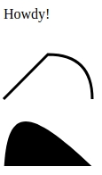

# Basics of D3

>Source [square.github.io](https://square.github.io/intro-to-d3/web-standards/) and the version of D3 is ```v5``` from [https://d3js.org/](https://d3js.org/)

I'll be using this template that you can use as well. Paste ```html``` code into the ```<body>``` and the ```css``` and ```js``` will be in separate files.

Example:
```html
<!DOCTYPE html>
<html>
<head>

    <title>Title</title>
    <link rel="stylesheet" type="text/css" href="styles.css">
    <script src="https://d3js.org/d3.v5.min.js"></script>

</head>
<body>

<!-- Insert HTML here!!! -->

<sbcript type="text/javascript" src="javascript.js"></script>

</body>
</html>
```

## DOM API versus the D3 API
A comparison of the DOM API for the regular javascript and D3:


### Ex 1: Basic Selection
HTML
```html
<div>
  <p>Normal paragraph</p>

  <p class="red">Red paragraph</p>
</div>

<ol>
  <li id="some-id">Unique element</li>
  <li>Another list element</li>
  <li>
    <p>Paragraph inside list element</p>
    <p>Second paragraph</p>
  </li>
</ol>
```

DOM API
```javascript
d3.select('#some-id')['_groups'][0][0]
// <li id="some-id">Unique element</li>
d3.select('p').size(); // select() only finds one
// 1
d3.selectAll('p').size(); // selectAll() finds all
// 4
var reds = d3.selectAll('.red');
// [ > Array[1] ]
reds.text();
// "Red paragraph"
```

D3 API
```
d3.select('p').size(); // select() only finds one
// 1
d3.selectAll('p').size(); // selectAll() finds all
// 4
var reds = d3.selectAll('.red');
// [ > Array[1] ]
reds.text();
// "Red paragraph"
```

### Ex 2: CSS
HTML
```html
<h1 id="click-me">
  Click on me!
</h1>

<p class="hover-me">
  Hover over me!
</p>

<p class="hover-me">
  OK now hover over here!
</p>

<p class="hover-me">
  Hover here too!
</p>
```

DOM API
```javascript
// DOM API
var clickMe = document.getElementById('click-me');
clickMe.onclick = function() {
  if (this.style.backgroundColor) {
    this.style.backgroundColor = '';
  } else {
    this.style.backgroundColor = 'red';
  }
}

var hoverMe = document.getElementsByClassName('hover-me');

for(var i=0; i<hoverMe.length;i++){
    hoverMe[i].onmouseover = function(){
        if (this.style.backgroundColor) {
            this.style.backgroundColor = '';
          } else {
            this.style.backgroundColor = 'yellow';
          }
        }
}
```

D3 DOM
```javascript
// D3 Selection API. Note: it attaches the
// callbacks to each element in the selection
d3.selectAll('.hover-me')
  .on('mouseover', function() {
    this.style.backgroundColor = 'yellow';
  })
  .on('mouseleave', function() {
    this.style.backgroundColor = '';
  });
```
> Note: In the D3 examples, the methods on the selection can chain (that is, they return themselves, so we can group them visually).


### Ex 3: SVG 
SVG (Scalable Vector Graphics) is an XML format used for drawing. You can think of SVG in a lot of the same terms as the DOM – there are elements with parents and children and attributes, and you can respond to the same mouse/touch events.

Even CSS styles and selectors can apply to SVG elements. The CSS attribute names for SVG come from the SVG definition, so they are sometimes different from their HTML brethren. (For example, to change the background color of a div to red you would select it then set background-color: red but to get the same effect on an SVG rectangle you would instead use the attribute fill: red since an SVG rect doesn’t respond to background-color for styling.)

SVG defines tags for lots of basic shapes, like ```<rect>``` and ```<circle>``` and ```<line>```.

HTML
```html
<svg width="300" height="180">
  <circle cx="30"  cy="50" r="25" />
  <circle cx="90"  cy="50" r="25" class="red" />
  <circle cx="150" cy="50" r="25" class="fancy" />

  <rect x="10"  y="80" width="40" height="40"
    fill="steelBlue" />
  <rect x="70"  y="80" width="40" height="40"
    style="fill: steelBlue" />
  <rect x="130" y="80" width="40" height="40"
    class="fancy" />
</svg>
```

CSS
```css
.red {
  fill: red; /* not background-color! */
}

.fancy {
  fill: none;
  stroke: black; /* similar to border-color */
  stroke-width: 3pt; /* similar to border-width */
  stroke-dasharray: 3,5,10;
}
```


### Ex4: ```<g>``` tag

Where HTML has the <div> and <span> tags, SVG has the <g> tag for an arbitrary group. You’ll see <g> a lot in D3 examples. They’re great for applying styles to a group (including re-positioning the groups).

The <text> tag is good for simple labels. The <path> tag is powerful but complex, it can be used for either lines or arbitrary filled-in shapes depending on the styling.

```html
<svg width="300" height="180">
  <g transform="translate(5, 15)">
    <text x="0" y="0">Howdy!</text>
  </g>

  <g transform="translate(5, 55)">
    <!-- M: move to (jump)
         L: line to
         Q: curve to (quadratic) -->
    <path d="M0,50 L50,0 Q100,0 100,50"
      fill="none" stroke-width="3" stroke="black" />
  </g>

  <g transform="translate(5, 105)">
    <!-- C: curve to (cubic)
         Z: close shape -->
    <path d="M0,100 C0,0 25,0 125,100 Z" fill="black" />
  </g>
</svg>
```


