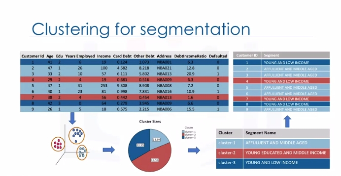
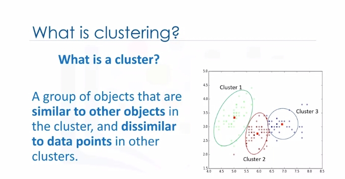
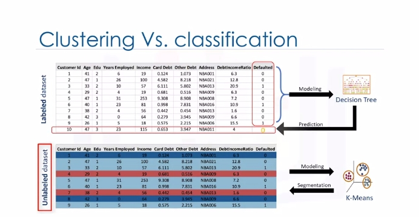
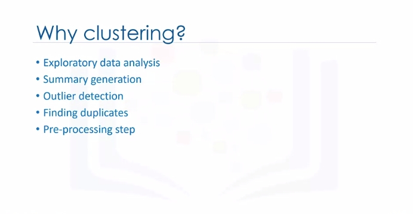
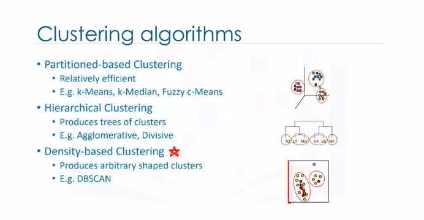
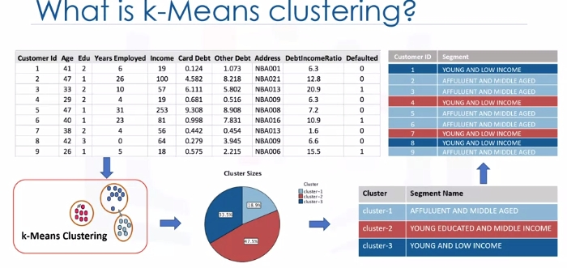
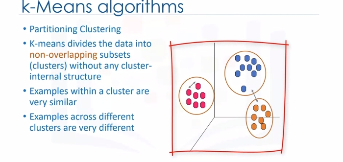
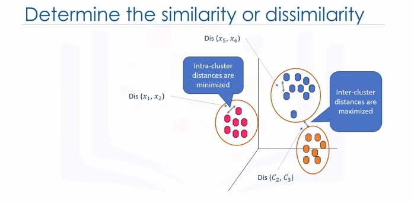
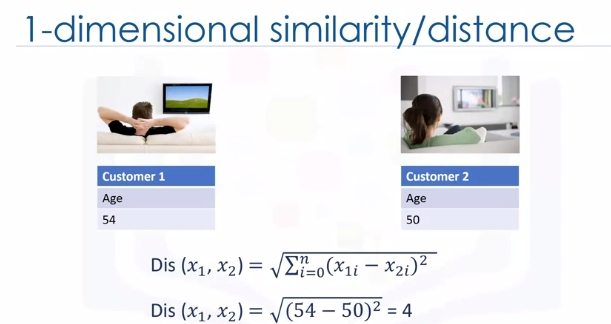

# Clustering

## Intro to Clustering

Customer segmentation is the practice of partitioning a customer base into groups of individuals that have similar characteristics. It is a significant strategy, as it allows the business to target specific groups of customers, so as to more effectively allocate marketing resources. For example, one group might contain customers who are high profit and low risk. That is, more likely to purchase products or subscribe for a service. Knowing this information allows a business to devote more time and attention to retaining these customers. Another group might include customers from nonprofit organizations and so on. 

Clustering means finding clusters in a dataset, unsupervised. So what is a cluster? A cluster is a group of data points or objects in a dataset that are similar to other objects in the group, and dissimilar to datapoints in other clusters. Now the question is," What is different between clustering and classification?"

Let's look at our customer dataset again. Classification algorithms predict categorical classed labels. This means assigning instances to predefined classes such as defaulted or not defaulted. For example, if an analyst wants to analyze customer data in order to know which customers might default on their payments, she uses a labeled dataset as training data and uses classification approaches such as a decision tree, Support Vector Machines or SVM, or logistic regression, to predict the default value for a new or unknown customer. Generally speaking, classification is a supervised learning where each training data instance belongs to a particular class. In clustering however, the data is unlabeled and the process is unsupervised. For example, we can use a clustering algorithm such as k-means to group similar customers as mentioned, and assign them to a cluster, based on whether they share similar attributes, such as; age, education, and so on.

 In the insurance industry, clustering is used for fraud detection in claims analysis, or to evaluate the insurance risk of certain customers based on their segments. In publication media, clustering is used to auto categorize news based on his content or to tag news, then cluster it so as to recommend similar news articles to readers. In medicine, it can be used to characterize patient behavior, based on their similar characteristics. So as to identify successful medical therapies for different illnesses or in biology, clustering is used to group genes with similar expression patterns or to cluster genetic markers to identify family ties.

## K-Means Clustering

Customer segmentation is the practice of partitioning a customer base into groups of individuals that have similar characteristics. One of the algorithms that can be used for customer segmentation is K-Means clustering. K-Means can group data only unsupervised based on the similarity of customers to each other. 

There are various types of clustering algorithms such as:

* Partitioning, hierarchical or density-based clustering.
* K-Means is a type of partitioning clustering, that is, it divides the data into K **non-overlapping** subsets or clusters without any cluster internal structure or labels. This means, it's an unsupervised algorithm. 
* Objects within a cluster are very similar
* Objects across different clusters are very different or dissimilar. As you can see, for using K-Means we have to find similar samples: for example, similar customers.

Now, we face a couple of key questions. First, how can we find the similarity of samples in clustering, and then how do we measure how similar two customers are with regard to their demographics?

Though the objective of K-Means is to form clusters in such a way that similar samples go into a cluster, and dissimilar samples fall into different clusters, it can be shown that instead of a similarity metric, we can use dissimilarity metrics. In other words, conventionally the distance of samples from each other is used to shape the clusters. So we can say K-Means tries to minimize the intra-cluster distances and maximize the inter-cluster distances. Now, the question is, how can we calculate the dissimilarity or distance of two cases such as two customers?

