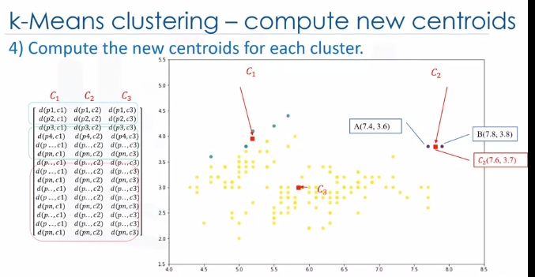

# Clustering

## Intro to Clustering

Customer segmentation is the practice of partitioning a customer base into groups of individuals that have similar characteristics. It is a significant strategy, as it allows the business to target specific groups of customers, so as to more effectively allocate marketing resources. For example, one group might contain customers who are high profit and low risk. That is, more likely to purchase products or subscribe for a service. Knowing this information allows a business to devote more time and attention to retaining these customers. Another group might include customers from nonprofit organizations and so on. 

Clustering means finding clusters in a dataset, unsupervised. So what is a cluster? A cluster is a group of data points or objects in a dataset that are similar to other objects in the group, and dissimilar to datapoints in other clusters. Now the question is," What is different between clustering and classification?"

Let's look at our customer dataset again. Classification algorithms predict categorical classed labels. This means assigning instances to predefined classes such as defaulted or not defaulted. For example, if an analyst wants to analyze customer data in order to know which customers might default on their payments, she uses a labeled dataset as training data and uses classification approaches such as a decision tree, Support Vector Machines or SVM, or logistic regression, to predict the default value for a new or unknown customer. Generally speaking, classification is a supervised learning where each training data instance belongs to a particular class. In clustering however, the data is unlabeled and the process is unsupervised. For example, we can use a clustering algorithm such as k-means to group similar customers as mentioned, and assign them to a cluster, based on whether they share similar attributes, such as; age, education, and so on.

 In the insurance industry, clustering is used for fraud detection in claims analysis, or to evaluate the insurance risk of certain customers based on their segments. In publication media, clustering is used to auto categorize news based on his content or to tag news, then cluster it so as to recommend similar news articles to readers. In medicine, it can be used to characterize patient behavior, based on their similar characteristics. So as to identify successful medical therapies for different illnesses or in biology, clustering is used to group genes with similar expression patterns or to cluster genetic markers to identify family ties.

## K-Means Clustering

Customer segmentation is the practice of partitioning a customer base into groups of individuals that have similar characteristics. One of the algorithms that can be used for customer segmentation is K-Means clustering. K-Means can group data only unsupervised based on the similarity of customers to each other. 

There are various types of clustering algorithms such as:

* Partitioning, hierarchical or density-based clustering.
* K-Means is a type of partitioning clustering, that is, it divides the data into K **non-overlapping** subsets or clusters without any cluster internal structure or labels. This means, it's an unsupervised algorithm. 
* Objects within a cluster are very similar
* Objects across different clusters are very different or dissimilar. As you can see, for using K-Means we have to find similar samples: for example, similar customers.

Now, we face a couple of key questions. First, how can we find the similarity of samples in clustering, and then how do we measure how similar two customers are with regard to their demographics?

Though the objective of K-Means is to form clusters in such a way that similar samples go into a cluster, and dissimilar samples fall into different clusters, it can be shown that instead of a similarity metric, we can use dissimilarity metrics. In other words, conventionally the distance of samples from each other is used to shape the clusters. So we can say K-Means tries to minimize the intra-cluster distances and maximize the inter-cluster distances. Now, the question is, how can we calculate the dissimilarity or distance of two cases such as two customers?

Assume that we have two customers, we will call them Customer one and two. Let's also assume that we have only one feature for each of these two customers and that feature is age. We can easily use a specific type of Minkowski distance to calculate the distance of these two customers. Indeed, it is the Euclidean distance. 

What about if we have more than one feature, for example, age and income?

For example, if we have income and age for each customer, we can still use the same formula but this time in a two-dimensional space.

Also, we can use the same distance matrix for multidimensional vectors. Of course, we have to normalize our feature set to get the accurate dissimilarity measure. There are other dissimilarity measures as well that can be used for this purpose, but it is highly dependent on datatype and also the domain that clustering is done for it. For example you may use Euclidean distance, cosine similarity, average distance, and so on. Indeed, the similarity measure highly controls how the clusters are formed, so it is recommended to understand the domain knowledge of your dataset and datatype of features and then choose the meaningful distance measurement.

Now, let's see how K-Means clustering works. For the sake of simplicity, let's assume that our dataset has only two features: the age and income of customers. This means, it's a two-dimensional space. We can show the distribution of customers using a scatter plot: 

The Y-axis indicates age and the X-axis shows income of customers. We try to cluster the customer dataset into distinct groups or clusters based on these two dimensions. 

In the first step, we should determine the number of clusters. The key concept of the K-Means algorithm is that it randomly picks a center point for each cluster. It means we must initialize K which represents number of clusters. Essentially, determining the number of clusters in a dataset or K is a hard problem in K-Means, that we will discuss later. 

For now, let's put K equals three here for our sample dataset. It is like we have three representative points for our clusters. 

These three data points are called centroids of clusters and should be of same feature size of our customer feature set. There are two approaches to choose these centroids. One, we can randomly choose three observations out of the dataset and use these observations as the initial means. 

Or two, we can create three random points as centroids of the clusters which is our choice that is shown in the plot with red color.

After the initialization step which was defining the centroid of each cluster, we have to assign each customer to the closest center. For this purpose, we have to calculate the distance of each data point or in our case each customer from the centroid points. As mentioned before, depending on the nature of the data and the purpose for which clustering is being used, different measures of distance may be used to place items into clusters. Therefore, you will form a matrix where each row represents the distance of a customer from each centroid. 

It is called the Distance Matrix. The main objective of K-Means clustering is to minimize the distance of data points from the centroid of this cluster and maximize the distance from other cluster centroids. 

So, in this step, we have to find the closest centroid to each data point. We can use the distance matrix to find the nearest centroid to datapoints. **Finding the closest centroids for each data point, we assign each data point to that cluster**. In other words, all the customers will fall to a cluster based on their distance from centroids. We can easily say that it does not result in good clusters because the centroids were chosen randomly from the first. Indeed, the model would have a high error. Here, error is the total distance of each point from its centroid. It can be shown as within-cluster sum of squares error.

> In case that was confusing, every dot is closest to one of the clusters mathematically. So assign every dot the category of the cluster center it is closest to. Redundant but hopefully helps.

Intuitively, we try to reduce this error. It means we should shape clusters in such a way that the total distance of all members of a cluster from its centroid be minimized. 

Now, the question is, how can we turn it into better clusters with less error?

Okay, we move centroids. In the next step, each cluster center will be updated to be the mean for datapoints in its cluster.

Indeed, each centroid moves according to their cluster members. In other words the centroid of each of the three clusters becomes the new mean. For example, if point A coordination is 7.4 and 3.6, and B point features are 7.8 and 3.8, the new centroid of this cluster with two points would be the average of them, which is 7.6 and 3.7. Now, we have new centroids. As you can guess, once again we will have to calculate the distance of all points from the new centroids. The points are reclustered and the centroids move again. This continues until the centroids no longer move. Please note that whenever a centroid moves, each point's distance to the centroid needs to be measured again.

Yes, K-Means is an iterative algorithm and we have to repeat steps two to four until the algorithm converges.

In each iteration, it will move the centroids, calculate the distances from new centroids and assign data points to the nearest centroid. It results in the clusters with minimum error or the most dense clusters. However, as it is a heuristic algorithm, there is no guarantee that it will converge to the global optimum and the result may depend on the initial clusters. It means, this algorithm is guaranteed to converge to a result, but the result may be a local optimum i.e. not necessarily the best possible outcome. To solve this problem, it is common to run the whole process multiple times with different starting conditions. This means with randomized starting centroids, it may give a better outcome. As the algorithm is usually very fast, it wouldn't be any problem to run it multiple times. Thanks for watching this video.

## More On K-Means (Evaluate Accuracy)

Euclidean distance is used to measure the distance from the object to the centroid. Please note, however, that you can also use different types of distance measurements, not just Euclidean distance. Euclidean distance is used because it's the most popular.

Now, the questions is, how can we evaluate the goodness of the clusters formed by k-Means? In other words, how do we calculate the accuracy of k-Means clustering? One way is to compare the clusters with the ground truth, if it's available. However, because k-Means is an unsupervised algorithm we usually don't have ground truth in real world problems to be used. 

But there is still a way to say how bad each cluster is, based on the objective of the k-Means. This value is the average distance between data points within a cluster.

Also, average of the distances of data points from their cluster centroids can be used as a metric of error for the clustering algorithm. 

Essentially, determining the number of clusters in a data set, or k as in the k-Means algorithm, is a frequent problem in data clustering. The correct choice of K is often ambiguous because it's very dependent on the shape and scale of the distribution of points in a dataset. There are some approaches to address this problem, but one of the techniques that is commonly used is to run the clustering across the different values of K and looking at a metric of accuracy for clustering.

This metric can be mean, distance between data points and their cluster's centroid, which indicate how dense our clusters are or, to what extent we minimize the error of clustering. Then, looking at the change of this metric, we can find the best value for K.
Play video starting at :2:49 and follow transcript2:49
But the problem is that with increasing the number of clusters, the distance of centroids to data points will always reduce. This means increasing K will always decrease the error. So, the value of the metric as a function of K is plotted and the elbow point is determined where the rate of decrease sharply shifts. It is the right K for clustering. This method is called the elbow method.

So let's recap k-Means clustering: k-Means is a partition-based clustering which is A, relatively efficient on medium and large sized data sets; B, produces sphere-like clusters because the clusters are shaped around the centroids; and C, its drawback is that we should pre-specify the number of clusters, and this is not an easy task. Thanks for watching. 

