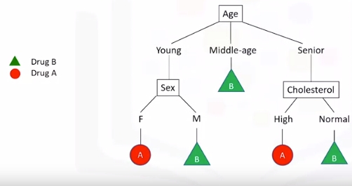
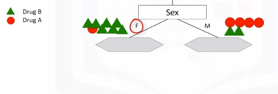
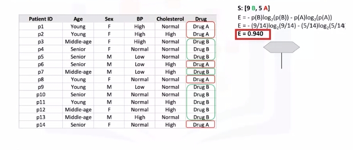
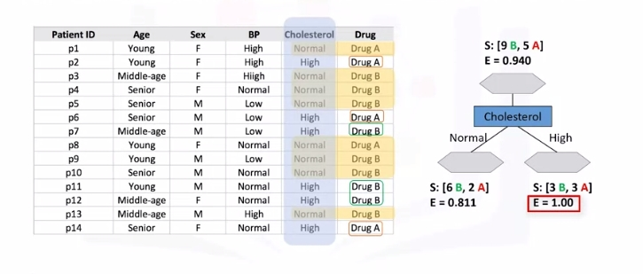
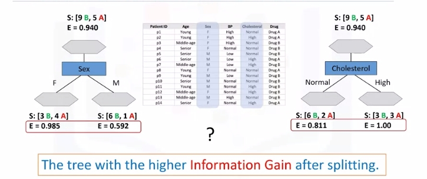
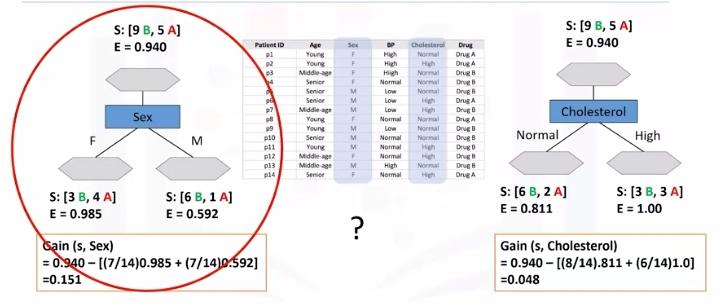

# Decision Trees
Source: [Machine_Learning_With_Python_IBM](https://www.coursera.org/learn/machine-learning-with-python)

## What Is A Decision Tree

Image a csv with patients and demographics and the target is the drug that each patient responded to. Part of your job is to build a model to find out which drug might be appropriate for a future patient with the same illness.

| patient_id | age        | sex | BP    | cholesterol | drug   |
|------------|------------|-----|-------|-------------|--------|
| p1         |      Young |   F |  High | Normal      | Drug A |
| p2         |      Young |   F |  High | High        | Drug A |
| p3         | Middle-age |   F |  High | Normal      | Drug B |
| p4         | Senior     |   F | Young | Normal      | Drug B |


> Note "B" is drug B and "A" is drug A.

1. If Middle-age recommend drug B
2. If either Young or Senior proceed to that branch and ask another relevant question...and so on

## Building Decision Trees
Refer to above dataset again. Use recursive partitioning to classify the data. We need to determine which attribute is the best or more predictive to split data based on the feature. Let's choose Cholesterol.

* If patient has high cholesterol we can't say with high confidence that drugB might be suitable. Same for normal.  


* Let's try sex. It is seems much better but not perfect.  


* Let's got a step further  


* For the male patient branch, we again test other attributes to split the sub-tree. We test cholesterol again here, as you can see it results in even more pure leaves. So we can easily make a decision here. For example, if a patient is male and his cholesterol is high, we can certainly prescribe drug A, but if it is normal, we can prescribe drug B with high confidence.

* As you might notice, the choice of attribute to split data is very important and it is all about purity of the leaves after the split. A node in the tree is considered pure if in 100 percent of the cases, the nodes fall into a specific category of the target field.

## Entropy
Impurity of nodes is calculated by entropy of data in the node. What is entropy? Entropy is the amount of information disorder or the amount of randomness in the data. The entropy in the node depends on how much random data is in that node and is calculated for each node. In decision trees, we're looking for trees that have the smallest entropy in their nodes.

* {"DrugA": 0, "DrugB": 8 } -> Entropy is 0
* {"DrugA": 1, "DrugB": 7 } -> Entropy is Low
* {"DrugA": 3, "DrugB": 5 } -> Entropy is High
* {"DrugA": 4, "DrugB": 4 } -> Entropy is 1

The lower the entropy , the less uniform the distribution.

$Entropy = -p(A)\log_2(p(A)) - p(B)\log_2(p(B))$
> $p(A)$ is the probability of drug A and is also x on the graph below

For reference: $y(x)=log_2(x)$
```bash
  |
  |
  |----0.1----0.2----0.3----0.4----0.5----0.6----0.7----0.8----0.9---- . ----
  |                                                .                      
-1|                                 .                   
  |                         .                           
  |                   .                                
-2|               .                                    
  |           .                                         
  |         .                                          
-3|       .                                             
```

* Calculate entropy before splitting it  

* After split  

* Another node, which has the least entropy? The answer is the tree with the higher information gain after splitting.  


## Information Gain
Information gain is the information that can increase the level of certainty after splitting. It is the entropy of a tree before the split minus the weighted entropy after the split by an attribute. We can think of information gain and entropy as opposites.

As entropy or the amount of randomness decreases, the information gain or amount of certainty increases and vice versa.

$Information Gain = (EntropyBeforeSplit) - (WeightedEntropyAfterSplit)$  

Ex:  

> Weights come from each node. For each decision, count total observations of that decision over total observations from both decisions

What we learn is that we should choose sex first when choosing between sex and cholesterol. How do we choose the next branch? Well, as you can guess, we should repeat the process for each branch and test each of the other attributes to continue to reach the most pure leaves. 