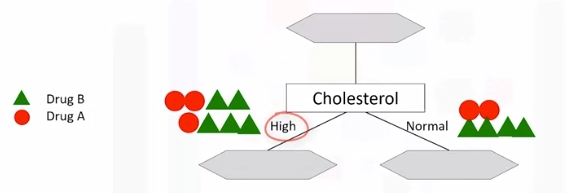

# Decision Trees
Source: [Machine_Learning_With_Python_IBM](https://www.coursera.org/learn/machine-learning-with-python)

## What Is A Decision Tree

Image a csv with patients and demographics and the target is the drug that each patient responded to. Part of your job is to build a model to find out which drug might be appropriate for a future patient with the same illness.

| patient_id | age        | sex | BP    | cholesterol | drug   |
|------------|------------|-----|-------|-------------|--------|
| p1         |      Young |   F |  High | Normal      | Drug A |
| p2         |      Young |   F |  High | High        | Drug A |
| p3         | Middle-age |   F |  High | Normal      | Drug B |
| p4         | Senior     |   F | Young | Normal      | Drug B |


> Note "B" is drug B and "A" is drug A.

1. If Middle-age recommend drug B
2. If either Young or Senior proceed to that branch and ask another relevant question...and so on

## Building Decision Trees
Refer to above dataset again. Use recursive partitioning to classify the data. We need to determine which attribute is the best or more predictive to split data based on the feature. Let's choose Cholesterol.

* If patient has high cholesterol we can't say with high confidence that drugB might be suitable. Same for normal.  


* Let's try sex. It is seems much better but not perfect.  


* Let's got a step further  


* For the male patient branch, we again test other attributes to split the sub-tree. We test cholesterol again here, as you can see it results in even more pure leaves. So we can easily make a decision here. For example, if a patient is male and his cholesterol is high, we can certainly prescribe drug A, but if it is normal, we can prescribe drug B with high confidence.

* As you might notice, the choice of attribute to split data is very important and it is all about purity of the leaves after the split. A node in the tree is considered pure if in 100 percent of the cases, the nodes fall into a specific category of the target field.

## Entropy
Impurity of nodes is calculated by entropy of data in the node. What is entropy? Entropy is the amount of information disorder or the amount of randomness in the data. The entropy in the node depends on how much random data is in that node and is calculated for each node. In decision trees, we're looking for trees that have the smallest entropy in their nodes.

* {"DrugA": 0, "DrugB": 8 } -> Entropy is 0
* {"DrugA": 1, "DrugB": 7 } -> Entropy is Low
* {"DrugA": 3, "DrugB": 5 } -> Entropy is High
* {"DrugA": 4, "DrugB": 4 } -> Entropy is 1

The lower the entropy , the less uniform the distribution.

$Entropy = -p(A)\log_2(p(A)) - p(B)\log_2(p(B))$
> $p(A)$ is the probability of drug A and is also x on the graph below

For reference: $y(x)=log_2(x)$
```bash
  |
  |
  |----0.1----0.2----0.3----0.4----0.5----0.6----0.7----0.8----0.9---- . ----
  |                                                .                      
-1|                                 .                   
  |                         .                           
  |                   .                                
-2|               .                                    
  |           .                                         
  |         .                                          
-3|       .                                             
```

* Calculate entropy before splitting it  

* After split  

* Another node, which has the least entropy? The answer is the tree with the higher information gain after splitting.  


## Information Gain
Information gain is the information that can increase the level of certainty after splitting. It is the entropy of a tree before the split minus the weighted entropy after the split by an attribute. We can think of information gain and entropy as opposites.

As entropy or the amount of randomness decreases, the information gain or amount of certainty increases and vice versa.

$Information Gain = (EntropyBeforeSplit) - (WeightedEntropyAfterSplit)$  

Ex:  

> Weights come from each node. For each decision, count total observations of that decision over total observations from both decisions

What we learn is that we should choose sex first when choosing between sex and cholesterol. How do we choose the next branch? Well, as you can guess, we should repeat the process for each branch and test each of the other attributes to continue to reach the most pure leaves. 

## Decision Tree Example
[classification_tree_svm.ipynb](JupyterNotebooks/classification_tree_svm.ipynb)
We will be exploring a decision tree and a support vector machine (SVM) to recognize fraudulent credit card transactions. You will use the trained model to assess if a credit card transaction is legitimate or not.

After completing this lab you will be able to:
* Perform basic data preprocessing in Python
* Model a classification task using the Scikit-Learn and Snap ML Python APIs
* Train Suppport Vector Machine and Decision Tree models using Scikit-Learn and Snap ML
* Run inference and assess the quality of the trained models

A transaction belongs to the positive class (1) if it is a fraud, otherwise it belongs to the negative class (0). You have access to transactions that occured over a certain period of time. The majority of the transactions are normally legitimate and only a small fraction are non-legitimate. Thus, typically you have access to a dataset that is highly unbalanced. This is also the case of the current dataset: only 492 transactions out of 284,807 are fraudulent (the positive class - the frauds - accounts for 0.172% of all transactions).

To train the model you can use part of the input dataset and the remaining data can be used to assess the quality of the trained model. First, let's download the dataset.

```bash
# Setup Environment
cd ~/Desktop; mkdir temp; cd temp; pyenv activate venv3.10.4;
# cd ~/Desktop; rm -r temp; # To remove
```
```python
import opendatasets as od

# download the dataset (this is a Kaggle dataset)
# during download you will be required to input your Kaggle username and password
od.download("https://www.kaggle.com/mlg-ulb/creditcardfraud")
```
```python
# Import the libraries we need to use in this lab
from __future__ import print_function
import numpy as np
import pandas as pd
import matplotlib.pyplot as plt
from sklearn.model_selection import train_test_split
from sklearn.preprocessing import normalize, StandardScaler
from sklearn.utils.class_weight import compute_sample_weight
from sklearn.metrics import roc_auc_score
import time
import warnings
warnings.filterwarnings('ignore')
# read the input data
raw_data = pd.read_csv('creditcardfraud/creditcard.csv')
print("There are " + str(len(raw_data)) + " observations in the credit card fraud dataset.")
print("There are " + str(len(raw_data.columns)) + " variables in the dataset.")
# display the first rows in the dataset
raw_data.head()
# In practice, a financial institution may have access to a much larger dataset of transactions. To simulate such a case, we will inflate the original one 10 times.
n_replicas = 10
# inflate the original dataset
big_raw_data = pd.DataFrame(np.repeat(raw_data.values, n_replicas, axis=0), columns=raw_data.columns)
print("There are " + str(len(big_raw_data)) + " observations in the inflated credit card fraud dataset.")
print("There are " + str(len(big_raw_data.columns)) + " variables in the dataset.")
# display first rows in the new dataset
big_raw_data.head()
# 'Class' is the target variable (1-fraud 0-otherwise)
# get the set of distinct classes
labels = big_raw_data.Class.unique()
# get the count of each class
sizes = big_raw_data.Class.value_counts().values
# plot the class value counts
fig, ax = plt.subplots()
ax.pie(sizes, labels=labels, autopct='%1.3f%%')
ax.set_title('Target Variable Value Counts')
plt.show()
```


