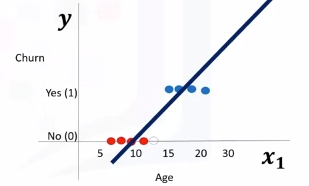

# Logistic Regression

## Intro to Logistic Regression
### Overview
Logistic regression is a statistical and machine learning technique for classifying records of a datastr based on the values of the input fields.

 Let's say we have a telecommunication dataset that we'd like to analyze in order to understand which customers might leave us next month. This is historical customer data where each row represents one customer. Imagine that you're an analyst at this company and you have to find out who is leaving and why? You'll use the dataset to build a model based on historical records and use it to predict the future churn within the customer group.

In logistic regression, we use one or more independent variables such as tenure, age, and income to predict an outcome, such as churn, which we call the dependent variable representing whether or not customers will stop using the service.  

Logistic regression is analogous to linear regression but tries to predict a categorical or discrete target field instead of a numeric one. In linear regression, we might try to predict a continuous value of variables such as the price of a house, blood pressure of a patient, or fuel consumption of a car. But in logistic regression, we predict a variable which is binary such as yes/no, true/false, successful or not successful, pregnant/not pregnant, and so on, all of which can be coded as zero or one.

In logistic regression independent variables should be continuous. If categorical, they should be dummy or indicator coded. This means we have to transform them to some continuous value.

Please note that logistic regression can be used for both binary classification and multi-class classification.

### Applications
* To predict the probability of a person having a heart attack within a specified time period
* Predict the chance of mortality in an injured patient
* Predict whether a patient has a given disease such as diabetes
* Predict the likelihood of a customer purchasing a product or halting a subscription as we've done in our churn example
* Probability of failure of a given process, system or product
* Predict the likelihood of a homeowner defaulting on a mortgage

>  Notice that in all these examples not only do we predict the class of each case, we also measure the probability of a case belonging to a specific class.

* one
    - inner 1
    - inner 2
* two

The question is, when should we use logistic regression?  

1. If your data is binary:  
    - 0/1, YES/NO, True/False  
2. If you need probabalistic results:  
3. When you need a linear decision boundary:  
    - The decision boundary of a logistic regression is a line or a plane or a hyper plane  
    - A classifier will classify all the points on one side of the decision boundary as belonging to one class and all those on the other side as belonging to the other class.  
    - For example, if we have just two features and are not applying any polynomial processing we can obtain an inequality like $\theta_0 + \theta_1x_1 + \theta_2x2 > 0$, which is a half-plane easily plottable.  
4. You need to understand the impact of a feature.
   - You can select the best features based on the statistical significance of the logistic regression model coefficients or parameters.
   - That is, after finding the optimum parameters, a feature X with the weight $\theta_1$ close to 0 has a smaller effect on the prediction than features with large absolute values of $\theta_1$.

* X is our dataset in the space of real numbers of m by n:  $X\epsilon \mathbb{R}^{m \times n}$  
* Y is the class that we want to predict: $y\epsilon\{0,1\}$, which can be either 0 or 1  
* Ideally, a logistic regression model, so-called Y hat, can predict that the class of the customer is one, given its features X: $\hat{y} = P(y=1|x)$  
 It can also be shown quite easily that the probability of a customer being in class zero can be calculated as one minus the probability that the class of the customer is one: $P(y=0|x)= 1 - P(y=1|x)$

### Logistic Regression vs Linear Regression

* We will learn the difference between linear regression and logistic regression.

* We go over linear regression and see why it cannot be used properly for some binary classification problems.

* We also look at the sigmoid function, which is the main part 
of logistic regression. 

Recall we want to predict the class of each customer $\hat{y} = P(y=1|x)$ and also the probability of each sample belonging to a class.

> y is the label's vector, also called **actual values**, that we would like to predict, and $\hat{y}$ is the vector of the predicted values by our model.

#### Let's Try Linear Regression
Let's use age to predict chrun (categorical value). We need to plot churn versus age which will have two horizontal areas of points for churn=0 and churn=1.

* Prediction can be represented as $\hat{y}=\theta_0 + \theta_1x_1$
* Where $\theta^T=[\theta_0,\theta_1,...,\theta_n]$
* Formally the line is $\theta^TX=\theta_0+\theta_1x_1+\theta_2x_2+...+\theta_nx_n$
* X (feature set) can be represented as: $X = \left[ \begin{array}{c} 1 \\ x_1 \\ x_2 \\ \end{array} \right]$

Seen here we can estimate the regression line and predict churn with $\theta^TX$. Let's try with 13 for $x_1$.

Then set a threshold of 0.5 for determining 0 or 1. Finally $\hat{y}$ can be represented as a piecewise function to force it to be categorical. In this example $P_1=[13]$ is Class 0. There is one problem here. What is the probability that this customer belongs to class zero?

As you can see, it's not the best model to solve this problem. Also, there are some other issues which verify that linear regression is not the proper method for classification problems. So, as mentioned, if we use the regression line to calculate the class of a point, it always returns a number such as three or negative two, and so on. Then, we should use a threshold, for example, 0.5, to assign that point to either class of zero or one. This threshold works as a step function that outputs zero or one regardless of how big or small, positive or negative the input is. So, using the threshold, we can find the class of a record. Notice that in the step function, no matter how big the value is, as long as it's greater than 0.5, it simply equals one and vice versa. Regardless of how small the value y is, the output would be zero if it is less than 0.5. In other words, there is no difference between a customer who has a value of one or 1,000. The outcome would be one. Instead of having this step function, wouldn't it be nice if we had a smoother line, one that would project these values between zero and one? 

Let's use the **Sigmoid Function**.

It gives a non-step function approach that gives us the probabilty that a point belongs to a certain class instead of the value of y directly.

Instead of calculating the value of Theta transpose x directly, it returns the probability that a Theta transpose x is very big or very small. It always returns a value between 0 and 1, depending on how large the Theta transpose x actually is. 

Now, our model is $\hat{y}=\sigma(\theta^TX)$, which represents the probability that the output is 1 given x.

#### Sigmoid Function
$\sigma(\theta^TX)=\frac{1}{1+e^{-\theta^TX}}$

When $\theta^T$ goes up $\sigma(\theta^TX)$ tends towards 1 and when small it tends to 0. This is the probability not the class itself.

...stopped at "what is the output of our model 10:52"
#### Logistic Regression
