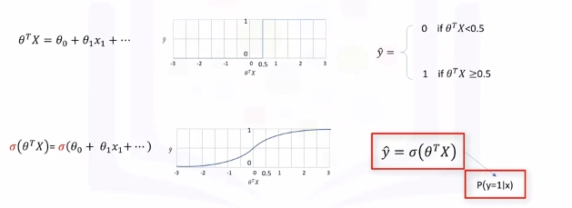
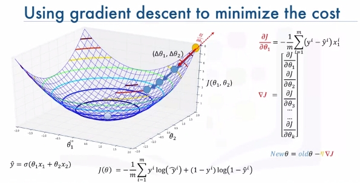

# Logistic Regression

## Intro to Logistic Regression
### Overview
Logistic regression is a statistical and machine learning technique for classifying records of a datastr based on the values of the input fields.

 Let's say we have a telecommunication dataset that we'd like to analyze in order to understand which customers might leave us next month. This is historical customer data where each row represents one customer. Imagine that you're an analyst at this company and you have to find out who is leaving and why? You'll use the dataset to build a model based on historical records and use it to predict the future churn within the customer group.

In logistic regression, we use one or more independent variables such as tenure, age, and income to predict an outcome, such as churn, which we call the dependent variable representing whether or not customers will stop using the service.  

Logistic regression is analogous to linear regression but tries to predict a categorical or discrete target field instead of a numeric one. In linear regression, we might try to predict a continuous value of variables such as the price of a house, blood pressure of a patient, or fuel consumption of a car. But in logistic regression, we predict a variable which is binary such as yes/no, true/false, successful or not successful, pregnant/not pregnant, and so on, all of which can be coded as zero or one.

In logistic regression independent variables should be continuous. If categorical, they should be dummy or indicator coded. This means we have to transform them to some continuous value.

Please note that logistic regression can be used for both binary classification and multi-class classification.

## Applications
* To predict the probability of a person having a heart attack within a specified time period
* Predict the chance of mortality in an injured patient
* Predict whether a patient has a given disease such as diabetes
* Predict the likelihood of a customer purchasing a product or halting a subscription as we've done in our churn example
* Probability of failure of a given process, system or product
* Predict the likelihood of a homeowner defaulting on a mortgage

>  Notice that in all these examples not only do we predict the class of each case, we also measure the probability of a case belonging to a specific class.

* one
    - inner 1
    - inner 2
* two


The question is, when should we use logistic regression?  

1. If your data is binary:  
    - 0/1, YES/NO, True/False  
2. If you need probabalistic results:  
3. When you need a linear decision boundary:  
    - The decision boundary of a logistic regression is a line or a plane or a hyper plane  
    - A classifier will classify all the points on one side of the decision boundary as belonging to one class and all those on the other side as belonging to the other class.  
    - For example, if we have just two features and are not applying any polynomial processing we can obtain an inequality like $\theta_0 + \theta_1x_1 + \theta_2x2 > 0$, which is a half-plane easily plottable.  
4. You need to understand the impact of a feature.
   - You can select the best features based on the statistical significance of the logistic regression model coefficients or parameters.
   - That is, after finding the optimum parameters, a feature X with the weight $\theta_1$ close to 0 has a smaller effect on the prediction than features with large absolute values of $\theta_1$.


* X is our dataset in the space of real numbers of m by n:  $X\epsilon \mathbb{R}^{m \times n}$  
* Y is the class that we want to predict: $y\epsilon\{0,1\}$, which can be either 0 or 1  
* Ideally, a logistic regression model, so-called Y hat, can predict that the class of the customer is one, given its features X: $\hat{y} = P(y=1|x)$  
 It can also be shown quite easily that the probability of a customer being in class zero can be calculated as one minus the probability that the class of the customer is one: $P(y=0|x)= 1 - P(y=1|x)$

## Logistic Regression vs Linear Regression

* We will learn the difference between linear regression and logistic regression.

* We go over linear regression and see why it cannot be used properly for some binary classification problems.

* We also look at the sigmoid function, which is the main part 
of logistic regression. 

Recall we want to predict the class of each customer $\hat{y} = P(y=1|x)$ and also the probability of each sample belonging to a class.

> y is the label's vector, also called **actual values**, that we would like to predict, and $\hat{y}$ is the vector of the predicted values by our model.

### Let's Try Linear Regression
Let's use age to predict chrun (categorical value). We need to plot churn versus age which will have two horizontal areas of points for churn=0 and churn=1.


* Prediction can be represented as $\hat{y}=\theta_0 + \theta_1x_1$
* Where $\theta^T=[\theta_0,\theta_1,...,\theta_n]$
* Formally the line is $\theta^TX=\theta_0+\theta_1x_1+\theta_2x_2+...+\theta_nx_n$
* X (feature set) can be represented as: $X = \left[ \begin{array}{c} 1 \\ x_1 \\ x_2 \\ \end{array} \right]$

Seen here we can estimate the regression line and predict churn with $\theta^TX$. Let's try with 13 for $x_1$.


Then set a threshold of 0.5 for determining 0 or 1. Finally $\hat{y}$ can be represented as a piecewise function to force it to be categorical. In this example $P_1=[13]$ is Class 0. There is one problem here. What is the probability that this customer belongs to class zero?

As you can see, it's not the best model to solve this problem. Also, there are some other issues which verify that linear regression is not the proper method for classification problems. So, as mentioned, if we use the regression line to calculate the class of a point, it always returns a number such as three or negative two, and so on. Then, we should use a threshold, for example, 0.5, to assign that point to either class of zero or one. This threshold works as a step function that outputs zero or one regardless of how big or small, positive or negative the input is. So, using the threshold, we can find the class of a record. Notice that in the step function, no matter how big the value is, as long as it's greater than 0.5, it simply equals one and vice versa. Regardless of how small the value y is, the output would be zero if it is less than 0.5. In other words, there is no difference between a customer who has a value of one or 1,000. The outcome would be one. Instead of having this step function, wouldn't it be nice if we had a smoother line, one that would project these values between zero and one? 

Let's use the **Sigmoid Function**.


It gives a non-step function approach that gives us the probabilty that a point belongs to a certain class instead of the value of y directly.

Instead of calculating the value of Theta transpose x directly, it returns the probability that a Theta transpose x is very big or very small. It always returns a value between 0 and 1, depending on how large the Theta transpose x actually is. 

Now, our model is $\hat{y}=\sigma(\theta^TX)$, which represents the probability that the output is 1 given x.

#### Sigmoid Function
$\sigma(\theta^TX)=\frac{1}{1+e^{-\theta^TX}}$

When $\theta^T$ goes up $\sigma(\theta^TX)$ tends towards 1 and when small it tends to 0. This is the probability not the class itself.

##### What is the output of our model?  
* $P(Y=1|X)$ - probability of Y=1 given X  
* $P(Y=0|X) = 1-P(Y=1|X)$ - probability of Y=0 given X

Ex:
* $P(Churn=1|income,age)$ = 0.8
* $P(Churn=0|income,age)$ = 1- 0.8 = 0.2

Now we can train our model to set its parameter values in such a way that our model is a good estimate of the probablity of Y given X:  $\sigma(\theta^TX)$ -> $P(y=1|x)$.

* $\sigma$ is model.
* $P(y=1|x)$ and $P(y=0|x)$ are actual probabilities. 

##### How to train this model?
$\sigma(\theta^TX)$ -> $P(y=1|x)$

1. Initialize $\theta$ with random values: $\theta$ = [-1, 2]
2. Calculate model output $\hat{y} = \sigma(\theta^TX)$ for a sample customer.  
   $\hat{y} = \sigma([-1,2]] x [2,5])$ = 0.7 - "2 and 5 are age and income"
3. Compare the output of $\hat{y}$ with the actual output of custom, y, and record it as error. Example: $Error = 1 - 0.7 = 0.3$. 1 Here was Churn and 0.7 was the probability of Chrun from model
4. Calculate the error for all customers. Add up these errors. Total error is the cost of your model and is calculated by your models cost function. The cost function, by the way, basically represents how to calculate the error of the model which is the difference between the actual and the models predicted values. You want low cost (preferrably 0).
5. Cost is high right now. We need to change to get lower cost. We change $\theta$ in such a way to hopefully reduce the total cost. 
6. Go back to step 2. and iterate to get a new cost. We do this until the cost is low enough.

One of the most popular ways is gradient descent. Also, there are various ways to stop iterations, but essentially you stop training by calculating the accuracy of your model and stop it when it's satisfactory. 

## Logistic Regression Training
Objective - $\sigma(\theta^TX)$ -> $P(y=1|x)$

Let's look at the cost function.

Cost($\hat{y}, y$) = $\sigma(\theta^TX) - y$

Usually the square of this equation is used because of the possibility of the negative result and for the sake of simplicity, half of this value is considered as the cost function through the derivative process.

Cost($\hat{y}, y$) = $\frac{(\sigma(\theta^TX) - y)^2}{2}$

> Note this is for a particular sample.

If we want for all samples we need a new equation:  
$J(\theta) = \frac{1}{m} \sum_{i-1}^mCost(\hat{y},y)$

> This confused me for a second as $\theta$ refers to the models parameters. It's the cost across all samples divided by the number of samples. This is also called **mean squared error**. The reason it's a function of $\theta$ is because all this "cost" we are measuring is for a specific set of $\theta$ parameters.

Now, how do we find or set the best weights or parameters that minimize this cost function? The answer is, we should calculate the minimum point of this cost function and it will show us the best parameters for our model.

Although we can find the minimum point of a function using the derivative of a function, there's not an easy way to find the global minimum point for such an equation. Given this complexity, describing how to reach the global minimum for this equation is outside the scope of this video.

So, what is the solution? Well we should find another cost function instead, one which has the same behavior but is easier to find its minimum point. Let's plot the desirable cost function for our model. 

Let's plot the desirable cost function for our model. Recall that our model is y hat. Our actual value is y which equals zero or one, and our model tries to estimate it as we want to find a simple cost function for our model.

This means our model is best if it estimates y equals one. In this case, we need a cost function that returns zero if the outcome of our model is one, which is the same as the actual label. And the cost should keep increasing as the outcome of our model gets farther from one. And cost should be very large if the outcome of our model is close to zero. 

We can see that a function $-log(\hat{y})$ looks similar to how we want to model this:


Recall the derivative of the cost function was hard to calculate. So instead we define as:

\[
Cost(\hat{y},y) = 
\begin{cases}
  -log(\hat{y}) & \text{if } y = 1 \\
  -log(1-\hat{y}) & \text{if } y = 0
\end{cases}
\]

and redefine $J(\theta)$ as:  
$J(\theta) = \frac{1}{m} \sum_{i-1}^m y^i log(\hat{y}^i) + (1-y^i) log(1-\hat{y}^i)$

### Gradient Descent To Minimize the Cost
Let's assume $\hat{y} = \sigma(\theta_1x_i + \theta_2x_2)$  

and

$J(\theta) = \frac{1}{m} \sum_{i-1}^m y^i log(\hat{y}^i) + (1-y^i) log(1-\hat{y}^i)$

Imagine that it makes a bowl as shown:


We need to find the minimum of this cost function. We change the parameters of $(\Delta\theta_1,\Delta\theta_2)$. We keep taking steps. First while slope is large we take larger steps. As slope gets smaller we take smaller steps.

#### How do we calculate slope?
$\frac{\delta J}{\delta \theta_1}$ = $-\frac{1}{m}\sum_i^m(y^i-\hat{y})x_1^i$

> It's technically some math proof we should look up if we are interested. If the derivative of J is positive with respect to $\theta_1$ then J increases as $\theta1$ increases. This tells us to move in the opposite direction. We can take smaller steps as the slop decreases.

That is just for $\theta_1$. We can represent the vector of all the slopes as the gradient vector:
$\nabla J = 
\left[ 
\begin{array}{c} 
\frac{\delta J}{\delta \theta_1} \\ 
\frac{\delta J}{\delta \theta_2} \\ 
\frac{\delta J}{\delta \theta_3} \\ 
... \\ 
\frac{\delta J}{\delta \theta_k} \\ 
\end{array} 
\right]$

We can use this vector to change or update all parameters. We take the previous values of the parametes and subtract the error derivative. This results in the new parameters for $\theta$ that we know decrease the cost.

$New\theta = old\theta - \nabla J$

> Note: Units of gradient vector are $\delta loss/ \delta \theta$ so that it matches $\theta$'s units. We can change all weights a little bit to move towards lower loss. 

Last we add a learning rate $\mu$ (dimensionless number | hyperparameter) to change the step we take towards lowering the cost.

$New\theta = old\theta - \mu \nabla J$

## Logistic Regression Code Example
```bash
# Setup Environment
cd ~/Desktop; rm -r temp; # To remove
cd ~/Desktop; mkdir temp; cd temp; pyenv activate venv3.10.4;
```
A telecommunications company is concerned about the number of customers leaving their land-line business for cable competitors. They need to understand who is leaving. Imagine that you are an analyst at this company and you have to find out who is leaving and why.

The dataset includes information about:
*   Customers who left within the last month – the column is called Churn
*   Services that each customer has signed up for – phone, multiple lines, internet, online security, online backup, device protection, tech support, and streaming TV and movies
*   Customer account information – how long they had been a customer, contract, payment method, paperless billing, monthly charges, and total charges
*   Demographic info about customers – gender, age range, and if they have partners and dependents
Download the data:
```bash
wget "https://cf-courses-data.s3.us.cloud-object-storage.appdomain.cloud/IBMDeveloperSkillsNetwork-ML0101EN-SkillsNetwork/labs/Module%203/data/ChurnData.csv"
```
```python
import pandas as pd
import pylab as pl
import numpy as np
import scipy.optimize as opt
from sklearn import preprocessing
import matplotlib.pyplot as plt
from sklearn.model_selection import train_test_split
from sklearn.linear_model import LogisticRegression
from sklearn.metrics import confusion_matrix
from sklearn.metrics import jaccard_score
from sklearn.metrics import classification_report
from sklearn.metrics import log_loss
import itertools

churn_df = pd.read_csv("ChurnData.csv")
churn_df.head()
# Let's select some features for the modeling.
churn_df = churn_df[['tenure', 'age', 'address', 'income', 'ed', 'employ', 'equip',   'callcard', 'wireless','churn']]
churn_df['churn'] = churn_df['churn'].astype('int')
churn_df.head()
```
> Also, we change the target data type to be an integer, as it is a requirement by the skitlearn algorithm:

```python
# Define X and Y for the dataset
X = np.asarray(churn_df[['tenure', 'age', 'address', 'income', 'ed', 'employ', 'equip']])
X[0:5]
y = np.asarray(churn_df['churn'])
y [0:5]
# Normalize the dataset
X = preprocessing.StandardScaler().fit(X).transform(X)
X[0:5]
# Train\Test
X_train, X_test, y_train, y_test = train_test_split( X, y, test_size=0.2, random_state=4)
print ('Train set:', X_train.shape,  y_train.shape)
print ('Test set:', X_test.shape,  y_test.shape)
```
Let's build our model using **LogisticRegression** from the Scikit-learn package. This function implements logistic regression and can use different numerical optimizers to find parameters, including ‘newton-cg’, ‘lbfgs’, ‘liblinear’, ‘sag’, ‘saga’ solvers. You can find extensive information about the pros and cons of these optimizers if you search it in the internet.

The version of Logistic Regression in Scikit-learn, support regularization. Regularization is a technique used to solve the overfitting problem of machine learning models.
**C** parameter indicates **inverse of regularization strength** which must be a positive float. Smaller values specify stronger regularization.
Now let's fit our model with train set:

```python
LR = LogisticRegression(C=0.01, solver='liblinear').fit(X_train,y_train)
LR
# Predict on test set
yhat = LR.predict(X_test)
yhat
```
**predict_proba**  returns estimates for all classes, ordered by the label of classes. So, the first column is the probability of class 0, P(Y=0|X), and second column is probability of class 1, P(Y=1|X):
```python
yhat_prob = LR.predict_proba(X_test)
yhat_prob
# Evaluation (Jaccard Index)
jaccard_score(y_test, yhat,pos_label=0)
# Confusion Matrix
def plot_confusion_matrix(cm, classes,
                          normalize=False,
                          title='Confusion matrix',
                          cmap=plt.cm.Blues):
    """
    This function prints and plots the confusion matrix.
    Normalization can be applied by setting `normalize=True`.
    """
    if normalize:
        cm = cm.astype('float') / cm.sum(axis=1)[:, np.newaxis]
        print("Normalized confusion matrix")
    else:
        print('Confusion matrix, without normalization')
    print(cm)
    plt.imshow(cm, interpolation='nearest', cmap=cmap)
    plt.title(title)
    plt.colorbar()
    tick_marks = np.arange(len(classes))
    plt.xticks(tick_marks, classes, rotation=45)
    plt.yticks(tick_marks, classes)
    fmt = '.2f' if normalize else 'd'
    thresh = cm.max() / 2.
    for i, j in itertools.product(range(cm.shape[0]), range(cm.shape[1])):
        plt.text(j, i, format(cm[i, j], fmt),
                 horizontalalignment="center",
                 color="white" if cm[i, j] > thresh else "black")
    plt.tight_layout()
    plt.ylabel('True label')
    plt.xlabel('Predicted label')

print(confusion_matrix(y_test, yhat, labels=[1,0]))
# Plot Confusion Matrix
# Compute confusion matrix
cnf_matrix = confusion_matrix(y_test, yhat, labels=[1,0])
np.set_printoptions(precision=2)
# Plot non-normalized confusion matrix
plt.figure()
plot_confusion_matrix(cnf_matrix, classes=['churn=1','churn=0'],normalize= False,  title='Confusion matrix')
plt.show()
# Print Classification Report
print (classification_report(y_test, yhat))
log_loss(y_test, yhat_prob)
```
