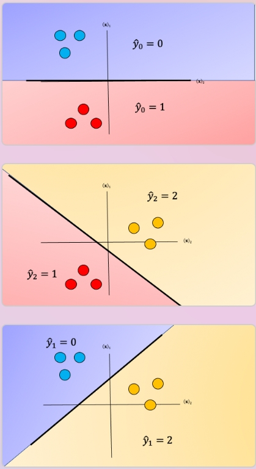

# Multiclass Prediction

## SoftMax Regression, One-vs-All & One-vs-One for Multi-class Classification

Unlike classification trees and nearest neighbors, the concept of Multi-class classification for linear classifiers is not as straightforward. We can convert logistic regression to Multi-class classification using multinomial logistic regression or SoftMax regression; this is a generalization of logistic regression. SoftMax regression will not work for Support Vector Machines (SVM); One vs. All (One-vs-Rest) and One vs One are two other multi-class classification techniques that can convert most two-class classifiers to a multi-class classifier.

## SoftMax Regression
SoftMax regression is similar to logistic regression, the SoftMax function converts the actual distances i.e. dot products of $x$ with each of the parameters $\theta_i$ for $K$ classes in the range from 0 to $K-1$. This is converted to probabilities using the following formula.

$softmax(x,i) = \frac{e^{-\theta_i^Tx}}{\sum_{j=1}^{K}e^{-\theta_j^Tx}}$

The training procedure is almost identical to logistic regression using cross-entropy, but the prediction is different. Consider the three-class example where:

$y$ $\epsilon$ {$0,1,2$} i.e. $y$ can equal 0,1,2.  We would like to classify $x$. We can use the SoftMax function to generate a probability of how likely the sample belongs to each class. We then  make a **prediction** using the argmax function:

$\hat{y} = argmax_i(softmax(x,i))$

Let’s do an example, consider sample $x_i$ , we will start by creating a table where each column will be the $i−th$ values of the SoftMax function. The index of each column is the same as the class. 

|                               |                               |                               |
|-------------------------------|-------------------------------|-------------------------------|
| probability of $\hat{y} = 0$  | probability of $\hat{y} = 1$  | probability of $\hat{y} = 2$  |
| softmax($x_1$,0)              | softmax($x_1$ ,1)             | softmax($x_1$ ,2)             |
| i=0                           | i=1                           | i=2                           |

Sample output probabilities (notice they add to 1):
|                               |                               |                               |
|-------------------------------|-------------------------------|-------------------------------|
| 0.97                          | 0.02                          | 0.01                          |
| i = 0                         | i = 1                         | i = 2                         |

We can represent the probability as a vector [0.97, 0.02, 0.01]. To get the class we simply apply the *argmax* function, this returns the index of the largest value.

$\hat{y} = argmax_i([0.97, 0.02, 0.01])$

### Geometric Inerpretation  

Each $\theta_i^Tx$ is the equation of a hyperplane, we plot the intersection of the three hyperplanes with 0 (I don't know what this means -BB-) in fig 1 as colored lines, in addition, we can overlay several training samples. We also shade the regions where the value of 
$\theta_i^Tx$ is largest, this also corresponds to the largest probability. This color corresponds to where a sample 
$x$ would be classified.  For example if the input is in the blue region, the sample would be classified $\hat{y}=0$, If the input is in the red region it would be classified as $\hat{y}=1$, and in the yellow region $\hat{y}=2$. We will use this convention going forward. 


One problem with SoftMax regression with cross-entropy is it cannot be used for SVM and other types of two-class classifiers.  

## One-vs-All
For one-vs-All classification, if we have $K$ classes, we use $K$ two-class classifier models, the number of class labels present in the dataset is equal to the number of generated classifiers. First, we create an artificial class. We will call this "dummy" class. For each classifier, we split the data into two classes. We take the class samples we would like to classify; the rest of the samples will be labelled as a dummy class. We repeat the process for each class. To make a  classification, we can use majority vote or use the classifier with the highest probability, disregarding the probabilities generated for the dummy class. 

## Multi-class Classification
Although classifiers such as logistic regression and SVM class values are {0,1} and {−1,1} respectively, we will use arbitrary class values. Consider the following samples colored according to class y=0 for blue, y=1 for red, and y=2 for yellow:


For each class we take the class samples we would like to classify, and the rest will be labeled as a “dummy” class. For example, to build a classifier for the blue class we simply assign all other labels that are not in the blue class to the Dummy class, we then train the classifier accordingly. The result is shown in fig 3 where the classifier predicts blue 
$\hat{y} = 0$ and in the purple region where we have our “dummy class" $\hat{y} = dummy$.


We repeat the process for each class as shown in Fig 4, the actual class is shown with the same color and the corresponding dummy class is shown in purple. The color of the space is the actual classifier predictions shown in the same manner as above.


One issue with one vs all is the ambiguous regions as shown in Fig 5 in purple. In these regions you may get multiple classes for example $\hat{y}_0=0$ and $\hat{y}_1=1$ or all the outputs will equal ”dummy.”


There are several ways to reduce this ambiguous region, you can use the output based on the output of the linear function this is called the fusion rule. We can also use the probability of a sample belonging to the actual class as shown in Fig 6, where we select the class with the largest probability in this case $\hat{y}_0=0$; we disregard the dummy values. These probabilities are scores, as the probabilities are between the dummy class and the actual class not between classes. Just a note packages like Scikit-learn can output probabilities for SVM. 


> I think this chart is misleading as it makes it see like the model is confident that its prediction is either $\hat{y}_0$, $\hat{y}_1$ or $\hat{y}_2$. In reality I think the likely scenarios is one where your data was always a "dummy" and you get likelihoods that look like:

* $P(\hat{y}_0 = 0 | x) = 0.45$
* $P(\hat{y}_1 = 0 | x) = 0.39$
* $P(\hat{y}_2 = 0 | x) = 0.28$

Not confident anywhere but at least mostly confident in $\hat{y}_0$.

## One-vs-One Classification
In One-vs-One classification, we split up the data into each class; we then train a two-class classifier on each pair of classes. For example, if we have class 0,1, and 2, we would train one classifier on the samples that are class 0 and class 1, a second classifier on samples that are of class 0 and class 2, and a final classifier on samples of class 1 and class 2. Fig 7 is an example of class 0 vs class 1, where we drop training samples  of class 2.  Using the same convention as above where the color of the training samples are based on their class. The separating plane of the classifier is in black.  The color represents the output of the classifier for that particular point in space.  


We repeat the process for each pair of classes, in Fig 8. For $K$ classes, we have to train $K \frac{K−1}{2}$classifiers. So if $K=3$, we have $(3×2)/2=3$ classes.



To perform Classification on a sample, we perform a majority vote where we select the class with the most predictions.  This is shown in Fig  9 where the black point represents a new sample and the output of each classifier is shown in the table. In this case, the final output is one as selected by two of the three classifiers. There is also an ambiguous region but it’s smaller, we can also use similar schemes as in One vs all like the fusion rule or using the probability. Check out the labs for more.  


## Lab

```bash
# Setup Environment
cd ~/Desktop; rm -r temp; # To remove
cd ~/Desktop; mkdir temp; cd temp; pyenv activate venv3.10.4;
```

```python
import numpy as np
import matplotlib.pyplot as plt
from sklearn import datasets
from sklearn.svm import SVC
from sklearn.linear_model import LogisticRegression
from sklearn.metrics import accuracy_score
from sklearn.metrics import classification_report
from sklearn.metrics import f1_score
import pandas as pd

plot_colors = "ryb"
plot_step = 0.02
# This functions Plots different decision boundary 
def decision_boundary (X,y,model,iris, two=None):
    x_min, x_max = X[:, 0].min() - 1, X[:, 0].max() + 1
    y_min, y_max = X[:, 1].min() - 1, X[:, 1].max() + 1
    xx, yy = np.meshgrid(np.arange(x_min, x_max, plot_step),
                         np.arange(y_min, y_max, plot_step))
    plt.tight_layout(h_pad=0.5, w_pad=0.5, pad=2.5)    
    Z = model.predict(np.c_[xx.ravel(), yy.ravel()])
    Z = Z.reshape(xx.shape)
    cs = plt.contourf(xx, yy, Z,cmap=plt.cm.RdYlBu)
    if two:
        cs = plt.contourf(xx, yy, Z,cmap=plt.cm.RdYlBu)
        for i, color in zip(np.unique(y), plot_colors):
            
            idx = np.where( y== i)
            plt.scatter(X[idx, 0], X[idx, 1], label=y,cmap=plt.cm.RdYlBu, s=15)
        plt.show()
    else:
        set_={0,1,2}
        print(set_)
        for i, color in zip(range(3), plot_colors):
            idx = np.where( y== i)
            if np.any(idx):
                set_.remove(i)
                plt.scatter(X[idx, 0], X[idx, 1], label=y,cmap=plt.cm.RdYlBu, edgecolor='black', s=15)
        for  i in set_:
            idx = np.where( iris.target== i)
            plt.scatter(X[idx, 0], X[idx, 1], marker='x',color='black')
        plt.show()

# This function will plot the probability of belonging to each class; each column is the probability of belonging to a class the row number is the sample number.
def plot_probability_array(X,probability_array):
    plot_array=np.zeros((X.shape[0],30))
    col_start=0
    ones=np.ones((X.shape[0],30))
    for class_,col_end in enumerate([10,20,30]):
        plot_array[:,col_start:col_end]= np.repeat(probability_array[:,class_].reshape(-1,1), 10,axis=1)
        col_start=col_end
    plt.imshow(plot_array)
    plt.xticks([])
    plt.ylabel("samples")
    plt.xlabel("probability of 3 classes")
    plt.colorbar()
    plt.show()

# In ths lab we will use the  iris dataset, it consists of 3 different types of irises’ (Setosa y=0, Versicolour y=1, and Virginica y=2) or targets and petal and sepal length and width (data), stored in a 150x4 numpy.ndarray.
pair=[1, 3]
iris = datasets.load_iris()
X = iris.data[:, pair]
y = iris.target
np.unique(y)
# plot
plt.scatter(X[:, 0], X[:, 1], c=y, cmap=plt.cm.RdYlBu)
plt.xlabel("sepal width (cm)")
plt.ylabel("petal width")
plt.show()
```
SoftMax regression is similar to logistic regression, the softmax function converts the actual distances i.e. dot products of $x$ with each of the parameters $\theta_i$ for the $K$ classes. This is converted to probabilities using the following:

$softmax(x,i) = \frac{e^{ \theta_i^T \bf x}}{\sum_{j=1}^K e^{\theta_j^T x}}$

```python
# Softmax Regression
# sklearn does this automatically, but we can verify the prediction step, we fit the model:
lr = LogisticRegression(random_state=0).fit(X, y)
# Generate probability uing predict_proba
probability=lr.predict_proba(X)
# We can plot the probability of belonging to each class; each column is the probability of belonging to a class the row number is the sample number.
plot_probability_array(X,probability)
# First sample
probability[0,:]
# We see it sums to 1
probability[0,:].sum()
# Apply argmax for first prediction
np.argmax(probability[0,:]) # 0
# We can apply to each sample
softmax_prediction=np.argmax(probability,axis=1)
softmax_prediction
# we took lr.predict_proba, applied argmax across all probabilities of all classes to get prediction
# can have lr do all this with lr.predict. Here we test they are the same:
yhat =lr.predict(X)
accuracy_score(yhat,softmax_prediction) # 1
```

We can't use Softmax regression for SVMs let explore two methods of Multi-class Classification. that we can apply to SVM.

Sklean performs Multi-class Classification automatically, we can apply the method and calculate the accuracy. Train a SVM classifier with the `kernel` set to `linear`, `gamma` set to `0.5`, and the `probability` paramter set to `True`, then train the model using the `X` and `y` data.

## SVM 
```python
# linear kernel
linear_svm = SVC(kernel='linear', gamma=0.5, probability=True)
linear_svm.fit(X, y) 
yhat = linear_svm.predict(X)
print (classification_report(y, yhat))
# f1_score
f1_score(y, yhat, average='weighted') 
# notice accuracy_score
accuracy_score(y, yhat)
# plot decision boundary
decision_boundary (X,y,linear_svm,iris)
```

## One vs All
For one-vs-All classification, if we have K classes, we use K  two-class classifier models—the number of class labels present in the dataset is equal to the number of generated classifiers. First, we create an artificial class we will call this "dummy" class. For each classifier, we split the data into two classes.  We take the class samples we would like to classify; the rest of the samples will be labelled as a dummy class. We repeat the process for each class. To make a  classification, we use the classifier with the highest probability, disregarding the dummy class.

```python
#dummy class
dummy_class=y.max()+1
#list used for classifiers 
my_models=[]
#iterate through each class
for class_ in np.unique(y):
    #select the index of our  class
    select=(y==class_)
    temp_y=np.zeros(y.shape)
    #class, we are trying to classify 
    temp_y[y==class_]=class_
    #set other samples  to a dummy class 
    temp_y[y!=class_]=dummy_class
    #Train model and add to list 
    model=SVC(kernel='linear', gamma=.5, probability=True)    
    my_models.append(model.fit(X,temp_y))
    #plot decision boundary 
    decision_boundary (X,temp_y,model,iris)

```


For each sample we calculate the  probability of belonging to each class, not including the dummy class.

```python
probability_array=np.zeros((X.shape[0],3))
for j,model in enumerate(my_models):
    real_class=np.where(np.array(model.classes_)!=3)[0]
    probability_array[:,j]=model.predict_proba(X)[:,real_class][:,0]

# first sample
probability_array[0,:]
# As each is the probability of belonging to the actual class and not the dummy class is does not sum to one. 
probability_array[0,:].sum()
# We can plot the probability of belonging to the class. The row number is the sample number.
plot_probability_array(X,probability_array)
# We can apply the argmax function to each sample to find the class 
one_vs_all=np.argmax(probability_array,axis=1)
one_vs_all
# we can calculate the accuracy 
accuracy_score(y,one_vs_all)
# We see the accuracy is less than the one obtained by sklearn, and this is because for SVM sklearn uses one vs one; let's verify it by comparing the outputs. 
accuracy_score(one_vs_all,yhat)
# we see that the output are different, now lets implement one vs one 
```


## One vs One


In One-vs-One classification, we split up the data into each class; we then train a two-class classifier on each pair of classes. For example, if we have class 0,1,2, we would train one classifier on the samples that are class 0 and class 1, a second classifier on samples that are of class 0 and class 2 and a final classifier on samples of class 1 and class 2.

For $K$ classes, we have to train  $K(K-1)/2$  classifiers. So if $K=3$, we have $(3x2)/2=3$ classes.

To perform classification on a sample, we perform a majority vote and select the class with the most predictions. 

```python
# list each class
classes_=set(np.unique(y))
classes_
# determine the number of classifiers:
K=len(classes_)
K*(K-1)/2
# We then train a two-class classifier on each pair of classes. We plot the different training points for each of the two classes 
pairs=[]
left_overs=classes_.copy()
#list used for classifiers 
my_models=[]
#iterate through each class
for class_ in classes_:
    #remove class we have seen before 
    left_overs.remove(class_)
    #the second class in the pair
    for second_class in left_overs:
        pairs.append(str(class_)+' and '+str(second_class))
        print("class {} vs class {} ".format(class_,second_class) )
        temp_y=np.zeros(y.shape)
        #find classes in pair 
        select=np.logical_or(y==class_ , y==second_class)
        #train model 
        model=SVC(kernel='linear', gamma=.5, probability=True)  
        model.fit(X[select,:],y[select])
        my_models.append(model)
        #Plot decision boundary for each pair and corresponding Training samples. 
        decision_boundary (X[select,:],y[select],model,iris,two=True)

# pairs 
pairs # ['0 and 1', '0 and 2', '1 and 2']
```


```python
# As we can see, our data is left-skewed, containing greater number of '5' star reviews. 
# (This means the blue regions have more data points)
# Here, we are ploting the disribution of ext length
pairs
majority_vote_array=np.zeros((X.shape[0],3))
majority_vote_dict={}
for j,(model,pair) in enumerate(zip(my_models,pairs)):
    majority_vote_dict[pair]=model.predict(X)
    majority_vote_array[:,j]=model.predict(X)

pd.DataFrame(majority_vote_dict).head(10)
pd.DataFrame(majority_vote_dict).iloc[60:70]

# To perform classification on a sample, we perform a majority vote i.e. select the class with the most predictions. We repeat the process for each sample. 
one_vs_one=np.array([np.bincount(sample.astype(int)).argmax() for sample  in majority_vote_array]) 
one_vs_one
# We calculate the accuracy:
accuracy_score(y,one_vs_one)
# we compare it to sklearn , it's the same! 
accuracy_score(yhat,one_vs_one)
```