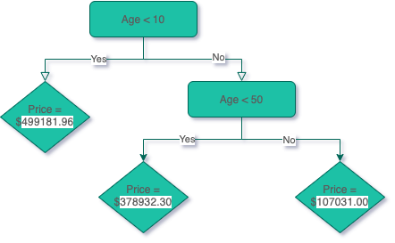
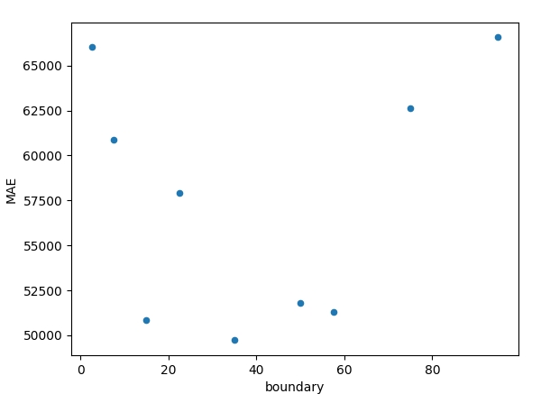

# Regression Trees
Source: [Machine_Learning_With_Python_IBM](https://www.coursera.org/learn/machine-learning-with-python)

## What Is A Regression Tree
As we have already seen, decision trees can be used for classification, but we can also use them for regression, commonly called regression trees. 

The basic idea behind regression trees is to split our data into groups based on features, like in classification, and return a prediction that is the average across the data we have already seen. 

Consider the housing data below, where we are using the ‘Age’ to predict the ‘Price’ of a house. 

```python
import pandas as pd
import matplotlib.pyplot as plt
age = [1,2,5,7,7,15,39,45,32,21,55,64,75,62,79]
price = [515550.73, 491775.83, 457544.34, 506443.94, 524594.98, 368796.62, 362740.81, 361467.51, 411260.00, 390396.54, 94761.54, 115555.98, 73275.04, 116153.90, 135408.55]

house_pricing_data_1 = pd.DataFrame({'Age':age, 'Price':price})

house_pricing_data_1.plot.scatter("Age", "Price")
plt.show()
```
Here, we can see the difference age has on the house prices. Ages between 0 and 10 have an average price of approximately $500,000, ages between 10 and 50 have an average price of approximately $380,000 and houses older than 50 years have an average price of approximately $100,000. Using these general ranges, we can predict the price of a house. 

Using the data above, we can create the regression tree, as shown below. The prices were determined by calculating the average price of the houses in the age range. 





## Criterion
The way the trees are built are similar to classification, but instead of using the entropy criterion. In Classification Trees, we choose features that increase the information gain. **In Regression Trees, we choose features that minimize the error.**

A popular one is the Mean Absolute Error, which we have also seen previously.

$MAE =\frac{1}{n}\sum_{j=1}^{n}|y_j-\hat{y}_j|$

## How Regression Trees are Built? 

Take the dataset sample shown below, the first step is to decide what the first decision is. We will do this by using the criterion and checking every single feature in the dataset to see which one produces the minimal error. 

but first...

## Categorical Features
Categorical features are simple, here we have Near Water so all we need to do is calculate the error if we used this as the first feature. Near Water feature has two categories: ‘Yes’ and ‘No’, therefore, we must calculate the average ‘Price’ of houses in the ‘Yes’ and ‘No’ categories. Then we use those values to calculate the average error. 


```python

index_1 = [0, 1, 2, 3, 4]
near_water_1 = ['No']*5
age_1 = [0,45,60,20,90]
price_1 = [260831.34, 222939.35, 101882.1, 226868.52, 94868.94] 
average_house_price_1 = sum(price_1)/len(price_1)
absolute_error_no = [abs(i-average_house_price_1) for i in price_1]


index_2 = [5,6,7,8,9]
near_water_2 = ['Yes']*5
age_2 = [100,5,10,55,25]
price_2 = [197703.55, 347982.98, 343150.38, 206713.16, 329768.77] 
average_house_price_2 = sum(price_2)/len(price_2)
absolute_error_yes = [abs(i-average_house_price_2) for i in price_2]

Index = index_1 + index_2
Near_water = near_water_1 + near_water_2
Age = age_1 + age_2
Price = price_1 + price_2
Average_house_prices = (average_house_price_1 , average_house_price_2)
Absolue_error = absolute_error_no + absolute_error_yes

MAE = sum(Absolue_error)/(len(Index))
MAE # 66383.1772
```

## Numerical Features
Numerical features, like ‘Age’, are trickier to handle because we need to find a number, instead of using a category, to split the data by. We do this by creating a boundary between each point, then we calculate the error. 

For example, first we create the boundary between the first two data points, which are (0, 260831.34) and (5, 347982.98), so we create a boundary of x = 2.5 (The midpoint between the x component of the first two data points). 

```python
house_pricing_data_2 = pd.DataFrame({"near_water": Near_water, "Age":Age, "Price":Price})
house_pricing_data_2.plot.scatter("Age","Price")
plt.plot([2.5]*40, [i*10000 for i in range(1,41)]); plt.title('Housing Data')
plt.show()
```
We now find the average price of the houses on the left and right sides of this boundary and use it to calculate the MAE.
```python
house_pricing_data_2.sort_values("Age", inplace=True) # Don't forget to run!
house_pricing_data_2.reset_index(inplace=True) # Don't forget to run!
left = house_pricing_data_2['Price'][0]
right = house_pricing_data_2['Price'][1:]
left_avg = left if isinstance(left, float) else sum(left)/len(left)
right_avg = right if isinstance(right, float) else sum(right)/len(right)
left_error = house_pricing_data_2['Price'][0] - left_avg
right_error = abs(house_pricing_data_2['Price'][1:] - right_avg)
MAE = sum(left_error + right_error)/len(house_pricing_data_2)

MAE # 66055.242
```

```python
boundaries = [(house_pricing_data_2.iloc[i]['Age'] + house_pricing_data_2.iloc[i+1]['Age'])/2 for i in range(house_pricing_data_2.shape[0]-1)]
house_pricing_data_2.plot.scatter("Age","Price")
for b in boundaries:
    plt.plot([b]*40, [i*10000 for i in range(1,41)], 'r'); plt.title('Housing Data')

plt.show()
```
This process is then repeated for each boundary between each pair of consecutive points. 

```python
house_pricing_data_2.sort_values("Age", inplace=True) # Don't forget to run!
house_pricing_data_2.reset_index(inplace=True) # Don't forget to run!

MAEs = pd.DataFrame({"boundary":[],"MAE":[]})
for i,boundary in enumerate(boundaries):
    left = house_pricing_data_2['Price'][:i+1]
    right = house_pricing_data_2['Price'][i+1:]
    left_avg = left if isinstance(left, float) else sum(left)/len(left)
    right_avg = right if isinstance(right, float) else sum(right)/len(right)
    left_error = [abs(y - left_avg) for y in house_pricing_data_2['Price'][:i+1]]
    right_error = [abs(y - right_avg) for y in house_pricing_data_2['Price'][i+1:]]
    # import pdb; pdb.set_trace()
    left; right;
    left_avg; right_avg;
    left_error; right_error;
    MAE = sum(left_error + right_error)/len(house_pricing_data_2)
    print(f"MAE: {MAE}")
    MAEs = pd.concat([MAEs, pd.DataFrame({"boundary":[boundary],"MAE":MAE})])

MAEs.plot.scatter("boundary","MAE"); plt.show()
```



We can see that the boundary 35 results in the lowest MAE (```49726.547200```) in this feature. 

## Choosing the Decision

Now, we compare the categorical MAE and the lowest numerical MAE, in this case, the categorical is ```66383.1772```, and the numerical is ```49726.55```. So, for the first decision, we will use the numerical ‘Age’ feature. We end up with a regression tree that looks like this: 

```bash
  Age<35
      |
  ----------
  |        |
  Yes      No
  |        |
```

## When do we Stop? 
With the regression tree above, we have two options, we can either stop here and use the average value of the ‘Yes’ (left) and ‘No’ (right) to predict the house prices, or we can continue to add more decisions to either branch. There are a few conditions that are commonly used to stop growing regression trees: 

• Tree depth
• Number of remaining samples on a branch
• Number of samples on each branch if another decision is made 

The depth of the tree above, is 1, because there is a single decision and the number of samples on each side is 5. Let’s add more decisions until the depth of the tree is 2. First, we start with the ‘Yes’ (left) side and we calculate the MAE for the features using the houses that have ‘Age’ < 35.

## Adding Decisions
Like before, we use the Near Water feature and calculate the MAE on houses with index 0, 3, 6, 7, and 9.

```python
Near_water = ['No','Yes','Yes','No','Yes','No','Yes','No','No','Yes']
Age = [0,5,10,20,25,45,55,60,90,100]
Price = [260831.34,347982.98,343150.38,226868.52,329768.77,222939.35,206713.16,101882.10, 94868.94,197703.55]
house_pricing_data_2 = pd.DataFrame({"near_water": Near_water, "Age":Age, "Price":Price})
# First consider the age < 35 branch
house_pricing_data_2_l35 = house_pricing_data_2[house_pricing_data_2['Age'] < 35]

nw_age_l35 = house_pricing_data_2_l35[house_pricing_data_2_l35['near_water'] == 'Yes']['Age']
nw_price_l35 = house_pricing_data_2_l35[house_pricing_data_2_l35['near_water'] == 'Yes']['Price']
nw_avg_house_price = sum(nw_price_l35)/len(nw_price_l35)

nnw_age_l35 = house_pricing_data_2_l35[house_pricing_data_2_l35['near_water'] == 'No']['Age']
nnw_price_l35 = house_pricing_data_2_l35[house_pricing_data_2_l35['near_water'] == 'No']['Price']
nnw_avg_house_price = sum(nnw_price_l35)/len(nnw_price_l35)

nw_avg_house_price
nnw_avg_house_price

AEs = [abs(y - nw_avg_house_price) for y in nw_price_l35] + [abs(y - nnw_avg_house_price) for y in nnw_price_l35]
MAE = sum(AEs)/len(AEs)
MAE # 11005.339999999991

# Now, we find the MAE for the boundaries in the ‘Age’ feature.
boundaries = [(house_pricing_data_2_l35.iloc[i]['Age'] + house_pricing_data_2_l35.iloc[i+1]['Age'])/2 for i in range(house_pricing_data_2_l35.shape[0]-1)]

house_pricing_data_2_l35.sort_values("Age", inplace=True) # Don't forget to run!
house_pricing_data_2_l35.reset_index(inplace=True) # Don't forget to run!

MAEs = pd.DataFrame({"boundary":[],"MAE":[]})
for i,boundary in enumerate(boundaries):
    left = house_pricing_data_2_l35['Price'][:i+1]
    right = house_pricing_data_2_l35['Price'][i+1:]
    left_avg = left if isinstance(left, float) else sum(left)/len(left)
    right_avg = right if isinstance(right, float) else sum(right)/len(right)
    left_error = [abs(y - left_avg) for y in house_pricing_data_2_l35['Price'][:i+1]]
    right_error = [abs(y - right_avg) for y in house_pricing_data_2_l35['Price'][i+1:]]
    # import pdb; pdb.set_trace()
    left; right;
    left_avg; right_avg;
    left_error; right_error;
    MAE = sum(left_error + right_error)/len(house_pricing_data_2_l35)
    print(f"MAE: {MAE}")
    MAEs = pd.concat([MAEs, pd.DataFrame({"boundary":[boundary],"MAE":MAE})])

MAEs.plot.scatter("boundary","MAE"); plt.show()
min(MAEs['MAE']) # lowest is 34029.657000000014
```
When compared to ```11005.339999999991``` from the near_water feature, ```34029.65700000001``` has more error. This means off of the 'Yes' branch or Age < 35 decision, the next decision should be near_water or not.

```bash
            Age<35
              |
         ----- -----
         |         |
         Yes       No
         |         |
     ---------- 
     |        |
   near_w  not_near_w
```

```python
# Second consider the age > 35 branch
house_pricing_data_2_g35 = house_pricing_data_2[house_pricing_data_2['Age'] > 35]

nw_age_g35 = house_pricing_data_2_g35[house_pricing_data_2_g35['near_water'] == 'Yes']['Age']
nw_price_g35 = house_pricing_data_2_g35[house_pricing_data_2_g35['near_water'] == 'Yes']['Price']
nw_avg_house_price = sum(nw_price_g35)/len(nw_price_g35)

nnw_age_g35 = house_pricing_data_2_g35[house_pricing_data_2_g35['near_water'] == 'No']['Age']
nnw_price_g35 = house_pricing_data_2_g35[house_pricing_data_2_g35['near_water'] == 'No']['Price']
nnw_avg_house_price = sum(nnw_price_g35)/len(nnw_price_g35)

nw_avg_house_price
nnw_avg_house_price

AEs = [abs(y - nw_avg_house_price) for y in nw_price_g35] + [abs(y - nnw_avg_house_price) for y in nnw_price_g35]
MAE = sum(AEs)/len(AEs)
MAE # 35018.943333333336

# Now, we find the MAE for the boundaries in the ‘Age’ feature.
boundaries = [(house_pricing_data_2_g35.iloc[i]['Age'] + house_pricing_data_2_g35.iloc[i+1]['Age'])/2 for i in range(house_pricing_data_2_g35.shape[0]-1)]

house_pricing_dathouse_pricing_data_2_g35a_2_g35.sort_values("Age", inplace=True) # Don't forget to run!
house_pricing_data_2_g35.reset_index(inplace=True) # Don't forget to run!

MAEs = pd.DataFrame({"boundary":[],"MAE":[]})
for i,boundary in enumerate(boundaries):
    left = house_pricing_data_2_g35['Price'][:i+1]
    right = house_pricing_data_2_g35['Price'][i+1:]
    left_avg = left if isinstance(left, float) else sum(left)/len(left)
    right_avg = right if isinstance(right, float) else sum(right)/len(right)
    left_error = [abs(y - left_avg) for y in house_pricing_data_2_g35['Price'][:i+1]]
    right_error = [abs(y - right_avg) for y in house_pricing_data_2_g35['Price'][i+1:]]
    # import pdb; pdb.set_trace()
    left; right;
    left_avg; right_avg;
    left_error; right_error;
    MAE = sum(left_error + right_error)/len(house_pricing_data_2_g35)
    print(f"MAE: {MAE}")
    MAEs = pd.concat([MAEs, pd.DataFrame({"boundary":[boundary],"MAE":MAE})])

MAEs.plot.scatter("boundary","MAE"); plt.show()
min(MAEs['MAE']) # lowest is 29732.71266666666
```

When compared to ```35018.943333333336``` from the near_water feature, ```29732.71266666666``` has less error. This means off of the 'No' branch or Age > 35 decision, the next decision should be Age *again* with the boundary set to 57.5.

```bash
                            Age<35
                              |
               --------------- ---------------
               |                             |
               Yes                           No
               |                             |
           --Near_water--               ---Age<57.5--- 
           |            |               |            |
           Yes          No              Yes          No
Price:     $A           $B              $C           $D
Price:     $341,911.57  $243,849.93     $214,826.26  $131,484.86

>>> house_pricing_data_2_g35
   index near_water  Age      Price
0      5         No   45  222939.35
1      6        Yes   55  206713.16
2      7         No   60  101882.10
3      8         No   90   94868.94
4      9        Yes  100  197703.55
>>> house_pricing_data_2_l35
   index near_water  Age      Price
0      0         No    0  260831.34
1      1        Yes    5  347982.98
2      2        Yes   10  343150.38
3      3         No   20  226868.52
4      4        Yes   25  329768.77
```
```python
>>> A = (347982.98+347982.98+329768.77)/3 # 341,911.57666666666
>>> B = (260831.34+226868.52)/2 # 243,849.93
>>> C = (222939.35+206713.16)/2 # 214,826.255
>>> D = (101882.10+94868.94+ 197703.55)/3 # 131,484.8633333333
```