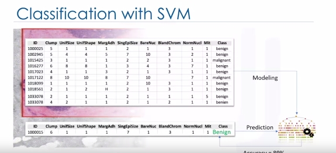
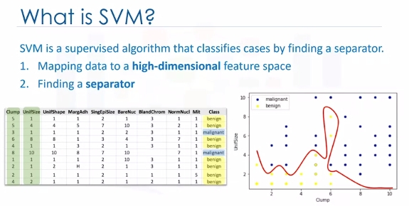
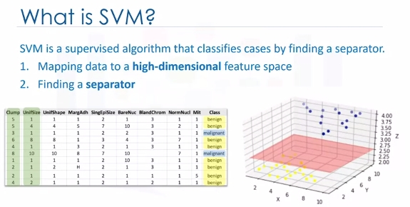
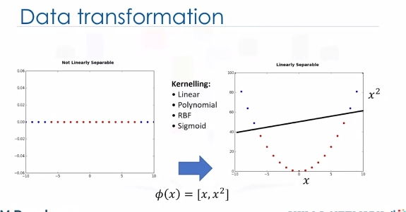
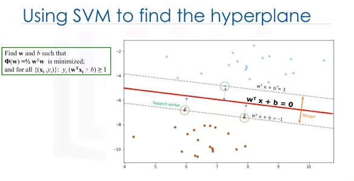

# Support Vecor Machine

## Classification with SVM

Imagine that you've obtained a dataset containing characteristics of thousands of human cell samples extracted from patients who were believed to be at risk of developing cancer. Analysis of the original data showed that many of the characteristics differed significantly between benign and malignant samples. You can use the values of these cell characteristics in samples from other patients, to give an early indication of whether a new sample might be benign or malignant. You can use Support Vector Machine, or SVM, as a classifier to train your model to understand patterns within the data that might show, benign or malignant cells.

SVM is a supervised algorithm that classifies cases by finding a separator:  
1. Mapping data to a high-dimensional feature space
2. Finding a separator

> The data should be transformed in such a way that a separator could be drawn as a hyperplane.

For example: Consider the following figure, which shows the distribution of a small set of cells only based on their unit size and clump thickness. As you can see, the data points fall into two different categories. It represents a **linearly non separable** data set. The two categories can be separated with a curve but not a line.

We can transfer this data to a higher-dimensional space, for example, mapping it to a three-dimensional space. After the transformation, the boundary between the two categories can be defined by a hyperplane. As we are now in three-dimensional space, the separator is shown as a plane. This plane can be used to classify new or unknown cases. Therefore, the SVM algorithm outputs an optimal hyperplane that categorizes new examples.  

Now, there are two challenging questions to consider.

* First, how do we transfer data in such a way that a separator could be drawn as a hyperplane?
* And two, how can we find the best or optimized hyperplane separator after transformation?

For the sake of simplicity, imagine that our dataset is one-dimensional data. This means we have only one feature x. As you can see, it is not linearly separable.

So what can we do here? Well, we can transfer it into a two-dimensional space. For example, you can increase the dimension of data by mapping x into a new space using a function with outputs x and x squared. Now the data is linearly separable, right? Notice that as we are in a two-dimensional space, the hyperplane is a line dividing a plane into two parts where each class lays on either side. Now we can use this line to classify new cases. Basically, mapping data into a higher-dimensional space is called, kernelling. The mathematical function used for the transformation is known as the kernel function, and can be of different types, such as linear, polynomial, Radial Basis Function,or RBF, and sigmoid. Each of these functions has its own characteristics, its pros and cons, and its equation. But the good news is that you don't need to know them as most of them are already implemented in libraries of data science programming languages.

Now we get to another question. Specifically, how do we find the right or optimized separator after transformation?

One reasonable choice as the best hyperplane is the one that represents the largest separation or margin between the two classes. So the goal is to choose a hyperplane with as big a margin as possible. Examples closest to the hyperplane are support vectors. It is intuitive that only support vectors matter for achieving our goal. We tried to find the hyperplane in such a way that it has the maximum distance to support vectors.

> Please note that the hyperplane and boundary decision lines have their own equations. So finding the optimized hyperplane can be formalized using an equation which involves quite a bit more math, so I'm not going to go through it here in detail.

One reasonable choice as the best hyperplane is the one that represents the largest separation or margin between the two classes. So the goal is to choose a hyperplane with as big a margin as possible. Examples closest to the hyperplane are support vectors. It is intuitive that only support vectors matter for achieving our goal. And thus, other trending examples can be ignored. We tried to find the hyperplane in such a way that it has the maximum distance to support vectors. Please note that the hyperplane and boundary decision lines have their own equations. So finding the optimized hyperplane can be formalized using an equation which involves quite a bit more math, so I'm not going to go through it here in detail.

That said, the hyperplane is learned from training data using an optimization procedure that maximizes the margin. And like many other problems, this optimization problem can also be solved by gradient descent, which is out of scope.

Therefore, the output of the algorithm is the values **w and b** for the line. You can make classifications using this estimated line. It is enough to plug in input values into the line equation. **Then, you can calculate whether an unknown point is above or below the line**.

Pros and Cons of SVM:
* Advantages:
  - Accurate in high-dimensional spaces
  - Memory efficient (sub-set of training points)
* Disadvantages:
  - Prone to over fitting, if features >>> # of samples
  - No probability estimation, which are normally desirable (binary)
  - Small datasets as large ones take too long (inefficient)

## SVM Applications

* Image recognition
* Test category assignment
* Detecting spam
* Sentiment analysis
* Gene expression data classification
* Regression
* Outlier detection
* Clustering

